# interview-coach 设计文档

> 本文档记录 interview-coach 项目的业务目标与设计决策。
> 文档随项目进展持续更新。

> **简历画像 MVP 实现基线（2026-07）**：当前 3～6 个月只服务用户使用自己的简历进行模拟面试。简历解析先生成可编辑事实草稿，用户确认后保存正式事实画像；优势、待验证能力点和推断技能水平保存在独立 AI 分析中，仅用于选题，不传给评估器，也不直接参与评分。
>
> 每份简历只保留一条辅助分析记录，但其中“最近一次成功结果”与“当前任务”使用独立字段。接受新的辅助分析任务后旧结果仍可展示，但立即停止参与新面试；新任务失败不会恢复其可用性。当前不做画像或分析历史版本、标签平台、持久任务队列，也不持久化用户的分析调整意见。
>
> 当前开发部署仍为单应用实例，但 AI 任务准入使用 Redisson 分布式许可（每用户 5、每简历 1），Worker 使用 Java 21 虚拟线程；手动 AI 任务和简历创建数量使用 Redis Lua 原子额度。应用重启只失败遗留内存任务并恢复可确认的额度结算，不自动重放模型调用。详细实现以 `docs/design/resume-module.md` 为准；MySQL 可执行基线依次为 `V1__init_schema.sql`、`V2__resume_profile_draft_analysis.sql`、`V3__resume_ai_task_control.sql`、`V4__position_analysis_lifecycle.sql`，迁移继续由维护者手工执行。
>
> 本文其余章节同时保留部分早期目标架构和演进设想；与当前简历模块实现冲突时，以上基线、模块详细设计和当前代码优先。

---

## 1. 项目概述

### 核心价值主张
帮助面试者**在面试中暴露问题，在面试后获得可执行的成长方案**。

不同于纯评估/考核系统，本项目以面试者的**成长**为核心目标，
不只是告诉用户"答得好不好"，而是要告诉用户"**如何变得更好**"。

### 差异化定位

**本项目核心差异**：
- 基于简历 × 岗位生成定制面试内容
- 生成针对性成长路线，而非通用建议
- 全自动流程，无人工介入成本

---

## 2. 用户画像

### 主要用户
所有面试者：
- **校招生**：无/少实战经验，需要系统化准备
- **跳槽党**：有经验但需针对性补齐，跳槽面试高频

### 用户痛点
1. 不知道自己的面试薄弱点在哪
2. 拿到面试反馈后不知道如何提升
3. 市面上面试准备材料同质化严重
4. 缺乏针对特定岗位的定制化练习

---

## 3. 核心使用场景

| 步骤 | 场景 | 描述 |
|------|------|------|
| 1 | 上传简历 | 用户上传简历，系统提取背景、技能、经历 |
| 2 | 上传/选择目标岗位 | 用户提供 JD 或选择预设岗位，系统生成**岗位画像**（考察重点、匹配要求） |
| 3 | 生成定制化模拟面试 | 基于 简历 × 岗位画像 生成个性化面试内容 |
| 4 | 模拟面试进行 | 用户回答问题，系统**边面边记录** |
| 5 | 面试结束 | 用户提交结束，系统生成评估报告 |
| 6 | 成长方案生成 | 评估报告 → 知识补全 → 学习路径 → 练习题（MD 文档） |

---

## 4. 核心竞争力

### 4.1 成长路线生成
- 针对面试中暴露的薄弱知识点
- 生成可执行的学习路径
- 明确每个阶段需要掌握的知识点

### 4.2 适配岗位内容
- 非通用题库模式
- 根据用户简历经历 + 目标岗位要求
- 利用 LLM 动态生成定制面试题

### 4.3 未来发展方向建议
- 不只是"通过这次面试"
- 结合用户背景给出职业发展建议
- 帮助用户规划长期技术成长路径

---

## 5. 商业模式

**免费试用**
- 用户可免费体验完整面试流程
- 成长方案文档免费生成
- 后续可扩展付费内容：深度报告、模拟面试次数、1v1 辅导等

---

## 6. MVP 范围

### 最简可运行版本（Phase 1）

**输入**：
- 用户简历（PDF/TXT）
- 目标岗位 JD（粘贴/上传）

**处理流程**：
1. 解析简历 → 提取关键信息（技能、经历、项目）
2. 解析 JD → 生成岗位画像（考察重点、匹配度要求）
3. 生成定制面试题（基于简历 × 岗位画像）
4. 模拟面试（递进式提问 + 记录 Q&A）
5. 面试评估（评估回答质量、深度、广度）
6. 生成成长方案（知识点补全 + 学习路径 + 练习题）

**输出**：

- 面试评估报告
- 成长方案 MD 文档（含知识补全、学习路径、练习题）

**不在 MVP 范围内（后续版本）**：
- 多轮面试（初面/复面区分）
- 实时反馈打断机制
- 企业 B 端功能
- 人工辅导对接

---

## 7. 业务域划分

### 7.1 业务域总览

系统按业务领域划分为 6 个独立的业务域，每个业务域有明确的职责边界：

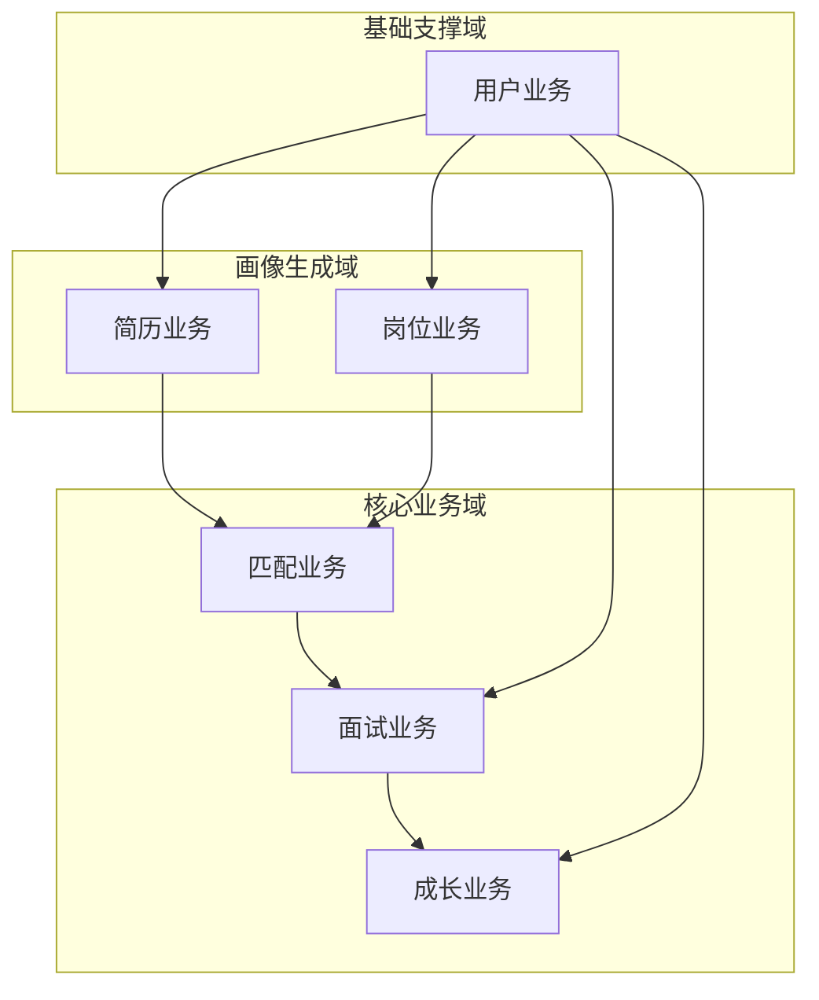
```mermaid
flowchart TB
    subgraph 基础支撑域
        User[用户业务]
    end

    subgraph 画像生成域
        Resume[简历业务]
        Position[岗位业务]
    end

    subgraph 核心业务域
        Matching[匹配业务]
        Interview[面试业务]
        Growth[成长业务]
    end

    User --> Resume
    User --> Position
    Resume --> Matching
    Position --> Matching
    Matching --> Interview
    Interview --> Growth
    User --> Interview
    User --> Growth
```

---

### 7.2 业务域定义

| 业务域 | 核心职责 | 主要数据 | 参与者 |
|--------|---------|---------|-------|
| **用户业务** | 用户注册/登录、认证授权、数据隔离 | 用户、角色、权限 | 系统管理员、面试用户 |
| **简历业务** | 简历上传、事实解析/确认、辅助分析与任务控制 | 简历文件、事实草稿、正式画像、辅助分析 | 面试用户 |
| **岗位业务** | JD上传/解析/审核、公共岗位库管理 | JD、岗位画像、审核记录 | 面试用户(上传)、系统管理员(审核) |
| **匹配业务** | 人物画像 × 岗位画像 → 定制化面试策略 | 匹配度报告、面试策略 | (内部服务) |
| **面试业务** | 模拟面试进行、Q&A记录、并行评估 | Q&A记录、面试上下文 | 面试用户 |
| **成长业务** | 评估报告生成、知识补全、成长方案 | 评估报告、成长方案MD | 面试用户 |

---

### 7.3 各业务域详细说明

#### 7.3.1 用户业务（User Domain）

**核心职责**：用户注册/登录、认证授权、数据隔离

**业务功能清单**：

| 功能 | 说明 | 参与者 |
|------|------|--------|
| 用户注册 | 求职者注册账号 | 面试用户 |
| 用户登录 | 求职者登录系统 | 面试用户 |
| 用户信息管理 | 查看/修改个人信息 | 面试用户 |
| 密码管理 | 修改密码、找回密码 | 面试用户 |
| 管理员登录 | 系统管理员登录后台 | 系统管理员 |
| 管理员用户管理 | 查看/禁用/删除用户 | 系统管理员 |
| 公共岗位审核 | 审核用户上传的JD | 系统管理员 |
| 公共岗位管理 | 管理公共岗位库 | 系统管理员 |
| 数据隔离执行 | 确保用户只能访问自己的数据 | 系统（自动） |

**功能关系**：
```
用户注册 ──▶ 用户登录 ──▶ 发起面试
    │                        │
    │                        ▼
    │                   修改个人信息
    │
    └──────────────────▶ 密码管理

系统管理员 ──▶ 管理员登录 ──▶ 公共岗位审核
                            ──▶ 公共岗位管理
                            ──▶ 用户管理
```

**用户角色**：

| 角色 | 权限 | 可操作 |
|------|------|--------|
| **面试用户** | 自己的数据隔离 | 上传简历/岗位、发起面试、查看报告/成长方案 |
| **系统管理员** | 公共数据管理 | 审核岗位、管理公共岗位库、查看统计数据 |

---

#### 7.3.2 简历业务（Resume Domain）

**核心职责**：简历上传、可核对事实解析与确认、可选辅助分析、面试画像快照输入

**业务功能清单**：

| 功能 | 说明 | 参与者 |
|------|------|--------|
| 上传简历 | 用户上传简历文件（PDF/TXT） | 面试用户 |
| 解析简历 | 从简历中提取可核对事实并生成当前代次草稿 | 系统（自动） |
| 展示/修改草稿 | 展示当前代次草稿并允许用户修正 | 系统 → 面试用户 |
| 确认正式事实 | 校验当前代次，保存正式事实画像 | 面试用户 |
| 生成辅助分析 | 基于正式事实生成优势、待验证点和推断技能水平 | 系统（可选） |
| 重新解析 | 保留正式画像，创建新代次并重新提取草稿 | 面试用户 |
| 重新生成/调整分析 | 公开支持 `REGENERATE` 和 `REFINE` 两种模式 | 面试用户 |
| 锁定简历 | 创建面试时锁定简历，面试结束后释放 | 系统（自动） |
| 查看已保留简历 | 用户查看当前未删除的简历列表 | 面试用户 |
| 删除简历 | 用户删除不需要的简历 | 面试用户 |

**功能关系**：
```
上传简历 ──▶ 事实解析 ──▶ 当前代次草稿 ──▶ 用户修改/确认
                                              │
                                              ▼
                                         正式事实画像
                                          │         │
                                          │         └──▶ 可选辅助分析 ──▶ 新面试选题线索
                                          │
                                          ├──▶ 创建面试时锁定并生成快照
                                          └──▶ 重新解析（正式事实继续保留）

未锁定简历 ──▶ 查看 / 删除
```

**正式事实与辅助分析边界**：

| 信息类别 | 说明 |
|---------|------|
| 正式事实画像 | 工作年限、学历、当前职位；技能标签及原文明示的技能水平；项目和工作经历 |
| 派生元数据 | 经验水平、岗位大类、事实 Schema 版本、正式事实哈希和确认时间 |
| 辅助分析 | 优势、待验证能力点、推断技能水平，可带证据引用与置信度 |
| 禁止混入事实 | 姓名、年龄、性别、联系方式、模型置信度及无原文依据的判断 |
| 使用边界 | 辅助分析只用于出题和追问，必须在回答中再次验证，不作为评分事实 |

---

#### 7.3.3 岗位业务（Position Domain）

**核心职责**：JD上传/解析/审核、公共岗位库管理

**业务功能清单**：

| 功能 | 说明 | 参与者 |
|------|------|--------|
| 上传JD | 用户上传岗位描述（粘贴/上传文件） | 面试用户 |
| 解析JD | 从JD中提取岗位要求、考察重点 | 系统（自动） |
| 生成岗位画像 | 生成岗位画像 | 系统（自动） |
| 展示解析结果 | 展示解析后的岗位画像 | 系统 → 面试用户 |
| 确认JD | 用户确认解析结果正确 | 面试用户 |
| 修改JD | 用户修改解析不准确的岗位信息 | 面试用户 |
| 重新解析 | 修改后重新解析JD | 系统（自动） |
| 提交审核 | 提交JD进入公共库审核流程 | 系统（自动）/ 用户 |
| 审核JD | 管理员审核JD是否可加入公共库 | 系统管理员 |
| 通过审核 | JD审核通过，进入公共岗位库 | 系统管理员 |
| 拒绝审核 | JD审核拒绝，通知用户修改 | 系统管理员 |
| 选择公共岗位 | 用户从公共岗位库选择岗位 | 面试用户 |
| 管理公共岗位 | 管理员增删改公共岗位库 | 系统管理员 |
| 查看岗位详情 | 用户查看岗位详细信息 | 面试用户 |

**审核状态**：

| 状态 | 说明 | 可见范围 |
|------|------|---------|
| **PENDING** | 待审核 | 仅上传用户 |
| **APPROVED** | 审核通过 | 所有用户 |
| **REJECTED** | 审核拒绝 | 仅上传用户 |

**岗位画像应包含的信息**：

| 信息类别 | 说明 |
|---------|------|
| 基本信息 | 岗位名称、公司、所在地、薪资范围 |
| 技能要求 | 必备技能、加分技能 |
| 考察重点 | 按岗位大类定制的考察重点（如技术族的源码理解 vs 产品族的业务逻辑） |
| 岗位等级 | 初级/中级/高级/专家 |
| 面试重点 | 技能考察优先级排序 |
| **岗位大类** | 岗位所属大类（技术族TECH/产品族PRODUCT/设计族DESIGN等），由 JD 解析自动识别 |

---

#### 7.3.4 匹配业务（Matching Domain）

**核心职责**：人物画像 × 岗位画像 → 定制化面试策略

**业务功能清单**：

| 功能 | 说明 | 参与者 |
|------|------|--------|
| 匹配分析 | 对比人物画像与岗位画像，分析匹配度 | 系统（自动） |
| 生成面试策略 | 基于匹配分析结果生成定制化面试策略 | 系统（自动） |
| 确定考察重点 | 确定本次面试重点考察的技能和深度 | 系统（自动） |
| 确定主题顺序 | 确定技术主题的考察顺序 | 系统（自动） |
| 评估匹配度 | 输出人物与岗位的匹配度分数 | 系统（自动） |
| 展示匹配报告 | 向用户展示匹配分析结果 | 系统 → 面试用户 |
| 调整面试策略 | 用户可调整系统生成的面试策略 | 面试用户 |

**面试策略应包含的信息**：

| 信息类别 | 说明 |
|---------|------|
| 匹配度总分 | 0-100 的综合匹配分数 |
| 技能匹配详情 | 各技能的匹配程度（高/中/低） |
| 考察优先级 | 按优先级排序的考察重点列表 |
| 主题顺序 | 技术主题的考察顺序 |
| 建议深度 | 每个主题建议考察到什么深度 |
| 需重点关注的薄弱点 | 面试中应深入探测的薄弱技能 |

---

#### 7.3.5 面试业务（Interview Domain）

**核心职责**：模拟面试进行、Q&A记录、并行评估，支持环节自由组合

**面试环节定义（固定顺序）**：

| 环节 | 代码 | 说明 |
|------|------|------|
| 自我介绍 | SELF_INTRO | 热身放松，了解基本信息 |
| 专业面试 | PROFESSIONAL | 考察岗位相关专业技能（根据岗位大类适配） |
| 简历探讨 | RESUME_DISCUSSION | 深入了解项目经历 |
| 行为面试 | BEHAVIORAL | 考察软技能和职业素养 |
| 结束 | ENDING | 总结面试、结束语 |

**环节组合规则**：

| 用户选择 | 实际执行顺序 |
|---------|-------------|
| 仅专业面试 | 专业面试 → 结束 |
| 专业面试 + 行为面试 | 专业面试 → 行为面试 → 结束 |
| 自我介绍 + 专业面试 + 简历探讨 | 自我介绍 → 专业面试 → 简历探讨 → 结束 |
| 全部选择 | 自我介绍 → 专业面试 → 简历探讨 → 行为面试 → 结束 |

**业务功能清单**：

| 功能 | 说明 | 参与者 |
|------|------|--------|
| 创建面试 | 基于简历+岗位+环节选择创建面试会话 | 面试用户 |
| 选择环节 | 用户勾选需要的面试环节 | 面试用户 |
| 分配Agent | 启动面试官Agent和评估者Agent（并行） | 系统（自动） |
| 自我介绍环节 | 生成自我介绍引导问题 | 面试官Agent |
| 专业面试环节 | 深度递进提问、主题切换（根据岗位大类适配） | 面试官Agent |
| 简历探讨环节 | 基于简历项目深入提问 | 面试官Agent |
| 行为面试环节 | STAR法则问题 | 面试官Agent |
| 发送问题 | 向用户展示面试题 | 系统 → 面试用户 |
| 记录回答 | 记录用户的问题和回答 | 评估者Agent |
| 评估当前回答 | 对用户回答进行详细评估（不展示） | 评估者Agent |
| 判断继续 | 面试官判断：追问深/换主题/换环节/结束 | 面试官Agent |
| 发送追问 | 基于当前回答发送追问 | 面试官Agent |
| 发送新主题 | 切换到下一个技术主题 | 面试官Agent |
| 切换环节 | 根据环节顺序切换到下一环节 | 系统（自动） |
| 结束面试 | 面试官判断结束，输出结束信号 | 面试官Agent |
| 汇总评估报告 | 评估者汇总所有评估结果生成报告 | 评估者Agent |
| 发送评估报告 | 向用户展示面试评估报告 | 系统 → 面试用户 |
| 中断面试 | 用户主动中断/结束面试 | 面试用户 |
| 保存Q&A记录 | 持久化面试问答记录 | 系统（自动） |

**并行机制说明**：

| Agent | 职责 | 对另一方不可见 |
|-------|------|--------------|
| 面试官Agent | 生成问题、判断流程 | 评估结果 |
| 评估者Agent | 记录Q&A、详细评估 | 出题思路 |

---

#### 7.3.6 成长业务（Growth Domain）

**核心职责**：评估报告生成，知识补全、成长方案

**业务功能清单**：

| 功能 | 说明 | 参与者 |
|------|------|--------|
| 接收评估报告 | 接收评估者生成的评估报告 | 系统（自动） |
| 分析薄弱点 | 从评估报告中提取薄弱知识点 | 系统（自动） |
| 生成知识补全 | 针对薄弱点生成知识补全内容 | 系统（自动） |
| 生成学习路径 | 针对薄弱点生成学习路线 | 系统（自动） |
| 生成练习题 | 针对薄弱点生成练习题和答案 | 系统（自动） |
| 生成成长方案MD | 将所有内容整合成MD文档 | 系统（自动） |
| 展示成长方案 | 向用户展示成长方案文档 | 系统 → 面试用户 |
| 查看历史方案 | 用户查看历史生成的成长方案 | 面试用户 |
| 下载成长方案 | 用户下载成长方案MD文件 | 面试用户 |

**成长方案MD应包含的内容**：

| 章节 | 说明 |
|------|------|
| 面试总结 | 本次面试的整体表现概述 |
| 薄弱知识点列表 | 面试中暴露的薄弱点 |
| 知识补全 | 每个薄弱点的详细解释和补充 |
| 学习路径 | 从基础到深入的学习路线 |
| 练习题 | 针对薄弱点的练习题及参考答案 |
| 推荐资源 | 学习每个薄弱点推荐的资料/课程 |
| 下一步建议 | 短期内如何提升 |

**成长方案生成触发时机**：

| 触发方式 | 说明 |
|---------|------|
| 面试正常结束 | 面试官判断面试完成后自动触发 |
| 用户主动结束 | 用户提前结束面试时触发 |
| 用户查看报告后 | 用户查看评估报告后手动触发（可选） |

---

### 7.4 所有业务域功能汇总

| 业务域 | 功能数量 | 核心功能 |
|--------|---------|---------|
| 用户业务 | 9个 | 注册/登录、认证授权、数据隔离 |
| 简历业务 | 10个 | 上传/解析/画像/确认/锁定 |
| 岗位业务 | 14个 | 上传/解析/画像/审核/公共库管理 |
| 匹配业务 | 7个 | 匹配分析/策略生成/考察重点 |
| 面试业务 | 15个 | 面试循环/并行评估/报告生成 |
| 成长业务 | 9个 | 知识补全/学习路径/练习题/MD生成 |

---

### 7.5 业务域间的依赖关系

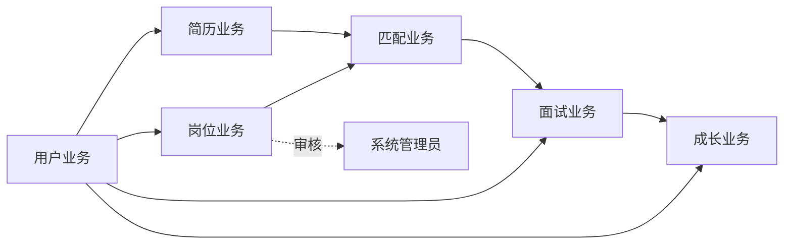
```mermaid
flowchart LR
    User["用户业务"] --> Resume["简历业务"]
    User["用户业务"] --> Position["岗位业务"]
    User["用户业务"] --> Interview["面试业务"]
    User["用户业务"] --> Growth["成长业务"]

    Resume --> Matching["匹配业务"]
    Position --> Matching

    Matching --> Interview
    Interview --> Growth

    Position -.->|审核| Admin["系统管理员"]
```

**依赖说明**：
- 用户业务是基础，所有业务都依赖它进行身份验证和数据隔离
- 简历业务和岗位业务是平行输入
- 匹配业务依赖简历和岗位业务输出
- 面试业务依赖匹配业务的策略
- 成长业务依赖面试业务的结果

---

### 7.6 业务域与 Agent 映射

| 业务域 | Agent | Tool |
|--------|-------|------|
| **用户业务** | - | 持久化 Tool |
| **简历业务** | 简历分析 Agent | 简历解析 Tool、画像生成 Tool |
| **岗位业务** | JD分析 Agent | JD解析 Tool、画像生成 Tool |
| **匹配业务** | 协调者 Agent（编排） | 匹配分析 Tool |
| **面试业务** | 面试官 Agent、评估者 Agent | 问题生成 Tool、评估 Tool |
| **成长业务** | 技能完善助理 | 文档生成 Tool |

---

## 8. 业务流程图

### 8.1 总体业务流程图（跨业务域）

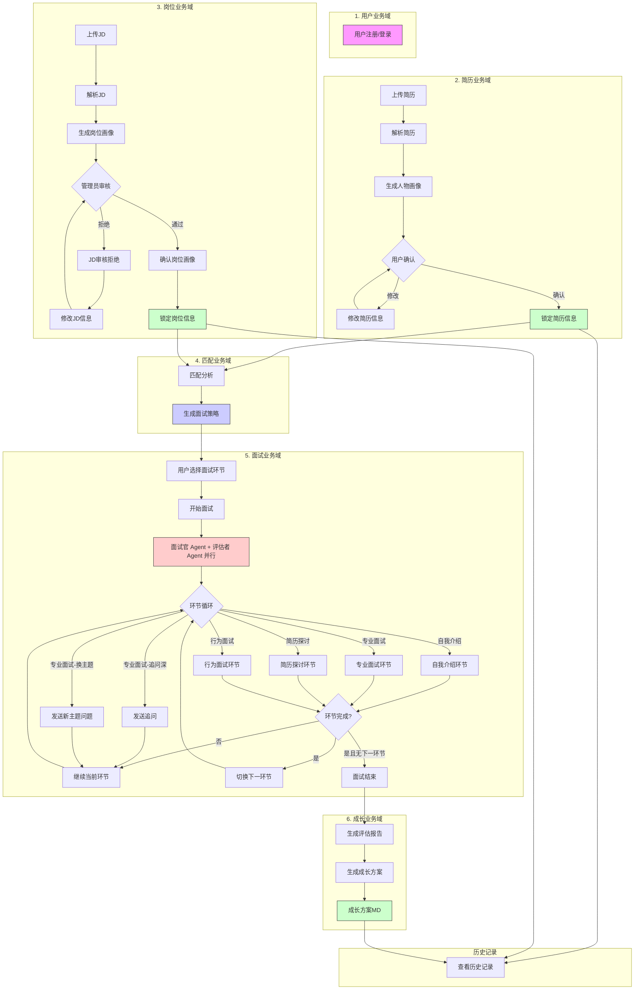
```mermaid
flowchart TB
    subgraph 用户业务["1. 用户业务域"]
        Login[用户注册/登录]
    end

    subgraph 简历业务["2. 简历业务域"]
        UploadResume[上传简历] --> ParseResume[解析简历]
        ParseResume --> GeneratePersona[生成人物画像]
        GeneratePersona --> ConfirmResume{用户确认}
        ConfirmResume -->|修改| EditResume[修改简历信息]
        EditResume --> ConfirmResume
        ConfirmResume -->|确认| LockResume[锁定简历信息]
    end

    subgraph 岗位业务["3. 岗位业务域"]
        UploadJD[上传JD] --> ParseJD[解析JD]
        ParseJD --> GeneratePosition[生成岗位画像]
        GeneratePosition --> AuditPosition{管理员审核}
        AuditPosition -->|拒绝| RejectJD[JD审核拒绝]
        RejectJD --> EditJD[修改JD信息]
        EditJD --> AuditPosition
        AuditPosition -->|通过| ConfirmPosition[确认岗位画像]
        ConfirmPosition --> LockPosition[锁定岗位信息]
    end

    subgraph 匹配业务["4. 匹配业务域"]
        LockResume --> Matching[匹配分析]
        LockPosition --> Matching
        Matching --> Strategy[生成面试策略]
    end

    subgraph 面试业务["5. 面试业务域"]
        Strategy --> SelectPhases[用户选择面试环节]
        SelectPhases --> StartInterview[开始面试]
        StartInterview --> ParallelRun["面试官 Agent + 评估者 Agent 并行"]
        ParallelRun --> PhaseLoop{环节循环}
        PhaseLoop -->|自我介绍| SelfIntro[自我介绍环节]
        SelfIntro --> PhaseComplete{环节完成?}
        PhaseLoop -->|专业面试| Professional[专业面试环节]
        Professional --> PhaseComplete
        PhaseLoop -->|简历探讨| Resume[简历探讨环节]
        Resume --> PhaseComplete
        PhaseLoop -->|行为面试| Behavioral[行为面试环节]
        Behavioral --> PhaseComplete
        PhaseComplete -->|否| NextQ[继续当前环节]
        NextQ --> PhaseLoop
        PhaseComplete -->|是| NextPhase[切换下一环节]
        NextPhase --> PhaseLoop
        PhaseComplete -->|是且无下一环节| EndInterview[面试结束]
        PhaseLoop -->|专业面试-追问深| DeepDive[发送追问]
        DeepDive --> NextQ
        PhaseLoop -->|专业面试-换主题| SwitchTopic[发送新主题问题]
        SwitchTopic --> NextQ
    end

    subgraph 成长业务["6. 成长业务域"]
        EndInterview --> GenerateReport[生成评估报告]
        GenerateReport --> GenerateGrowth[生成成长方案]
        GenerateGrowth --> GrowthDoc[成长方案MD]
    end

    subgraph 历史记录
        LockResume --> History[查看历史记录]
        LockPosition --> History
        GrowthDoc --> History
    end

    style Login fill:#f9f,stroke:#333
    style LockResume fill:#cfc,stroke:#333
    style LockPosition fill:#cfc,stroke:#333
    style Strategy fill:#ccf,stroke:#333
    style ParallelRun fill:#fcc,stroke:#333
    style GrowthDoc fill:#cfc,stroke:#333
```

---

### 8.2 整体用户操作流程

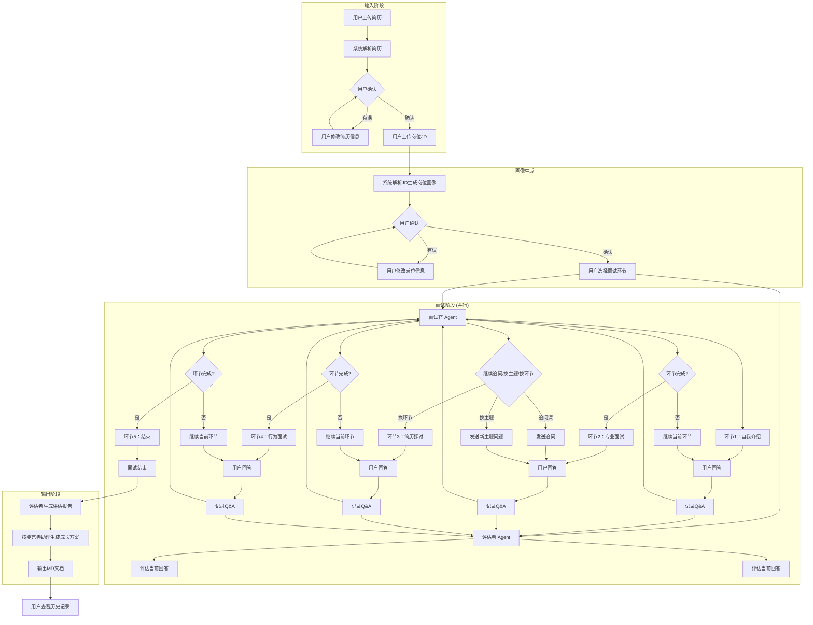
```mermaid
flowchart TD
    subgraph 输入阶段
        A[用户上传简历] --> B[系统解析简历]
        B --> C{用户确认}
        C -->|有误| D[用户修改简历信息]
        D --> C
        C -->|确认| E[用户上传岗位JD]
    end

    subgraph 画像生成
        E --> F[系统解析JD生成岗位画像]
        F --> G{用户确认}
        G -->|有误| H[用户修改岗位信息]
        H --> G
        G -->|确认| I[用户选择面试环节]
    end

    subgraph 面试阶段["面试阶段 (并行)"]
        I --> J[面试官 Agent]
        I --> K[评估者 Agent]
        J --> Phase1[环节1：自我介绍]
        Phase1 --> M1[用户回答]
        M1 --> N1[记录Q&A]
        N1 --> J
        N1 --> K
        K --> O1[评估当前回答]
        J --> P1{环节完成?}
        P1 -->|否| Q1[继续当前环节]
        Q1 --> M1
        P1 -->|是| Phase2[环节2：专业面试]
        Phase2 --> M2[用户回答]
        M2 --> N2[记录Q&A]
        N2 --> J
        N2 --> K
        K --> O2[评估当前回答]
        J --> P2{继续追问/换主题/换环节}
        P2 -->|追问深| Q2[发送追问]
        Q2 --> M2
        P2 -->|换主题| R2[发送新主题问题]
        R2 --> M2
        P2 -->|换环节| Phase3[环节3：简历探讨]
        Phase3 --> M3[用户回答]
        M3 --> N3[记录Q&A]
        N3 --> J
        N3 --> K
        J --> P3{环节完成?}
        P3 -->|否| Q3[继续当前环节]
        Q3 --> M3
        P3 -->|是| Phase4[环节4：行为面试]
        Phase4 --> M4[用户回答]
        M4 --> N4[记录Q&A]
        N4 --> J
        N4 --> K
        J --> P4{环节完成?}
        P4 -->|否| Q4[继续当前环节]
        Q4 --> M4
        P4 -->|是| EndPhase[环节5：结束]
        EndPhase --> S[面试结束]
    end

    subgraph 输出阶段
        S --> T[评估者生成评估报告]
        T --> U[技能完善助理生成成长方案]
        U --> V[输出MD文档]
    end

    V --> W[用户查看历史记录]
```

---

### 8.3 面试官与评估者并行协作

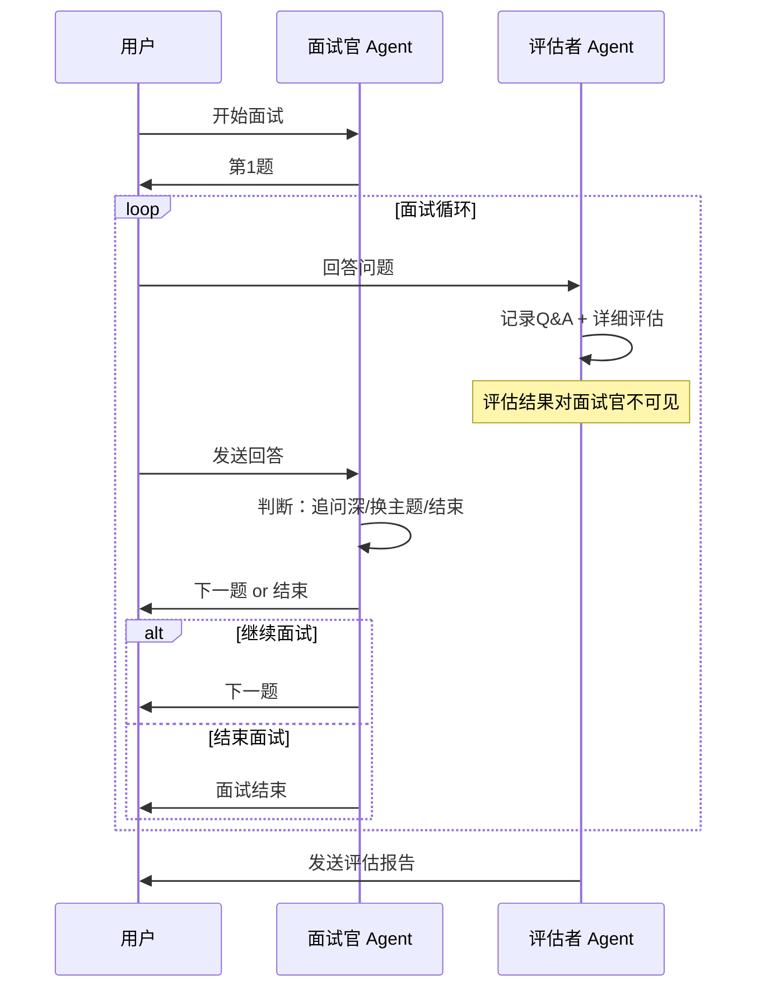
```mermaid
sequenceDiagram
    participant User as 用户
    participant Interviewer as 面试官 Agent
    participant Evaluator as 评估者 Agent

    User->>Interviewer: 开始面试
    Interviewer->>User: 第1题

    loop 面试循环
        User->>Evaluator: 回答问题
        Evaluator->>Evaluator: 记录Q&A + 详细评估
        Note over Evaluator: 评估结果对面试官不可见

        User->>Interviewer: 发送回答
        Interviewer->>Interviewer: 判断：追问深/换主题/结束
        Interviewer->>User: 下一题 or 结束

        alt 继续面试
            Interviewer->>User: 下一题
        else 结束面试
            Interviewer->>User: 面试结束
        end
    end

    Evaluator->>User: 发送评估报告
```

---

## 9. 数据流设计

### 8.1 数据流总图

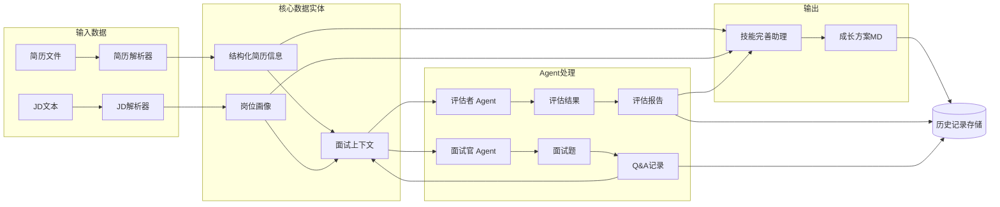
```mermaid
flowchart LR
    subgraph 输入数据
        A[简历文件] --> E[简历解析器]
        B[JD文本] --> F[JD解析器]
    end

    subgraph 核心数据实体
        E --> G[结构化简历信息]
        F --> H[岗位画像]
        G --> I[面试上下文]
        H --> I
    end

    subgraph Agent处理
        I --> J[面试官 Agent]
        J --> K[面试题]
        K --> L[Q&A记录]
        L --> I
        I --> M[评估者 Agent]
        M --> N[评估结果]
        N --> O[评估报告]
    end

    subgraph 输出
        G --> P[技能完善助理]
        H --> P
        O --> P
        P --> Q[成长方案MD]
    end

    Q --> R[(历史记录存储)]
    O --> R
    L --> R
```

---

### 8.2 数据在 Agent 间的流转

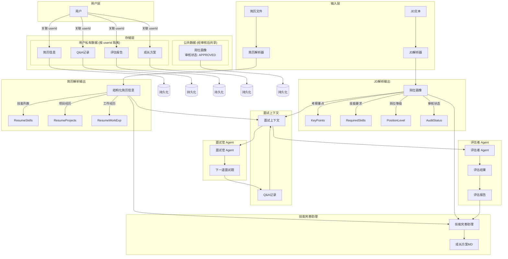
```mermaid
flowchart TB
    subgraph 用户层
        User[用户]
    end

    subgraph 输入层
        Resume[简历文件] --> ResumeParser[简历解析器]
        JD[JD文本] --> JDParser[JD解析器]
    end

    subgraph 简历解析输出
        ResumeParser --> ResumeInfo[结构化简历信息]
        ResumeInfo -->|技能列表| ResumeSkills
        ResumeInfo -->|项目经历| ResumeProjects
        ResumeInfo -->|工作经历| ResumeWorkExp
    end

    subgraph JD解析输出
        JDParser --> PositionProfile[岗位画像]
        PositionProfile -->|考察重点| KeyPoints
        PositionProfile -->|技能要求| RequiredSkills
        PositionProfile -->|岗位等级| PositionLevel
        PositionProfile -->|审核状态| AuditStatus
    end

    subgraph 面试上下文
        ResumeInfo --> InterviewCtx[面试上下文]
        PositionProfile --> InterviewCtx
        QARecord[Q&A记录] --> InterviewCtx
    end

    subgraph 面试官 Agent
        InterviewCtx --> Interviewer[面试官 Agent]
        Interviewer --> NextQuestion[下一道面试题]
        NextQuestion --> QARecord
    end

    subgraph 评估者 Agent
        InterviewCtx --> Evaluator[评估者 Agent]
        Evaluator --> EvaluationResult[评估结果]
        EvaluationResult --> FinalReport[评估报告]
    end

    subgraph 技能完善助理
        ResumeInfo --> Coach[技能完善助理]
        PositionProfile --> Coach
        FinalReport --> Coach
        Coach --> GrowthPlan[成长方案MD]
    end

    subgraph 存储层
        subgraph 用户私有数据["用户私有数据 (按 userId 隔离)"]
            ResumeInfo2[简历信息]
            QARecord2[Q&A记录]
            FinalReport2[评估报告]
            GrowthPlan2[成长方案]
        end

        subgraph 公共数据["公共数据 (经审核后共享)"]
            PositionProfile2[岗位画像<br/>审核状态: APPROVED]
        end
    end

    User -->|关联 userId| ResumeInfo2
    User -->|关联 userId| QARecord2
    User -->|关联 userId| FinalReport2
    User -->|关联 userId| GrowthPlan2
    ResumeInfo2 --> Storage1[(持久化)]
    QARecord2 --> Storage2[(持久化)]
    FinalReport2 --> Storage3[(持久化)]
    GrowthPlan2 --> Storage4[(持久化)]
    PositionProfile2 --> Storage5[(持久化)]
```

---

### 8.3 数据实体定义

| 数据实体 | 说明 | 主要字段 | 数据隔离 |
|---------|------|---------|---------|
| **用户** | 系统用户 | 用户ID、认证信息 | - |
| **简历信息** | 用户上传简历的结构化表示 | 技能列表、项目经历、工作经历、教育背景、userId | **用户私有** |
| **岗位画像** | JD解析生成的考察框架 | 考察重点、技能要求、匹配度要求、岗位等级、审核状态 | **公共/私有** |
| **面试上下文** | 贯穿面试全流程的运行时数据 | 简历信息、岗位画像、Q&A历史、当前主题、当前深度 | 运行时数据 |
| **Q&A记录** | 面试中每一轮的问答对 | 问题、回答、时间戳、userId | **用户私有** |
| **评估结果** | 单次回答的评估数据 | 维度打分、优缺点、知识点评、是否通过 | 评估者私有 |
| **评估报告** | 面试结束的完整评估 | 各维度总分、薄弱点列表、总体评价、userId | **用户私有** |
| **成长方案MD** | 最终输出的学习方案 | 知识补全、学习路径、练习题列表、userId | **用户私有** |

---

### 8.4 数据隔离设计

#### 8.4.1 隔离原则

| 数据类型 | 隔离方式 | 说明 |
|---------|---------|------|
| **用户私有数据** | 按 userId 隔离 | 简历信息、Q&A记录、评估报告、成长方案 |
| **岗位信息** | 按审核状态区分 | 已审核(APPROVED)可供所有用户使用；未审核(PENDING/REJECTED)仅上传用户可见 |

#### 8.4.2 岗位审核状态

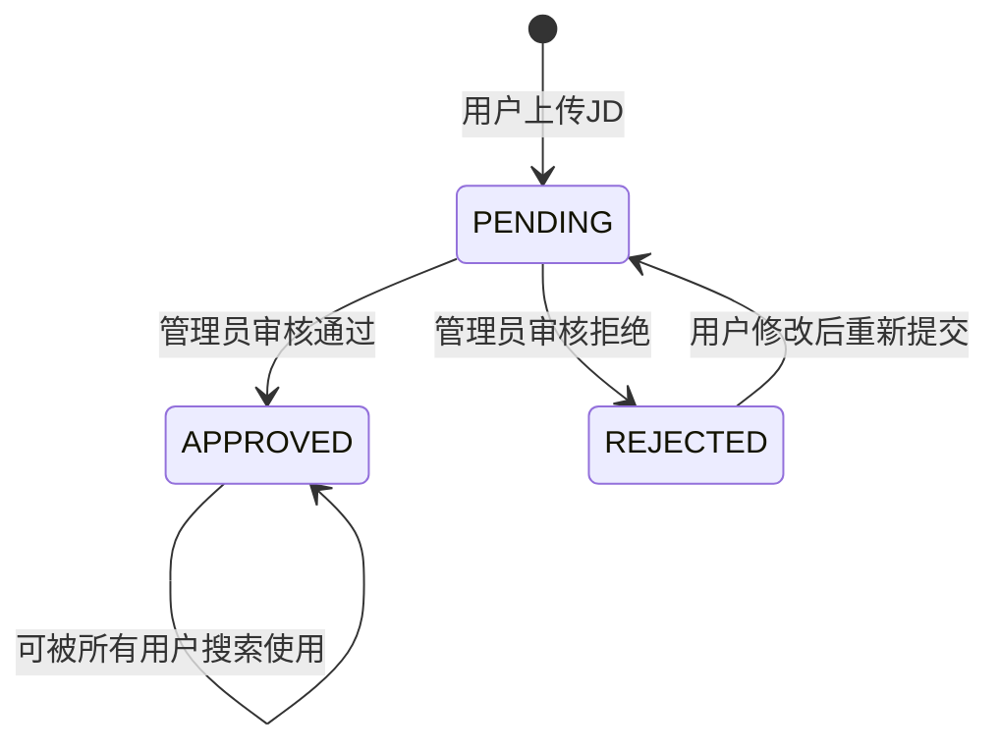
```mermaid
stateDiagram-v2
    [*] --> PENDING: 用户上传JD
    PENDING --> APPROVED: 管理员审核通过
    PENDING --> REJECTED: 管理员审核拒绝
    APPROVED --> APPROVED: 可被所有用户搜索使用
    REJECTED --> PENDING: 用户修改后重新提交
```

| 状态 | 说明 | 可见范围 |
|------|------|---------|
| **PENDING** | 待审核 | 仅上传用户 |
| **APPROVED** | 审核通过 | 所有用户 |
| **REJECTED** | 审核拒绝 | 仅上传用户 |

#### 8.4.3 权限控制要点

```
查询简历信息：WHERE user_id = :currentUserId
查询面试记录：WHERE user_id = :currentUserId
查询岗位信息：WHERE audit_status = 'APPROVED' OR user_id = :currentUserId
新增岗位：audit_status = 'PENDING'
```

---

## 10. 多 Agent 协作架构

### 9.1 架构概览

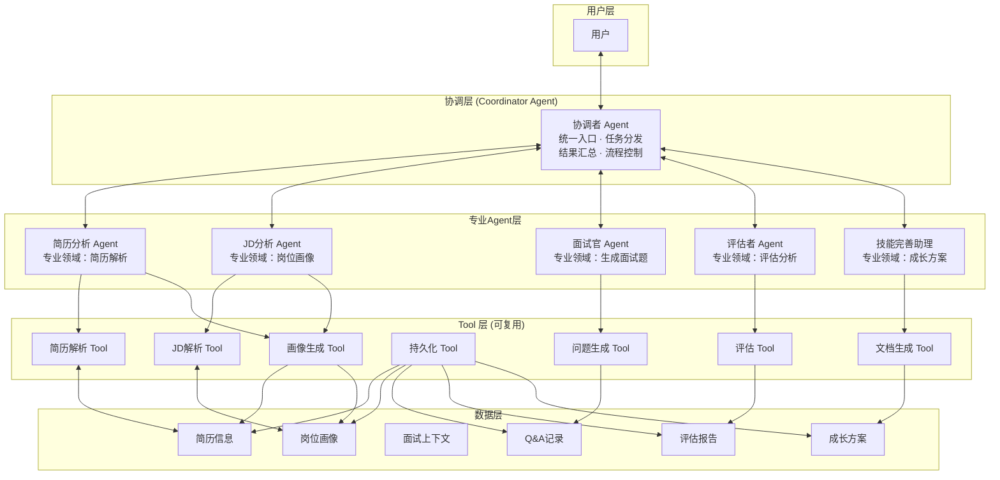
```mermaid
flowchart TB
    subgraph 用户层
        User[用户]
    end

    subgraph 协调层["协调层 (Coordinator Agent)"]
        Coordinator[协调者 Agent<br/>统一入口 · 任务分发<br/>结果汇总 · 流程控制]
    end

    subgraph 专业Agent层
        ResumeAgent[简历分析 Agent<br/>专业领域：简历解析]
        JDAgent[JD分析 Agent<br/>专业领域：岗位画像]
        InterviewerAgent[面试官 Agent<br/>专业领域：生成面试题]
        EvaluatorAgent[评估者 Agent<br/>专业领域：评估分析]
        CoachAgent[技能完善助理<br/>专业领域：成长方案]
    end

    subgraph 工具层["Tool 层 (可复用)"]
        ResumeParserTool[简历解析 Tool]
        JDParserTool[JD解析 Tool]
        ProfileGenTool[画像生成 Tool]
        PersistenceTool[持久化 Tool]
        QuestionGenTool[问题生成 Tool]
        EvaluationTool[评估 Tool]
        DocGenTool[文档生成 Tool]
    end

    subgraph 数据层
        ResumeInfo[简历信息]
        PositionProfile[岗位画像]
        InterviewCtx[面试上下文]
        QARecord[Q&A记录]
        EvaluationReport[评估报告]
        GrowthPlan[成长方案]
    end

    User <--> Coordinator
    Coordinator <--> ResumeAgent
    Coordinator <--> JDAgent
    Coordinator <--> InterviewerAgent
    Coordinator <--> EvaluatorAgent
    Coordinator <--> CoachAgent

    ResumeAgent --> ResumeParserTool
    JDAgent --> JDParserTool
    ResumeAgent --> ProfileGenTool
    JDAgent --> ProfileGenTool
    InterviewerAgent --> QuestionGenTool
    EvaluatorAgent --> EvaluationTool
    CoachAgent --> DocGenTool

    ResumeParserTool <--> ResumeInfo
    JDParserTool <--> PositionProfile
    ProfileGenTool --> ResumeInfo
    ProfileGenTool --> PositionProfile
    QuestionGenTool --> QARecord
    EvaluationTool --> EvaluationReport
    DocGenTool --> GrowthPlan

    PersistenceTool --> ResumeInfo
    PersistenceTool --> PositionProfile
    PersistenceTool --> QARecord
    PersistenceTool --> EvaluationReport
    PersistenceTool --> GrowthPlan
```

---

### 9.2 各 Agent 职责

| Agent | 职责 | 输入 | 输出 | 运行时机 |
|-------|------|------|------|---------|
| **协调者 Agent** | 统一入口，任务分发，结果汇总，流程控制 | 用户指令 | 任务分发 | 全程 |
| **简历分析 Agent** | 解析简历，提取技能/经历/项目 | 简历文件 | 结构化简历信息 | 用户上传后 |
| **JD分析 Agent** | 解析JD，生成岗位画像 | JD文本 | 岗位画像 | 用户上传后 |
| **面试官 Agent** | 生成面试题，判断追问/换主题/结束 | 简历+岗位+历史Q&A | 下一道题 | 面试进行中 |
| **评估者 Agent** | 记录Q&A，详细评估（对面试官不可见） | 当前Q&A | 评估结果 | 并行于面试 |
| **技能完善助理** | 生成成长方案（知识补全+学习路径+练习题） | 简历+报告 | MD文档 | 面试结束后 |

---

### 9.3 协调者工作流程

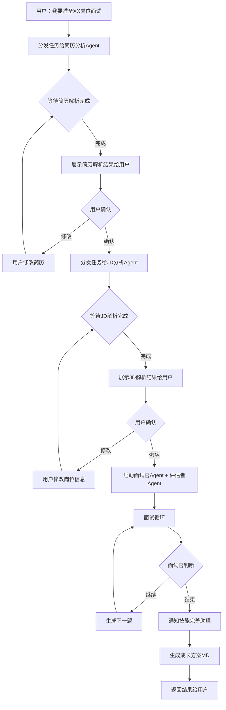
```mermaid
flowchart TD
    Start[用户：我要准备XX岗位面试] --> Resume[分发任务给简历分析Agent]
    Resume --> ResumeWait{等待简历解析完成}
    ResumeWait -->|完成| ShowResume[展示简历解析结果给用户]
    ShowResume --> Confirm{用户确认}
    Confirm -->|修改| Edit[用户修改简历]
    Edit --> ResumeWait
    Confirm -->|确认| JD[分发任务给JD分析Agent]
    JD --> JDWait{等待JD解析完成}
    JDWait -->|完成| ShowJD[展示JD解析结果给用户]
    ShowJD --> ConfirmJD{用户确认}
    ConfirmJD -->|修改| EditJD[用户修改岗位信息]
    EditJD --> JDWait
    ConfirmJD -->|确认| Interview[启动面试官Agent + 评估者Agent]
    Interview --> InterviewLoop[面试循环]
    InterviewLoop --> InterviewerDecides{面试官判断}
    InterviewerDecides -->|继续| NextQ[生成下一题]
    NextQ --> InterviewLoop
    InterviewerDecides -->|结束| Coach[通知技能完善助理]
    Coach --> Generate[生成成长方案MD]
    Generate --> End[返回结果给用户]
```

---

### 9.4 Agent 间通信模式

| 通信模式 | 说明 | 适用场景 |
|---------|------|---------|
| **同步调用** | 协调者直接调用Agent，等待结果 | 简历解析、JD解析（用户需确认，结果必须返回） |
| **异步并行** | 协调者同时启动多个Agent，各跑各的 | 面试官 + 评估者并行运行 |
| **事件驱动** | Agent完成后发布事件，其他Agent订阅 | 面试结束 → 触发技能完善助理 |
| **共享状态** | 各Agent读写同一份数据（面试上下文） | Q&A记录、面试上下文 |

---

### 9.5 并行执行说明

**面试官 Agent 与评估者 Agent 必须并行运行**：

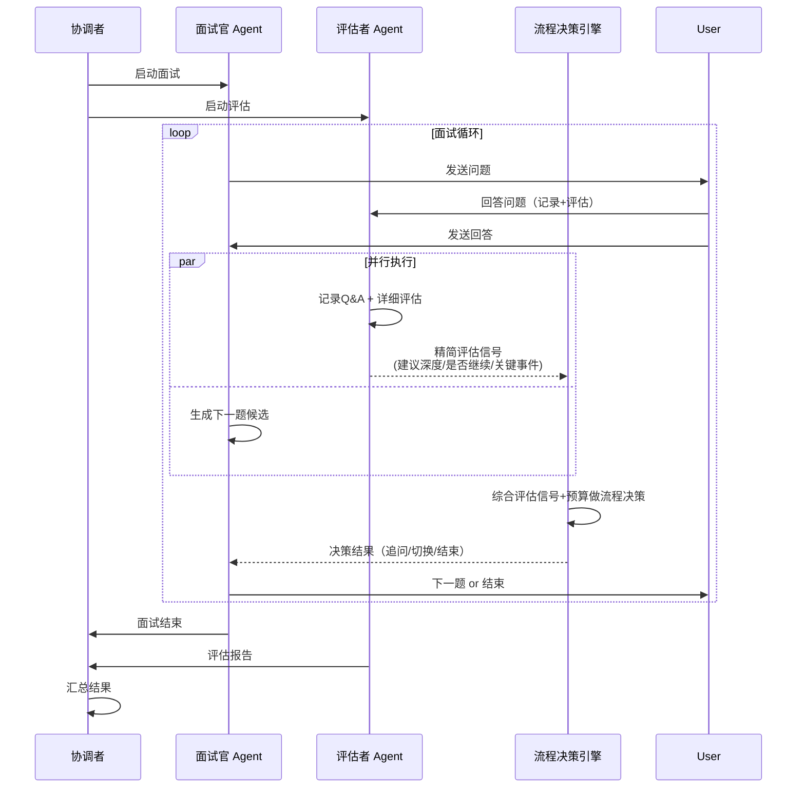
```mermaid
sequenceDiagram
    participant Coord as 协调者
    participant Interviewer as 面试官 Agent
    participant Evaluator as 评估者 Agent
    participant Decision as 流程决策引擎

    Coord->>Interviewer: 启动面试
    Coord->>Evaluator: 启动评估

    loop 面试循环
        Interviewer->>User: 发送问题
        User->>Evaluator: 回答问题（记录+评估）
        User->>Interviewer: 发送回答

        par 并行执行
            Evaluator->>Evaluator: 记录Q&A + 详细评估
            Evaluator-->>Decision: 精简评估信号<br/>(建议深度/是否继续/关键事件)
        and
            Interviewer->>Interviewer: 生成下一题候选
        end

        Decision->>Decision: 综合评估信号+预算做流程决策
        Decision-->>Interviewer: 决策结果（追问/切换/结束）
        Interviewer->>User: 下一题 or 结束
    end

    Interviewer->>Coord: 面试结束
    Evaluator->>Coord: 评估报告
    Coord->>Coord: 汇总结果
```

**为什么并行？**
- 评估耗时，如果等评估完成再出题，会导致用户等待
- 面试官 Agent 不读取详细评估报告，只接收流程决策引擎下发的精简信号
- 避免单一Agent处理所有逻辑导致卡顿

**评估信号隔离原则**：

| 信息类型 | 可见范围 | 说明 |
|---------|---------|------|
| 详细评估分数、维度分析、完整评语 | 仅评估者 Agent + 最终报告 | 对面试官不可见 |
| 建议下一深度、是否切换主题、关键事件标记 | 流程决策引擎 + 面试官 Agent | 仅用于流程控制 |
| 原始回答内容 | 面试官 Agent + 评估者 Agent | 用于生成追问和评估 |

---

### 9.6 工具层设计

#### 9.6.1 Tool 抽象接口

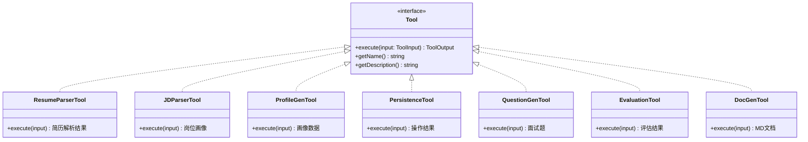
```mermaid
classDiagram
    class Tool {
        <<interface>>
        +execute(input: ToolInput) ToolOutput
        +getName() string
        +getDescription() string
    }

    class ResumeParserTool {
        +execute(input) 简历解析结果
    }

    class JDParserTool {
        +execute(input) 岗位画像
    }

    class ProfileGenTool {
        +execute(input) 画像数据
    }

    class PersistenceTool {
        +execute(input) 操作结果
    }

    class QuestionGenTool {
        +execute(input) 面试题
    }

    class EvaluationTool {
        +execute(input) 评估结果
    }

    class DocGenTool {
        +execute(input) MD文档
    }

    Tool <|.. ResumeParserTool
    Tool <|.. JDParserTool
    Tool <|.. ProfileGenTool
    Tool <|.. PersistenceTool
    Tool <|.. QuestionGenTool
    Tool <|.. EvaluationTool
    Tool <|.. DocGenTool
```

#### 9.6.2 Tool 标准接口

所有 Tool 必须遵循统一接口规范：

```typescript
// Tool 输入标准格式
interface ToolInput {
  taskName: string;      // 任务名称
  context: object;       // 上下文数据（各Tool自行定义）
  parameters: object;   // 任务参数
  metadata: object;     // 元数据（调用方、时间戳等）
}

// Tool 输出标准格式
interface ToolOutput {
  success: boolean;      // 是否成功
  data: object;         // 输出数据（各Tool自行定义）
  error?: string;        // 错误信息
  metadata: object;      // 元数据（耗时、token消耗等）
}
```

#### 9.6.3 Tool 分类

| Tool 类型 | 职责 | 抽象说明 | 调用方 |
|---------|------|---------|-------|
| **解析 Tool** | 解析原始文档，提取结构化信息 | 将非结构化输入转为结构化数据 | 简历分析 Agent、JD分析 Agent |
| **生成 Tool** | 根据输入生成目标内容 | Prompt + LLM + 输出格式化 | 面试官 Agent、技能完善助理 |
| **评估 Tool** | 对输入内容进行评估分析 | Prompt + LLM + 评估维度计算 | 评估者 Agent |
| **持久化 Tool** | 统一的数据读写接口 | 屏蔽底层存储细节 | 所有 Agent |
| **画像 Tool** | 生成各类画像数据 | 生成结构化的画像描述 | 简历分析 Agent、JD分析 Agent |

#### 9.6.4 Tool 实现要点

| 要点 | 说明 |
|------|------|
| **可替换** | Tool 实现可切换（如换 LLM 提供商），不影响 Agent |
| **可组合** | 复杂 Tool 可组合简单 Tool 实现 |
| **可观测** | Tool 调用需记录耗时、成功率等指标 |
| **可复用** | 同一 Tool 可被多个 Agent 调用 |
| **错误处理** | Tool 失败时返回标准错误格式，由调用方决定重试或降级 |

#### 9.6.5 Tool 与 Agent 的关系

```
Agent 职责：做决策（判断、路由、编排）
Tool 职责：做执行（解析、生成、存储）

Agent 调用 Tool，但不关心 Tool 内部实现
Tool 被 Agent 调用，但不知道被谁调用
```

---

## 11. 安全设计

### 11.1 安全设计原则

| 原则 | 说明 |
|------|------|
| **最小权限原则** | Agent 只获取完成任务所需的最少数据 |
| **职责分离** | 不同 Agent 负责不同数据域，禁止跨权限访问 |
| **数据隔离** | 用户数据按 userId 严格隔离，不可跨用户访问 |
| **可审计** | 所有数据访问操作需记录日志 |
| **默认安全** | 安全措施内嵌架构，而非后期补救 |

---

### 11.2 Agent 权限边界

#### 11.2.1 Agent 权限矩阵

| Agent | 可读取 | 可写入 | 禁止访问 |
|-------|--------|--------|---------|
| **协调者** | 用户指令、任务分发记录 | 任务分发 | 直接读取用户私有数据 |
| **简历分析 Agent** | 当前用户简历文件 | 简历信息 | 其他用户简历、面试记录 |
| **JD分析 Agent** | 当前用户上传的JD、公共岗位库 | JD信息（含审核状态） | 其他用户私有数据 |
| **面试官 Agent** | 当前用户简历（脱敏后）、公共岗位库、当前面试上下文 | 当前面试Q&A | 其他用户数据 |
| **评估者 Agent** | 当前面试Q&A | 评估报告 | 用户简历原文 |
| **技能完善助理** | 当前用户简历（脱敏后）、评估报告 | 成长方案 | 其他用户数据 |

#### 11.2.2 隐私数据 vs 公共数据边界

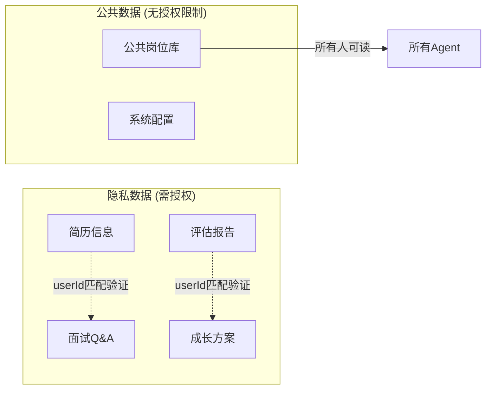
```mermaid
flowchart LR
    subgraph 隐私数据["隐私数据 (需授权)"]
        R[简历信息]
        I[面试Q&A]
        E[评估报告]
        G[成长方案]
    end

    subgraph 公共数据["公共数据 (无授权限制)"]
        P[公共岗位库]
        S[系统配置]
    end

    R -.->|userId匹配验证| I
    E -.->|userId匹配验证| G
    P -->|所有人可读| All[所有Agent]
```

**隐私数据访问规则**：
- 必须验证 `userId` 匹配
- Agent 只能访问当前会话用户的私有数据
- 严禁跨用户数据访问

---

### 11.3 外部 LLM 数据边界

> **合规风险提示**：简历结构化内容、岗位信息、完整面试回答会发送给外部 LLM 服务商。
> 需在隐私政策、用户告知、单独同意、供应商隔离、数据保留策略等方面满足合规要求。

#### 11.3.1 合规风险识别

| 风险项 | 说明 | 合规要求 |
|--------|------|---------|
| **数据跨境** | 使用境外 LLM 服务商，用户数据可能出境 | 需用户明确单独同意 |
| **用户告知** | 用户未被告知数据会发送给第三方 | 必须告知 |
| **单独同意** | 用户未单独同意 LLM 处理 | 需获取单独同意 |
| **数据最小化** | 可能发送了不必要的隐私信息 | 仅发送必要数据 |
| **数据保留** | 不清楚 LLM 服务商如何保留数据 | 需明确保留策略 |
| **供应商审计** | 未评估 LLM 供应商的数据安全资质 | 需评估并记录 |

#### 11.3.2 合规措施

| 措施 | 说明 | 实施要点 |
|------|------|---------|
| **用户告知** | 首次使用时明确告知 LLM 数据处理 | 弹窗/页面显著位置提示 |
| **单独同意** | LLM 处理需用户单独勾选同意 | 不可默认勾选，需主动操作 |
| **数据脱敏** | 发送前移除不必要的个人信息 | 移除真实姓名、身份证、电话、邮箱、公司名称等 |
| **最小化发送** | 只发送当前任务必需的上下文 | 控制 Prompt 长度和字段 |
| **供应商评估** | 评估 LLM 供应商的数据安全资质 | 记录供应商、数据处理协议 |
| **数据保留策略** | 明确 LLM 服务商的数据保留期限 | 参考供应商政策并告知用户 |

#### 11.3.3 数据脱敏规则

发送至 LLM 前必须脱敏的字段：

| 字段类型 | 脱敏方式 | 示例 |
|---------|---------|------|
| **姓名** | 替换为"候选人" | 张三 → 候选人 |
| **电话** | 删除 | 138xxxx8888 → [已删除] |
| **邮箱** | 删除 | xxx@email.com → [已删除] |
| **身份证** | 删除 | 110xxx... → [已删除] |
| **公司名称** | 替换为"某公司" | 字节跳动 → 某公司 |
| **具体地址** | 删除或模糊化 | 北京市朝阳区xxx → 北京市 |
| **项目名称** | 如涉及竞品需处理 | 保留但标注来源 |

#### 11.3.4 LLM 调用审计日志

```json
{
  "llm_call_id": "uuid",
  "timestamp": "2026-07-19T10:00:00Z",
  "user_id": "user_xxx",
  "llm_provider": "provider_a",
  "data_types_sent": ["resume_summary", "position_profile", "qa_history"],
  "sensitive_fields_removed": ["name", "phone", "email", "company_name"],
  "user_consent_obtained": true,
  "consent_timestamp": "2026-07-19T09:00:00Z",
  "response_retention_days": 30
}
```

---

### 11.4 安全实施检查清单

#### P0 必须做（上线前必须完成）

```
[P0] Agent 权限边界：每个 Agent 调用 Tool 前校验权限，禁止越权访问
[P0] Agent 越级访问防护：Tool 层增加权限校验，Agent 无法访问其职责外的数据
[P0] 用户数据隔离：所有数据查询必须包含 userId 条件校验
[P0] LLM 单独同意：用户主动勾选同意后方可使用 LLM 功能，不可默认同意
[P0] 数据脱敏：简历发送 LLM 前执行脱敏处理（姓名、电话、邮箱、公司名等）
[P0] 用户告知：首次使用前明确告知 LLM 数据处理
```

#### P1 尽快做（上线后短期内完成）

```
[P1] 接口限流：防止恶意刷接口、爆破攻击
[P1] Prompt 注入防护：输入过滤，防止用户在回答中注入恶意 Prompt
[P1] LLM 幻觉校验：对生成的评估结果和成长方案进行置信度校验
[P1] 输入长度限制：防止超长输入导致成本失控或 Prompt 攻击
```

#### P2 应该做（后续版本完成）

```
[P2] 密钥管理：使用密钥管理服务存储 API Key，定期轮换
[P2] 多供应商备份：配置多个 LLM 供应商，故障时自动切换
[P2] 成本预警：LLM 调用量/费用达到阈值时告警
[P2] 全链路监控：记录各 Agent、Tool 调用耗时、成功率
```

#### P3 可以做（持续完善）

```
[P3] 数据本地化：考虑使用境内 LLM 供应商
[P3] 详细审计日志：记录所有数据访问操作
[P3] 用户删除权：用户可请求删除其所有数据
```

---

### 11.5 Agent 越级访问防护设计

#### 风险说明

Agent 越级访问指 Agent 尝试访问超出其职责范围的数据。例如：
- 面试官 Agent 尝试读取用户简历原始文件
- 评估者 Agent 尝试写入 Q&A 记录
- 技能完善助理尝试读取其他用户的评估报告

#### 防护机制

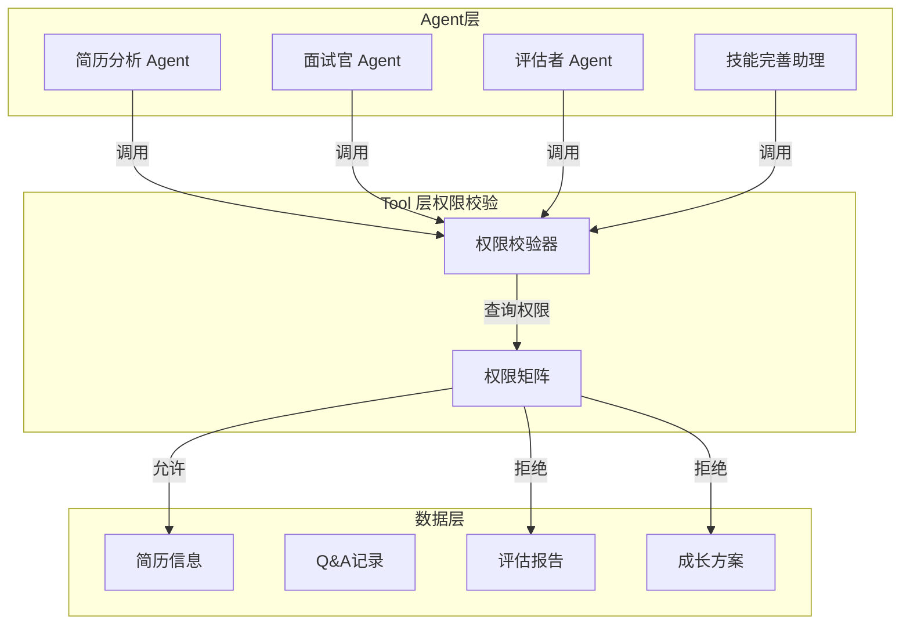
```mermaid
flowchart TB
    subgraph Agent层
        A1[简历分析 Agent]
        A2[面试官 Agent]
        A3[评估者 Agent]
        A4[技能完善助理]
    end

    subgraph Tool权限校验["Tool 层权限校验"]
        PC[权限校验器]
        PM[权限矩阵]
    end

    subgraph 数据层
        D1[简历信息]
        D2[Q&A记录]
        D3[评估报告]
        D4[成长方案]
    end

    A1 -->|调用| PC
    A2 -->|调用| PC
    A3 -->|调用| PC
    A4 -->|调用| PC

    PC -->|查询权限| PM
    PM -->|允许| D1
    PM -->|拒绝| D3
    PM -->|拒绝| D4
```

#### 权限校验实现要点

| 实现要点 | 说明 |
|---------|------|
| **权限矩阵配置化** | 权限规则配置在独立文件中，不硬编码 |
| **Tool 层校验** | 在 Tool 执行前校验调用者权限，校验失败直接拒绝 |
| **最小权限默认** | 默认拒绝，只显式配置允许的操作 |
| **校验日志** | 所有权限校验结果需记录日志 |
| **定期审计** | 定期检查权限配置是否正确执行 |

#### 权限配置示例

```yaml
# agent_permissions.yaml
agents:
  resume_agent:
    allowed_tools:
      - resume_parser
      - resume_profile_gen
    allowed_data_read:
      - user_resume_file
    allowed_data_write:
      - resume_info
    denied_data:
      - qa_records
      - evaluation_report

  interviewer_agent:
    allowed_tools:
      - question_gen
      - public_position_query
    allowed_data_read:
      - user_resume_summary  # 只读脱敏后的摘要
      - public_positions
    allowed_data_write:
      - qa_records
    denied_data:
      - user_resume_file     # 禁止读取原始简历
      - evaluation_report    # 禁止读取详细评估报告
```

---

## 12. 超时与容灾设计

### 12.1 设计目标

- 任何 LLM 调用失败都不应导致面试异常终止
- 用户断线/刷新后能够恢复当前面试状态
- 单次 LLM 超时不会影响整个面试流程

### 12.2 LLM 调用超时与降级

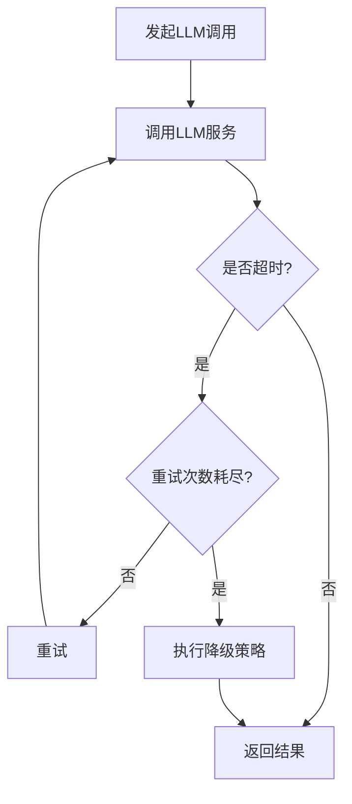
```mermaid
flowchart TD
    Start[发起LLM调用]
    Call[调用LLM服务]
    Timeout{是否超时?}
    Retry[重试]
    RetryCount{重试次数耗尽?}
    Fallback[执行降级策略]
    Success[返回结果]

    Start --> Call
    Call --> Timeout
    Timeout -->|否| Success
    Timeout -->|是| RetryCount
    RetryCount -->|否| Retry
    Retry --> Call
    RetryCount -->|是| Fallback
    Fallback --> Success
```

**超时与降级配置**：

| 场景 | 超时时间 | 重试次数 | 降级策略 |
|------|---------|---------|---------|
| 简历解析 | 60s | 1 次 | 标记 `PARSE_FAILED` 并保留已有正式画像；由用户手动重试，不伪装为空画像成功 |
| JD 解析 | 60s | 2 次 | 返回基础岗位信息，允许用户手动补充 |
| 问题生成 | 15s | 2 次 | 从题库返回同主题基础题 |
| 回答评估 | 10s | 1 次 | 使用规则评估（长度/关键词） |
| 报告生成 | 30s | 2 次 | 返回简化版报告 |
| 成长方案生成 | 60s | 2 次 | 返回仅含薄弱点的简化方案 |

### 12.3 面试断线恢复

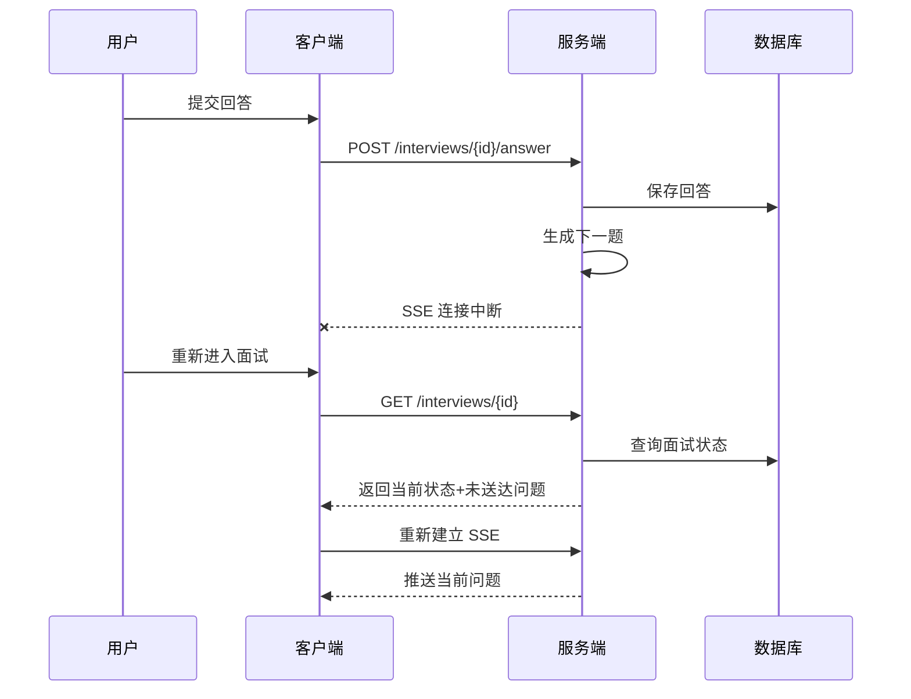
```mermaid
sequenceDiagram
    participant User as 用户
    participant Client as 客户端
    participant Server as 服务端
    participant DB as 数据库

    User->>Client: 提交回答
    Client->>Server: POST /interviews/{id}/answer
    Server->>DB: 保存回答
    Server->>Server: 生成下一题
    Server--xClient: SSE 连接中断

    User->>Client: 重新进入面试
    Client->>Server: GET /interviews/{id}
    Server->>DB: 查询面试状态
    Server-->>Client: 返回当前状态+未送达问题
    Client->>Server: 重新建立 SSE
    Server-->>Client: 推送当前问题
```

**恢复规则**：
- 服务端每次收到回答后立即持久化
- 若 SSE 推送失败，问题会标记为 `pending_delivery`
- 客户端重新连接时拉取 `pending_delivery` 的问题

### 12.4 SSE 错误事件

```json
{
  "type": "error",
  "code": "LLM_TIMEOUT",
  "message": "当前生成超时，已为你切换到备选题目",
  "fallback": true
}
```

| 错误码 | 说明 | 客户端处理 |
|--------|------|-----------|
| LLM_TIMEOUT | LLM 调用超时 | 显示提示，等待重试 |
| LLM_SERVICE_ERROR | LLM 服务异常 | 使用题库题目 |
| INTERVIEW_INTERRUPTED | 面试被中断 | 跳转报告页 |
| INVALID_ANSWER | 回答无效 | 提示重新输入 |

### 12.5 熔断与限流

- 单个面试会话内 LLM 连续失败 3 次自动切换为题库模式
- 简历 AI 任务达到用户级或简历级许可上限时立即拒绝，不进入业务等待队列；其他业务域按各自策略处理
- 全局 LLM 供应商不可用时自动切换到备用供应商

---

## 13. 关键业务规则

### 13.1 简历与 JD 确认规则

| 规则 | 说明 |
|------|------|
| 简历事实确认 | 首次解析后必须由用户确认事实草稿，正式事实画像存在后才能创建面试 |
| 简历重新解析 | 保留旧正式事实；新草稿确认前仍可使用旧事实创建面试 |
| 辅助分析 | 可选且只用于选题；缺失、失败或损坏不阻断正式事实和面试 |
| JD确认 | 解析后必须用户确认方可开始面试 |

### 13.2 面试并行规则

| 规则 | 说明 |
|------|------|
| 面试并行 | 面试官与评估者并行运行，评估结果对面试官不可见 |
| 评估隔离 | 评估者详细评估，但不展示给用户，不干扰面试官 |

### 13.3 多岗位类型支持

**背景**：当前设计以技术开发岗位为主，实际面试场景覆盖技术族、产品族、设计族、运营族、营销族、职能族等多个岗位大类。不同岗位的考察重点、深度维度、评估权重各不相同，需通过岗位大类抽象实现通用支持。

#### 13.3.1 岗位大类定义

| 大类 | 代码 | 说明 | 示例岗位 |
|------|------|------|---------|
| **技术族** | TECH | 软件开发、算法、数据等技术人员 | Java开发、前端、算法工程师、测试工程师 |
| **产品族** | PRODUCT | 产品策划、设计、需求分析 | 产品经理、需求分析师、BA |
| **设计族** | DESIGN | 视觉设计、交互设计 | UI设计师、UX设计师、产品设计师 |
| **运营族** | OPERATIONS | 运营、编辑、客服 | 用户运营、内容运营、客服 |
| **营销族** | MARKETING | 销售、市场、品牌 | 销售经理、市场专员、品牌经理 |
| **职能族** | FUNCTION | HR、财务、法务等职能岗位 | HRBP、财务、法务 |

#### 13.3.2 通用深度递进模型

**核心原则**：所有岗位大类遵循统一的 5 层深度递进框架，各岗位在具体问题类型和考察重点上有所不同。

| Level | 层级名称 | 技术族 | 产品族 | 设计族 | 运营族 | 营销族 |
|-------|---------|--------|--------|--------|--------|--------|
| **L1** | 基础概念 | 基础知识/概念 | 基本概念/术语 | 设计基础/原则 | 行业常识/规则 | 市场常识/概念 |
| **L2** | 选型决策 | 方案选型 | 需求分析/优先级 | 方案设计/比选 | 策略制定 | 销售/营销策略 |
| **L3** | 原理机制 | 原理/源码 | 业务逻辑/流程 | 用户洞察/心理 | 客户需求理解 | 客户心理/动机 |
| **L4** | 实践踩坑 | 实战经验/踩坑 | 项目经验/落地 | 落地经验/案例 | 成交经验/案例 | 资源整合/谈判 |
| **L5** | 深度扩展 | 边界/异常/优化 | 行业洞察/创新 | 创新思维/趋势 | 资源整合/创新 | 战略规划/格局 |

#### 13.3.3 各岗位大类评估权重

| 评估维度 | 技术族 | 产品族 | 设计族 | 运营族 | 营销族 | 职能族 |
|----------|--------|--------|--------|--------|--------|--------|
| **专业深度** | 30% | 15% | 15% | 10% | 10% | 15% |
| **业务理解** | 15% | 30% | 25% | 25% | 30% | 20% |
| **实践能力** | 25% | 25% | 30% | 25% | 25% | 20% |
| **沟通表达** | 15% | 20% | 20% | 25% | 25% | 25% |
| **学习能力** | 15% | 10% | 10% | 15% | 10% | 20% |

> **权重配置化**：各岗位大类的评估权重通过配置管理，支持后续调整和扩展新岗位类型。

#### 13.3.4 深度跳跃规则（通用）

| 场景 | 行为 | 说明 |
|------|------|------|
| **连续优秀** | 跳跃深度等级（可跳1-2级） | 快速通过浅层，直达更深层，但**不换主题** |
| **连续失败** | 切换到下一主题 | 候选人无法继续深入，切换主题 |
| **深度已达上限** | 切换到下一主题 | 该主题考察完毕 |
| **主题时间耗尽** | 切换到下一主题 | 时间预算用完 |

> **重要**：连续优秀是**加速深入**，不是**跳离主题**。必须确认候选人确实掌握了这个主题的深层才能换主题。

#### 13.3.5 深度控制参数（通用）

| 参数 | 说明 | 建议值 |
|------|------|--------|
| `minDepth` | 主题最低深度 | L1 |
| `maxDepth` | 主题最高深度 | L5 |
| `consecutiveFailures` | 连续失败多少次触发切换 | 2-3 次 |
| `consecutiveExcellence` | 连续优秀多少次可跳跃深度 | 2 次 |
| `depthJumpMax` | 最多跳跃多少个深度等级 | 2 级 |

#### 13.3.6 主题切换条件（通用）

| 触发条件 | 说明 |
|---------|------|
| 当前主题深度已达 `maxDepth` 且回答稳定 | 该主题考察完毕 |
| 连续 `consecutiveFailures` 次无法深入回答 | 候选人无法继续，切换主题 |
| 该主题时间预算耗尽 | 切换到下一主题 |
| 所有预设主题已考察完毕 | 面试结束 |

#### 13.3.7 架构改动要点

**数据模型新增**：

```
JobCategory（岗位大类）
  ├── categoryId: String (唯一标识，如 "TECH")
  ├── categoryName: String (中文名称，如 "技术族")
  ├── depthModel: JSON (L1-L5 各层级定义)
  ├── evaluationWeights: JSON (评估维度权重配置)
  └── questionTemplates: List<String> (问题模板标识)

Position（岗位）
  ├── ...
  └── category: JobCategory (岗位所属大类)
```

**Agent Prompt 重构策略**：

| Agent | 重构要点 |
|-------|---------|
| **协调者 Agent** | 根据岗位类别选择对应 Prompt 模板、调用不同子 Agent |
| **面试官 Agent** | 按岗位类别选择问题生成策略、使用类别特定的问题模板 |
| **评估者 Agent** | 按岗位类别应用不同评估维度权重、输出类别定制的评估报告 |
| **技能完善助理** | 生成符合岗位类别的成长方案、使用类别特定的学习路径模板 |

**配置化设计**：

```yaml
job_category:
  TECH:
    name: 技术族
    depth_model:
      L1: 基础概念
      L2: 选型决策
      L3: 原理机制
      L4: 实践踩坑
      L5: 深度扩展
    evaluation_weights:
      专业深度: 0.30
      业务理解: 0.15
      实践能力: 0.25
      沟通表达: 0.15
      学习能力: 0.15
  
  PRODUCT:
    name: 产品族
    depth_model:
      L1: 基本概念
      L2: 需求分析
      L3: 业务逻辑
      L4: 项目经验
      L5: 行业洞察
    evaluation_weights:
      专业深度: 0.15
      业务理解: 0.30
      实践能力: 0.25
      沟通表达: 0.20
      学习能力: 0.10
```

---

### 13.4 专业面试深度递进模型（技术族示例）

> 以下内容为技术族岗位的专业面试详细定义，作为默认配置保留。实际使用时应通过 `JobCategory` 配置驱动。
>
> **各岗位大类的专业面试模型**：技术族使用技术类深度模型，产品族使用需求分析/产品设计模型，营销族使用客户拓展/谈判模型等。

#### 深度层级定义（技术族）

| Level | 层级名称 | 提问模式 | 考察目的 |
|-------|---------|---------|---------|
| **L1** | 基础概念 | 你对 [技术主题] 有哪些了解？ | 探测广度，确认候选人是否接触过该技术 |
| **L2** | 选型与决策 | 碰到这样的问题，你会采用什么技术/方案？ | 探测候选人的技术选型能力和经验 |
| **L3** | 原理与机制 | 这项技术的原理是什么？它是怎么解决这个问题的？ | 探测深度，确认不仅会用，还能理解原理 |
| **L4** | 实践与踩坑 | 使用过程中有没有碰到什么重大问题？怎么解决的？ | 探测实践经验，确认有真实踩坑和解决能力 |
| **L5** | 深度扩展 | 在这种情况下，遇到 [特定异常/边界] 问题怎么处理？ | 探测对技术边界的理解和处理复杂情况的能力 |

#### 深度跳跃示例（技术族）

```
场景：Java 多线程面试

候选人 L1 回答优秀 → 直接跳到 L3 或 L4
候选人 L3 回答优秀 → 直接跳到 L5

但不会：L1 优秀 → 直接换到 MySQL 主题
```

### 13.5 面试结束判定规则

#### 结束类型定义

| 结束类型 | 触发条件 | 说明 |
|---------|---------|------|
| **正常结束** | 所有预设主题考察完毕 | 面试官输出结束信号 |
| **提前结束** | 连续两个主题无法达到目标深度 | 基础薄弱，继续面试意义不大 |
| **用户中断** | 用户主动结束面试 | 触发成长方案生成 |
| **时间耗尽** | 达到面试总时长上限 | 按时间结束 |

#### "问题太差"的定义

| 情况 | 说明 |
|------|------|
| **无法回答** | 候选人明确表示不知道或无法回答 |
| **严重偏离** | 回答与问题主题完全不相关 |
| **连续基础失败** | 连续多次基础问题（L1/L2）都无法正确回答 |

#### 提前结束判定流程

```
┌─────────────────────────────────────────────────────────────────┐
│                      提前结束判定流程                            │
├─────────────────────────────────────────────────────────────────┤
│                                                                 │
│  单问题回答太差？                                               │
│      │                                                         │
│      ├──是──→ 切换到同主题下一个问题（给一次机会）               │
│      │                                                         │
│      └──否──→ 继续当前主题                                       │
│                                                                 │
│  该主题结束后，判断能否进入更深层级？                             │
│      │                                                         │
│      ├──是──→ 继续当前主题（追问或跳跃深度）                     │
│      │                                                         │
│      └──否──→ 切换到下一主题                                     │
│                  │                                              │
│                  ▼                                              │
│          连续 2 个主题无法达到 L2？                             │
│              │                                                  │
│              ├──是──→ 提前结束面试                              │
│              │                                                  │
│              └──否──→ 继续面试                                   │
│                                                                 │
└─────────────────────────────────────────────────────────────────┘
```

#### 提前结束判定参数

| 参数 | 说明 | 建议值 |
|------|------|--------|
| `singleQuestionRetry` | 单问题连续失败多少次切换问题 | 2 次 |
| `consecutiveThemeFailures` | 多少个主题未达到目标深度时提前结束 | 2 个 |
| `minDepthThreshold` | 目标深度的最低要求（通常是 L2） | L2 |

#### 提前结束后处理

| 处理项 | 说明 |
|--------|------|
| **生成成长方案** | 仍然生成成长方案 |
| **基础薄弱提示** | 明确告知基础薄弱，建议先补齐基础再面试 |
| **评估报告标注** | 报告中标注"基础薄弱，无法完成深度考察" |

### 13.6 历史记录规则

| 规则 | 说明 |
|------|------|
| 面试记录保存 | 所有 Q&A 记录自动保存 |
| 历史查看 | 用户可回看历史面试记录 |
| 报告存档 | 评估报告和成长方案长期保存 |

### 13.7 评估维度与打分标准

#### 评估维度（5个核心维度）

| 维度 | 说明 | 权重 |
|------|------|------|
| **技术深度** | 对技术原理、机制的掌握程度 | 30% |
| **技术广度** | 对技术栈的全面性了解 | 15% |
| **实践经验** | 真实项目经验、问题解决能力 | 25% |
| **表达能力** | 逻辑清晰、表述准确 | 15% |
| **学习能力** | 对新技术的理解和学习潜力 | 15% |

#### 打分等级标准

| 等级 | 分数范围 | 说明 |
|------|---------|------|
| **优秀** | 90-100 | 能深入原理，有丰富实践经验 |
| **良好** | 75-89 | 理解原理，有一定实践经验 |
| **一般** | 60-74 | 了解基础，实践经验较少 |
| **较差** | 40-59 | 基础薄弱，需要加强学习 |
| **很差** | 0-39 | 完全无法回答或严重偏离 |

#### 综合评分计算

```
综合评分 = 技术深度×30% + 技术广度×15% + 实践经验×25% + 表达能力×15% + 学习能力×15%
```

#### 评估输出内容

| 内容 | 说明 |
|------|------|
| 各维度评分 | 每个维度的具体得分（0-100） |
| 综合评分 | 加权计算后的总分（0-100） |
| 等级评定 | 优秀/良好/一般/较差/很差 |
| 主题表现 | 每个考察主题的具体表现 |
| 关键事件 | 优秀/困难的关键回答记录 |
| 薄弱点列表 | 暴露的薄弱知识点 |
| 优势点列表 | 表现突出的知识点 |

#### 成长方案 MD 格式规范

| 章节 | 内容 |
|------|------|
| **一、面试总结** | 面试整体表现概述、综合评分、等级评定 |
| **二、薄弱知识点列表** | 本次面试暴露的薄弱点、每个薄弱点的严重程度 |
| **三、知识补全** | 针对每个薄弱点的详细解释、核心概念澄清、常见误区说明 |
| **四、学习路径** | 从基础到深入的学习路线、每个阶段的学习目标、推荐学习周期 |
| **五、练习题** | 针对薄弱点的练习题、参考答案、解题思路 |
| **六、推荐资源** | 书籍、在线课程、官方文档 |
| **七、下一步建议** | 短期内如何提升、下次面试前应该达到什么水平 |

---

### 13.8 LLM 成本控制策略

#### 12.9.1 控制目标

- 单次完整面试 LLM 调用次数控制在 **20 次以内**
- 单次面试 token 消耗较"全 LLM 驱动"方案降低 **50% 以上**
- 成长方案生成控制在 **1-2 次 LLM 调用**

#### 12.9.2 核心策略

| 策略 | 说明 | 落地位置 |
|------|------|---------|
| **混合题库 + RAG** | 按题库规模动态调整题库/LLM 出题比例，题库不足时由 LLM 生成并沉淀 | 面试模块 QuestionGenTool |
| **评估降频** | 专业面试每 2-3 题评估一次；非专业环节使用规则评估 | 面试模块 EvaluationTool |
| **上下文压缩** | 只保留最近 N 轮 Q&A + 主题摘要进入 Prompt | 面试上下文 InterviewContext |
| **结果缓存** | 简历解析、岗位画像、公共题库结果可缓存 | 简历/岗位模块 |
| **模型分层** | 按任务复杂度、token 预算、延迟要求路由到不同模型层级 | AI 服务层 ModelRouter |
| **Prompt 模板复用** | 高频任务使用结构化模板，减少重复 token | PromptTemplateRegistry |

#### 12.9.3 题库与 RAG 设计

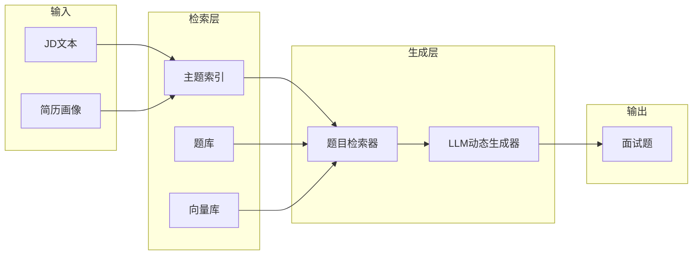
```mermaid
flowchart LR
    subgraph 输入
        JD[JD文本]
        Resume[简历画像]
    end

    subgraph 检索层
        TopicIndex[主题索引]
        QuestionBank[题库]
        VectorStore[向量库]
    end

    subgraph 生成层
        Retriever[题目检索器]
        Generator[LLM动态生成器]
    end

    subgraph 输出
        Question[面试题]
    end

    JD --> TopicIndex
    Resume --> TopicIndex
    TopicIndex --> Retriever
    QuestionBank --> Retriever
    VectorStore --> Retriever
    Retriever --> Generator
    Generator --> Question
```

**题库分级**：

| 级别 | 内容 | 使用方式 |
|------|------|---------|
| **L1 基础题库** | 各岗位大类常见基础题 | 直接返回，无需 LLM |
| **L2 模板题库** | 带占位符的问题模板 | 填充简历/岗位信息后返回 |
| **L3 动态生成** | 针对特定回答的追问 | 必须由 LLM 生成 |

**渐进式题库比例策略（按岗位大类独立统计）**：

| 题库规模 | 题库出题比例 | LLM 出题比例 | 沉淀规则 |
|----------|-------------|--------------|---------|
| **< 100 题** | 0% | 100% | LLM 生成题目经去重后全部沉淀入库 |
| **100 - 200 题** | 40% | 60% | 经典/高质量 LLM 题目沉淀入库 |
| **200 - 400 题** | 70% | 30% | 经典/高质量 LLM 题目沉淀入库 |
| **400 - 1000 题** | 85% | 15% | 经典/高质量 LLM 题目沉淀入库 |
| **> 1000 题** | 95% | 5% | 经典/高质量 LLM 题目沉淀入库 |

> **说明**：
> - 比例按「岗位大类（job_category）」独立计算，避免某个大类题库不足时被其他大类稀释
> - 每次出题前统计当前岗位大类 + 主题下的可用题目数，动态决定出题来源
> - LLM 生成的题目经过语义去重后，质量较高的题目补充进题库，逐步降低 LLM 依赖

**题目沉淀与去重规则**：

| 项目 | 说明 |
|------|------|
| **去重方式** | 语义相似度去重（向量相似度 ≥ 0.92 视为重复）+ 同一主题下 exact 重复过滤 |
| **入库条件** | LLM 生成题目需满足：表达清晰、与岗位大类/主题相关、无明显错误 |
| **质量筛选** | 经典题/高质量题可由 LLM 自评 + 用户使用反馈（use_count/评分）共同决定 |
| **来源标记** | 沉淀入库的题目 `source=llm`，与系统预设 `source=system` 区分 |
| **索引更新** | 入库后异步更新主题索引和向量库，保证检索实时性 |

#### 12.9.4 评估降频规则

| 环节 | 评估频率 | 说明 |
|------|---------|------|
| 自我介绍 | 1 次（环节结束时） | 规则评估表达逻辑 |
| 专业面试 | 每 2-3 题评估一次 | 由流程决策引擎判断是否需要评估 |
| 简历探讨 | 每项目 1 次 | 项目结束后评估 |
| 行为面试 | 每 2 题评估一次 | 关注 STAR 结构完整性 |
| 结束环节 | 不评估 | 仅记录 |

**触发强制评估的条件**：
- 当前主题可能达到切换条件
- 回答长度异常（过短/过长）
- 用户主动请求反馈

#### 12.9.5 上下文压缩规则

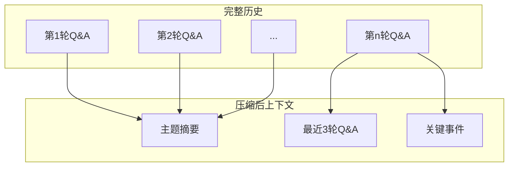
```mermaid
flowchart TB
    subgraph 完整历史
        H1[第1轮Q&A]
        H2[第2轮Q&A]
        H3[...]
        Hn[第n轮Q&A]
    end

    subgraph 压缩后上下文
        S1[主题摘要]
        S2[最近3轮Q&A]
        S3[关键事件]
    end

    H1 --> S1
    H2 --> S1
    H3 --> S1
    Hn --> S2
    Hn --> S3
```

**压缩策略**：
- 同主题早期 Q&A 压缩为"主题摘要"（由评估者维护）
- 进入面试官 Prompt 的只保留最近 3-5 轮完整 Q&A
- 跨主题切换时只携带上一主题摘要，不携带完整历史

#### 12.9.6 模型分层路由策略

**模型分层目标**：在成本、质量、延迟之间取得平衡，避免所有任务都使用最高能力模型。

**任务复杂度分层**：

| 层级 | 典型任务 | 能力要求 | 示例 |
|------|---------|---------|------|
| **L1 轻量任务** | 格式化、简单提取、模板渲染、规则判断 | 低 | JSON 格式化、关键词提取、题目模板填充 |
| **L2 标准任务** | 常规生成、分类、摘要、简历/岗位解析 | 中 | 生成面试题、简历画像、岗位画像 |
| **L3 复杂任务** | 深度推理、评估、多轮决策、成长方案 | 高 | 面试评估报告、深度追问、成长方案生成 |

**阈值确定方法**：

阈值不是固定值，由以下因素综合决定，并在配置中心可调整：

| 维度 | 判定指标 | 建议阈值/规则 |
|------|---------|--------------|
| **输出长度** | 预期输出 token 数 | L1 < 300 / L2 300-800 / L3 > 800 |
| **推理深度** | 是否需要多步推理/因果分析 | 需要深度推理 → L3 |
| **任务类型标签** | 业务标注的任务类型 | 解析类 → L2，评估类 → L3，格式化 → L1 |
| **上下文长度** | 输入 prompt token 数 | > 4k 时考虑降层以控制成本 |
| **延迟要求** | 用户可接受等待时间 | 实时交互 < 2s 优先 L1/L2 |
| **成本预算** | 单次面试/月度预算 | 预算紧张时自动降层 |
| **质量反馈** | 人工抽检评分 | 某层模型连续低分则上调层级 |

**模型层级与供应商映射（用户可配置）**：

| 层级 | 默认用途 | 用户配置项 |
|------|---------|-----------|
| **L1 轻量** | 主供：用户配置的轻量模型；备供：同供应商更低阶模型或本地规则 | `llm.tier.l1.primary`、`llm.tier.l1.fallback` |
| **L2 标准** | 主供：用户配置的标准模型；备供：同供应商备选模型 | `llm.tier.l2.primary`、`llm.tier.l2.fallback` |
| **L3 复杂** | 主供：用户配置的高性能模型；备供：另一供应商高性能模型 | `llm.tier.l3.primary`、`llm.tier.l3.fallback` |

> **说明**：
> - 每个层级绑定一个主供应商模型和一个备用供应商模型，由用户在系统配置中提供 API Key 和模型名
> - 备用模型在主模型超时/不可用时自动切换，切换后记录日志
> - 阈值初始值由系统预设，管理员可根据实际质量和成本数据调整

**路由决策流程**：

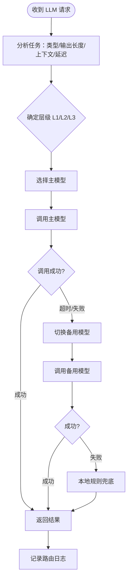
```mermaid
flowchart TD
    Start([收到 LLM 请求])
    Analyze[分析任务：类型/输出长度/上下文/延迟]
    Decide{确定层级 L1/L2/L3}
    SelectPrimary[选择主模型]
    CallPrimary[调用主模型]
    Success{调用成功?}
    SelectFallback[切换备用模型]
    CallFallback[调用备用模型]
    FallbackSuccess{成功?}
    LocalRule[本地规则兜底]
    Return[返回结果]
    Record[记录路由日志]

    Start --> Analyze
    Analyze --> Decide
    Decide --> SelectPrimary
    SelectPrimary --> CallPrimary
    CallPrimary --> Success

    Success -->|成功| Return
    Success -->|超时/失败| SelectFallback
    SelectFallback --> CallFallback
    CallFallback --> FallbackSuccess

    FallbackSuccess -->|成功| Return
    FallbackSuccess -->|失败| LocalRule
    LocalRule --> Return

    Return --> Record
```

---

## 14. 整体技术架构

### 13.1 架构分层总览

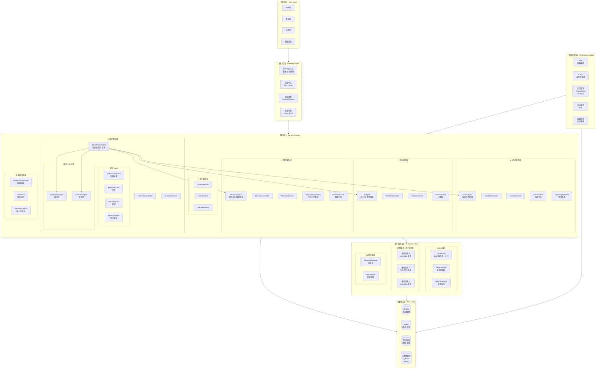
```mermaid
flowchart TB
    %% ============================================
    %% 用户层
    %% ============================================
    subgraph 用户层["【用户层】 User Layer"]
        Web[Web端]
        Mobile[移动端]
        MiniApp[小程序]
        Admin[管理后台]
    end

    %% ============================================
    %% 接入层
    %% ============================================
    subgraph 接入层["【接入层】 Gateway Layer"]
        Gateway[API Gateway<br/>路由·协议转换]
        Auth[认证中心<br/>JWT·OAuth]
        RateLimiter[限流熔断<br/>Sentinel·Guava]
        LoadBalancer[负载均衡<br/>Nginx·云LB]
    end

    %% ============================================
    %% 服务域
    %% ============================================
    subgraph 服务域["【服务域】 Service Domain"]
        direction TB

        subgraph 用户服务["👤 用户服务域"]
            UserController[UserController]
            UserService[UserService]
            UserRepo[UserRepository]
        end

        subgraph 简历服务["📄 简历服务域"]
            ResumeController[ResumeController]
            ResumeService[ResumeService]
            ResumeAgent[ResumeAgent<br/>简历分析·画像生成]
            ResumeParserTool[ResumeParserTool<br/>PDF/TXT解析]
            ProfileGenTool[ProfileGenTool<br/>画像生成]
        end

        subgraph 岗位服务["💼 岗位服务域"]
            PositionController[PositionController]
            PositionService[PositionService]
            JDAgent[JDAgent<br/>JD分析·需求提取]
            JDParserTool[JDParserTool<br/>JD解析]
        end

        subgraph 面试服务["🎯 面试服务域"]
            InterviewController[InterviewController]
            InterviewService[InterviewService]

            Coordinator[CoordinatorAgent<br/>协调者·任务编排]

            subgraph 面试子域["面试 Agent 群"]
                InterviewerAgent[InterviewerAgent<br/>面试官]
                EvaluatorAgent[EvaluatorAgent<br/>评估者]
            end

            subgraph 面试工具["面试 Tools"]
                QuestionGenTool[QuestionGenTool<br/>问题生成]
                EvaluationTool[EvaluationTool<br/>评估]
                MatchingTool[MatchingTool<br/>匹配]
                StreamingTool[StreamingTool<br/>流式输出]
            end
        end

        subgraph 成长服务["📈 成长服务域"]
            GrowthController[GrowthController]
            GrowthService[GrowthService]
            CoachAgent[CoachAgent<br/>技能完善助理]
            DocGenTool[DocGenTool<br/>文档生成]
            LearningPathTool[LearningPathTool<br/>学习路径]
        end

        subgraph 基础设施["⚙️ 基础设施域"]
            DesensitizationTool[DesensitizationTool<br/>数据脱敏]
            AuditTool[AuditTool<br/>操作审计]
            PersistenceTool[PersistenceTool<br/>统一持久化]
        end
    end

    %% ============================================
    %% AI 服务层（Spring AI Alibaba）
    %% ============================================
    subgraph AI服务层["【AI 服务层】 AI Service Layer"]
        direction TB

        subgraph AI编排["Agent 编排"]
            LlmService[LlmService<br/>LLM 服务统一入口]
            ModelRouter[ModelRouter<br/>多模型路由]
            ReActExecutor[ReActExecutor<br/>推理执行]
        end

        subgraph AI模型["模型服务（用户配置）"]
            ProviderA[主供应商 A<br/>L1/L2/L3 模型]
            ProviderB[备供应商 B<br/>L1/L2/L3 模型]
            ProviderC[备供应商 C<br/>L1/L2/L3 模型]
        end

        subgraph 向量服务["向量化服务"]
            EmbeddingModel[EmbeddingModel<br/>向量化]
            VectorStore[VectorStore<br/>向量存储]
        end
    end

    %% ============================================
    %% 数据域
    %% ============================================
    subgraph 数据域["【数据域】 Data Layer"]
        MySQL[(MySQL<br/>业务数据)]
        Redis[(Redis<br/>缓存·会话)]
        FileStorage[(文件存储<br/>简历·文档)]
        VectorDB[(向量数据库<br/>Qdrant<br/>Milvus)]
    end

    %% ============================================
    %% 底层支撑域
    %% ============================================
    subgraph 底层支撑域["【底层支撑域】 Infrastructure Layer"]
        Kubernetes[K8s<br/>容器编排]
        CICD[CI/CD<br/>自动化部署]
        Monitoring[监控告警<br/>Prometheus<br/>Grafana]
        Logging[日志服务<br/>ELK]
        MQ[消息队列<br/>异步解耦]
    end

    %% ============================================
    %% 层级关系
    %% ============================================
    用户层 --> 接入层
    接入层 --> 服务域
    服务域 --> AI服务层
    服务域 --> 数据域
    AI服务层 --> 数据域
    底层支撑域 --> 服务域
    底层支撑域 --> 数据域

    Coordinator --> InterviewerAgent
    Coordinator --> EvaluatorAgent
    Coordinator --> ResumeAgent
    Coordinator --> JDAgent
    Coordinator --> CoachAgent
```

---

### 13.1.2 层级说明

| 层级 | 说明 | 关键组件 |
|------|------|---------|
| **用户层** | 用户触达入口 | Web、移动端、小程序、管理后台 |
| **接入层** | 统一入口、安全防护 | API Gateway、认证中心、限流熔断、负载均衡 |
| **服务域** | 核心业务逻辑、Agent 编排 | 6大服务域（用户/简历/岗位/面试/成长/基础设施） |
| **AI 服务层** | LLM 接入、Agent 编排、向量化 | Spring AI Alibaba、LlmService、ModelRouter |
| **数据域** | 数据持久化、缓存、向量存储 | MySQL、Redis、文件存储、向量数据库 |
| **底层支撑域** | 运行时基础设施 | K8s、CI/CD、监控、日志、消息队列 |

---

### 13.1.3 服务域详细组成

| 服务域 | 职责 | 核心组件 |
|--------|------|---------|
| **用户服务域** | 用户注册、登录、认证、权限 | UserController, UserService, UserRepository |
| **简历服务域** | 简历上传、解析、人物画像生成 | ResumeController, ResumeService, ResumeAgent, ResumeParserTool, ProfileGenTool |
| **岗位服务域** | JD 上传、解析、岗位画像生成 | PositionController, PositionService, JDAgent, JDParserTool |
| **面试服务域** | 面试流程编排、问题生成、评估 | InterviewController, InterviewService, CoordinatorAgent, InterviewerAgent, EvaluatorAgent, QuestionGenTool, EvaluationTool, MatchingTool, StreamingTool |
| **成长服务域** | 成长方案生成、学习路径规划 | GrowthController, GrowthService, CoachAgent, DocGenTool, LearningPathTool |
| **基础设施域** | 数据脱敏、操作审计、统一持久化 | DesensitizationTool, AuditTool, PersistenceTool |

---

### 13.2 服务域内部结构

#### 13.2.1 面试服务域详细结构

```mermaid
flowchart TB
    subgraph Controller["Controller 层"]
        IC[InterviewController<br/>面试会话管理]
        FC[FeedbackController<br/>反馈管理]
    end

    subgraph Service["Service 层"]
        IS[InterviewService<br/>面试流程管理]
        MS[MatchingService<br/>人岗匹配]
        TS[TopicSelector<br/>主题选择]
        DC[DepthController<br/>深度控制]
    end

    subgraph Agent["Agent 层"]
        CA[CoordinatorAgent<br/>协调者·任务编排]
        
        subgraph 面试Agent群
            IA[InterviewerAgent<br/>面试官]
            EA[EvaluatorAgent<br/>评估者]
        end
    end

    subgraph Tool["Tool 层"]
        QT[QuestionGenTool<br/>问题生成]
        ET[EvaluationTool<br/>评估]
        MT[MatchingTool<br/>匹配]
        ST[StreamingTool<br/>流式输出]
        TMT[TopicMemoryTool<br/>主题记忆]
    end

    subgraph AI["Spring AI Alibaba + 多供应商路由"]
        LS[LlmService<br/>LLM统一入口]
        MR[ModelRouter<br/>模型路由]
        RE[ReActExecutor<br/>推理执行]
    end

    subgraph Repository["Repository 层"]
        IR[InterviewRepository]
        IMR[InterviewMessageRepository]
        TR[ThemeEvaluationRepository]
    end

    Controller --> Service
    Service --> Agent
    Agent --> Tool
    Agent --> AI
    Tool --> AI
    Service --> Repository
```

#### 13.2.2 Agent 协作关系

```mermaid
flowchart LR
    subgraph Coordinator["CoordinatorAgent"]
        C1[任务分发]
        C2[流程控制]
        C3[结果汇总]
    end

    subgraph Agents["执行 Agent"]
        RA[ResumeAgent<br/>简历分析]
        JA[JDAgent<br/>JD分析]
        IA[InterviewerAgent<br/>面试官]
        EA[EvaluatorAgent<br/>评估者]
        COA[CoachAgent<br/>技能完善]
    end

    C1 --> RA
    C1 --> JA
    C1 --> IA
    C1 --> EA
    C1 --> COA

    RA -.->|用户画像| C3
    JA -.->|岗位画像| C3
    IA -.->|面试记录| C3
    EA -.->|评估报告| C3
    COA -.->|成长方案| C3
```

---

### 13.3 模块内部结构

#### 13.3.1 用户模块 (user-module)

```
┌─────────────────────────────────────────────────────────┐
│                     用户模块 (user-module)                │
├─────────────────────────────────────────────────────────┤
│  ┌─────────────────────────────────────────────────┐    │
│  │                  Controller 层                    │    │
│  │  • UserController (注册/登录/信息管理)           │    │
│  └─────────────────────────────────────────────────┘    │
│                         ▼                               │
│  ┌─────────────────────────────────────────────────┐    │
│  │                   Service 层                      │    │
│  │  • UserService (用户 CRUD、认证、权限)            │    │
│  │  • UserContext (当前用户上下文)                  │    │
│  └─────────────────────────────────────────────────┘    │
│                         ▼                               │
│  ┌─────────────────────────────────────────────────┐    │
│  │                 Repository 层                     │    │
│  │  • UserRepository (JPA)                          │    │
│  └─────────────────────────────────────────────────┘    │
│                         ▼                               │
│  ┌─────────────────────────────────────────────────┐    │
│  │                   Entity 层                       │    │
│  │  • User                                         │    │
│  │  • UserProfile                                  │    │
│  │  • UserPreference                               │    │
│  └─────────────────────────────────────────────────┘    │
└─────────────────────────────────────────────────────────┘
```

#### 13.3.2 简历模块 (resume-module)

```
┌─────────────────────────────────────────────────────────┐
│                   简历模块 (resume-module)                 │
├─────────────────────────────────────────────────────────┤
│  ┌─────────────────────────────────────────────────┐    │
│  │                  Controller 层                    │    │
│  │  • ResumeController (上传/解析/查询)            │    │
│  └─────────────────────────────────────────────────┘    │
│                         ▼                               │
│  ┌─────────────────────────────────────────────────┐    │
│  │                   Service 层                      │    │
│  │  • ResumeService (简历 CRUD、元数据管理)         │    │
│  │  • ResumeAnalysisService (分析结果管理)          │    │
│  └─────────────────────────────────────────────────┘    │
│                         ▼                               │
│  ┌─────────────────────────────────────────────────┐    │
│  │                 Agent 层                         │    │
│  │  • ResumeAgent                                  │    │
│  │    - analyze() → 生成人物画像                     │    │
│  │    - extractSkills() → 提取技能                 │    │
│  │    - extractProjects() → 提取项目经历           │    │
│  └─────────────────────────────────────────────────┘    │
│                         ▼                               │
│  ┌─────────────────────────────────────────────────┐    │
│  │                  Tool 层                         │    │
│  │  • ResumeParserTool (PDF/TXT 解析)              │    │
│  │  • ProfileGenTool (画像生成)                    │    │
│  │  • DesensitizationTool (脱敏处理)              │    │
│  └─────────────────────────────────────────────────┘    │
│                         ▼                               │
│  ┌─────────────────────────────────────────────────┐    │
│  │                 Repository 层                     │    │
│  │  • ResumeRepository                              │    │
│  │  • UserProfileRepository                        │    │
│  └─────────────────────────────────────────────────┘    │
└─────────────────────────────────────────────────────────┘
```

#### 13.3.3 岗位模块 (position-module)

```
┌─────────────────────────────────────────────────────────┐
│                    岗位模块 (position-module)             │
├─────────────────────────────────────────────────────────┤
│  ┌─────────────────────────────────────────────────┐    │
│  │                  Controller 层                    │    │
│  │  • PositionController (岗位 CRUD/审核)          │    │
│  │  • JDJontroller (JD 上传/解析)                 │    │
│  └─────────────────────────────────────────────────┘    │
│                         ▼                               │
│  ┌─────────────────────────────────────────────────┐    │
│  │                   Service 层                      │    │
│  │  • PositionService (岗位管理)                    │    │
│  │  • JDService (JD 解析/画像生成)                  │    │
│  │  • AuditService (岗位审核)                      │    │
│  └─────────────────────────────────────────────────┘    │
│                         ▼                               │
│  ┌─────────────────────────────────────────────────┐    │
│  │                 Agent 层                         │    │
│  │  • JDAgent                                     │    │
│  │    - analyze() → 生成岗位画像                     │    │
│  │    - extractRequirements() → 提取需求           │    │
│  │    - extractProbingDirections() → 提取探测方向 │    │
│  └─────────────────────────────────────────────────┘    │
│                         ▼                               │
│  ┌─────────────────────────────────────────────────┐    │
│  │                  Tool 层                         │    │
│  │  • JDParserTool (JD 解析)                       │    │
│  │  • ProfileGenTool (画像生成)                    │    │
│  │  • PositionAuditTool (审核 Tool)                │    │
│  └─────────────────────────────────────────────────┘    │
│                         ▼                               │
│  ┌─────────────────────────────────────────────────┐    │
│  │                 Repository 层                     │    │
│  │  • PositionRepository                           │    │
│  │  • PositionProfileRepository                    │    │
│  │  • AuditLogRepository                          │    │
│  └─────────────────────────────────────────────────┘    │
└─────────────────────────────────────────────────────────┘
```

#### 13.3.4 面试模块 (interview-module)

```
┌─────────────────────────────────────────────────────────┐
│                   面试模块 (interview-module)              │
├─────────────────────────────────────────────────────────┤
│  ┌─────────────────────────────────────────────────┐    │
│  │                  Controller 层                    │    │
│  │  • InterviewController (面试会话管理)            │    │
│  │  • FeedbackController (反馈管理)                 │    │
│  └─────────────────────────────────────────────────┘    │
│                         ▼                               │
│  ┌─────────────────────────────────────────────────┐    │
│  │                   Service 层                      │    │
│  │  • InterviewService (面试流程管理)              │    │
│  │  • FeedbackService (反馈记录)                    │    │
│  │  • MatchingService (人岗匹配)                   │    │
│  │  • TopicSelector (主题选择)                    │    │
│  │  • DepthController (深度控制)                  │    │
│  └─────────────────────────────────────────────────┘    │
│                         ▼                               │
│  ┌─────────────────────────────────────────────────┐    │
│  │                 Agent 层                         │    │
│  │  ┌─────────────────────────────────────────┐   │    │
│  │  │           CoordinatorAgent               │   │    │
│  │  │   (入口 · 任务分发 · 结果汇总 · 流程控制)  │   │    │
│  │  └─────────────────────────────────────────┘   │    │
│  │  ┌───────────────┐  ┌───────────────┐         │    │
│  │  │InterviewerAgent│  │ EvaluatorAgent │         │    │
│  │  │  面试官 Agent  │  │  评估者 Agent  │         │    │
│  │  │ • 生成问题     │  │ • 评估回答     │         │    │
│  │  │ • 判断追问     │  │ • 记录关键事件  │         │    │
│  │  │ • 切换主题     │  │ • 生成报告     │         │    │
│  │  └───────────────┘  └───────────────┘         │    │
│  └─────────────────────────────────────────────────┘    │
│                         ▼                               │
│  ┌─────────────────────────────────────────────────┐    │
│  │                  Tool 层                         │    │
│  │  • QuestionGenTool (问题生成)                   │    │
│  │  • EvaluationTool (评估 Tool)                   │    │
│  │  • MatchingTool (人岗匹配)                      │    │
│  │  • StreamingTool (流式输出 Tool)                │    │
│  │  • TopicMemoryTool (主题记忆 Tool)              │    │
│  └─────────────────────────────────────────────────┘    │
│                         ▼                               │
│  ┌─────────────────────────────────────────────────┐    │
│  │          Spring AI Alibaba + 多供应商路由        │    │
│  │  • LlmService (LLM 统一入口)                    │    │
│  │  • ModelRouter (多模型路由 / 主备切换)          │    │
│  │  • ReActExecutor (ReAct 执行器)                 │    │
│  └─────────────────────────────────────────────────┘    │
│                         ▼                               │
│  ┌─────────────────────────────────────────────────┐    │
│  │                 Repository 层                     │    │
│  │  • InterviewRepository                          │    │
│  │  • InterviewMessageRepository                   │    │
│  │  • FeedbackRepository                           │    │
│  │  • ThemeEvaluationRepository                    │    │
│  └─────────────────────────────────────────────────┘    │
└─────────────────────────────────────────────────────────┘
```

#### 13.3.5 成长模块 (growth-module)

```
┌─────────────────────────────────────────────────────────┐
│                   成长模块 (growth-module)                │
├─────────────────────────────────────────────────────────┤
│  ┌─────────────────────────────────────────────────┐    │
│  │                  Controller 层                    │    │
│  │  • GrowthController (成长方案查询)               │    │
│  │  • LearningPathController (学习路径)             │    │
│  │  • PracticeController (练习题)                    │    │
│  └─────────────────────────────────────────────────┘    │
│                         ▼                               │
│  ┌─────────────────────────────────────────────────┐    │
│  │                   Service 层                      │    │
│  │  • GrowthPlanService (成长方案管理)              │    │
│  │  • LearningPathService (学习路径生成)            │    │
│  │  • PracticeService (练习题管理)                  │    │
│  │  • KnowledgeGapAnalyzer (知识差距分析)          │    │
│  └─────────────────────────────────────────────────┘    │
│                         ▼                               │
│  ┌─────────────────────────────────────────────────┐    │
│  │                 Agent 层                         │    │
│  │  • CoachAgent                                   │    │
│  │    - generateGrowthPlan() → 生成成长方案         │    │
│  │    - generateLearningPath() → 生成学习路径       │    │
│  │    - generatePractice() → 生成练习题             │    │
│  │    - analyzeWeaknesses() → 分析薄弱点           │    │
│  └─────────────────────────────────────────────────┘    │
│                         ▼                               │
│  ┌─────────────────────────────────────────────────┐    │
│  │                  Tool 层                         │    │
│  │  • DocGenTool (MD 文档生成)                      │    │
│  │  • LearningPathTool (学习路径 Tool)             │    │
│  │  • PracticeGenTool (练习题生成)                  │    │
│  │  • ResourceRecommendTool (资源推荐 Tool)        │    │
│  └─────────────────────────────────────────────────┘    │
│                         ▼                               │
│  ┌─────────────────────────────────────────────────┐    │
│  │                 Repository 层                     │    │
│  │  • GrowthPlanRepository                         │    │
│  │  • LearningPathRepository                       │    │
│  │  • PracticeRepository                           │    │
│  └─────────────────────────────────────────────────┘    │
└─────────────────────────────────────────────────────────┘
```

#### 13.3.6 基础设施模块 (infra-module)

```
┌─────────────────────────────────────────────────────────┐
│                基础设施模块 (infra-module)                  │
├─────────────────────────────────────────────────────────┤
│  ┌─────────────────────────────────────────────────┐    │
│  │                   通用服务                        │    │
│  │  • PersistenceService (统一持久化)               │    │
│  │  • DesensitizationService (统一脱敏)             │    │
│  │  • AuditService (统一审计)                       │    │
│  │  • NotificationService (通知服务)                │    │
│  │  • FileStorageService (文件存储)                 │    │
│  └─────────────────────────────────────────────────┘    │
│                         ▼                               │
│  ┌─────────────────────────────────────────────────┐    │
│  │                  Tool 层                         │    │
│  │  • PersistenceTool (统一数据读写)                │    │
│  │  • DesensitizationTool (脱敏处理)                │    │
│  │    - 手机号脱敏                                  │    │
│  │    - 邮箱脱敏                                   │    │
│  │    - 姓名脱敏                                   │    │
│  │    - 公司名脱敏                                 │    │
│  │  • AuditTool (操作审计)                          │    │
│  │    - Agent 调用审计                             │    │
│  │    - LLM 数据交互审计                           │    │
│  │    - 敏感操作审计                               │    │
│  │  • FileStorageTool (文件存储 Tool)              │    │
│  └─────────────────────────────────────────────────┘    │
│                         ▼                               │
│  ┌─────────────────────────────────────────────────┐    │
│  │                 AI 基础设施                       │    │
│  │  • ModelRegistry (模型注册中心)                  │    │
│  │  • PromptTemplateRegistry (Prompt 模板)         │    │
│  │  • TokenCounter (Token 计数)                    │    │
│  │  • CostTracker (成本追踪)                        │    │
│  └─────────────────────────────────────────────────┘    │
│                         ▼                               │
│  ┌─────────────────────────────────────────────────┐    │
│  │                 公共组件                          │    │
│  │  • RetryTemplate (重试模板)                     │    │
│  │  • CircuitBreaker (熔断器)                     │    │
│  │  • Idempotency (幂等性)                          │    │
│  │  • DistributedLock (分布式锁)                  │    │
│  └─────────────────────────────────────────────────┘    │
└─────────────────────────────────────────────────────────┘
```

---

### 13.4 接口设计规范（多端适配）

#### 13.4.1 API 设计原则

| 原则 | 说明 |
|------|------|
| **RESTful 风格** | 资源导向，HTTP 方法语义化 |
| **版本控制** | `/api/v1/{module}/{resource}` |
| **统一响应格式** | 所有接口返回统一结构 |
| **端隔离标记** | 请求头 `X-Client-Type` 区分客户端 |
| **可演进** | 旧版本兼容，新版本独立维护 |

#### 13.4.2 多端适配策略

**MVP 阶段：统一 Controller + 端标记**

```
┌─────────────────────────────────────────────────────────────┐
│                    接口适配策略（MVP）                        │
├─────────────────────────────────────────────────────────────┤
│                                                             │
│  客户端请求：                                               │
│    Header: X-Client-Type: web | miniapp | app | admin      │
│                                                             │
│  ┌─────────────────────────────────────────────────────┐   │
│  │              统一 Controller 层                      │   │
│  │  • 同一接口接收不同端请求                            │   │
│  │  • 根据 X-Client-Type 决定响应结构                  │   │
│  │  • 业务逻辑完全共用                                 │   │
│  └─────────────────────────────────────────────────────┘   │
│                           │                                 │
│                           ▼                                 │
│  ┌─────────────────────────────────────────────────────┐   │
│  │              统一响应包装器                           │   │
│  │  • 字段裁剪（按端裁剪不必要的字段）                  │   │
│  │  • 格式转换（日期格式、金额单位等）                  │   │
│  │  • 国际化处理                                       │   │
│  └─────────────────────────────────────────────────────┘   │
│                                                             │
└─────────────────────────────────────────────────────────────┘
```

**演进阶段：BFF 层拆分**

```
┌─────────────────────────────────────────────────────────────┐
│                    接口适配策略（演进）                        │
├─────────────────────────────────────────────────────────────┤
│                                                             │
│  ┌─────────┐    ┌─────────┐    ┌─────────┐              │
│  │  Web    │    │ 小程序  │    │  App   │              │
│  │  前端   │    │  前端   │    │  端    │              │
│  └────┬────┘    └────┬────┘    └────┬────┘              │
│       │              │              │                      │
│       ▼              ▼              ▼                      │
│  ┌─────────┐    ┌─────────┐    ┌─────────┐              │
│  │ WebBFF  │    │MiniBFF  │    │ AppBFF │              │
│  │ :8081   │    │ :8082   │    │ :8083  │              │
│  └────┬────┘    └────┬────┘    └────┬────┘              │
│       │              │              │                      │
│       └──────────────┼──────────────┘                      │
│                      ▼                                      │
│          ┌───────────────────┐                              │
│          │   业务服务层       │                              │
│          │ (Controller/Service) │                          │
│          └───────────────────┘                              │
│                                                             │
│  BFF 职责：                                                │
│  • 聚合数据（一个页面需要调多次接口）                        │
│  • 字段裁剪（Web 需要完整字段，小程序精简字段）               │
│  • 格式适配（响应数据结构按端调整）                          │
│  • 端特定逻辑（微信支付、苹果支付等）                        │
│                                                             │
└─────────────────────────────────────────────────────────────┘
```

#### 13.4.3 统一响应格式

```java
public class ApiResponse<T> {
    private int code;           // 业务状态码：0=成功，其他=失败
    private String message;     // 提示信息
    private T data;             // 响应数据
    private ClientMeta meta;    // 端元信息

    // 静态工厂方法
    public static <T> ApiResponse<T> success(T data) { ... }
    public static <T> ApiResponse<T> error(int code, String message) { ... }
}

public class ClientMeta {
    private String clientType;  // web / miniapp / app / admin
    private String version;      // 客户端版本
    private String language;     // 语言
}
```

**响应示例**：
```json
{
  "code": 0,
  "message": "success",
  "data": {
    "interviewId": "12345",
    "status": "IN_PROGRESS",
    "currentPhase": "PROFESSIONAL_INTERVIEW"
  },
  "meta": {
    "clientType": "miniapp",
    "version": "1.0.0",
    "language": "zh-CN"
  }
}
```

#### 13.4.4 接口版本控制

| 版本 | URL | 说明 |
|------|-----|------|
| v1 | `/api/v1/*` | 当前版本，MVP 使用 |
| v2 | `/api/v2/*` | 未来大版本升级 |

**版本升级策略**：
- 新增接口：直接在当前版本添加
- 接口变更：新增版本，旧版本保持兼容（通常 2-3 个版本并存）
-废弃接口：提前公告，逐步下线

#### 13.4.5 多端认证方案

| 端 | 认证方式 | 说明 |
|----|---------|------|
| Web | JWT Token | 登录后颁发，有效期可配置 |
| 小程序 | 微信 OAuth 2.0 | 获取 openid，换取 JWT |
| App | OAuth 2.0 / 手机号 | 支持微信/苹果/手机号登录 |
| Admin | JWT Token | 独立管理后台认证 |

**统一认证流程**：
```
┌─────────────────────────────────────────────────────────────┐
│                     统一认证流程                             │
├─────────────────────────────────────────────────────────────┤
│                                                             │
│  1. 小程序：微信 code → 后台换取 JWT                        │
│  2. Web：用户名密码 → 后台颁发 JWT                          │
│  3. App：手机号 + 验证码 → 后台颁发 JWT                     │
│                                                             │
│  后续请求 Header：                                          │
│    Authorization: Bearer {jwt_token}                       │
│                                                             │
│  统一 Token 校验：                                          │
│    • 检查 Token 有效性                                      │
│    • 提取 userId / openid                                  │
│    • 校验权限                                               │
│                                                             │
└─────────────────────────────────────────────────────────────┘
```

#### 13.4.6 面试接口设计示例

**面试模块主要接口**：

| 方法 | 路径 | 说明 | 端 |
|------|------|------|-----|
| POST | `/api/v1/interview/start` | 开始面试 | ALL |
| GET | `/api/v1/interview/{id}` | 获取面试详情 | ALL |
| POST | `/api/v1/interview/{id}/answer` | 提交回答 | ALL |
| GET | `/api/v1/interview/{id}/report` | 获取评估报告 | ALL |
| GET | `/api/v1/interview/{id}/growth-plan` | 获取成长方案 | ALL |

**统一端点示例**：
```yaml
# 面试开始
POST /api/v1/interview/start
Header: X-Client-Type: miniapp
Body: { "resumeId": "xxx", "positionId": "yyy" }
Response: { "interviewId": "123", "firstQuestion": "..." }

# 提交回答（流式响应）
POST /api/v1/interview/{id}/answer
Header: X-Client-Type: miniapp
Body: { "answer": "我的回答是..." }
Response: SSE stream (next question)

# 获取面试报告
GET /api/v1/interview/{id}/report
Header: X-Client-Type: miniapp
Response: { "overallScore": 85, "strengths": [...], "weaknesses": [...] }
```

---

### 13.5 Agent 协作流程

```mermaid
sequenceDiagram
    participant U as 用户
    participant C as CoordinatorAgent
    participant RA as ResumeAgent
    participant JA as JDAgent
    participant IA as InterviewerAgent
    participant EA as EvaluatorAgent
    participant COA as CoachAgent

    U->>C: 开始面试(简历, JD)

    par 并行执行
        C->>RA: 分析简历
        RA-->>C: 用户画像
    and
        C->>JA: 分析JD
        JA-->>C: 岗位画像
    end

    C->>IA: 启动面试(用户画像, 岗位画像)

    loop 面试流程
        IA->>IA: 生成问题
        IA-->>U: 流式输出问题
        U-->>IA: 回答
        IA->>EA: 评估回答
        EA-->>IA: 评估结果
        IA->>IA: 判断追问/切换/结束
    end

    IA-->>C: 面试结束
    C->>EA: 生成评估报告
    EA-->>C: 评估报告
    C->>COA: 生成成长方案
    COA-->>C: 成长方案
    C-->>U: 面试结果 + 成长方案
```

---

### 13.6 模块依赖关系

```mermaid
flowchart TB
    subgraph 外部依赖
        Gateway[API Gateway]
        Redis[(Redis)]
        MySQL[(MySQL)]
        VectorDB[(VectorDB)]
    end

    user-module --> Gateway
    user-module --> MySQL
    user-module --> Redis

    infra-module --> MySQL
    infra-module --> Redis

    resume-module --> user-module
    resume-module --> infra-module
    resume-module --> MySQL
    resume-module --> VectorDB

    position-module --> infra-module
    position-module --> MySQL

    interview-module --> resume-module
    interview-module --> position-module
    interview-module --> infra-module
    interview-module --> MySQL
    interview-module --> VectorDB
    interview-module --> Gateway

    growth-module --> interview-module
    growth-module --> infra-module
    growth-module --> MySQL
```

**依赖规则**：
- 上游模块可调用下游模块（如 interview-module 调用 resume-module）
- 下游模块不直接引用上游模块（如 resume-module 不引用 interview-module）
- 所有模块依赖 infra-module（基础设施）
- 模块间通过接口通信，不直接暴露 Entity

```mermaid
flowchart TB
    subgraph 协调层["协调层"]
        Coordinator[协调者 Agent<br/>入口 · 决策 · 编排]
    end

    subgraph 执行层["专业 Agent 执行层"]
        ResumeAgent[简历分析 Agent]
        JDAgent[JD分析 Agent]
        InterviewerAgent[面试官 Agent]
        EvaluatorAgent[评估者 Agent]
        CoachAgent[技能完善助理]
    end

    subgraph 工具层["Tool 执行层"]
        ParserTool[简历解析 Tool]
        JDParserTool[JD解析 Tool]
        ProfileGenTool[画像生成 Tool]
        QuestionGenTool[问题生成 Tool]
        EvaluationTool[评估 Tool]
        PersistenceTool[持久化 Tool]
        DocGenTool[文档生成 Tool]
    end

    Coordinator --> ResumeAgent
    Coordinator --> JDAgent
    Coordinator --> InterviewerAgent
    Coordinator --> EvaluatorAgent
    Coordinator --> CoachAgent

    ResumeAgent --> ParserTool
    ResumeAgent --> ProfileGenTool
    JDAgent --> JDParserTool
    JDAgent --> ProfileGenTool
    InterviewerAgent --> QuestionGenTool
    EvaluatorAgent --> EvaluationTool
    CoachAgent --> DocGenTool

    ParserTool --> PersistenceTool
    JDParserTool --> PersistenceTool
    ProfileGenTool --> PersistenceTool
    QuestionGenTool --> PersistenceTool
    EvaluationTool --> PersistenceTool
    DocGenTool --> PersistenceTool
```

**层次说明**：

| 层级 | 说明 |
|------|------|
| **协调层** | 协调者 Agent 作为唯一入口，接收请求、决策分发、汇总结果 |
| **执行层** | 专业 Agent 各司其职，执行特定领域的任务 |
| **工具层** | Tool 被 Agent 调用，提供原子化能力 |
| **持久化层** | 所有数据通过统一的持久化 Tool 存储 |

> **实现说明**：所有 Agent 和 Tool 通过 **Spring AI Alibaba** 实现，LLM 接入统一通过 `LlmService`/`ModelRouter` 抽象，底层按需选择不同供应商的 `ChatClient`，支持多模型路由与主备降级。

---

## 15. 技术选型建议

### 14.1 推荐技术栈：Java 模块化单体 + Spring AI Alibaba

**核心技术选型**：

| 类别 | 技术选型 | 说明 |
|------|---------|------|
| **主语言** | Java 21+ / Spring Boot 3.x | 业务逻辑、主应用框架 |
| **AI 框架** | Spring AI Alibaba | LLM 接入、Agent 编排、向量化 |
| **PC 前端** | Vue.js 3 + Element Plus | 单页应用、组件化、响应式 |
| **小程序端** | Taro 3 + Vue 3 | 一套代码输出微信小程序/ H5 / App 多端 |
| **实时通信** | Server-Sent Events (SSE) | 面试流式推送、轻量稳定 |
| **数据库** | MySQL 8.0 | 业务数据持久化 |
| **缓存** | Redis | 会话缓存、热点数据 |
| **向量库** | MySQL Vector / Qdrant | 语义检索、相似度匹配 |
| **文件存储** | 本地 / S3 兼容 | 简历文件、成长方案 MD |

**为什么选 Spring AI Alibaba**：
- **统一抽象**：屏蔽不同 LLM 供应商的 API 差异，支持 OpenAI、Claude、阿里通义、百度文心等
- **Agent 编排**：支持多 Agent 协作、任务分解、结果汇总
- **向量化**：内置 Embedding 支持，接入向量数据库方便
- **工程统一**：Java 一套代码，模块化单体，无需维护 Python 服务
- **国产适配**：对国内大模型（通义、GLM、文心）支持更好

**MVP 阶段架构（模块化单体）**：

```
┌─────────────────────────────────────────────────────────────────┐
│                    Java Spring Boot 模块化单体                     │
│                                                                 │
│  ┌─────────────────────────────────────────────────────────┐   │
│  │                      用户模块                             │   │
│  │                   (user-module)                          │   │
│  └─────────────────────────────────────────────────────────┘   │
│  ┌─────────────────────────────────────────────────────────┐   │
│  │                      简历模块                             │   │
│  │                (resume-module)                           │   │
│  │              简历分析 Agent + 解析 Tool                  │   │
│  └─────────────────────────────────────────────────────────┘   │
│  ┌─────────────────────────────────────────────────────────┐   │
│  │                      岗位模块                             │   │
│  │                 (position-module)                       │   │
│  │                JD分析 Agent + 解析 Tool                   │   │
│  └─────────────────────────────────────────────────────────┘   │
│  ┌─────────────────────────────────────────────────────────┐   │
│  │                      面试模块                             │   │
│  │               (interview-module)                        │   │
│  │          面试官 Agent + 评估 Agent + 协调者 Agent         │   │
│  └─────────────────────────────────────────────────────────┘   │
│  ┌─────────────────────────────────────────────────────────┐   │
│  │                      成长模块                             │   │
│  │                 (growth-module)                         │   │
│  │              技能完善助理 + 文档生成 Tool                 │   │
│  └─────────────────────────────────────────────────────────┘   │
│  ┌─────────────────────────────────────────────────────────┐   │
│  │                    基础设施模块                           │   │
│  │          (脱敏 Tool、审计 Tool、持久化 Tool)              │   │
│  └─────────────────────────────────────────────────────────┘   │
└─────────────────────────────────────────────────────────────────┘
```

**模块化设计要点**：
- **模块间解耦**：模块间通过 API 通信，不直接依赖对方数据库
- **模块内自治**：每个模块有独立的 Service、Repository、Agent
- **共知下沉**：通用能力（下敏、审计、持久化）放在基础设施模块
- **向微服务演进**：模块可独立部署为微服务，只需将模块间 API 改为 RPC

---

### 14.2 Spring AI Alibaba Agent 编排建议

**Agent 实现方式**：

| Agent | Spring AI 实现 | 职责 |
|-------|---------------|------|
| **协调者 Agent** | `@Agent` + `LlmService` | 任务分发、流程控制、结果汇总 |
| **简历分析 Agent** | `@Agent` + `LlmService` | 解析简历、生成人物画像 |
| **JD分析 Agent** | `@Agent` + `LlmService` | 解析JD、生成岗位画像 |
| **面试官 Agent** | `@Agent` + `LlmService` | 生成面试题、判断追问/切换 |
| **评估者 Agent** | `@Agent` + `LlmService` | 评估回答、生成报告 |
| **技能完善助理** | `@Agent` + `LlmService` | 生成成长方案 |

**Tool 注册方式**：
```java
@Bean
public ToolCallbackProvider resumeTools(ResumeParserTool parser, 
                                         ProfileGenTool generator) {
    return ToolCallbacks.of(parser, generator);
}
```

**多 Agent 协作示例**：
```java
// 协调者调度多个 Agent
@Agent
public class CoordinatorAgent {
    private final LlmService llmService;
    
    public InterviewResult coordinate(Resume resume, Position position) {
        // 1. 简历分析
        UserProfile profile = resumeAgent.analyze(resume);
        
        // 2. JD分析
        PositionProfile jdProfile = jdAgent.analyze(position);
        
        // 3. 并行：面试官 + 评估者
        InterviewResult result = interviewerAgent.runInterview(profile, jdProfile);
        
        // 4. 生成成长方案
        GrowthPlan plan = coachAgent.generateGrowthPlan(result);
        
        return result.withGrowthPlan(plan);
    }
}
```

---

### 14.3 推荐部署方式

**MVP 阶段：Docker Compose 单机部署**

```
┌─────────────────────────────────────────────────────────┐
│                  Docker Compose 部署 (MVP)              │
│                                                         │
│  ┌─────────────────────────────────────────────────┐   │
│  │                   Java 应用                      │   │
│  │              Spring Boot :8080                  │   │
│  └─────────────────────────────────────────────────┘   │
│                                                         │
│  ┌────────┐ ┌────────┐ ┌────────┐ ┌────────┐           │
│  │ MySQL  │ │ Redis  │ │MinIO   │ │ Qdrant │           │
│  │ :3306  │ │ :6379  │ │ :9000  │ │ :6333  │           │
│  └────────┘ └────────┘ └────────┘ └────────┘           │
└─────────────────────────────────────────────────────────┘
```

**Growth 阶段：K8s + 云服务**

| 组件 | 推荐方案 | 说明 |
|------|---------|------|
| **计算资源** | Kubernetes (EKS/ACK/GKE) | 弹性伸缩、故障自愈 |
| **数据库** | 云厂商托管 MySQL (RDS) | 免运维、自动备份 |
| **缓存** | Redis 云服务 | 高可用 |
| **向量数据库** | Qdrant Cloud / Pinecone | 托管向量化检索 |
| **LLM API** | 用户配置（支持多供应商主备） | 按 token 计费 |

---

### 14.4 LLM 供应商配置与模型路由

**核心设计：LLM 接入层统一抽象 + 用户可配置主备**

```
┌─────────────────────────────────────────────────────────────────┐
│                    LLM 接入层抽象                                │
├─────────────────────────────────────────────────────────────────┤
│                                                                 │
│  ┌─────────────────────────────────────────────────────────┐  │
│  │              LlmService（统一接口）                        │  │
│  │   • chat(prompt, tier) → String                         │  │
│  │   • chatStream(prompt, tier) → Stream<String>           │  │
│  │   • embed(text) → float[]                               │  │
│  └─────────────────────────────────────────────────────────┘  │
│                            │                                    │
│           ┌────────────────┼────────────────┐                   │
│           ▼                ▼                ▼                    │
│  ┌─────────────┐  ┌─────────────┐  ┌─────────────┐          │
│  │ Provider A  │  │ Provider B  │  │ Provider C  │          │
│  │  （主供）   │  │  （备供）   │  │  （备选）   │          │
│  └─────────────┘  └─────────────┘  └─────────────┘          │
│                                                                 │
│  配置切换：只改配置，不改代码；每个模型层级独立绑定主备供应商   │
│                                                                 │
└─────────────────────────────────────────────────────────────────┘
```

**配置说明**：
- 每个模型层级（L1/L2/L3）由用户独立配置主供应商和备用供应商
- 用户需提供供应商 API Key、模型名、超时时间、重试次数
- 系统不内置固定供应商，仅提供常见供应商的配置模板（阿里通义、OpenAI、智谱、百度等）
- 主备切换条件：调用超时、HTTP 错误、连续失败、用户手动切换

**Spring AI Alibaba 配置示例**：
```yaml
llm:
  # L1 轻量任务：用户配置主备
  tier:
    l1:
      primary:
        provider: dashscope
        model: qwen-turbo
        api-key: ${DASHSCOPE_API_KEY}
        timeout-seconds: 10
      fallback:
        provider: openai
        model: gpt-3.5-turbo
        api-key: ${OPENAI_API_KEY}
        timeout-seconds: 10
    l2:
      primary:
        provider: dashscope
        model: qwen-plus
        api-key: ${DASHSCOPE_API_KEY}
        timeout-seconds: 30
      fallback:
        provider: openai
        model: gpt-4o-mini
        api-key: ${OPENAI_API_KEY}
        timeout-seconds: 30
    l3:
      primary:
        provider: openai
        model: gpt-4o
        api-key: ${OPENAI_API_KEY}
        timeout-seconds: 60
      fallback:
        provider: dashscope
        model: qwen-max
        api-key: ${DASHSCOPE_API_KEY}
        timeout-seconds: 60

  # 路由策略
  router:
    default-tier: l2
    fallback-on-timeout: true
    fallback-on-error: true
    local-rule-fallback: true
```

**供应商配置模板**：

| 供应商 | 配置标识 | 示例模型 | 接入方式 |
|--------|---------|---------|---------|
| **阿里通义** | `dashscope` | qwen-turbo / qwen-plus / qwen-max | Spring AI Alibaba |
| **OpenAI** | `openai` | gpt-3.5-turbo / gpt-4o / gpt-4o-mini | Spring AI OpenAI |
| **智谱 GLM** | `zhipu` | GLM-4 / GLM-3 | Spring AI Zhipu |
| **百度文心** | `baidu` | ERNIE-Bot | 自定义实现 |
| **其他** | 自定义 | 按 OpenAI 兼容接口 | 自定义实现 |

> **说明**：
> - 以上供应商/模型仅为配置模板示例，实际使用哪个由用户在部署时决定
> - 用户可只配置一个供应商，也可配置多个形成主备
> - 新增供应商只需实现 Spring AI 的 `ChatClient` 接口并注册到 Spring 容器

#### 与 Spring AI Alibaba 的融合方式

**核心思路**：
- Spring AI Alibaba 提供 `ChatClient` 统一抽象，用于调用 DashScope（通义千问）等国内模型
- 对于 OpenAI、智谱等供应商，使用对应的 Spring AI 官方 starter（spring-ai-openai、spring-ai-zhipu）
- 对于未官方支持的供应商，通过自定义 `ChatClient` 实现适配
- 自定义 `ModelRouter` 屏蔽多 `ChatClient` 的差异，对外提供 `chat(prompt, tier)` 接口
- Agent 和 Tool 不直接依赖具体 `ChatClient`，只依赖 `ModelRouter`

**类结构**：

```java
/**
 * 模型路由服务：统一入口，负责分层 + 主备切换
 */
public interface LlmService {
    String chat(String prompt, ModelTier tier);
    Stream<String> chatStream(String prompt, ModelTier tier);
}

/**
 * 模型层级
 */
public enum ModelTier {
    L1, L2, L3
}

/**
 * 供应商配置
 */
@Data
public class ProviderConfig {
    private String provider;      // dashscope / openai / zhipu / custom
    private String model;
    private String apiKey;
    private int timeoutSeconds;
    private int retryTimes;
}

/**
 * 层级路由配置
 */
@Data
public class TierConfig {
    private ProviderConfig primary;
    private ProviderConfig fallback;
}

/**
 * 模型路由器实现
 */
@Component
public class ModelRouter implements LlmService {
    private final Map<String, ChatClient> clients;   // provider -> ChatClient
    private final LlmProperties properties;
    private final CircuitBreakerRegistry cbRegistry;

    @Override
    public String chat(String prompt, ModelTier tier) {
        TierConfig config = properties.getTier(tier);
        try {
            return callWithCircuitBreaker(config.getPrimary(), prompt);
        } catch (Exception e) {
            log.warn("Primary LLM failed, switch to fallback. tier={}, error={}", tier, e.getMessage());
            return callWithCircuitBreaker(config.getFallback(), prompt);
        }
    }

    private String callWithCircuitBreaker(ProviderConfig config, String prompt) {
        ChatClient client = clients.get(config.getProvider());
        if (client == null) {
            throw new LlmException("Provider not registered: " + config.getProvider());
        }
        ChatOptions options = ChatOptionsFactory.build(config.getProvider(), config.getModel());
        // 熔断 + 超时控制
        return cbRegistry.circuitBreaker(config.getProvider())
            .executeSupplier(() -> client.prompt(prompt)
                .options(options)
                .call()
                .content());
    }
}

/**
 * 根据供应商构建对应的 ChatOptions
 */
@Component
public class ChatOptionsFactory {
    public static ChatOptions build(String provider, String model) {
        return switch (provider) {
            case "dashscope" -> DashScopeChatOptions.builder().withModel(model).build();
            case "openai" -> OpenAiChatOptions.builder().withModel(model).build();
            case "zhipu" -> ZhiPuAiChatOptions.builder().withModel(model).build();
            default -> throw new LlmException("Unsupported provider: " + provider);
        };
    }
}
```

**依赖关系**：

```
Agent / Tool
    │
    ▼
LlmService (ModelRouter)
    │
    ├── Spring AI Alibaba ChatClient ──▶ DashScope / 通义千问
    ├── Spring AI OpenAI ChatClient ───▶ OpenAI / GPT
    ├── Spring AI Zhipu ChatClient ────▶ 智谱 / GLM
    └── Custom ChatClient ─────────────▶ 百度文心 / 其他
```

**Spring Boot 依赖示例**：

```xml
<!-- Spring AI Alibaba：支持通义千问 -->
<dependency>
    <groupId>com.alibaba.cloud.ai</groupId>
    <artifactId>spring-ai-alibaba-starter</artifactId>
</dependency>

<!-- Spring AI OpenAI：支持 GPT 系列 -->
<dependency>
    <groupId>org.springframework.ai</groupId>
    <artifactId>spring-ai-openai-spring-boot-starter</artifactId>
</dependency>

<!-- Spring AI Zhipu：支持智谱 GLM -->
<dependency>
    <groupId>org.springframework.ai</groupId>
    <artifactId>spring-ai-zhipuai-spring-boot-starter</artifactId>
</dependency>
```

**关键设计点**：

| 问题 | 解决方案 |
|------|---------|
| 不同供应商的 `ChatOptions` 类型不同 | `ModelRouter` 根据 `provider` 构建对应的 options 对象 |
| 主备切换 | 捕获超时/异常后自动切换到 fallback 的 `ChatClient` |
| 流式输出 | `chatStream` 同样按 tier 选择 `ChatClient`，失败时降级为普通响应 |
| 新增供应商 | 实现 `ChatClient` 接口并注册 Bean，`ModelRouter` 自动识别 |
| 测试 mock | `MockChatClient` 实现 `ChatClient`，测试 profile 下替换真实客户端 |

**数据合规策略**：
- **DPA 暂不签署**：通过数据脱敏确保敏感数据不传给 LLM
- **脱敏前置**：所有发送给 LLM 的数据必须先经过脱敏处理
- **配置可切换**：通过配置切换不同 LLM 供应商/模型，不修改业务代码

---

### 14.5 数据脱敏方案

**核心设计：配置化脱敏规则 + 保留分析价值**

#### 脱敏字段规则

| 原始字段 | 脱敏方式 | 保留分析价值 |
|---------|---------|-------------|
| **姓名** | → "用户" / "候选人" | 无需保留 |
| **手机号** | → 138****8888 | 无需保留 |
| **邮箱** | → u***@email.com | 保留域名：email.com |
| **公司名** | → "知名互联网公司" / "创业公司" / "某公司" | 保留公司规模/性质标签 |
| **地址** | → "某城市" / "某省份" | 保留城市等级标签 |
| **具体项目名** | → "某电商项目" / "某社交项目" | 保留项目类型标签 |

#### 脱敏流程

```
┌─────────────────────────────────────────────────────────────────┐
│                      数据脱敏流程                                 │
├─────────────────────────────────────────────────────────────────┤
│                                                                 │
│  原始简历数据                                                   │
│      │                                                          │
│      ▼                                                          │
│  脱敏服务（DesensitizationService）                            │
│      │                                                          │
│      ├── 读取脱敏配置（YAML/JSON）                             │
│      ├── 按字段类型匹配脱敏规则                                  │
│      ├── 执行脱敏转换                                            │
│      └── 输出脱敏后数据                                          │
│      │                                                          │
│      ▼                                                          │
│  脱敏后数据 ──→ 发送给 LLM                                     │
│                                                                 │
└─────────────────────────────────────────────────────────────────┘
```

#### 脱敏配置示例

```yaml
desensitization:
  rules:
    - field: name
      action: replace
      replacement: "用户"
    
    - field: phone
      action: mask
      pattern: "(\\d{3})\\d{4}(\\d{4})"
      replacement: "$1****$2"
    
    - field: email
      action: mask
      pattern: "^(.{1}).*@(.+)$"
      replacement: "$1***@$2"
    
    - field: company
      action: classify
      labels:
        - "知名互联网公司"
        - "中型企业"
        - "创业公司"
        - "某公司"
    
    - field: project
      action: generalize
      labels:
        - "某电商项目"
        - "某社交项目"
        - "某金融项目"
        - "某工具项目"
```

#### 脱敏服务接口

```java
public interface DesensitizationService {
    /**
     * 对输入数据进行脱敏
     * @param data 待脱敏数据
     * @param context 脱敏上下文（包含字段类型等信息）
     * @return 脱敏后的数据
     */
    String desensitize(String data, DesensitizeContext context);

    /**
     * 批量脱敏
     */
    Map<String, String> desensitizeBatch(Map<String, String> dataMap);
}
```

---

### 14.6 用户同意机制

**核心设计：全屏遮罩弹窗 + 完整隐私政策 + 首次同意后记录跳过**

#### 同意触发场景

| 场景 | 说明 | 触发时机 |
|------|------|---------|
| **LLM 服务使用** | 简历解析、面试生成等 | 首次调用 LLM 前 |
| **隐私政策变更** | 隐私政策更新后 | 下次使用前 |

#### 同意流程

```
┌─────────────────────────────────────────────────────────────────┐
│                      用户同意流程                                 │
├─────────────────────────────────────────────────────────────────┤
│                                                                 │
│  用户首次触发 LLM 功能                                           │
│      │                                                          │
│      ▼                                                          │
│  检查用户同意记录                                                │
│      │                                                          │
│      ├── 已有有效同意记录 ──→ 跳过，直接使用 LLM                │
│      │                                                          │
│      └── 无记录/版本过期                                         │
│              │                                                  │
│              ▼                                                  │
│  全屏遮罩弹窗（强制阅读）                                       │
│      │                                                          │
│      ├── 用户拒绝 ──→ 禁止使用 LLM 功能，显示提示              │
│      │                                                          │
│      └── 用户同意 ──→ 记录同意版本+时间，跳过继续使用          │
│                                                                 │
└─────────────────────────────────────────────────────────────────┘
```

#### 同意记录数据结构

```java
public class UserConsentRecord {
    Long userId;           // 用户ID
    String consentVersion; // 同意版本号（如 v1.0）
    LocalDateTime consentTime;  // 同意时间
    String consentType;    // 同意类型：LLM_SERVICE / PRIVACY_POLICY
    String ipAddress;      // 同意时 IP 地址
    String userAgent;      // 同意时浏览器信息
}
```

#### 全屏遮罩弹窗设计

| 要素 | 设计 |
|------|------|
| **形式** | 全屏遮罩，不可跳过 |
| **标题** | "数据使用说明" |
| **内容** | 完整版隐私政策（滚动阅读） |
| **按钮** | "同意并继续" / "不同意" |
| **拒绝处理** | 禁止使用 LLM 功能，提示用户 |

#### 同意检查接口

```java
public interface ConsentService {
    /**
     * 检查用户是否已有效同意
     */
    boolean hasValidConsent(Long userId, String consentType);

    /**
     * 记录用户同意
     */
    void recordConsent(Long userId, String consentVersion, String consentType);

    /**
     * 获取当前隐私政策版本
     */
    String getCurrentPrivacyPolicyVersion();
}
```

---

### 14.7 API 网关模块设计（未来演进）

**当前阶段：不引入独立网关，由 `backend` 自包含实现**

MVP 阶段采用方案 1：网关能力内置于 `backend` 模块。前端和客户端直接请求 `backend` 的 `/api/v1/**` 接口，`backend` 通过 Spring Security 完成认证与鉴权，并通过应用内过滤器 / 拦截器承担 CORS、基础限流和请求日志职责。不引入独立网关，避免运维复杂度和额外部署成本。

本文档中的 Gateway 节点及相关设计代表**未来拆分后的目标架构**，当前作为预留和演进蓝图，不是 MVP 部署形态。

**为什么现在不建网关**：
- 当前为单体应用，无需路由拆分
- 团队规模小，增加网关会提高学习和维护成本
- 功能未验证前，过度拆分属于过早优化
- 接口安全和限流可由 Spring Security + 应用内拦截器承担

**未来网关定位**：

当业务增长到一定阶段（用户量上升、需要多端接入、准备微服务拆分）时，将网关作为独立模块/服务拆出。网关职责与业务后端严格分离：

| 职责 | 说明 | 是否下沉到网关 |
|------|------|---------------|
| **统一路由** | 将 `/api/v1/**` 路由到对应后端服务 | 是 |
| **JWT 认证** | 解析 token，校验用户身份 | 是 |
| **鉴权** | 判断用户是否有权限访问某接口 | 部分下沉（粗粒度） |
| **限流** | 按 IP / 用户 / 接口限流 | 是 |
| **熔断降级** | LLM 服务超时熔断、后端服务降级 | 是 |
| **请求日志** | 统一记录请求路径、耗时、状态码 | 是 |
| **跨域处理** | CORS 统一配置 | 是 |
| **负载均衡** | 多实例后端流量分发 | 是 |
| **业务逻辑** | 用户注册、简历解析、面试流程 | 否，保留在 backend |

**演进路线**：

```
当前 MVP：
前端 / 小程序 ──▶ backend (Spring Boot) ──▶ MySQL / Redis / LLM

未来 Growth：
前端 / 小程序 ──▶ gateway (Spring Cloud Gateway) ──▶ backend 服务集群
                    │
                    ├──▶ user-service
                    ├──▶ resume-service
                    ├──▶ interview-service
                    └──▶ growth-service
```

**技术选型建议**：

| 阶段 | 网关方案 | 说明 |
|------|---------|------|
| **MVP** | 不引入网关 | 由 backend 自包含安全与路由 |
| **Growth** | Spring Cloud Gateway | 与 Spring 生态无缝集成，支持响应式、限流、路由 |
| **大规模** | Spring Cloud Gateway + Nginx / Envoy | 边缘网关 + 业务网关分层 |

**为网关拆分提前做的准备**：

1. **接口路径统一**：所有接口以 `/api/v1/{module}/**` 开头，网关后续可按前缀路由
2. **JWT 无状态认证**：当前使用 JWT，网关未来可直接解析，无需共享 session
3. **前后端解耦**：API 不依赖前端技术栈，PC / 小程序 / App 统一走相同接口
4. **模块边界清晰**：user / resume / position / interview / growth 按包隔离，便于未来拆分为服务
5. **预留目录**：项目根目录可预留 `gateway/` 模块目录，当前为空，未来直接填充

**网关模块目录规划**：

```
interview-coach/
├── backend/            # 当前后端单体
├── frontend/
│   ├── web/            # PC 前端
│   └── miniapp/        # Taro 小程序
├── gateway/            # 未来独立网关模块（当前占位）
│   └── src/
│       └── main/
│           ├── java/
│           │   └── com/interviewcoach/gateway/
│           │       ├── GatewayApplication.java
│           │       ├── config/
│           │       │   └── GatewayConfig.java
│           │       ├── filter/
│           │       │   ├── JwtAuthFilter.java
│           │       │   └── RateLimitFilter.java
│           │       └── handler/
│           │           └── FallbackHandler.java
│           └── resources/
│               └── application.yml
└── docs/
```

> **结论**：网关是必要的未来组件，但当前阶段不实现。先确保 `backend` 内部认证、路由、限流能力完善，待业务量验证后再拆分为独立 `gateway` 模块，并平滑迁移到 Spring Cloud Gateway。

---

### 14.8 当前简历解析技术方案

**方案：事实提取与辅助分析分离（`LlmService` + 用户配置模型）**

| 环节 | 技术选型 | 说明 |
|------|---------|------|
| **文件存储** | 本地文件系统 | 按 userId 分目录保存，数据库只保存路径；跨资源失败显式补偿 |
| **文本提取** | PDFBox / JDK 文件读取 | PDF 使用 PDFBox，TXT 使用 UTF-8 读取 |
| **事实提取** | `ResumeAnalysisAgent` + L2 模型 | 只提取简历原文可核对事实，生成当前 generation 草稿 |
| **确定性处理** | `ResumeProfileNormalizer/Validator` | 归一化草稿并在用户确认时执行最小事实校验 |
| **正式事实** | `resume_profile` | 保存用户确认的事实 JSON、hash、Schema 版本和确认时间 |
| **辅助分析** | `ResumeProfileAnalysisAgent` | 基于正式事实生成选题线索，与事实和评分隔离 |
| **任务控制** | Redisson + Redis Lua + 虚拟线程 | 分布式并发许可、手动额度、迟到写回保护和启动恢复 |

**简历解析流程**：

```
┌─────────────────────────────────────────────────────────────────┐
│                      简历解析流程                                 │
├─────────────────────────────────────────────────────────────────┤
│                                                                 │
│  1. 文件上传                                                    │
│      └── PDF / TXT 文件                                         │
│              │                                                  │
│              ▼                                                  │
│  2. 文本提取（PDFBox / UTF-8）                                  │
│      └── 提取纯文本内容                                          │
│              │                                                  │
│              ▼                                                  │
│  3. LLM 事实提取（用户配置的 L2 模型）                           │
│      └── 只提取可核对的背景、技能、项目和工作经历                 │
│              │                                                  │
│              ▼                                                  │
│  4. 保存当前 generation 事实草稿                                │
│      └── 用户可编辑；失败不伪装为空草稿成功                       │
│              │                                                  │
│              ▼                                                  │
│  5. 用户确认并保存正式事实                                      │
│      └── 独立提交事实 JSON、hash 和确认元数据                     │
│              │                                                  │
│              ▼                                                  │
│  6. 非阻塞尝试免费辅助分析                                      │
│      └── 失败不回滚正式事实；创建面试时才锁定并保存快照            │
│                                                                 │
└─────────────────────────────────────────────────────────────────┘
```

**LLM 解析 Prompt 设计要点**：
- 明确要求输出结构化 JSON 格式
- 事实提取 Prompt 禁止姓名、年龄、性别、联系方式、优势、薄弱点和无原文依据的技能水平
- 优势、待验证点、推断技能水平及置信度只允许进入独立辅助分析结构
- 两类 Agent 都在本地输入准备、序列化和脱敏完成后才跨越模型调用计数边界
- 详细状态、API、额度和恢复语义以 `docs/design/resume-module.md` 为准

---

### 14.8 测试策略

#### 14.8.1 测试目标

- 保证核心面试流程端到端可运行
- 保证 LLM 输出符合预期 schema
- 建立回归用例，防止 Prompt 调整导致质量下降
- 至少完成一次完整面试的自动化测试

#### 14.8.2 测试分层

```mermaid
flowchart TB
    subgraph 测试金字塔
        U[单元测试]
        I[集成测试]
        E[端到端测试]
    end

    U --> I --> E
```

| 层级 | 范围 | 工具 | 占比 |
|------|------|------|------|
| **单元测试** | Service、Tool、Prompt 模板 | JUnit 5 + Mockito | 60% |
| **集成测试** | Agent 与数据库/缓存/向量库 | Spring Boot Test | 30% |
| **端到端测试** | 完整面试流程 | Testcontainers + Mock LLM | 10% |

#### 14.8.3 核心测试场景

| 测试场景 | 说明 |
|---------|------|
| 简历解析 | 验证不同格式简历能正确输出 JSON |
| JD 解析 | 验证不同岗位类型能生成正确画像 |
| 面试流程 | 模拟一次完整面试，验证状态流转 |
| 评估稳定性 | 固定 Q&A 对，多次运行评分波动在可接受范围 |
| 成长方案生成 | 验证 JSON schema 正确，MD 格式规范 |
| 断线恢复 | 模拟 SSE 中断，验证状态可恢复 |
| LLM 降级 | 模拟 LLM 失败，验证题库降级正常 |

#### 14.8.4 Mock LLM 设计

```java
/**
 * MockChatClient 用于测试，不调用真实 LLM
 */
@Component
@Profile("test")
public class MockChatClient implements ChatClient {
    private final Map<String, String> responseMap = Map.of(
        "PARSE_RESUME", "{\"name\":\"张三\",\"skills\":[\"Java\"]}",
        "GENERATE_QUESTION", "{\"question\":\"请介绍一下你的项目经验\",\"type\":\"BEHAVIORAL\"}",
        "EVALUATE_ANSWER", "{\"score\":75,\"weakPoints\":[\"表达不够清晰\"]}"
    );

    @Override
    public ChatResponse call(Prompt prompt) {
        String key = extractKey(prompt);
        return new ChatResponse(List.of(new Generation(responseMap.getOrDefault(key, "{}"))));
    }
}
```

#### 14.8.5 Prompt 版本管理

- 每个 Prompt 模板独立版本号
- 修改 Prompt 后需运行回归测试
- 重要 Prompt 变更需人工抽检 5-10 组样本

---

### 14.9 技术选型总结

| 决策项 | 推荐方案 | MVP 可行方案 |
|--------|---------|-------------|
| **主语言** | Java 21 / Spring Boot 3.x | Java 21 / Spring Boot 3.x |
| **AI 框架** | Spring AI Alibaba | Spring AI Alibaba |
| **PC 前端** | Vue.js 3 + Element Plus | Vue.js 3 + Element Plus |
| **小程序端** | Taro 3 + Vue 3 | Taro 3 + Vue 3 |
| **实时通信** | Server-Sent Events | Server-Sent Events |
| **数据库** | MySQL 8.0 (云 RDS) | MySQL 8.0 (Docker) |
| **缓存** | Redis (云服务) | Redis (Docker) |
| **向量库** | Qdrant / MySQL Vector | Qdrant (Docker) |
| **LLM 路由** | 用户配置 L1/L2/L3 主备模型 | 用户配置主备模型 |
| **部署** | K8s + 云服务 | Docker Compose |
| **架构** | 模块化单体 | 模块化单体 |
| **演进** | 模块化单体 → 微服务 | 同左 |

**关键决策**：
- **不引入 Python**：所有 AI 逻辑通过 Spring AI Alibaba 在 Java 内完成
- **模块化先行**：模块边界清晰，为未来微服务拆分预留空间
- **渐进演进**：MVP 先跑通，再根据负载决定是否拆分 AI 服务

---

## 16. 待讨论

### 已确认事项

- [x] 递进式面试的具体策略（深度加深 vs 主题切换的触发条件）
- [x] 面试官"问题太差就结束"的判定标准
- [x] 评估维度和打分标准
- [x] 成长方案MD的具体格式规范
- [x] 简历解析的技术方案选型
- [x] LLM 供应商选择（统一抽象 + 配置化切换 + 用户配置主备）
- [x] 数据脱敏的具体实现方案（配置化 + 保留分析价值）
- [x] 模型分层路由策略（L1/L2/L3 阈值确定方法 + 主备切换规则）
- [x] 多岗位类型支持（JobCategory 抽象、通用深度模型、分类权重配置）
- [x] 面试环节自由组合（自我介绍、专业面试、简历探讨、行为面试、结束环节）
- [x] 专业面试适配多岗位类型（技术族用技术深度模型，产品族用业务分析模型等）

### 已确认事项（新增）

- [x] PC 前端技术栈统一为 Vue.js 3 + Element Plus
- [x] 小程序端采用 Taro 3 + Vue 3 多端方案（输出微信小程序/ H5 / App）
- [x] LLM 成本控制策略（混合题库、评估降频、上下文压缩、模型分层）
- [x] 超时与容灾设计（降级策略、断线恢复、SSE 错误事件）
- [x] 测试策略（Mock LLM、端到端测试、Prompt 版本管理）
- [x] Agent 评估信号隔离设计（详细报告对面试官不可见）
- [x] 成长方案生成改为单次大模型调用 + Markdown 后处理
- [x] 题库建设策略（按岗位大类渐进式沉淀，初期由 LLM 生成并去重入库）

### 待讨论事项

无

---

*文档版本：v1.18*
*最后更新：2026-07-20*
