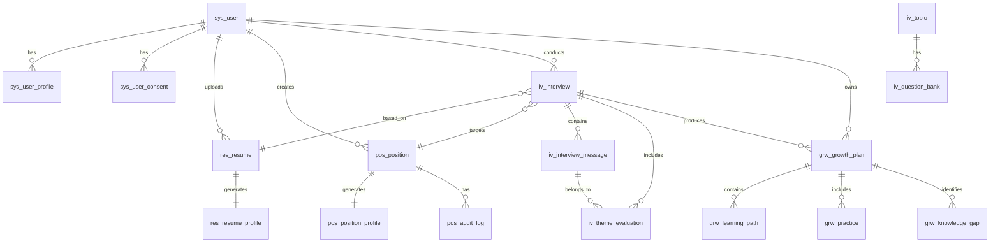

# 数据库设计文档

> 本文档记录 interview-coach 项目的数据库设计，包括 ER 图、表结构、索引策略、DDL 脚本。
>
> **现状说明：**本文档中的前缀表名和 DDL 保留的是早期设计方案，与当前实体并不完全一致。
> 当前可执行、受版本管理的 MySQL 基线以
> `backend/src/main/resources/db/migration/V1__init_schema.sql` 为准；该脚本由维护者手工执行，
> 后续结构变化通过新的版本化 SQL 演进。

---

## 1. 数据库架构

### 1.1 库设计

| 库名 | 说明 | 字符集 |
|------|------|--------|
| `interview_coach` | 主业务库 | utf8mb4 |

### 1.2 表命名规范

- 表名使用小写，单词间用下划线分隔
- 表前缀按业务域划分：
  - `sys_` - 系统基础表（用户、角色等）
  - `res_` - 简历业务表
  - `pos_` - 岗位业务表
  - `iv_` - 面试业务表
  - `grw_` - 成长业务表
  - `inf_` - 基础设施表（审计、日志等）

---

## 2. ER 图

### 2.1 整体 ER 关系



---

## 3. 表结构设计

### 3.1 系统基础表（sys_）

#### sys_user（用户表）

| 字段 | 类型 | 约束 | 说明 |
|------|------|------|------|
| id | BIGINT | PK, AUTO | 用户ID |
| username | VARCHAR(50) | UNIQUE, NOT NULL | 用户名 |
| password | VARCHAR(255) | NOT NULL | 密码（BCrypt加密） |
| phone | VARCHAR(20) | UNIQUE | 手机号 |
| email | VARCHAR(100) | UNIQUE | 邮箱 |
| openid | VARCHAR(100) | UNIQUE | 微信openid |
| status | TINYINT | NOT NULL, DEFAULT 1 | 状态：1正常 2禁用 |
| create_time | DATETIME | NOT NULL | 创建时间 |
| update_time | DATETIME | NOT NULL | 更新时间 |

**索引**：
| 索引名 | 字段 | 类型 |
|--------|------|------|
| uk_username | username | UNIQUE |
| uk_phone | phone | UNIQUE |
| uk_email | email | UNIQUE |
| uk_openid | openid | UNIQUE |

---

#### sys_user_profile（用户资料表）

| 字段 | 类型 | 约束 | 说明 |
|------|------|------|------|
| id | BIGINT | PK, AUTO | 资料ID |
| user_id | BIGINT | FK, UNIQUE, NOT NULL | 用户ID |
| nickname | VARCHAR(50) | | 昵称 |
| avatar | VARCHAR(500) | | 头像URL |
| gender | TINYINT | | 性别：1男 2女 0未知 |
| birthday | DATE | | 生日 |
| bio | VARCHAR(500) | | 个人简介 |
| create_time | DATETIME | NOT NULL | 创建时间 |
| update_time | DATETIME | NOT NULL | 更新时间 |

**索引**：
| 索引名 | 字段 | 类型 |
|--------|------|------|
| uk_user_id | user_id | UNIQUE |

---

#### sys_user_consent（用户同意记录表）

| 字段 | 类型 | 约束 | 说明 |
|------|------|------|------|
| id | BIGINT | PK, AUTO | 记录ID |
| user_id | BIGINT | FK, NOT NULL | 用户ID |
| consent_type | VARCHAR(50) | NOT NULL | 同意类型 |
| consent_version | VARCHAR(20) | NOT NULL | 同意版本号 |
| consent_time | DATETIME | NOT NULL | 同意时间 |
| ip_address | VARCHAR(50) | | IP地址 |
| user_agent | VARCHAR(500) | | 浏览器信息 |

**索引**：
| 索引名 | 字段 | 类型 |
|--------|------|------|
| idx_user_id | user_id | |
| idx_consent_type | consent_type | |

---

### 3.2 简历业务表（res_）

#### res_resume（简历表）

| 字段 | 类型 | 约束 | 说明 |
|------|------|------|------|
| id | BIGINT | PK, AUTO | 简历ID |
| user_id | BIGINT | FK, NOT NULL | 用户ID |
| resume_name | VARCHAR(100) | NOT NULL | 简历名称 |
| file_path | VARCHAR(500) | | 简历文件存储路径 |
| file_type | VARCHAR(20) | | 文件类型：PDF/TXT/DOC |
| file_size | BIGINT | | 文件大小（字节） |
| parse_status | TINYINT | NOT NULL, DEFAULT 0 | 解析状态：0待解析 1解析中 2待确认 3已确认 4解析失败 |
| job_category | VARCHAR(20) | | 岗位大类：TECH/PRODUCT/DESIGN等 |
| lock_interview_id | BIGINT | | 锁定的面试ID（防止重复使用） |
| create_time | DATETIME | NOT NULL | 创建时间 |
| update_time | DATETIME | NOT NULL | 更新时间 |

**索引**：
| 索引名 | 字段 | 类型 |
|--------|------|------|
| idx_user_id | user_id | |
| idx_parse_status | parse_status | |

---

#### res_resume_profile（简历画像表）

| 字段 | 类型 | 约束 | 说明 |
|------|------|------|------|
| id | BIGINT | PK, AUTO | 画像ID |
| resume_id | BIGINT | FK, UNIQUE, NOT NULL | 简历ID |
| user_id | BIGINT | FK, NOT NULL | 用户ID（冗余） |
| profile_data | JSON | NOT NULL | 画像数据（JSON） |
| experience_level | VARCHAR(20) | | 经验水平：JUNIOR/MID/SENIOR |
| create_time | DATETIME | NOT NULL | 创建时间 |
| update_time | DATETIME | NOT NULL | 更新时间 |

**索引**：
| 索引名 | 字段 | 类型 |
|--------|------|------|
| uk_resume_id | resume_id | UNIQUE |
| idx_user_id | user_id | |

**profile_data JSON 结构示例**：
```json
{
  "basicInfo": {
    "workYears": 3,
    "education": "本科",
    "currentPosition": "Java开发工程师"
  },
  "skills": ["Java", "Spring Boot", "MySQL", "Redis", "Docker"],
  "projects": [
    {
      "name": "电商平台",
      "role": "后端开发",
      "techStack": ["Java", "Spring Cloud", "MySQL"],
      "achievements": "日均订单处理10万+"
    }
  ]
}
```

---

### 3.3 岗位业务表（pos_）

#### pos_position（岗位表）

| 字段 | 类型 | 约束 | 说明 |
|------|------|------|------|
| id | BIGINT | PK, AUTO | 岗位ID |
| user_id | BIGINT | FK | 上传用户ID（为空则是公共岗位） |
| position_name | VARCHAR(100) | NOT NULL | 岗位名称 |
| company_name | VARCHAR(100) | | 公司名称 |
| location | VARCHAR(100) | | 工作地点 |
| salary_range | VARCHAR(50) | | 薪资范围 |
| job_category | VARCHAR(20) | NOT NULL | 岗位大类：TECH/PRODUCT/DESIGN等 |
| level | VARCHAR(20) | | 岗位等级：JUNIOR/MID/SENIOR/EXPERT |
| parse_status | TINYINT | NOT NULL, DEFAULT 0 | 解析状态：0待解析 1解析中 2待确认 3已确认 4解析失败 |
| audit_status | TINYINT | NOT NULL, DEFAULT 0 | 审核状态：0待审核 1通过 2拒绝 |
| jd_content | TEXT | | JD原文内容 |
| create_time | DATETIME | NOT NULL | 创建时间 |
| update_time | DATETIME | NOT NULL | 更新时间 |

**索引**：
| 索引名 | 字段 | 类型 |
|--------|------|------|
| idx_user_id | user_id | |
| idx_job_category | job_category | |
| idx_parse_status | parse_status | |
| idx_audit_status | audit_status | |
| idx_company_name | company_name | |

---

#### pos_position_profile（岗位画像表）

| 字段 | 类型 | 约束 | 说明 |
|------|------|------|------|
| id | BIGINT | PK, AUTO | 画像ID |
| position_id | BIGINT | FK, UNIQUE, NOT NULL | 岗位ID |
| user_id | BIGINT | FK | 用户ID（冗余） |
| profile_data | JSON | NOT NULL | 画像数据（JSON） |
| create_time | DATETIME | NOT NULL | 创建时间 |
| update_time | DATETIME | NOT NULL | 更新时间 |

**索引**：
| 索引名 | 字段 | 类型 |
|--------|------|------|
| uk_position_id | position_id | UNIQUE |
| idx_user_id | user_id | |

**profile_data JSON 结构示例**：
```json
{
  "basicInfo": {
    "title": "Java高级工程师",
    "level": "中级",
    "salaryRange": "25k-40k",
    "location": "北京"
  },
  "requiredSkills": [
    { "skill": "Java", "importance": "必须", "depth": "L3-L4" },
    { "skill": "Spring", "importance": "必须", "depth": "L3-L4" }
  ],
  "preferredSkills": [
    { "skill": "Redis", "importance": "加分", "depth": "L2-L3" }
  ],
  "probingDirections": [
    {
      "direction": "并发编程",
      "priority": 1,
      "depthRange": "L2-L4",
      "sampleQuestions": ["synchronized原理", "JUC并发包"]
    }
  ],
  "interviewFocus": ["技术深度", "源码理解", "问题解决能力"],
  "confidenceLevel": 0.9
}
```

---

#### pos_audit_log（岗位审核记录表）

| 字段 | 类型 | 约束 | 说明 |
|------|------|------|------|
| id | BIGINT | PK, AUTO | 记录ID |
| position_id | BIGINT | FK, NOT NULL | 岗位ID |
| auditor_id | BIGINT | FK | 审核员ID |
| action | TINYINT | NOT NULL | 操作：1通过 2拒绝 |
| reason | VARCHAR(500) | | 审核原因 |
| create_time | DATETIME | NOT NULL | 审核时间 |

**索引**：
| 索引名 | 字段 | 类型 |
|--------|------|------|
| idx_position_id | position_id | |

---

### 3.4 面试业务表（iv_）

#### iv_interview（面试会话表）

| 字段 | 类型 | 约束 | 说明 |
|------|------|------|------|
| id | BIGINT | PK, AUTO | 面试ID |
| uuid | VARCHAR(36) | UNIQUE, NOT NULL | 唯一标识 |
| user_id | BIGINT | FK, NOT NULL | 用户ID |
| resume_id | BIGINT | FK, NOT NULL | 简历ID |
| position_id | BIGINT | FK, NOT NULL | 岗位ID |
| job_category | VARCHAR(20) | NOT NULL | 岗位大类 |
| user_profile_snapshot | JSON | | 用户画像（快照） |
| position_profile_snapshot | JSON | | 岗位画像（快照） |
| selected_phases | JSON | NOT NULL | 选择的环节列表（已排序） |
| current_phase | VARCHAR(30) | NOT NULL | 当前环节 |
| current_topic_id | VARCHAR(50) | | 当前主题ID |
| current_depth | INT | DEFAULT 1 | 当前深度 |
| current_topic_followups | INT | DEFAULT 0 | 当前主题追问次数 |
| consecutive_failures | INT | DEFAULT 0 | 连续失败次数 |
| consecutive_excellence | INT | DEFAULT 0 | 连续优秀次数 |
| last_evaluation_seq | INT | DEFAULT 0 | 上次评估的消息序号 |
| pending_question | JSON | | 未送达的问题（断线恢复用） |
| status | TINYINT | NOT NULL, DEFAULT 0 | 状态：0进行中 1正常结束 2中断 |
| total_questions | INT | DEFAULT 0 | 总问题数 |
| started_at | DATETIME | | 开始时间 |
| ended_at | DATETIME | | 结束时间 |
| duration_seconds | INT | | 面试时长（秒） |
| create_time | DATETIME | NOT NULL | 创建时间 |
| update_time | DATETIME | NOT NULL | 更新时间 |

**索引**：
| 索引名 | 字段 | 类型 |
|--------|------|------|
| uk_uuid | uuid | UNIQUE |
| idx_user_id | user_id | |
| idx_user_status_time | (user_id, status, create_time) | 复合索引 |
| idx_resume_id | resume_id | |
| idx_position_id | position_id | |
| idx_status | status | |
| idx_create_time | create_time | |

---

#### iv_interview_message（面试消息表）

| 字段 | 类型 | 约束 | 说明 |
|------|------|------|------|
| id | BIGINT | PK, AUTO | 消息ID |
| interview_id | BIGINT | FK, NOT NULL | 面试ID |
| phase | VARCHAR(30) | NOT NULL | 所属环节 |
| role | VARCHAR(20) | NOT NULL | 角色：interviewer/candidate/system |
| content | TEXT | NOT NULL | 消息内容 |
| topic_id | VARCHAR(50) | | 所属主题ID |
| depth | INT | | 问题深度 |
| token_count | INT | | Token数量 |
| create_time | DATETIME | NOT NULL | 创建时间 |

**索引**：
| 索引名 | 字段 | 类型 |
|--------|------|------|
| idx_interview_id | interview_id | |
| idx_phase | phase | |
| idx_create_time | create_time | |

---

#### iv_theme_evaluation（主题评估表）

| 字段 | 类型 | 约束 | 说明 |
|------|------|------|------|
| id | BIGINT | PK, AUTO | 评估ID |
| interview_id | BIGINT | FK, NOT NULL | 面试ID |
| message_id | BIGINT | FK | 关联消息ID |
| topic_id | VARCHAR(50) | NOT NULL | 主题ID |
| topic_name | VARCHAR(100) | | 主题名称 |
| score | INT | | 得分 0-100 |
| depth_reached | INT | | 达到深度 |
| strength_list | JSON | | 优势列表 |
| weakness_list | JSON | | 薄弱列表 |
| key_events | JSON | | 关键事件 |
| create_time | DATETIME | NOT NULL | 创建时间 |

**索引**：
| 索引名 | 字段 | 类型 |
|--------|------|------|
| idx_interview_id | interview_id | |
| idx_topic_id | topic_id | |

---

#### iv_topic（技术主题表）

| 字段 | 类型 | 约束 | 说明 |
|------|------|------|------|
| id | BIGINT | PK, AUTO | 主题ID |
| topic_id | VARCHAR(50) | UNIQUE, NOT NULL | 主题标识 |
| topic_name | VARCHAR(100) | NOT NULL | 主题名称 |
| job_category | VARCHAR(20) | NOT NULL | 适用的岗位大类 |
| description | VARCHAR(500) | | 主题描述 |
| min_depth | INT | DEFAULT 1 | 最低深度 |
| max_depth | INT | DEFAULT 5 | 最高深度 |
| weight | DECIMAL(3,2) | DEFAULT 0.5 | 主题权重 |
| probing_directions | JSON | | 探测方向 |
| is_active | TINYINT | DEFAULT 1 | 是否启用 |
| create_time | DATETIME | NOT NULL | 创建时间 |
| update_time | DATETIME | NOT NULL | 更新时间 |

**索引**：
| 索引名 | 字段 | 类型 |
|--------|------|------|
| uk_topic_id | topic_id | UNIQUE |
| idx_job_category | job_category | |

---

#### iv_question_bank（题库表）

| 字段 | 类型 | 约束 | 说明 |
|------|------|------|------|
| id | BIGINT | PK, AUTO | 题目ID |
| topic_id | VARCHAR(50) | NOT NULL, FK | 主题ID |
| job_category | VARCHAR(20) | NOT NULL | 岗位大类 |
| question_level | TINYINT | NOT NULL, DEFAULT 1 | 题目级别：1基础 2模板 3动态 |
| depth | INT | | 对应深度 L1-L5 |
| question_template | TEXT | NOT NULL | 题目模板或原文 |
| placeholders | JSON | | 模板占位符定义 |
| evaluation_rule | JSON | | 规则评估配置 |
| use_count | INT | DEFAULT 0 | 使用次数 |
| quality_score | DOUBLE | DEFAULT 0 | 质量评分（0-1） |
| source | VARCHAR(20) | DEFAULT 'system' | 来源：system/user/llm |
| is_active | TINYINT | DEFAULT 1 | 是否启用 |
| vector_id | VARCHAR(64) | | 向量库ID（用于语义去重） |
| create_time | DATETIME | NOT NULL | 创建时间 |
| update_time | DATETIME | NOT NULL | 更新时间 |

**索引**：
| 索引名 | 字段 | 类型 |
|--------|------|------|
| idx_topic_id | topic_id | |
| idx_job_category | job_category | |
| idx_topic_depth | (topic_id, job_category, depth, question_level) | 复合索引 |
| idx_vector_id | vector_id | UNIQUE |

---

### 3.5 成长业务表（grw_）

#### grw_growth_plan（成长方案表）

| 字段 | 类型 | 约束 | 说明 |
|------|------|------|------|
| id | BIGINT | PK, AUTO | 方案ID |
| uuid | VARCHAR(36) | UNIQUE, NOT NULL | 唯一标识 |
| interview_id | BIGINT | FK, UNIQUE, NOT NULL | 面试ID |
| user_id | BIGINT | FK, NOT NULL | 用户ID |
| job_category | VARCHAR(20) | NOT NULL | 岗位大类 |
| content | LONGTEXT | NOT NULL | 成长方案内容（MD格式） |
| summary | JSON | | 成长方案摘要 |
| overall_score | INT | | 综合评分 |
| grade | VARCHAR(20) | | 等级 |
| completed_phases | JSON | | 完成的环节 |
| create_time | DATETIME | NOT NULL | 创建时间 |
| update_time | DATETIME | NOT NULL | 更新时间 |

**索引**：
| 索引名 | 字段 | 类型 |
|--------|------|------|
| uk_uuid | uuid | UNIQUE |
| uk_interview_id | interview_id | UNIQUE |
| idx_user_id | user_id | |

---

#### grw_learning_path（学习路径表）

| 字段 | 类型 | 约束 | 说明 |
|------|------|------|------|
| id | BIGINT | PK, AUTO | 路径ID |
| growth_plan_id | BIGINT | FK, NOT NULL | 成长方案ID |
| knowledge_gap_id | BIGINT | FK | 关联知识差距ID |
| path_name | VARCHAR(200) | NOT NULL | 路径名称 |
| stage | INT | NOT NULL | 阶段序号 |
| stage_name | VARCHAR(100) | NOT NULL | 阶段名称 |
| description | TEXT | | 阶段描述 |
| duration_days | INT | | 建议学习天数 |
| resources | JSON | | 推荐资源 |
| create_time | DATETIME | NOT NULL | 创建时间 |

**索引**：
| 索引名 | 字段 | 类型 |
|--------|------|------|
| idx_growth_plan_id | growth_plan_id | |

---

#### grw_practice（练习题表）

| 字段 | 类型 | 约束 | 说明 |
|------|------|------|------|
| id | BIGINT | PK, AUTO | 题目ID |
| growth_plan_id | BIGINT | FK, NOT NULL | 成长方案ID |
| knowledge_gap_id | BIGINT | FK | 关联知识差距ID |
| question | TEXT | NOT NULL | 题目内容 |
| answer | TEXT | | 参考答案 |
| difficulty | TINYINT | | 难度：1简单 2中等 3困难 |
| category | VARCHAR(50) | | 分类 |
| create_time | DATETIME | NOT NULL | 创建时间 |

**索引**：
| 索引名 | 字段 | 类型 |
|--------|------|------|
| idx_growth_plan_id | growth_plan_id | |

---

#### grw_knowledge_gap（知识差距表）

| 字段 | 类型 | 约束 | 说明 |
|------|------|------|------|
| id | BIGINT | PK, AUTO | 差距ID |
| growth_plan_id | BIGINT | FK, NOT NULL | 成长方案ID |
| interview_id | BIGINT | FK, NOT NULL | 面试ID |
| topic_id | VARCHAR(50) | | 主题ID |
| gap_name | VARCHAR(200) | NOT NULL | 差距名称 |
| current_level | VARCHAR(50) | | 当前水平 |
| target_level | VARCHAR(50) | | 目标水平 |
| severity | TINYINT | | 严重程度：1轻微 2一般 3严重 |
| create_time | DATETIME | NOT NULL | 创建时间 |

**索引**：
| 索引名 | 字段 | 类型 |
|--------|------|------|
| idx_growth_plan_id | growth_plan_id | |

---

### 3.6 基础设施表（inf_）

#### inf_audit_log（操作审计表）

| 字段 | 类型 | 约束 | 说明 |
|------|------|------|------|
| id | BIGINT | PK, AUTO | 记录ID |
| user_id | BIGINT | | 用户ID |
| operation | VARCHAR(100) | NOT NULL | 操作类型 |
| module | VARCHAR(50) | NOT NULL | 模块 |
| resource_type | VARCHAR(50) | | 资源类型 |
| resource_id | BIGINT | | 资源ID |
| detail | JSON | | 详细信息 |
| ip_address | VARCHAR(50) | | IP地址 |
| user_agent | VARCHAR(500) | | 浏览器信息 |
| create_time | DATETIME | NOT NULL | 操作时间 |

**索引**：
| 索引名 | 字段 | 类型 |
|--------|------|------|
| idx_user_id | user_id | |
| idx_operation | operation | |
| idx_create_time | create_time | |

---

#### inf_llm_call_log（LLM调用日志表）

| 字段 | 类型 | 约束 | 说明 |
|------|------|------|------|
| id | BIGINT | PK, AUTO | 日志ID |
| user_id | BIGINT | | 用户ID |
| interview_id | BIGINT | | 面试ID |
| agent_name | VARCHAR(50) | NOT NULL | Agent名称 |
| prompt_tokens | INT | | Prompt token数 |
| completion_tokens | INT | | Completion token数 |
| total_tokens | INT | | 总token数 |
| model | VARCHAR(50) | | 使用的模型 |
| latency_ms | INT | | 延迟（毫秒） |
| status | TINYINT | | 状态：1成功 2失败 |
| error_message | VARCHAR(500) | | 错误信息 |
| create_time | DATETIME | NOT NULL | 调用时间 |

**索引**：
| 索引名 | 字段 | 类型 |
|--------|------|------|
| idx_user_id | user_id | |
| idx_interview_id | interview_id | |
| idx_create_time | create_time | |

---

## 4. 索引策略

### 4.1 索引设计原则

| 原则 | 说明 |
|------|------|
| **高频查询优先** | 为 WHERE 条件中的高频字段建立索引 |
| **区分度高的字段** | 选择区分度高的字段（如 user_id） |
| **复合索引** | 考虑字段顺序，区分度高的在前 |
| **避免冗余** | 同一字段不建多个单列索引 |

### 4.2 核心查询索引

| 查询场景 | 索引设计 |
|---------|---------|
| 查询用户简历列表 | `idx_user_id` on res_resume |
| 查询用户面试列表 | `idx_user_status_time` on iv_interview |
| 查询用户成长方案 | `idx_user_id` on grw_growth_plan |
| 查询岗位公共库 | `idx_audit_status + idx_job_category` on pos_position |
| 查询用户面试记录 | `idx_user_status_time` on iv_interview |
| 按主题检索题目 | `idx_topic_depth` on iv_question_bank |
| 查询用户岗位列表 | `idx_user_id` on pos_position |

---

## 5. DDL 脚本

### 5.1 创建数据库

```sql
CREATE DATABASE IF NOT EXISTS interview_coach
  DEFAULT CHARACTER SET utf8mb4
  DEFAULT COLLATE utf8mb4_unicode_ci;
```

### 5.2 系统基础表

```sql
-- 用户表
CREATE TABLE sys_user (
    id BIGINT AUTO_INCREMENT PRIMARY KEY,
    username VARCHAR(50) NOT NULL COMMENT '用户名',
    password VARCHAR(255) NOT NULL COMMENT '密码',
    phone VARCHAR(20) COMMENT '手机号',
    email VARCHAR(100) COMMENT '邮箱',
    openid VARCHAR(100) COMMENT '微信openid',
    status TINYINT NOT NULL DEFAULT 1 COMMENT '状态：1正常 2禁用',
    create_time DATETIME NOT NULL DEFAULT CURRENT_TIMESTAMP,
    update_time DATETIME NOT NULL DEFAULT CURRENT_TIMESTAMP ON UPDATE CURRENT_TIMESTAMP,
    UNIQUE KEY uk_username (username),
    UNIQUE KEY uk_phone (phone),
    UNIQUE KEY uk_email (email),
    UNIQUE KEY uk_openid (openid)
) ENGINE=InnoDB DEFAULT CHARSET=utf8mb4 COMMENT='用户表';

-- 用户资料表
CREATE TABLE sys_user_profile (
    id BIGINT AUTO_INCREMENT PRIMARY KEY,
    user_id BIGINT NOT NULL COMMENT '用户ID',
    nickname VARCHAR(50) COMMENT '昵称',
    avatar VARCHAR(500) COMMENT '头像URL',
    gender TINYINT COMMENT '性别：1男 2女 0未知',
    birthday DATE COMMENT '生日',
    bio VARCHAR(500) COMMENT '个人简介',
    create_time DATETIME NOT NULL DEFAULT CURRENT_TIMESTAMP,
    update_time DATETIME NOT NULL DEFAULT CURRENT_TIMESTAMP ON UPDATE CURRENT_TIMESTAMP,
    UNIQUE KEY uk_user_id (user_id)
) ENGINE=InnoDB DEFAULT CHARSET=utf8mb4 COMMENT='用户资料表';

-- 用户同意记录表
CREATE TABLE sys_user_consent (
    id BIGINT AUTO_INCREMENT PRIMARY KEY,
    user_id BIGINT NOT NULL COMMENT '用户ID',
    consent_type VARCHAR(50) NOT NULL COMMENT '同意类型',
    consent_version VARCHAR(20) NOT NULL COMMENT '同意版本号',
    consent_time DATETIME NOT NULL COMMENT '同意时间',
    ip_address VARCHAR(50) COMMENT 'IP地址',
    user_agent VARCHAR(500) COMMENT '浏览器信息',
    KEY idx_user_id (user_id),
    KEY idx_consent_type (consent_type)
) ENGINE=InnoDB DEFAULT CHARSET=utf8mb4 COMMENT='用户同意记录表';
```

### 5.3 简历业务表

```sql
-- 简历表
CREATE TABLE res_resume (
    id BIGINT AUTO_INCREMENT PRIMARY KEY,
    user_id BIGINT NOT NULL COMMENT '用户ID',
    resume_name VARCHAR(100) NOT NULL COMMENT '简历名称',
    file_path VARCHAR(500) COMMENT '简历文件存储路径',
    file_type VARCHAR(20) COMMENT '文件类型：PDF/TXT/DOC',
    file_size BIGINT COMMENT '文件大小（字节）',
    parse_status TINYINT NOT NULL DEFAULT 0 COMMENT '解析状态：0待解析 1解析中 2待确认 3已确认 4解析失败',
    job_category VARCHAR(20) COMMENT '岗位大类：TECH/PRODUCT/DESIGN等',
    lock_interview_id BIGINT COMMENT '锁定的面试ID',
    create_time DATETIME NOT NULL DEFAULT CURRENT_TIMESTAMP,
    update_time DATETIME NOT NULL DEFAULT CURRENT_TIMESTAMP ON UPDATE CURRENT_TIMESTAMP,
    KEY idx_user_id (user_id),
    KEY idx_parse_status (parse_status)
) ENGINE=InnoDB DEFAULT CHARSET=utf8mb4 COMMENT='简历表';

-- 简历画像表
CREATE TABLE res_resume_profile (
    id BIGINT AUTO_INCREMENT PRIMARY KEY,
    resume_id BIGINT NOT NULL COMMENT '简历ID',
    user_id BIGINT NOT NULL COMMENT '用户ID',
    profile_data JSON NOT NULL COMMENT '画像数据',
    experience_level VARCHAR(20) COMMENT '经验水平：JUNIOR/MID/SENIOR',
    create_time DATETIME NOT NULL DEFAULT CURRENT_TIMESTAMP,
    update_time DATETIME NOT NULL DEFAULT CURRENT_TIMESTAMP ON UPDATE CURRENT_TIMESTAMP,
    UNIQUE KEY uk_resume_id (resume_id),
    KEY idx_user_id (user_id)
) ENGINE=InnoDB DEFAULT CHARSET=utf8mb4 COMMENT='简历画像表';
```

### 5.4 岗位业务表

```sql
-- 岗位表
CREATE TABLE pos_position (
    id BIGINT AUTO_INCREMENT PRIMARY KEY,
    user_id BIGINT COMMENT '上传用户ID',
    position_name VARCHAR(100) NOT NULL COMMENT '岗位名称',
    company_name VARCHAR(100) COMMENT '公司名称',
    location VARCHAR(100) COMMENT '工作地点',
    salary_range VARCHAR(50) COMMENT '薪资范围',
    job_category VARCHAR(20) NOT NULL COMMENT '岗位大类',
    level VARCHAR(20) COMMENT '岗位等级',
    parse_status TINYINT NOT NULL DEFAULT 0 COMMENT '解析状态：0待解析 1解析中 2待确认 3已确认 4解析失败',
    audit_status TINYINT NOT NULL DEFAULT 0 COMMENT '审核状态：0待审核 1通过 2拒绝',
    jd_content TEXT COMMENT 'JD原文内容',
    create_time DATETIME NOT NULL DEFAULT CURRENT_TIMESTAMP,
    update_time DATETIME NOT NULL DEFAULT CURRENT_TIMESTAMP ON UPDATE CURRENT_TIMESTAMP,
    KEY idx_user_id (user_id),
    KEY idx_job_category (job_category),
    KEY idx_parse_status (parse_status),
    KEY idx_audit_status (audit_status),
    KEY idx_company_name (company_name)
) ENGINE=InnoDB DEFAULT CHARSET=utf8mb4 COMMENT='岗位表';

-- 岗位画像表
CREATE TABLE pos_position_profile (
    id BIGINT AUTO_INCREMENT PRIMARY KEY,
    position_id BIGINT NOT NULL COMMENT '岗位ID',
    user_id BIGINT COMMENT '用户ID',
    profile_data JSON NOT NULL COMMENT '画像数据',
    create_time DATETIME NOT NULL DEFAULT CURRENT_TIMESTAMP,
    update_time DATETIME NOT NULL DEFAULT CURRENT_TIMESTAMP ON UPDATE CURRENT_TIMESTAMP,
    UNIQUE KEY uk_position_id (position_id),
    KEY idx_user_id (user_id)
) ENGINE=InnoDB DEFAULT CHARSET=utf8mb4 COMMENT='岗位画像表';

-- 岗位审核记录表
CREATE TABLE pos_audit_log (
    id BIGINT AUTO_INCREMENT PRIMARY KEY,
    position_id BIGINT NOT NULL COMMENT '岗位ID',
    auditor_id BIGINT COMMENT '审核员ID',
    action TINYINT NOT NULL COMMENT '操作：1通过 2拒绝',
    reason VARCHAR(500) COMMENT '审核原因',
    create_time DATETIME NOT NULL DEFAULT CURRENT_TIMESTAMP,
    KEY idx_position_id (position_id)
) ENGINE=InnoDB DEFAULT CHARSET=utf8mb4 COMMENT='岗位审核记录表';
```

### 5.5 面试业务表

```sql
-- 面试会话表
CREATE TABLE iv_interview (
    id BIGINT AUTO_INCREMENT PRIMARY KEY,
    uuid VARCHAR(36) NOT NULL COMMENT '唯一标识',
    user_id BIGINT NOT NULL COMMENT '用户ID',
    resume_id BIGINT NOT NULL COMMENT '简历ID',
    position_id BIGINT NOT NULL COMMENT '岗位ID',
    job_category VARCHAR(20) NOT NULL COMMENT '岗位大类',
    user_profile_snapshot JSON COMMENT '用户画像快照',
    position_profile_snapshot JSON COMMENT '岗位画像快照',
    selected_phases JSON NOT NULL COMMENT '选择的环节列表',
    current_phase VARCHAR(30) NOT NULL COMMENT '当前环节',
    current_topic_id VARCHAR(50) COMMENT '当前主题ID',
    current_depth INT DEFAULT 1 COMMENT '当前深度',
    current_topic_followups INT DEFAULT 0 COMMENT '当前主题追问次数',
    consecutive_failures INT DEFAULT 0 COMMENT '连续失败次数',
    consecutive_excellence INT DEFAULT 0 COMMENT '连续优秀次数',
    last_evaluation_seq INT DEFAULT 0 COMMENT '上次评估的消息序号',
    pending_question JSON COMMENT '未送达的问题',
    status TINYINT NOT NULL DEFAULT 0 COMMENT '状态：0进行中 1正常结束 2中断',
    total_questions INT DEFAULT 0 COMMENT '总问题数',
    started_at DATETIME COMMENT '开始时间',
    ended_at DATETIME COMMENT '结束时间',
    duration_seconds INT COMMENT '面试时长（秒）',
    create_time DATETIME NOT NULL DEFAULT CURRENT_TIMESTAMP,
    update_time DATETIME NOT NULL DEFAULT CURRENT_TIMESTAMP ON UPDATE CURRENT_TIMESTAMP,
    UNIQUE KEY uk_uuid (uuid),
    KEY idx_user_id (user_id),
    KEY idx_user_status_time (user_id, status, create_time),
    KEY idx_resume_id (resume_id),
    KEY idx_position_id (position_id),
    KEY idx_status (status),
    KEY idx_create_time (create_time)
) ENGINE=InnoDB DEFAULT CHARSET=utf8mb4 COMMENT='面试会话表';

-- 面试消息表
CREATE TABLE iv_interview_message (
    id BIGINT AUTO_INCREMENT PRIMARY KEY,
    interview_id BIGINT NOT NULL COMMENT '面试ID',
    phase VARCHAR(30) NOT NULL COMMENT '所属环节',
    role VARCHAR(20) NOT NULL COMMENT '角色：interviewer/candidate/system',
    content TEXT NOT NULL COMMENT '消息内容',
    topic_id VARCHAR(50) COMMENT '所属主题ID',
    depth INT COMMENT '问题深度',
    token_count INT COMMENT 'Token数量',
    create_time DATETIME NOT NULL DEFAULT CURRENT_TIMESTAMP,
    KEY idx_interview_id (interview_id),
    KEY idx_phase (phase),
    KEY idx_create_time (create_time)
) ENGINE=InnoDB DEFAULT CHARSET=utf8mb4 COMMENT='面试消息表';

-- 主题评估表
CREATE TABLE iv_theme_evaluation (
    id BIGINT AUTO_INCREMENT PRIMARY KEY,
    interview_id BIGINT NOT NULL COMMENT '面试ID',
    message_id BIGINT COMMENT '关联消息ID',
    topic_id VARCHAR(50) NOT NULL COMMENT '主题ID',
    topic_name VARCHAR(100) COMMENT '主题名称',
    score INT COMMENT '得分 0-100',
    depth_reached INT COMMENT '达到深度',
    strength_list JSON COMMENT '优势列表',
    weakness_list JSON COMMENT '薄弱列表',
    key_events JSON COMMENT '关键事件',
    create_time DATETIME NOT NULL DEFAULT CURRENT_TIMESTAMP,
    KEY idx_interview_id (interview_id),
    KEY idx_topic_id (topic_id)
) ENGINE=InnoDB DEFAULT CHARSET=utf8mb4 COMMENT='主题评估表';

-- 技术主题表
CREATE TABLE iv_topic (
    id BIGINT AUTO_INCREMENT PRIMARY KEY,
    topic_id VARCHAR(50) NOT NULL COMMENT '主题标识',
    topic_name VARCHAR(100) NOT NULL COMMENT '主题名称',
    job_category VARCHAR(20) NOT NULL COMMENT '适用的岗位大类',
    description VARCHAR(500) COMMENT '主题描述',
    min_depth INT DEFAULT 1 COMMENT '最低深度',
    max_depth INT DEFAULT 5 COMMENT '最高深度',
    weight DECIMAL(3,2) DEFAULT 0.5 COMMENT '主题权重',
    probing_directions JSON COMMENT '探测方向',
    is_active TINYINT DEFAULT 1 COMMENT '是否启用',
    create_time DATETIME NOT NULL DEFAULT CURRENT_TIMESTAMP,
    update_time DATETIME NOT NULL DEFAULT CURRENT_TIMESTAMP ON UPDATE CURRENT_TIMESTAMP,
    UNIQUE KEY uk_topic_id (topic_id),
    KEY idx_job_category (job_category)
) ENGINE=InnoDB DEFAULT CHARSET=utf8mb4 COMMENT='技术主题表';

-- 题库表
CREATE TABLE iv_question_bank (
    id BIGINT AUTO_INCREMENT PRIMARY KEY,
    topic_id VARCHAR(50) NOT NULL COMMENT '主题ID',
    job_category VARCHAR(20) NOT NULL COMMENT '岗位大类',
    question_level TINYINT NOT NULL DEFAULT 1 COMMENT '题目级别：1基础 2模板 3动态',
    depth INT COMMENT '对应深度 L1-L5',
    question_template TEXT NOT NULL COMMENT '题目模板或原文',
    placeholders JSON COMMENT '模板占位符定义',
    evaluation_rule JSON COMMENT '规则评估配置',
    use_count INT DEFAULT 0 COMMENT '使用次数',
    quality_score DOUBLE DEFAULT 0 COMMENT '质量评分（0-1）',
    source VARCHAR(20) DEFAULT 'system' COMMENT '来源：system/user/llm',
    is_active TINYINT DEFAULT 1 COMMENT '是否启用',
    vector_id VARCHAR(64) COMMENT '向量库ID（用于语义去重）',
    create_time DATETIME NOT NULL DEFAULT CURRENT_TIMESTAMP,
    update_time DATETIME NOT NULL DEFAULT CURRENT_TIMESTAMP ON UPDATE CURRENT_TIMESTAMP,
    KEY idx_topic_id (topic_id),
    KEY idx_job_category (job_category),
    KEY idx_topic_depth (topic_id, job_category, depth, question_level),
    UNIQUE KEY idx_vector_id (vector_id)
) ENGINE=InnoDB DEFAULT CHARSET=utf8mb4 COMMENT='题库表';
```

### 5.6 成长业务表

```sql
-- 成长方案表
CREATE TABLE grw_growth_plan (
    id BIGINT AUTO_INCREMENT PRIMARY KEY,
    uuid VARCHAR(36) NOT NULL COMMENT '唯一标识',
    interview_id BIGINT NOT NULL COMMENT '面试ID',
    user_id BIGINT NOT NULL COMMENT '用户ID',
    job_category VARCHAR(20) NOT NULL COMMENT '岗位大类',
    content LONGTEXT NOT NULL COMMENT '成长方案内容',
    summary JSON COMMENT '成长方案摘要',
    overall_score INT COMMENT '综合评分',
    grade VARCHAR(20) COMMENT '等级',
    completed_phases JSON COMMENT '完成的环节',
    create_time DATETIME NOT NULL DEFAULT CURRENT_TIMESTAMP,
    update_time DATETIME NOT NULL DEFAULT CURRENT_TIMESTAMP ON UPDATE CURRENT_TIMESTAMP,
    UNIQUE KEY uk_uuid (uuid),
    UNIQUE KEY uk_interview_id (interview_id),
    KEY idx_user_id (user_id)
) ENGINE=InnoDB DEFAULT CHARSET=utf8mb4 COMMENT='成长方案表';

-- 学习路径表
CREATE TABLE grw_learning_path (
    id BIGINT AUTO_INCREMENT PRIMARY KEY,
    growth_plan_id BIGINT NOT NULL COMMENT '成长方案ID',
    knowledge_gap_id BIGINT COMMENT '关联知识差距ID',
    path_name VARCHAR(200) NOT NULL COMMENT '路径名称',
    stage INT NOT NULL COMMENT '阶段序号',
    stage_name VARCHAR(100) NOT NULL COMMENT '阶段名称',
    description TEXT COMMENT '阶段描述',
    duration_days INT COMMENT '建议学习天数',
    resources JSON COMMENT '推荐资源',
    create_time DATETIME NOT NULL DEFAULT CURRENT_TIMESTAMP,
    KEY idx_growth_plan_id (growth_plan_id)
) ENGINE=InnoDB DEFAULT CHARSET=utf8mb4 COMMENT='学习路径表';

-- 练习题表
CREATE TABLE grw_practice (
    id BIGINT AUTO_INCREMENT PRIMARY KEY,
    growth_plan_id BIGINT NOT NULL COMMENT '成长方案ID',
    knowledge_gap_id BIGINT COMMENT '关联知识差距ID',
    question TEXT NOT NULL COMMENT '题目内容',
    answer TEXT COMMENT '参考答案',
    difficulty TINYINT COMMENT '难度：1简单 2中等 3困难',
    category VARCHAR(50) COMMENT '分类',
    create_time DATETIME NOT NULL DEFAULT CURRENT_TIMESTAMP,
    KEY idx_growth_plan_id (growth_plan_id)
) ENGINE=InnoDB DEFAULT CHARSET=utf8mb4 COMMENT='练习题表';

-- 知识差距表
CREATE TABLE grw_knowledge_gap (
    id BIGINT AUTO_INCREMENT PRIMARY KEY,
    growth_plan_id BIGINT NOT NULL COMMENT '成长方案ID',
    interview_id BIGINT NOT NULL COMMENT '面试ID',
    topic_id VARCHAR(50) COMMENT '主题ID',
    gap_name VARCHAR(200) NOT NULL COMMENT '差距名称',
    current_level VARCHAR(50) COMMENT '当前水平',
    target_level VARCHAR(50) COMMENT '目标水平',
    severity TINYINT COMMENT '严重程度：1轻微 2一般 3严重',
    create_time DATETIME NOT NULL DEFAULT CURRENT_TIMESTAMP,
    KEY idx_growth_plan_id (growth_plan_id)
) ENGINE=InnoDB DEFAULT CHARSET=utf8mb4 COMMENT='知识差距表';
```

### 5.7 基础设施表

```sql
-- 操作审计表
CREATE TABLE inf_audit_log (
    id BIGINT AUTO_INCREMENT PRIMARY KEY,
    user_id BIGINT COMMENT '用户ID',
    operation VARCHAR(100) NOT NULL COMMENT '操作类型',
    module VARCHAR(50) NOT NULL COMMENT '模块',
    resource_type VARCHAR(50) COMMENT '资源类型',
    resource_id BIGINT COMMENT '资源ID',
    detail JSON COMMENT '详细信息',
    ip_address VARCHAR(50) COMMENT 'IP地址',
    user_agent VARCHAR(500) COMMENT '浏览器信息',
    create_time DATETIME NOT NULL DEFAULT CURRENT_TIMESTAMP,
    KEY idx_user_id (user_id),
    KEY idx_operation (operation),
    KEY idx_create_time (create_time)
) ENGINE=InnoDB DEFAULT CHARSET=utf8mb4 COMMENT='操作审计表';

-- LLM调用日志表
CREATE TABLE inf_llm_call_log (
    id BIGINT AUTO_INCREMENT PRIMARY KEY,
    user_id BIGINT COMMENT '用户ID',
    interview_id BIGINT COMMENT '面试ID',
    agent_name VARCHAR(50) NOT NULL COMMENT 'Agent名称',
    prompt_tokens INT COMMENT 'Prompt token数',
    completion_tokens INT COMMENT 'Completion token数',
    total_tokens INT COMMENT '总token数',
    model VARCHAR(50) COMMENT '使用的模型',
    latency_ms INT COMMENT '延迟（毫秒）',
    status TINYINT COMMENT '状态：1成功 2失败',
    error_message VARCHAR(500) COMMENT '错误信息',
    create_time DATETIME NOT NULL DEFAULT CURRENT_TIMESTAMP,
    KEY idx_user_id (user_id),
    KEY idx_interview_id (interview_id),
    KEY idx_create_time (create_time)
) ENGINE=InnoDB DEFAULT CHARSET=utf8mb4 COMMENT='LLM调用日志表';
```

---

## 6. 分库分表建议（未来扩展）

| 阶段 | 策略 | 说明 |
|------|------|------|
| MVP | 单库 | 当前阶段足够 |
| Growth | 按业务域分库 | 用户库、面试库分离 |
| Scale | 按用户ID分表 | 面试记录按用户哈希分表 |

---

*文档版本：v0.3*
*创建时间：2026-07-20*
*更新说明：消除画像表冗余字段、增加题库表、优化 iv_interview 索引、新增断线恢复字段*
