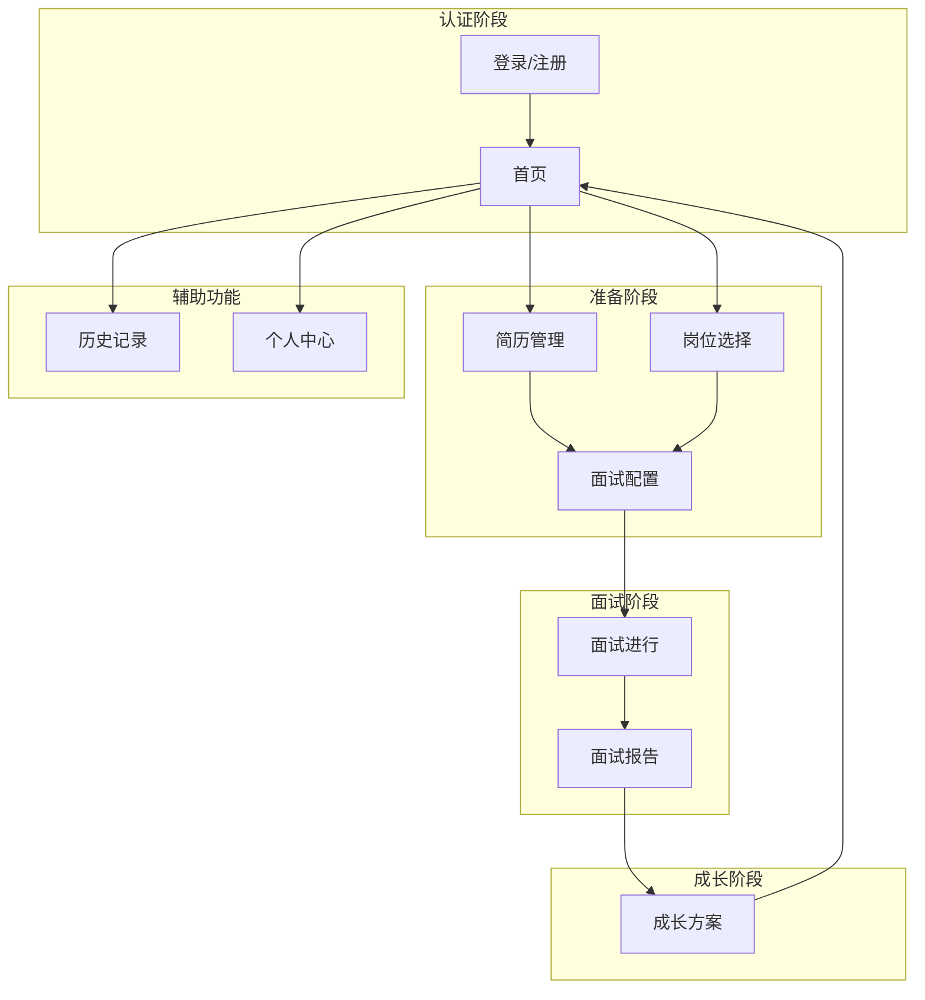
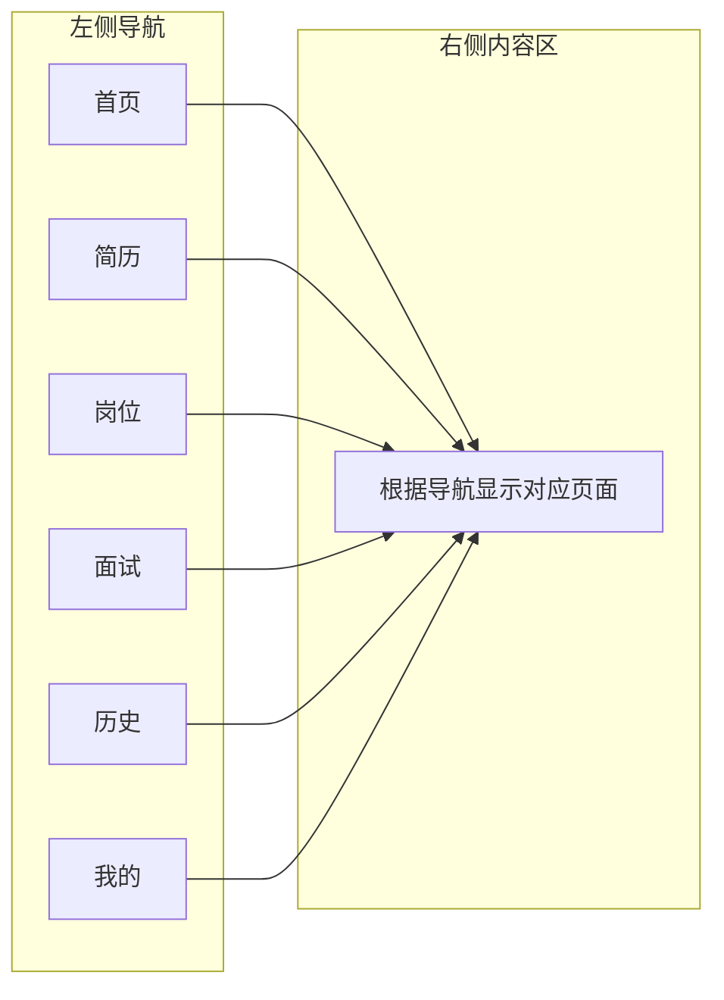
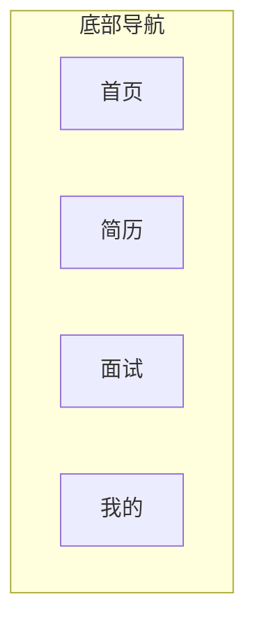

# 前端页面原型设计

> 本文档记录 interview-coach 项目的前端页面原型设计，包括页面结构、交互流程、组件布局等。
> 适用于 PC 端（Vue.js 3 + Element Plus）和移动端（Taro 3 + Vue 3，输出微信小程序 / H5 / App）。

---

## 1. 页面总览

### 1.1 页面清单

| 页面 | 路径 | 说明 | 端 |
|------|------|------|-----|
| **登录/注册** | `/login`, `/register` | 用户认证 | PC + 小程序 |
| **首页** | `/` | 引导页、快捷入口 | PC + 小程序 |
| **简历管理** | `/resume` | 简历上传、列表、详情 | PC + 小程序 |
| **岗位选择** | `/position` | 岗位库、JD上传 | PC + 小程序 |
| **面试配置** | `/interview/config` | 选择面试环节、开始面试 | PC + 小程序 |
| **面试进行** | `/interview/{id}` | 实时面试交互 | PC + 小程序 |
| **面试报告** | `/interview/{id}/report` | 评估报告查看 | PC + 小程序 |
| **成长方案** | `/interview/{id}/growth` | 成长方案查看/下载 | PC + 小程序 |
| **历史记录** | `/history` | 历史面试列表 | PC + 小程序 |
| **个人中心** | `/profile` | 用户信息设置 | PC + 小程序 |

### 1.2 前端技术栈

| 端 | 技术选型 | 说明 |
|----|---------|------|
| **PC 端** | Vue.js 3 + Element Plus | 单页应用，组件化开发 |
| **多端小程序** | Taro 3 + Vue 3 | 一套代码输出微信小程序 / H5 / App |
| **状态管理** | Pinia | 跨端状态共享 |
| **PC 路由** | Vue Router 4 | SPA 路由管理 |
| **HTTP 客户端** | Axios | RESTful API 调用 |
| **实时通信** | EventSource / Taro 封装 | Server-Sent Events 接收面试流式消息 |
| **构建工具** | Vite | PC 端快速构建 |
| **小程序构建** | Taro CLI | 多端编译与打包 |

**前端项目划分**：

```
frontend/
├── web/                # PC 端 Vue 3 + Element Plus
│   ├── src/
│   │   ├── views/      # 页面组件
│   │   ├── components/ # 可复用组件
│   │   ├── stores/     # Pinia 状态管理
│   │   ├── api/        # Axios 接口封装
│   │   └── utils/      # 工具函数
│   └── vite.config.ts
└── miniapp/            # Taro 3 + Vue 3 多端小程序
    ├── src/
    │   ├── pages/      # 页面组件
    │   ├── components/ # 可复用组件
    │   ├── stores/     # Pinia 状态管理
    │   ├── api/        # Axios 接口封装
    │   └── utils/      # 工具函数
    └── config/index.js
```

**跨端复用策略**：

| 复用层级 | 说明 |
|---------|------|
| **API 层** | 两端共用同一套 RESTful 接口封装，统一请求头 `X-Client-Type` |
| **状态管理** | Pinia Store 逻辑可跨端复用，UI 组件各自实现 |
| **工具函数** | 通用工具（日期、校验、SSE 解析）抽离到共享包 |
| **页面结构** | 面试流程、路由映射保持一致，组件实现按端适配 |

---

## 2. 页面流程图

### 2.1 整体用户路径



### 2.2 PC端页面流程



### 2.3 小程序页面流程（底部 Tab）



---

## 3. 页面原型设计

### 3.1 登录/注册页

#### PC 端布局

```
┌─────────────────────────────────────────────────────────────────┐
│  Logo                                              语言切换      │
├─────────────────────────────────────────────────────────────────┤
│                                                                 │
│                    ┌─────────────────────┐                      │
│                    │                     │                      │
│                    │    欢迎使用          │                      │
│                    │   面试教练           │                      │
│                    │                     │                      │
│                    │  ┌─────────────────┐│                      │
│                    │  │ 手机号/用户名    ││                      │
│                    │  └─────────────────┘│                      │
│                    │  ┌─────────────────┐│                      │
│                    │  │ 密码             ││                      │
│                    │  └─────────────────┘│                      │
│                    │                     │                      │
│                    │  [ ] 记住我         │                      │
│                    │                     │                      │
│                    │  [    登录    ]     │                      │
│                    │                     │                      │
│                    │  还没有账号？注册    │                      │
│                    │                     │                      │
│                    └─────────────────────┘                      │
│                                                                 │
│                                                                 │
└─────────────────────────────────────────────────────────────────┘
```

#### 注册页布局

```
┌─────────────────────────────────────────────────────────────────┐
│  Logo                                              语言切换      │
├─────────────────────────────────────────────────────────────────┤
│                                                                 │
│                    ┌─────────────────────┐                      │
│                    │                     │                      │
│                    │    创建账号          │                      │
│                    │                     │                      │
│                    │  ┌─────────────────┐│                      │
│                    │  │ 用户名           ││                      │
│                    │  └─────────────────┘│                      │
│                    │  ┌─────────────────┐│                      │
│                    │  │ 手机号           ││                      │
│                    │  └─────────────────┘│                      │
│                    │  ┌─────────────────┐│                      │
│                    │  │ 验证码    [发送] ││                      │
│                    │  └─────────────────┘│                      │
│                    │  ┌─────────────────┐│                      │
│                    │  │ 设置密码         ││                      │
│                    │  └─────────────────┘│                      │
│                    │  ┌─────────────────┐│                      │
│                    │  │ 确认密码         ││                      │
│                    │  └─────────────────┘│                      │
│                    │                     │                      │
│                    │  [    注册    ]     │                      │
│                    │                     │                      │
│                    │  已有账号？登录      │                      │
│                    │                     │                      │
│                    └─────────────────────┘                      │
│                                                                 │
└─────────────────────────────────────────────────────────────────┘
```

#### 小程序端布局

```
┌─────────────────────────┐
│                         │
│      面试教练 Logo       │
│                         │
│  ┌───────────────────┐  │
│  │ 手机号             │  │
│  └───────────────────┘  │
│  ┌───────────────────┐  │
│  │ 密码               │  │
│  └───────────────────┘  │
│                         │
│  [      登录      ]     │
│                         │
│  微信登录                │
│                         │
│  还没有账号？注册         │
│                         │
└─────────────────────────┘
```

---

### 3.2 首页

#### PC 端布局

```
┌─────────────────────────────────────────────────────────────────┐
│  Logo   首页   简历   岗位   面试   历史   [头像] 我的          │
├─────────────────────────────────────────────────────────────────┤
│                                                                 │
│  ┌─────────────────────────────────────────────────────────┐   │
│  │                                                         │   │
│  │     👋 欢迎回来，张三                                     │   │
│  │                                                         │   │
│  │     开始一场模拟面试，提升你的面试能力                     │   │
│  │                                                         │   │
│  │     [  开始面试  ]   [  查看历史  ]                      │   │
│  │                                                         │   │
│  └─────────────────────────────────────────────────────────┘   │
│                                                                 │
│  📄 我的简历                                                   │
│  ┌────────────┐ ┌────────────┐ ┌────────────┐                 │
│  │ 简历1      │ │ 简历2      │ │ + 上传新简历│                 │
│  │ 2024-01-01 │ │ 2024-01-15 │ │             │                 │
│  └────────────┘ └────────────┘ └────────────┘                 │
│                                                                 │
│  💼 目标岗位                                                   │
│  ┌────────────┐ ┌────────────┐ ┌────────────┐                 │
│  │ Java开发   │ │ 前端开发   │ │ + 选择岗位 │                 │
│  │ 字节跳动   │ │ 腾讯       │ │             │                 │
│  └────────────┘ └────────────┘ └────────────┘                 │
│                                                                 │
│  📊 最近面试                                                   │
│  ┌─────────────────────────────────────────────────────────┐   │
│  │ Java开发 · 2024-01-20 · 得分 78 · [查看报告]            │   │
│  │ 前端开发 · 2024-01-18 · 得分 85 · [查看报告]            │   │
│  └─────────────────────────────────────────────────────────┘   │
│                                                                 │
└─────────────────────────────────────────────────────────────────┘
```

#### 小程序端布局

```
┌─────────────────────────┐
│                         │
│   面试教练              │
│                         │
│   👋 张三，你好！        │
│                         │
│   ┌───────────────────┐ │
│   │  🎯 开始面试       │ │
│   └───────────────────┘ │
│                         │
│   ─── 我的简历 ───      │
│   ┌─────┐ ┌─────┐      │
│   │简历1│ │ +  │      │
│   └─────┘ └─────┘      │
│                         │
│   ─── 目标岗位 ───      │
│   ┌─────┐ ┌─────┐      │
│   │Java │ │ +  │      │
│   │开发 │ │     │      │
│   └─────┘ └─────┘      │
│                         │
│   ─── 最近面试 ───      │
│   ┌───────────────────┐ │
│   │ Java · 01-20 · 78分│ │
│   └───────────────────┘ │
│                         │
├─────────────────────────┤
│ 首页  简历  面试  我的   │
└─────────────────────────┘
```

---

### 3.3 简历管理页

#### PC 端布局

```
┌─────────────────────────────────────────────────────────────────┐
│  Logo   首页   简历   岗位   面试   历史   [头像] 我的          │
├─────────────────────────────────────────────────────────────────┤
│                                                                 │
│  我的简历                                      [ + 上传简历 ]    │
│                                                                 │
│  ┌─────────────────────────────────────────────────────────┐   │
│  │ 简历名称    │ 岗位类型  │ 状态        │ 上传时间   │ 操作 │   │
│  ├─────────────────────────────────────────────────────────┤   │
│  │ 张三简历V1  │ 技术族    │ ✓ 已确认    │ 2024-01-01 │ 查看 │   │
│  │ 张三简历V2  │ 技术族    │ ⏳ 待确认    │ 2024-01-15 │ 编辑 │   │
│  └─────────────────────────────────────────────────────────┘   │
│                                                                 │
│  ─── 简历详情预览 ───                                          │
│  ┌─────────────────────────────────────────────────────────┐   │
│  │                                                         │   │
│  │  基本信息                                               │   │
│  │  姓名：张三（脱敏）  工作年限：3年  学历：本科           │   │
│  │                                                         │   │
│  │  技能清单                                               │   │
│  │  Java · Spring Boot · MySQL · Redis · Docker           │   │
│  │                                                         │   │
│  │  项目经历                                               │   │
│  │  • 电商平台后端开发（2022-至今）                        │   │
│  │  • 用户中心系统重构（2021-2022）                         │   │
│  │                                                         │   │
│  └─────────────────────────────────────────────────────────┘   │
│                                                                 │
└─────────────────────────────────────────────────────────────────┘
```

#### 小程序端布局

```
┌─────────────────────────┐
│  ← 我的简历              │
│                         │
│  ┌───────────────────┐  │
│  │  张三简历V1       │  │
│  │  技术族 · 已确认  │  │
│  │  2024-01-01       │  │
│  └───────────────────┘  │
│                         │
│  ┌───────────────────┐  │
│  │  张三简历V2       │  │
│  │  技术族 · 待确认  │  │
│  │  2024-01-15       │  │
│  └───────────────────┘  │
│                         │
│  ┌───────────────────┐  │
│  │    + 上传新简历    │  │
│  └───────────────────┘  │
│                         │
├─────────────────────────┤
│ 首页  简历  面试  我的   │
└─────────────────────────┘
```

---

### 3.4 面试配置页

#### PC 端布局

```
┌─────────────────────────────────────────────────────────────────┐
│  Logo   首页   简历   岗位   面试   历史   [头像] 我的          │
├─────────────────────────────────────────────────────────────────┤
│                                                                 │
│  开始面试                                                       │
│                                                                 │
│  ┌─────────────────────────────┐  ┌─────────────────────────┐  │
│  │  选择简历                   │  │  选择岗位               │  │
│  │  ┌───────────────────────┐  │  │  ┌───────────────────┐  │  │
│  │  │ ✓ 张三简历V1          │  │  │  │ ✓ Java开发        │  │  │
│  │  └───────────────────────┘  │  │  └───────────────────┘  │  │
│  │                             │  │                         │  │
│  │  技能：Java, MySQL, Redis   │  │  公司：字节跳动         │  │
│  │  状态：已确认               │  │  状态：已审核           │  │
│  └─────────────────────────────┘  └─────────────────────────┘  │
│                                                                 │
│  选择面试环节                                                   │
│  ┌─────────────────────────────────────────────────────────┐   │
│  │                                                         │   │
│  │  固定顺序：自我介绍 → 专业面试 → 简历探讨 → 行为面试      │   │
│  │                                                         │   │
│  │  ┌─────────────────────────────────────────────────┐   │   │
│  │  │ ✓ 自我介绍    1-2题 · 热身放松，了解基本信息       │   │   │
│  │  │ ✓ 专业面试    深度提问 · 考察专业技能              │   │   │
│  │  │ ✓ 简历探讨    项目追问 · 深入了解项目经历          │   │   │
│  │  │ ✓ 行为面试    STAR问题 · 考察软技能                │   │   │
│  │  └─────────────────────────────────────────────────┘   │   │
│  │                                                         │   │
│  │  （ENDING 结束环节自动添加）                            │   │
│  │                                                         │   │
│  └─────────────────────────────────────────────────────────┘   │
│                                                                 │
│                                          [  开始模拟面试  ]     │
│                                                                 │
└─────────────────────────────────────────────────────────────────┘
```

#### 小程序端布局

```
┌─────────────────────────┐
│  ← 开始面试              │
│                         │
│  选择简历                │
│  ┌───────────────────┐  │
│  │ ✓ 张三简历V1      │  │
│  └───────────────────┘  │
│                         │
│  选择岗位                │
│  ┌───────────────────┐  │
│  │ ✓ Java开发        │  │
│  │   字节跳动        │  │
│  └───────────────────┘  │
│                         │
│  选择面试环节            │
│  ┌───────────────────┐  │
│  │ ✓ 自我介绍 1-2题  │  │
│  │ ✓ 专业面试 深度   │  │
│  │ ✓ 简历探讨 项目   │  │
│  │ ✓ 行为面试 STAR   │  │
│  └───────────────────┘  │
│                         │
│  [    开始模拟面试    ]  │
│                         │
├─────────────────────────┤
│ 首页  简历  面试  我的   │
└─────────────────────────┘
```

---

### 3.5 面试进行页（核心页面）

#### PC 端布局 - 左侧问题区 + 右侧状态区

```
┌─────────────────────────────────────────────────────────────────┐
│  Logo   首页   简历   岗位   面试   历史   [头像] 我的          │
├─────────────────────────────────────────────────────────────────┤
│                                                                 │
│  面试进行中 · Java开发 · 第 3 题 / 共约 15 题                   │
│                                                                 │
│  ┌─────────────────────────────────────┐ ┌───────────────────┐  │
│  │                                     │ │ 面试进度          │  │
│  │  ┌─────────────────────────────┐   │ │                   │  │
│  │  │  📍 当前环节：专业面试       │   │ │ ████████░░ 60%    │  │
│  │  │  📍 当前主题：Java并发       │   │ │                   │  │
│  │  │  📍 当前深度：L3            │   │ │ 环节：            │  │
│  │  └─────────────────────────────┘   │ │ ✓ 自我介绍 ✓      │  │
│  │                                     │ │ ▶ 专业面试 ◀      │  │
│  │  面试官：                            │ │ ○ 简历探讨        │  │
│  │  ───────────────────────────────   │ │ ○ 行为面试        │  │
│  │                                     │ │ ○ 结束            │  │
│  │  你能详细说说 synchronized 的底层    │ │                   │  │
│  │  实现原理吗？                         │ │ 主题进度：        │  │
│  │                                     │ │ ✓ Java基础 ✓      │  │
│  │                                     │ │ ▶ Java并发 ◀      │  │
│  │  ───────────────────────────────   │ │ ○ MySQL           │  │
│  │                                     │ │ ○ Redis           │  │
│  │  你的回答：                          │ │                   │  │
│  │  ┌─────────────────────────────┐   │ │ 评估（不显示）：   │  │
│  │  │                             │   │ │ 深度：85          │  │
│  │  │  synchronized 是 Java 中的  │   │ │ 广度：78          │  │
│  │  │  同步关键字...              │   │ │ 表达：80          │  │
│  │  │                             │   │ │                   │  │
│  │  │                             │   │ │                   │  │
│  │  └─────────────────────────────┘   │ │                   │  │
│  │                                     │ │                   │  │
│  │                          [提交回答] │ │                   │  │
│  │                                     │ │                   │  │
│  └─────────────────────────────────────┘ └───────────────────┘  │
│                                                                 │
│  💡 提示：回答完成后，面试官会根据回答质量决定是否追问或切换主题   │
│                                                                 │
└─────────────────────────────────────────────────────────────────┘
```

#### 小程序端布局 - 上下布局

```
┌─────────────────────────┐
│  ← 面试进行中            │
├─────────────────────────┤
│                         │
│  📍 专业面试 · Java并发  │
│  📍 L3 · 第 3 题         │
│                         │
│  ┌───────────────────┐  │
│  │                   │  │
│  │  你能详细说说      │  │
│  │  synchronized 的  │  │
│  │  底层实现原理吗？  │  │
│  │                   │  │
│  └───────────────────┘  │
│                         │
│  ┌───────────────────┐  │
│  │  我的回答：        │  │
│  │                   │  │
│  │  synchronized 是  │  │
│  │  Java 中的同步... │  │
│  │                   │  │
│  └───────────────────┘  │
│                         │
│  [      提交回答      ]  │
│                         │
├─────────────────────────┤
│ ████████░░░░░░░░ 45%    │
│ 自我介绍→专业面试→...   │
└─────────────────────────┘
```

#### 面试进行中 - SSE 流式输出效果

```
┌─────────────────────────────────────────────────────────────────┐
│                                                                 │
│  面试官正在思考...                                              │
│                                                                 │
│  正在分析你的回答深度...                                        │
│                                                                 │
│  ┌─────────────────────────────────────────────────────────┐   │
│  │                                                         │   │
│  │  面试官：                                                │   │
│  │                                                         │   │
│  │  你的回答提到了 synchronized 的基本概念，                │   │
│  │  很好。追问一下：                                        │   │
│  │                                                         │   │
│  │  那你知道 synchronized 在 JDK 1.6 之后做了哪些         │   │
│  │  优化吗？比如轻量级锁和偏向锁的实现？                    │   │
│  │                                                         │   │
│  └─────────────────────────────────────────────────────────┘   │
│                                                                 │
│  ┌─────────────────────────────────────────────────────────┐   │
│  │  我的回答：                                              │   │
│  │                                                         │   │
│  │  _                                                       │   │
│  └─────────────────────────────────────────────────────────┘   │
│                                                                 │
│                                         [  提交回答  ]          │
│                                                                 │
└─────────────────────────────────────────────────────────────────┘
```

#### 环节切换提示

```
┌─────────────────────────────────────────────────────────────────┐
│                                                                 │
│                    ┌─────────────────────┐                      │
│                    │                     │                      │
│                    │   ✅ 自我介绍环节完成  │                      │
│                    │                     │                      │
│                    │   即将进入：专业面试  │                      │
│                    │                     │                      │
│                    │   考察内容：         │                      │
│                    │   • Java 基础        │                      │
│                    │   • 并发编程         │                      │
│                    │   • 数据库           │                      │
│                    │   • 框架原理         │                      │
│                    │                     │                      │
│                    │       [ 继续 ]       │                      │
│                    │                     │                      │
│                    └─────────────────────┘                      │
│                                                                 │
└─────────────────────────────────────────────────────────────────┘
```

---

### 3.6 面试报告页

#### PC 端布局

```
┌─────────────────────────────────────────────────────────────────┐
│  Logo   首页   简历   岗位   面试   历史   [头像] 我的          │
├─────────────────────────────────────────────────────────────────┤
│                                                                 │
│  面试报告 · Java开发 · 2024-01-20                               │
│                                                                 │
│  ┌─────────────────────────────────────────────────────────┐   │
│  │                                                         │   │
│  │     综合评分          等级                              │   │
│  │       78             良好                              │   │
│  │                                                         │   │
│  │  ┌─────────┐ ┌─────────┐ ┌─────────┐ ┌─────────┐       │   │
│  │  │ 技术深度 │ │ 技术广度 │ │ 实践经验 │ │ 表达能力 │       │   │
│  │  │   80    │ │   75    │ │   82    │ │   75    │       │   │
│  │  │ ████████│ │ ███████░│ │ ████████│ │ ███████░│       │   │
│  │  └─────────┘ └─────────┘ └─────────┘ └─────────┘       │   │
│  │                                                         │   │
│  └─────────────────────────────────────────────────────────┘   │
│                                                                 │
│  环节完成情况                                                   │
│  ┌─────────────────────────────────────────────────────────┐   │
│  │ ✓ 自我介绍 (1题) · 表达清晰                             │   │
│  │ ✓ 专业面试 (8题) · Java并发 达到L4 · MySQL 达到L3       │   │
│  │ ✓ 简历探讨 (3题) · 项目经验描述清晰                      │   │
│  │ ✓ 行为面试 (4题) · 团队协作能力良好                      │   │
│  └─────────────────────────────────────────────────────────┘   │
│                                                                 │
│  薄弱知识点                                                     │
│  ┌─────────────────────────────────────────────────────────┐   │
│  │ • Redis 缓存一致性问题 - 不够深入                        │   │
│  │ • Docker 容器网络配置 - 实践经验较少                     │   │
│  │ • 分布式事务解决方案 - 了解不全面                        │   │
│  └─────────────────────────────────────────────────────────┘   │
│                                                                 │
│  优势知识点                                                     │
│  ┌─────────────────────────────────────────────────────────┐   │
│  │ • Java 并发编程 - 原理理解深入，有源码阅读经验           │   │
│  │ • MySQL 索引原理 - 分析到位，能讲清楚底层结构            │   │
│  └─────────────────────────────────────────────────────────┘   │
│                                                                 │
│                      [ 查看成长方案 ]                            │
│                                                                 │
└─────────────────────────────────────────────────────────────────┘
```

#### 小程序端布局

```
┌─────────────────────────┐
│  ← 面试报告              │
│                         │
│  ┌───────────────────┐  │
│  │                   │  │
│  │    综合评分        │  │
│  │      78           │  │
│  │      良好         │  │
│  │                   │  │
│  └───────────────────┘  │
│                         │
│  维度评分               │
│  ┌───────────────────┐  │
│  │ 技术深度   ████ 80│  │
│  │ 技术广度   ███░ 75│  │
│  │ 实践经验   ████ 82│  │
│  │ 表达能力   ███░ 75│  │
│  │ 学习能力   ███░ 78│  │
│  └───────────────────┘  │
│                         │
│  薄弱点                 │
│  • Redis 缓存一致性     │
│  • Docker 容器网络      │
│                         │
│  优势点                 │
│  • Java 并发编程        │
│  • MySQL 索引原理       │
│                         │
│  [    查看成长方案    ] │
│                         │
├─────────────────────────┤
│ 首页  简历  面试  我的   │
└─────────────────────────┘
```

---

### 3.7 成长方案页

#### PC 端布局

```
┌─────────────────────────────────────────────────────────────────┐
│  Logo   首页   简历   岗位   面试   历史   [头像] 我的          │
├─────────────────────────────────────────────────────────────────┤
│                                                                 │
│  成长方案 · Java开发 · 2024-01-20              [ 📥 下载MD ]    │
│                                                                 │
│  ┌─────────────────────────────────────────────────────────┐   │
│  │                                                         │   │
│  │  # 一、面试总结                                         │   │
│  │                                                         │   │
│  │  本次面试总评：良好。候选人在 Java 并发编程方面表现突出，│   │
│  │  能够深入原理层面。但在 Redis 和 Docker 方面存在不足，   │   │
│  │  需要加强实践练习。                                     │   │
│  │                                                         │   │
│  │  ────────────────────────────────                       │   │
│  │                                                         │   │
│  │  # 二、薄弱知识点列表                                   │   │
│  │                                                         │   │
│  │  ## 1. Redis 缓存一致性问题                             │   │
│  │  - 当前水平：了解基本使用，缺乏深度                     │   │
│  │  - 目标水平：能够设计合理的缓存一致性问题               │   │
│  │                                                         │   │
│  │  ## 2. Docker 容器网络配置                              │   │
│  │  - 当前水平：会用基本命令，原理不清                     │   │
│  │  - 目标水平：能够独立配置容器网络                       │   │
│  │                                                         │   │
│  │  ────────────────────────────────                       │   │
│  │                                                         │   │
│  │  # 三、知识补全                                         │   │
│  │                                                         │   │
│  │  ## Redis 缓存一致性                                     │   │
│  │  ### 核心概念                                           │   │
│  │  缓存一致性是分布式系统中的经典问题...                   │   │
│  │                                                         │   │
│  │  ────────────────────────────────                       │   │
│  │                                                         │   │
│  │  # 四、学习路径                                         │   │
│  │                                                         │   │
│  │  ## 第一周：Redis 基础与缓存策略                        │   │
│  │  - 学习 Redis 数据结构和命令                            │   │
│  │  - 理解缓存读写策略（Cache-Aside/Write-Behind）         │   │
│  │                                                         │   │
│  │  ## 第二周：缓存一致性深入                              │   │
│  │  - 学习分布式锁实现                                     │   │
│  │  - 实践双写一致性方案                                   │   │
│  │                                                         │   │
│  │  ────────────────────────────────                       │   │
│  │                                                         │   │
│  │  # 五、练习题                                           │   │
│  │                                                         │   │
│  │  ## 练习 1：设计一个缓存一致性问题解决方案              │   │
│  │  ### 题目                       │   │
│  │  请设计一个满足以下要求的方案...  │   │
│  │                                                         │   │
│  │  ## 参考答案                                            │   │
│  │  ```java                        │   │
│  │  public void updateData() {     │   │
│  │    // 1. 更新数据库             │   │
│  │    // 2. 删除缓存               │   │
│  │  }                             │   │
│  │  ```                           │   │
│  │                                                         │   │
│  └─────────────────────────────────────────────────────────┘   │
│                                                                 │
└─────────────────────────────────────────────────────────────────┘
```

#### 小程序端布局

```
┌─────────────────────────┐
│  ← 成长方案              │
├─────────────────────────┤
│                         │
│  # 一、面试总结          │
│  本次面试总评：良好。    │
│                         │
│  # 二、薄弱知识点        │
│                         │
│  ▼ Redis 缓存一致性      │
│    当前：了解基本使用    │
│    目标：能设计解决方案  │
│                         │
│  ▼ Docker 容器网络       │
│    当前：会用基本命令    │
│    目标：能独立配置      │
│                         │
│  # 三、学习路径          │
│                         │
│  ▶ 第一周：Redis基础     │
│  ▶ 第二周：缓存一致性    │
│                         │
│  # 四、练习题            │
│                         │
│  ▶ 练习1：缓存一致性方案 │
│  ▶ 练习2：分布式锁实现   │
│                         │
│  ┌───────────────────┐  │
│  │    📥 下载文档    │  │
│  └───────────────────┘  │
│                         │
├─────────────────────────┤
│ 首页  简历  面试  我的   │
└─────────────────────────┘
```

---

### 3.8 历史记录页

#### PC 端布局

```
┌─────────────────────────────────────────────────────────────────┐
│  Logo   首页   简历   岗位   面试   历史   [头像] 我的          │
├─────────────────────────────────────────────────────────────────┤
│                                                                 │
│  面试历史                                                       │
│                                                                 │
│  筛选：全部岗位 ▼    全部状态 ▼    最近一个月 ▼                 │
│                                                                 │
│  ┌─────────────────────────────────────────────────────────┐   │
│  │  岗位          │ 面试时间  │ 综合评分 │ 状态    │ 操作    │   │
│  ├─────────────────────────────────────────────────────────┤   │
│  │  Java开发      │ 01-20     │ 78 良好  │ 已完成  │ 查看报告│   │
│  │  前端开发      │ 01-18     │ 85 优秀  │ 已完成  │ 查看报告│   │
│  │  产品经理      │ 01-15     │ -  -     │ 已中断  │ 继续    │   │
│  │  Python数据    │ 01-10     │ 72 良好  │ 已完成  │ 查看报告│   │
│  └─────────────────────────────────────────────────────────┘   │
│                                                                 │
│                                                                 │
│  ─── 01-20 面试详情 ───                                        │
│  ┌─────────────────────────────────────────────────────────┐   │
│  │  Java开发 · 字节跳动 · 78分                              │   │
│  │                                                         │   │
│  │  环节完成：✓ 自我介绍 ✓ 专业面试 ✓ 简历探讨 ✓ 行为面试   │   │
│  │                                                         │   │
│  │  薄弱点：Redis · Docker · 分布式事务                     │   │
│  │                                                         │   │
│  │  [查看报告] [查看成长方案]                               │   │
│  └─────────────────────────────────────────────────────────┘   │
│                                                                 │
└─────────────────────────────────────────────────────────────────┘
```

#### 小程序端布局

```
┌─────────────────────────┐
│  ← 面试历史              │
│                         │
│  全部  进行中  已完成    │
│                         │
│  ┌───────────────────┐  │
│  │ Java开发 · 01-20  │  │
│  │ 78分 · 良好       │  │
│  │ [查看报告]        │  │
│  └───────────────────┘  │
│                         │
│  ┌───────────────────┐  │
│  │ 前端开发 · 01-18  │  │
│  │ 85分 · 优秀       │  │
│  │ [查看报告]        │  │
│  └───────────────────┘  │
│                         │
│  ┌───────────────────┐  │
│  │ 产品经理 · 01-15  │  │
│  │ 已中断            │  │
│  │ [继续]            │  │
│  └───────────────────┘  │
│                         │
├─────────────────────────┤
│ 首页  简历  面试  我的   │
└─────────────────────────┘
```

---

## 4. 组件说明

### 4.1 通用组件

| 组件 | 说明 | 状态 |
|------|------|------|
| Header | 顶部导航栏（PC） | 固定 |
| TabBar | 底部导航栏（小程序） | 固定 |
| Button | 按钮组件 | 默认/禁用/加载中 |
| Card | 卡片容器 | - |
| Input | 输入框 | 默认/错误/禁用 |
| TextArea | 多行文本输入 | - |
| Modal | 模态框 | - |
| Toast | 轻提示 | success/error/info |
| Loading | 加载状态 | - |
| Empty | 空状态 | - |

### 4.2 业务组件

| 组件 | 说明 |
|------|------|
| ResumeCard | 简历卡片 |
| PositionCard | 岗位卡片 |
| InterviewProgress | 面试进度条 |
| PhaseIndicator | 环节指示器 |
| TopicTag | 主题标签 |
| ScoreRing | 评分环形图 |
| RadarChart | 能力雷达图 |
| GrowthPlanViewer | 成长方案查看器（支持 Markdown 渲染） |

---

## 5. 交互说明

### 5.1 面试进行页交互

| 交互 | 说明 |
|------|------|
| 提交回答 | 输入回答内容，点击提交，显示思考状态，SSE 接收下一题 |
| 环节切换 | 环节完成时显示切换提示弹窗，点击继续进入下一环节 |
| 中断面试 | 点击中断按钮，二次确认后保存当前状态并结束 |
| 流式输出 | 问题逐字显示，模拟真人输入效果 |
| 断线恢复 | 页面刷新或网络恢复后，自动拉取 `pending_question` 继续面试 |
| 错误降级 | LLM 超时/失败时显示提示，并展示题库降级生成的问题 |

### 5.2 SSE 流式事件类型

| 事件类型 | 说明 | 数据结构 |
|---------|------|---------|
| `thinking` | 思考状态 | `{"type": "thinking", "content": "..."}` |
| `question` | 问题输出 | `{"type": "question", "content": "...", "phase": "...", "topicId": "...", "depth": 3}` |
| `phaseChange` | 环节切换 | `{"type": "phaseChange", "previousPhase": "...", "currentPhase": "..."}` |
| `done` | 完成 | `{"type": "done"}` |
| `error` | 错误（可恢复） | `{"type": "error", "code": "LLM_TIMEOUT", "message": "...", "fallback": true}` |
| `interrupted` | 面试中断 | `{"type": "interrupted", "reason": "..."}` |

**断线恢复逻辑**：

```javascript
// Vue 3 组合式函数示例
export function useInterviewRecovery(interviewId) {
  const pendingQuestion = ref(null)

  onMounted(async () => {
    const { data } = await getInterviewDetail(interviewId)
    if (data.pendingQuestion) {
      pendingQuestion.value = data.pendingQuestion
    } else {
      connectSSE(interviewId)
    }
  })

  return { pendingQuestion }
}
```

**SSE 错误处理**：
- `LLM_TIMEOUT`: 显示"当前生成较慢，已为你切换到备选题目"，继续面试
- `LLM_SERVICE_ERROR`: 显示"面试官服务暂时不可用"，提供"重新生成"按钮
- `INTERVIEW_INTERRUPTED`: 跳转报告页

---

## 6. 响应式设计

### 6.1 断点设计

| 断点 | 宽度 | 说明 |
|------|------|------|
| xs | < 576px | 小程序竖屏 |
| sm | ≥ 576px | 小程序横屏 |
| md | ≥ 768px | 平板 |
| lg | ≥ 992px | PC 中等屏幕 |
| xl | ≥ 1200px | PC 大屏幕 |

### 6.2 面试进行页响应式

- **PC (lg+)**: 左右布局，左侧问题区 65%，右侧状态区 35%
- **平板 (md-lg)**: 左右布局 50%-50%
- **小程序 (xs-sm)**: 上下布局，问题区上方，底部进度条

---

*文档版本：v0.2*
*创建时间：2026-07-20*
*更新说明：PC 端统一为 Vue.js 3 + Element Plus，小程序端采用 Taro 3 + Vue 3 多端方案，增加断线恢复与 SSE 错误处理交互*
