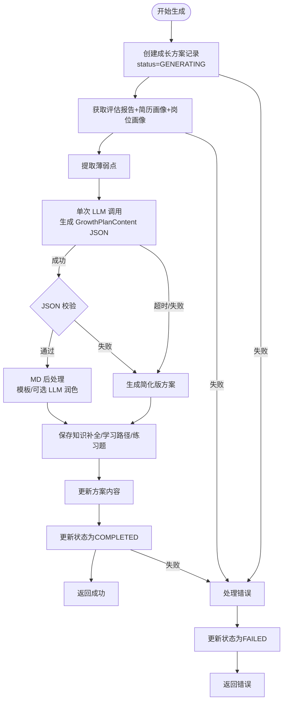
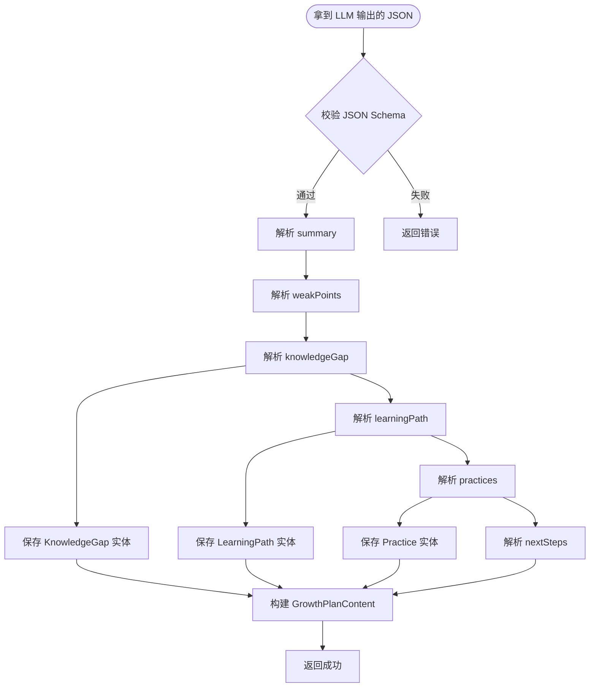
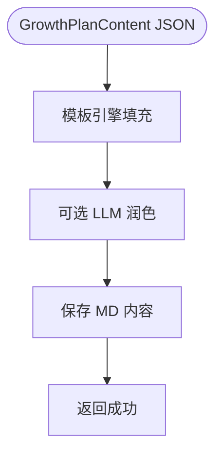
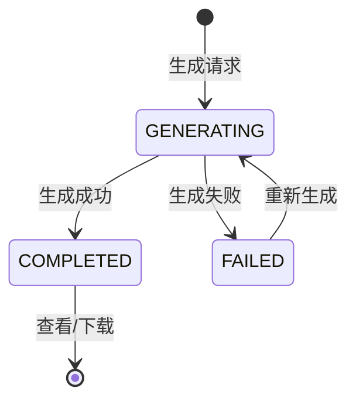

# 成长模块详细设计

> 本文档记录成长模块的详细设计，包括功能定义、数据结构、接口设计、业务流程等。

---

## 1. 模块概述

### 1.1 模块职责

| 职责 | 说明 |
|------|------|
| **成长方案生成** | 基于评估报告生成个性化成长方案 |
| **学习路径规划** | 针对薄弱点生成学习路线 |
| **练习题生成** | 针对薄弱点生成练习题 |
| **知识补全** | 生成薄弱知识点的详细解释 |
| **方案查看下载** | 用户查看和下载成长方案 MD |

### 1.2 模块位置

```
┌─────────────────────────────────────────────────────────────┐
│                  成长模块 (growth-module)                       │
├─────────────────────────────────────────────────────────────┤
│  Controller: GrowthController, LearningPathController       │
│  Service: GrowthPlanService, LearningPathService,        │
│            PracticeService, KnowledgeGapService             │
│  Agent: CoachAgent                                      │
│  Tools: DocGenTool, LearningPathTool, PracticeGenTool,  │
│         ResourceRecommendTool                             │
│  Repository: GrowthPlanRepository,                        │
│              LearningPathRepository,                      │
│              PracticeRepository                          │
└─────────────────────────────────────────────────────────────┘
```

### 1.3 模块依赖

| 依赖模块 | 说明 |
|---------|------|
| 面试模块 | 获取评估报告、薄弱点列表 |
| 用户模块 | 获取当前用户身份 |
| 基础设施模块 | 持久化 Tool、审计 Tool |
| AI 服务层 | LLM 调用（Spring AI Alibaba） |

---

## 2. 数据模型

### 2.1 实体设计

#### GrowthPlan（成长方案）

| 字段 | 类型 | 约束 | 说明 |
|------|------|------|------|
| id | Long | PK, AUTO | 方案ID |
| userId | Long | FK, NOT NULL, INDEX | 用户ID |
| interviewId | Long | FK, NOT NULL | 来源面试ID |
| overallScore | Integer | | 综合评分 0-100 |
| grade | String | | 等级：优秀/良好/一般/较差 |
| content | Text | | 方案内容（MD格式） |
| status | Enum | NOT NULL | 生成中/已完成/失败 |
| generatedAt | DateTime | | 生成时间 |
| createdAt | DateTime | NOT NULL | 创建时间 |
| updatedAt | DateTime | NOT NULL | 更新时间 |

#### LearningPath（学习路径）

| 字段 | 类型 | 约束 | 说明 |
|------|------|------|------|
| id | Long | PK, AUTO | 路径ID |
| growthPlanId | Long | FK, NOT NULL | 成长方案ID |
| topicId | String | | 主题ID |
| topicName | String | NOT NULL | 主题名称 |
| currentLevel | String | | 当前水平 |
| targetLevel | String | | 目标水平 |
| stages | JSON | | 学习阶段列表 |
| totalDuration | String | | 总学习周期 |
| createdAt | DateTime | NOT NULL | 创建时间 |

#### Practice（练习题）

| 字段 | 类型 | 约束 | 说明 |
|------|------|------|------|
| id | Long | PK, AUTO | 题目ID |
| growthPlanId | Long | FK, NOT NULL | 成长方案ID |
| topicId | String | | 主题ID |
| topicName | String | NOT NULL | 主题名称 |
| questionType | String | | 题目类型：选择/简答/编程 |
| difficulty | String | | 难度：简单/中等/困难 |
| question | Text | NOT NULL | 题目内容 |
| answer | Text | | 参考答案 |
| explanation | Text | | 题解 |
| createdAt | DateTime | NOT NULL | 创建时间 |

#### KnowledgeGap（知识补全）

| 字段 | 类型 | 约束 | 说明 |
|------|------|------|------|
| id | Long | PK, AUTO | ID |
| growthPlanId | Long | FK, NOT NULL | 成长方案ID |
| topicId | String | | 主题ID |
| topicName | String | NOT NULL | 主题名称 |
| weakPoint | String | NOT NULL | 薄弱点名称 |
| severity | String | | 严重程度：高/中/低 |
| explanation | Text | | 详细解释 |
| commonMistakes | JSON | | 常见误区 |
| recommendedResources | JSON | | 推荐资源 |
| createdAt | DateTime | NOT NULL | 创建时间 |

### 2.2 枚举类型

```java
// 成长方案状态
public enum GrowthPlanStatus {
    GENERATING,  // 生成中
    COMPLETED,   // 已完成
    FAILED       // 生成失败
}

// 题目类型
public enum QuestionType {
    SINGLE_CHOICE,  // 单选题
    MULTIPLE_CHOICE, // 多选题
    SHORT_ANSWER,    // 简答题
    CODING            // 编程题
}

// 难度等级
public enum Difficulty {
    EASY,     // 简单
    MEDIUM,   // 中等
    HARD      // 困难
}

// 严重程度
public enum Severity {
    HIGH,   // 高
    MEDIUM, // 中
    LOW     // 低
}
```

### 2.3 成长方案数据结构

#### GrowthPlanContent（成长方案 JSON 结构）

```json
{
  "summary": {
    "overallScore": 78,
    "grade": "良好",
    "totalQuestions": 15,
    "totalDuration": "45分钟",
    "strongAreas": ["Java并发", "Spring源码"],
    "weakAreas": ["MySQL优化", "分布式事务"]
  },
  "weakPoints": [
    {
      "topicId": "mysql",
      "topicName": "MySQL",
      "severity": "HIGH",
      "description": "在MySQL索引优化和事务隔离级别方面理解不够深入"
    }
  ],
  "knowledgeGap": [
    {
      "topicId": "mysql",
      "weakPoint": "索引失效场景",
      "explanation": "详细解释索引失效的常见场景...",
      "commonMistakes": ["模糊查询使用索引", "最左前缀原则"],
      "recommendedResources": [
        { "type": "article", "title": "MySQL索引详解", "url": "..." }
      ]
    }
  ],
  "learningPath": [
    {
      "topicId": "mysql",
      "topicName": "MySQL",
      "stages": [
        { "stage": 1, "name": "基础回顾", "duration": "3天", "content": "索引基础、事务概念" },
        { "stage": 2, "name": "深入理解", "duration": "5天", "content": "索引优化、锁机制" },
        { "stage": 3, "name": "实战应用", "duration": "7天", "content": "慢查询优化、主从复制" }
      ],
      "totalDuration": "2周"
    }
  ],
  "practices": [
    {
      "topicId": "mysql",
      "questionType": "CODING",
      "difficulty": "MEDIUM",
      "question": "编写一个SQL查询，找出所有订单表中重复的订单...",
      "answer": "SELECT order_id, COUNT(*) as cnt FROM orders GROUP BY order_id HAVING cnt > 1",
      "explanation": "使用GROUP BY + HAVING筛选重复记录..."
    }
  ],
  "nextSteps": [
    "建议优先学习MySQL索引优化",
    "下周安排一次针对性练习",
    "1个月后重新面试检验"
  ]
}
```

---

## 3. 功能定义

### 3.1 成长方案生成

| 项目 | 说明 |
|------|------|
| **触发时机** | 面试结束后自动触发 |
| **输入** | 评估报告、薄弱点列表、简历画像、岗位画像 |
| **输出** | GrowthPlanContent 结构 + MD 文档 |
| **流程** | 一次 LLM 调用生成完整 GrowthPlanContent → JSON 后处理 → 生成 MD |
| **成本控制** | 成长方案生成控制在 1-2 次 LLM 调用内 |

### 3.2 知识补全

| 项目 | 说明 |
|------|------|
| **功能描述** | 针对薄弱点生成详细解释和补充 |
| **输入** | 薄弱点列表 |
| **输出** | 详细解释、常见误区、推荐资源 |

### 3.3 学习路径规划

| 项目 | 说明 |
|------|------|
| **功能描述** | 为每个薄弱点生成学习路径 |
| **输入** | 薄弱点、目标水平 |
| **输出** | 分阶段学习计划 |

### 3.4 练习题生成

| 项目 | 说明 |
|------|------|
| **功能描述** | 针对薄弱点生成练习题 |
| **输入** | 薄弱点列表 |
| **输出** | 选择题、简答题、编程题及答案 |

### 3.5 方案查看下载

| 功能 | 说明 |
|------|------|
| 查看方案 | 获取成长方案详情 |
| 下载 MD | 下载成长方案 MD 文件 |

---

## 4. 接口设计

### 4.1 接口一览

| 方法 | 路径 | 说明 | 认证 |
|------|------|------|------|
| POST | /api/v1/growth-plans/generate | 生成成长方案 | 是 |
| GET | /api/v1/growth-plans/{id} | 获取成长方案 | 是 |
| GET | /api/v1/growth-plans/{id}/download | 下载 MD 文件 | 是 |
| GET | /api/v1/growth-plans | 获取方案列表 | 是 |
| GET | /api/v1/growth-plans/{id}/learning-path | 获取学习路径 | 是 |
| GET | /api/v1/growth-plans/{id}/practices | 获取练习题 | 是 |

### 4.2 接口详情

#### POST /api/v1/growth-plans/generate（生成成长方案）

**请求**：
```json
{
  "interviewId": "uuid-xxx"
}
```

**响应**（200）：
```json
{
  "code": 0,
  "message": "success",
  "data": {
    "growthPlanId": 1,
    "status": "GENERATING"
  }
}
```

**错误码**：
| code | message | 说明 |
|------|---------|------|
| 7001 | 面试不存在 | interviewId 不存在 |
| 7002 | 面试未结束 | 面试还在进行中 |
| 7003 | 方案生成中 | 同一面试不可重复生成 |

---

#### GET /api/v1/growth-plans/{id}（获取成长方案）

**响应**（200）：
```json
{
  "code": 0,
  "message": "success",
  "data": {
    "growthPlanId": 1,
    "interviewId": "uuid-xxx",
    "overallScore": 78,
    "grade": "良好",
    "status": "COMPLETED",
    "summary": {
      "strongAreas": ["Java并发", "Spring源码"],
      "weakAreas": ["MySQL优化", "分布式事务"]
    },
    "weakPoints": [...],
    "knowledgeGap": [...],
    "learningPath": [...],
    "practices": [...],
    "nextSteps": [...],
    "generatedAt": "2024-01-15T12:00:00"
  }
}
```

**错误码**：
| code | message | 说明 |
|------|---------|------|
| 7101 | 方案不存在 | growthPlanId 不存在 |
| 7102 | 无权访问 | 方案不属于当前用户 |

---

#### GET /api/v1/growth-plans/{id}/download（下载 MD 文件）

**响应**：text/markdown
```
# 面试成长方案

## 一、面试总结
...

## 二、薄弱知识点列表
...
```

---

#### GET /api/v1/growth-plans（获取方案列表）

**请求参数**：
| 参数 | 类型 | 必填 | 说明 |
|------|------|------|------|
| page | int | 否 | 页码（默认0） |
| size | int | 否 | 每页条数（默认10） |

**响应**（200）：
```json
{
  "code": 0,
  "message": "success",
  "data": {
    "content": [
      {
        "growthPlanId": 1,
        "interviewId": "uuid-xxx",
        "overallScore": 78,
        "grade": "良好",
        "status": "COMPLETED",
        "generatedAt": "2024-01-15T12:00:00"
      }
    ],
    "totalElements": 5,
    "totalPages": 1
  }
}
```

---

#### GET /api/v1/growth-plans/{id}/learning-path（获取学习路径）

**响应**（200）：
```json
{
  "code": 0,
  "message": "success",
  "data": {
    "growthPlanId": 1,
    "learningPaths": [
      {
        "topicId": "mysql",
        "topicName": "MySQL",
        "currentLevel": "了解",
        "targetLevel": "熟练",
        "stages": [
          { "stage": 1, "name": "基础回顾", "duration": "3天", "content": "索引基础、事务概念" },
          { "stage": 2, "name": "深入理解", "duration": "5天", "content": "索引优化、锁机制" }
        ],
        "totalDuration": "2周"
      }
    ]
  }
}
```

---

#### GET /api/v1/growth-plans/{id}/practices（获取练习题）

**请求参数**：
| 参数 | 类型 | 必填 | 说明 |
|------|------|------|------|
| topicId | String | 否 | 筛选主题 |
| questionType | String | 否 | 筛选题目类型 |
| difficulty | String | 否 | 筛选难度 |

**响应**（200）：
```json
{
  "code": 0,
  "message": "success",
  "data": {
    "growthPlanId": 1,
    "practices": [
      {
        "id": 1,
        "topicId": "mysql",
        "topicName": "MySQL",
        "questionType": "CODING",
        "difficulty": "MEDIUM",
        "question": "编写一个SQL查询...",
        "answer": "SELECT order_id...",
        "explanation": "使用GROUP BY..."
      }
    ],
    "totalCount": 20
  }
}
```

---

## 5. 业务流程

### 5.1 成长方案生成流程



**为什么改为单次调用？**
- 原流程 4-5 次串行 LLM 调用，任一步失败整体失败
- 单次调用可保证内容一致性，避免前后章节矛盾
- 降低 token 总消耗和整体生成时间

**降级策略**：
- LLM 超时或 JSON 校验失败时，生成仅含薄弱点列表和下一步建议的简化版方案
- 简化版方案不生成练习题和详细学习路径

---

### 5.2 JSON 后处理与实体拆分流程



**JSON Schema 校验要点**：
- 必须包含 summary、weakPoints、knowledgeGap、learningPath、practices、nextSteps
- 每个薄弱点必须有 topicName 和 severity
- 每个练习题必须有 question 和 answer

---

### 5.3 MD 后处理流程



**MD 生成策略**：
- 默认使用 Velocity / Thymeleaf 模板引擎直接渲染
- 如需润色，可额外调用一次 LLM（MVP 阶段不建议）
- 模板中预定义 7 个章节：面试总结、薄弱知识点、知识补全、学习路径、练习题、推荐资源、下一步建议

---

## 6. Agent 设计

### 6.1 技能完善助理 Agent（CoachAgent）

```java
// 职责：基于评估报告一次性生成完整成长方案 JSON
public class CoachAgent {
    // 1. 生成完整成长方案（单次 LLM 调用）
    public GrowthPlanContent generateGrowthPlan(EvaluationReport report,
                                                 ResumeProfile resumeProfile,
                                                 PositionProfile positionProfile);

    // 2. 生成简化版方案（LLM 失败时兜底）
    public GrowthPlanContent generateFallbackPlan(EvaluationReport report);

    // 3. 生成 MD 文档（模板渲染，可选 LLM 润色）
    public String generateMarkdown(GrowthPlanContent content);
}
```

---

## 7. 安全设计

### 7.1 数据隔离

| 设计 | 说明 |
|------|------|
| **用户隔离** | 所有成长方案操作需校验 userId |
| **来源关联** | 成长方案关联面试，面试属于用户 |

### 7.2 审计日志

| 记录场景 | 记录内容 |
|---------|---------|
| 方案生成 | growthPlanId, interviewId, userId, time |
| 方案查看 | growthPlanId, userId, time |
| 方案下载 | growthPlanId, userId, time |

---

## 8. 错误码设计

### 8.1 成长模块错误码（7xxx）

| 错误码 | 消息 | 说明 |
|--------|------|------|
| 7001 | 面试不存在 | interviewId 不存在 |
| 7002 | 面试未结束 | 面试还在进行中 |
| 7003 | 方案生成中 | 同一面试不可重复生成 |
| 7004 | 方案生成失败 | LLM 调用失败 |

### 8.2 业务错误码（71xx）

| 错误码 | 消息 | 说明 |
|--------|------|------|
| 7101 | 方案不存在 | growthPlanId 不存在 |
| 7102 | 无权访问 | 方案不属于当前用户 |
| 7103 | 方案未完成 | 方案还在生成中 |

---

## 9. LLM Prompt 设计

### 9.1 统一成长方案生成 Prompt

#### System Prompt（系统角色）

```
你是一位资深的技术导师和职业规划顾问。基于候选人的面试评估报告、简历画像和目标岗位画像，
生成一份完整的、结构化的成长方案。方案需要针对性强、可执行，并且内容前后一致。
```

#### User Prompt（用户输入内容）

```
**面试评估报告：**
{evaluation_report_json}

**候选人简历画像：**
{resume_profile_json}

**目标岗位画像：**
{position_profile_json}

**生成要求：**
1. 总结面试表现：综合评分、等级、优势技能、薄弱技能
2. 列出薄弱知识点：每个薄弱点需有主题、严重程度、描述
3. 知识补全：针对每个薄弱点给出详细解释、常见误区、推荐资源
4. 学习路径：为每个主题制定 3-5 个阶段的学习计划，含周期和目标
5. 练习题：为每个薄弱点生成 1-2 道练习题（选择/简答/编程），含答案和解析
6. 下一步建议：给出 3-5 条可执行的短期（1周内）和中期（1个月内）建议

**输出格式（必须为标准 JSON）：**
{
  "summary": {
    "overallScore": 78,
    "grade": "良好",
    "totalQuestions": 15,
    "totalDuration": "45分钟",
    "strongAreas": ["Java并发", "Spring源码"],
    "weakAreas": ["MySQL优化", "分布式事务"]
  },
  "weakPoints": [
    {
      "topicId": "mysql",
      "topicName": "MySQL",
      "severity": "HIGH",
      "description": "在MySQL索引优化和事务隔离级别方面理解不够深入"
    }
  ],
  "knowledgeGap": [
    {
      "topicId": "mysql",
      "weakPoint": "索引失效场景",
      "explanation": "...",
      "commonMistakes": ["误区1", "误区2"],
      "recommendedResources": [
        { "type": "book", "title": "...", "description": "..." }
      ]
    }
  ],
  "learningPath": [
    {
      "topicId": "mysql",
      "topicName": "MySQL",
      "currentLevel": "了解",
      "targetLevel": "熟练",
      "stages": [
        { "stage": 1, "name": "基础回顾", "duration": "3天", "goals": [...], "content": "...", "resources": [...] }
      ],
      "totalDuration": "2周"
    }
  ],
  "practices": [
    {
      "topicId": "mysql",
      "questionType": "CODING",
      "difficulty": "MEDIUM",
      "question": "...",
      "answer": "...",
      "explanation": "..."
    }
  ],
  "nextSteps": [
    "建议优先学习MySQL索引优化",
    "下周安排一次针对性练习"
  ]
}
```

---

### 9.2 MD 后处理 Prompt（可选）

#### System Prompt（系统角色）

```
你是一个专业的技术文档撰写专家，负责将成长方案 JSON 润色成格式良好的 Markdown 文档。
```

#### User Prompt（用户输入内容）

```
**成长方案内容：**
{plan_content_json}

**格式要求：**
1. 使用标准的Markdown格式
2. 章节层次清晰
3. 代码块使用```java等指定语言
4. 列表使用有序/无序列表

**输出格式：**
```markdown
# 面试成长方案

## 一、面试总结
...

## 二、薄弱知识点列表
...

## 三、知识补全
...

## 四、学习路径
...

## 五、练习题
...

## 六、推荐资源
...

## 七、下一步建议
...
```
```

---

## 10. 成长方案 MD 格式模板

```markdown
# 面试成长方案

> 生成时间：{generated_at}
> 原面试岗位：{position_name}

## 一、面试总结

| 项目 | 内容 |
|------|------|
| 综合评分 | {overall_score} |
| 等级 | {grade} |
| 面试时长 | {duration} |
| 总问题数 | {question_count} |

### 1.1 优势技能
- {strong_point_1}
- {strong_point_2}

### 1.2 薄弱技能
- {weak_point_1}
- {weak_point_2}

---

## 二、薄弱知识点列表

### 2.1 {topic_name_1}
- **严重程度**：{severity}
- **问题描述**：{description}

### 2.2 {topic_name_2}
- **严重程度**：{severity}
- **问题描述**：{description}

---

## 三、知识补全

### 3.1 {weak_point_name}

**详细解释**：
{explnation}

**常见误区**：
1. {mistake_1}
2. {mistake_2}

**推荐资源**：
- {resource_1}
- {resource_2}

---

## 四、学习路径

### 4.1 {topic_name}

**当前水平**：{current_level}
**目标水平**：{target_level}
**预计周期**：{total_duration}

| 阶段 | 名称 | 周期 | 学习内容 |
|------|------|------|---------|
| 1 | {stage_name} | {duration} | {content} |
| 2 | {stage_name} | {duration} | {content} |
| 3 | {stage_name} | {duration} | {content} |

---

## 五、练习题

### 5.1 {topic_name} - 编程题

**题目**：
{question}

**参考答案**：
```java
{answer_code}
```

**解题思路**：
{explanation}

---

## 六、下一步建议

### 6.1 短期（1周内）
1. {action_1}

### 6.2 中期（1个月内）
1. {action_2}

---

*本方案由 AI 自动生成，仅供参考*
```

---

## 11. 成长方案状态流转



---

*文档版本：v0.2*
*创建时间：2026-07-20*
*更新说明：成长方案生成改为单次 LLM 调用 + JSON 后处理 + MD 后处理，增加降级策略*
