# 面试模块详细设计

> **当前简历画像接入基线（2026-07）**：创建面试时固定用户已确认的事实画像快照，并在当前有效 AI 分析存在时同时固定辅助分析快照。辅助分析缺失或损坏不阻断面试，只作为出题和追问线索，不传给评估器，也不直接参与评分。

> 本文档记录面试模块的详细设计，包括功能定义、数据结构、接口设计、业务流程等。

---

## 1. 模块概述

### 1.1 模块职责

| 职责 | 说明 |
|------|------|
| **面试创建** | 基于简历+岗位创建面试会话，支持环节自由组合 |
| **环节管理** | 自我介绍、专业面试、简历探讨、行为面试、结束环节 |
| **面试编排** | 协调者 Agent 调度面试官/评估者并行工作 |
| **问题生成** | 面试官 Agent 按深度递进模型生成问题 |
| **流式输出** | SSE 流式推送问题给用户 |
| **评估记录** | 评估者 Agent 实时评估回答 |
| **深度控制** | 根据回答质量控制追问深度（专业面试阶段） |
| **主题切换** | 根据评估结果决定切换主题（专业面试阶段） |
| **报告生成** | 面试结束生成评估报告 |

### 1.2 模块位置

```
┌─────────────────────────────────────────────────────────────┐
│                  面试模块 (interview-module)                     │
├─────────────────────────────────────────────────────────────┤
│  Controller: InterviewController, FeedbackController       │
│  Service: InterviewService, MatchingService               │
│  Agent: CoordinatorAgent, InterviewerAgent, EvaluatorAgent│
│  Engine: InterviewDecisionEngine                           │
│  Tools: QuestionGenTool, EvaluationTool, MatchingTool,     │
│         StreamingTool, TopicMemoryTool,                   │
│         QuestionBankTool, EvaluationFallbackTool          │
│  Repository: InterviewRepository,                         │
│              InterviewMessageRepository,                   │
│              ThemeEvaluationRepository                    │
└─────────────────────────────────────────────────────────────┘
```

### 1.3 模块依赖

| 依赖模块 | 说明 |
|---------|------|
| 用户模块 | 获取当前用户身份 |
| 简历模块 | 获取用户画像 |
| 岗位模块 | 获取岗位画像 |
| 成长模块 | 触发成长方案生成 |
| 基础设施模块 | 脱敏 Tool、审计 Tool、持久化 Tool |
| AI 服务层 | LLM 调用（Spring AI Alibaba） |

---

## 2. 数据模型

### 2.1 实体设计

#### Interview（面试会话）

| 字段 | 类型 | 约束 | 说明 |
|------|------|------|------|
| id | Long | PK, AUTO | 面试ID |
| userId | Long | FK, NOT NULL, INDEX | 用户ID |
| resumeId | Long | FK, NOT NULL | 简历ID |
| positionId | Long | FK, NOT NULL | 岗位ID |
| userProfile | JSON | | 用户已确认事实画像（快照） |
| userProfileAnalysis | JSON | | 可选 AI 辅助分析（快照） |
| positionProfile | JSON | | 岗位画像（快照） |
| selectedPhases | JSON | NOT NULL | 用户选择的环节列表（已排序） |
| currentPhase | Enum | NOT NULL | 当前环节 |
| currentTopicId | String | | 当前主题ID（专业面试阶段） |
| currentDepth | Integer | DEFAULT 1 | 当前深度（专业面试阶段） |
| currentTopicFollowUpCount | Integer | DEFAULT 0 | 当前主题追问次数 |
| consecutiveFailures | Integer | DEFAULT 0 | 连续失败次数 |
| consecutiveExcellence | Integer | DEFAULT 0 | 连续优秀次数 |
| lastEvaluationSeq | Integer | DEFAULT 0 | 上次评估的消息序号 |
| pendingQuestion | JSON | | 未送达的问题（用于断线恢复） |
| status | Enum | NOT NULL | 进行中/已结束/已中断 |
| totalQuestionCount | Integer | DEFAULT 0 | 总问题数 |
| currentQuestionCount | Integer | DEFAULT 0 | 当前主题问题数 |
| startedAt | DateTime | | 开始时间 |
| endedAt | DateTime | | 结束时间 |
| createdAt | DateTime | NOT NULL | 创建时间 |
| updatedAt | DateTime | NOT NULL | 更新时间 |

#### InterviewMessage（面试消息）

| 字段 | 类型 | 约束 | 说明 |
|------|------|------|------|
| id | Long | PK, AUTO | 消息ID |
| interviewId | Long | FK, NOT NULL, INDEX | 面试ID |
| phase | String | NOT NULL | 所属环节 |
| role | String | NOT NULL | interviewer/candidate/system |
| content | Text | NOT NULL | 消息内容 |
| topicId | String | | 所属主题ID（专业面试阶段） |
| depth | Integer | | 问题深度 |
| tokenCount | Integer | | Token 数量 |
| createdAt | DateTime | NOT NULL | 创建时间 |

#### ThemeEvaluation（主题评估）

| 字段 | 类型 | 约束 | 说明 |
|------|------|------|------|
| id | Long | PK, AUTO | 评估ID |
| interviewId | Long | FK, NOT NULL, INDEX | 面试ID |
| topicId | String | NOT NULL | 主题ID |
| topicName | String | | 主题名称 |
| score | Integer | | 得分 0-100 |
| depthReached | Integer | | 达到深度 |
| strengthList | JSON | | 优势列表 |
| weaknessList | JSON | | 薄弱列表 |
| keyEvents | JSON | | 关键事件 |
| createdAt | DateTime | NOT NULL | 创建时间 |

#### Topic（技术主题）

| 字段 | 类型 | 约束 | 说明 |
|------|------|------|------|
| topicId | String | PK | 主题ID |
| topicName | String | NOT NULL | 主题名称 |
| minDepth | Integer | DEFAULT 1 | 最低深度 |
| maxDepth | Integer | DEFAULT 5 | 最高深度 |
| weight | Double | DEFAULT 0.5 | 主题权重 |
| targetDepth | Integer | | 目标深度 |
| probingDirections | JSON | | 探测方向列表 |

#### QuestionBank（题库）

| 字段 | 类型 | 约束 | 说明 |
|------|------|------|------|
| id | Long | PK, AUTO | 题目ID |
| topicId | String | FK, INDEX | 主题ID |
| jobCategory | String | INDEX | 岗位大类 |
| level | Integer | | 题目级别：1基础/2模板/3动态 |
| depth | Integer | | 对应深度 L1-L5 |
| questionTemplate | Text | NOT NULL | 题目模板或原文 |
| placeholders | JSON | | 模板占位符定义 |
| evaluationRule | JSON | | 规则评估配置（关键词/长度） |
| useCount | Integer | DEFAULT 0 | 使用次数 |
| qualityScore | Double | DEFAULT 0 | 质量评分（0-1） |
| source | String | | 来源：system/user/llm |
| isActive | Boolean | DEFAULT true | 是否启用 |
| vectorId | String | | 向量库ID（用于语义去重） |
| createdAt | DateTime | NOT NULL | 创建时间 |
| updatedAt | DateTime | NOT NULL | 更新时间 |

### 2.2 枚举类型

```java
// 面试状态
public enum InterviewStatus {
    IN_PROGRESS,  // 进行中
    ENDED,        // 正常结束
    INTERRUPTED   // 中断（用户主动结束）
}

// 面试环节（按固定顺序）
public enum InterviewPhase {
    SELF_INTRO,          // 自我介绍
    PROFESSIONAL,        // 专业面试
    RESUME_DISCUSSION,   // 简历探讨
    BEHAVIORAL,          // 行为面试
    ENDING               // 结束
}

// 关键事件类型
public enum KeyEventType {
    EXCELLENT,    // 优秀回答
    STRUGGLED,     // 困难回答
    IMPORTANT,     // 重要事件
    TOPIC_SWITCH,  // 主题切换
    DEPTH_JUMP     // 深度跳跃
}
```

### 2.3 环节配置

#### 环节顺序定义（固定顺序）

```
1. 自我介绍 (SELF_INTRO)
2. 专业面试 (PROFESSIONAL)
3. 简历探讨 (RESUME_DISCUSSION)
4. 行为面试 (BEHAVIORAL)
5. 结束 (ENDING)
```

#### 用户选择逻辑

| 用户选择 | 实际环节顺序 |
|---------|-------------|
| 仅专业面试 | 专业面试 → 结束 |
| 专业面试 + 行为面试 | 专业面试 → 行为面试 → 结束 |
| 自我介绍 + 专业面试 + 简历探讨 | 自我介绍 → 专业面试 → 简历探讨 → 结束 |
| 全部选择 | 自我介绍 → 专业面试 → 简历探讨 → 行为面试 → 结束 |

### 2.4 上下文数据结构

#### InterviewContext（面试上下文）

```java
public class InterviewContext {
    Long interviewId;
    Long userId;
    ResumeProfile userProfile;      // 已确认事实画像（快照）
    ResumeProfileAnalysisData userProfileAnalysis; // 可选选题线索，不参与评分
    PositionProfile positionProfile; // 岗位画像（快照）

    // 环节相关
    List<InterviewPhase> selectedPhases;  // 用户选择的环节（已排序）
    InterviewPhase currentPhase;          // 当前环节

    // 专业面试相关（仅 PROFESSIONAL 阶段使用）
    String currentTopicId;          // 当前主题ID
    Topic currentTopic;             // 当前主题
    Integer currentDepth;           // 当前深度
    Integer currentTopicFollowUpCount; // 当前主题追问次数
    Integer consecutiveFailures;     // 连续失败次数
    Integer consecutiveExcellence;   // 连续优秀次数
    Map<String, ThemeEvaluation> completedThemeEvaluations; // 已完成主题评估
    List<Topic> topics;            // 预设主题列表

    // 成本控制相关
    Integer lastEvaluationSeq;       // 上次评估的消息序号
    Boolean needEvaluate;            // 当前消息是否需要评估

    // 上下文压缩
    List<InterviewMessage> recentMessages; // 最近 3-5 轮完整 Q&A
    Map<String, String> topicSummaries;    // 各主题摘要

    InterviewBudget budget;         // 面试预算
}

// 面试预算
public class InterviewBudget {
    Integer maxQuestions;           // 最大问题数
    Integer maxDuration;             // 最大时长（分钟）
    Integer maxFollowUpPerTopic;    // 每主题最大追问次数
    Integer maxDepthLevel;          // 最大深度等级
}
```

---

## 3. 功能定义

### 3.1 创建面试

| 项目 | 说明 |
|------|------|
| **功能描述** | 基于简历和岗位创建新面试会话 |
| **输入** | resumeId, positionId, selectedPhases（用户选择的环节） |
| **输出** | interviewId, 首题 |
| **流程** | 校验 → 获取画像 → 初始化上下文 → 按顺序排列环节 → 生成首题 |

### 3.2 提交回答

| 项目 | 说明 |
|------|------|
| **功能描述** | 用户提交回答，系统生成下一题 |
| **输入** | interviewId, 回答内容 |
| **输出** | SSE 流式下一题 |
| **流程** | 记录回答 → 评估降频判断 → 评估回答（按需）→ 流程决策 → 生成下一题 → 流式推送 |

### 3.3 环节切换

| 项目 | 说明 |
|------|------|
| **切换时机** | 当前环节所有问题完成或达到预设数量 |
| **切换逻辑** | 按 selectedPhases 顺序切换到下一环节 |
| **专业面试阶段** | 支持深度递进、主题切换、追问 |
| **其他阶段** | 按阶段特定流程处理 |

### 3.4 各环节说明

#### 3.4.1 自我介绍（SELF_INTRO）

| 项目 | 说明 |
|------|------|
| **目的** | 让候选人放松，了解基本信息 |
| **问题数量** | 1-2 题 |
| **问题类型** | 背景介绍、职业经历、求职动机 |
| **评估** | 主要评估表达能力和逻辑组织 |

#### 3.4.2 专业面试（PROFESSIONAL）

| 项目 | 说明 |
|------|------|
| **目的** | 考察岗位相关专业技能（根据岗位大类适配） |
| **问题数量** | 根据主题数量动态调整 |
| **问题类型** | 深度递进（L1-L5）、主题切换 |
| **评估** | 专业深度、专业广度、实践经验 |

#### 3.4.3 简历探讨（RESUME_DISCUSSION）

| 项目 | 说明 |
|------|------|
| **目的** | 深入了解简历中的项目经历 |
| **问题数量** | 根据项目数量动态调整 |
| **问题类型** | 项目细节、技术选型、问题解决、成果量化 |
| **评估** | 实践能力、业务理解、表达能力 |

#### 3.4.4 行为面试（BEHAVIORAL）

| 项目 | 说明 |
|------|------|
| **目的** | 考察软技能和职业素养 |
| **问题数量** | 3-5 题 |
| **问题类型** | STAR 法则问题（情境、任务、行动、结果） |
| **评估** | 沟通表达、学习能力、团队协作 |

#### 3.4.5 结束（ENDING）

| 项目 | 说明 |
|------|------|
| **目的** | 总结面试、回答候选人问题 |
| **问题数量** | 1-2 题 |
| **问题类型** | 面试反馈询问、候选人提问 |
| **评估** | 无评估，仅记录结束语 |

### 3.5 深度递进控制（专业面试阶段）

| 项目 | 说明 |
|------|------|
| **L1-L5 深度模型** | 基础→选型→原理→实践→扩展 |
| **深度跳跃** | 连续优秀可跳1-2级 |
| **深度回退** | 回答困难退回浅层 |

### 3.6 主题切换（专业面试阶段）

| 项目 | 说明 |
|------|------|
| **切换条件** | 连续失败、深度已达上限、时间耗尽 |
| **切换流程** | 评估当前主题 → 选择下一主题 → 生成过渡语 |

### 3.7 流式输出

| 项目 | 说明 |
|------|------|
| **技术实现** | SSE（Server-Sent Events） |
| **推送内容** | 问题文本、思考状态、评估结果 |

---

## 4. 接口设计

### 4.1 接口一览

| 方法 | 路径 | 说明 | 认证 |
|------|------|------|------|
| POST | /api/v1/interviews | 创建面试 | 是 |
| GET | /api/v1/interviews/{id} | 获取面试详情 | 是 |
| POST | /api/v1/interviews/{id}/answer | 提交回答（流式） | 是 |
| POST | /api/v1/interviews/{id}/end | 主动结束面试 | 是 |
| GET | /api/v1/interviews/{id}/report | 获取评估报告 | 是 |
| GET | /api/v1/interviews/{id}/messages | 获取消息列表 | 是 |

### 4.2 接口详情

#### POST /api/v1/interviews（创建面试）

**请求**：
```json
{
  "resumeId": 1,
  "positionId": 1,
  "selectedPhases": ["SELF_INTRO", "PROFESSIONAL", "RESUME_DISCUSSION", "BEHAVIORAL"]
}
```

> **selectedPhases 说明**：
> - 可选值：`SELF_INTRO`, `PROFESSIONAL`, `RESUME_DISCUSSION`, `BEHAVIORAL`
> - 必须至少选择一个（ENDING 环节自动添加）
> - 系统按固定顺序排序后执行

**响应**（200）：
```json
{
  "code": 0,
  "message": "success",
  "data": {
    "interviewId": "uuid-xxx",
    "status": "IN_PROGRESS",
    "selectedPhases": ["SELF_INTRO", "PROFESSIONAL", "RESUME_DISCUSSION", "BEHAVIORAL"],
    "currentPhase": "SELF_INTRO",
    "firstQuestion": "你好，欢迎参加模拟面试。请先做一个简单的自我介绍，包括你的工作经历和擅长的技术领域。",
    "phaseOrder": ["SELF_INTRO", "PROFESSIONAL", "RESUME_DISCUSSION", "BEHAVIORAL", "ENDING"]
  }
}
```

**错误码**：
| code | message | 说明 |
|------|---------|------|
| 6001 | 简历不存在或未确认 | 简历状态不对 |
| 6002 | 岗位不存在或未审核 | 岗位状态不对 |
| 6003 | 简历已锁定在其他面试 | 冲突检查 |
| 6006 | 未选择任何环节 | selectedPhases 为空 |

---

#### POST /api/v1/interviews/{id}/answer（提交回答）

**请求**：
```json
{
  "answer": "我的回答是..."
}
```

**响应**：SSE 流式
```
data: {"type": "thinking", "content": "面试官正在思考..."}
data: {"type": "question", "content": "你能详细说说synchronized的底层实现原理吗？", "phase": "PROFESSIONAL", "depth": 3, "topicId": "java-concurrency"}
data: {"type": "phaseChange", "previousPhase": "PROFESSIONAL", "currentPhase": "RESUME_DISCUSSION"}
data: {"type": "done"}
```

**错误事件**（SSE）：
```
data: {"type": "error", "code": "LLM_TIMEOUT", "message": "当前生成超时，已为你切换到备选题目", "fallback": true}
data: {"type": "error", "code": "LLM_SERVICE_ERROR", "message": "面试官服务暂时不可用", "fallback": true}
```

**错误码**：
| code | message | 说明 |
|------|---------|------|
| 6101 | 面试不存在 | 面试ID不存在 |
| 6102 | 面试已结束 | 状态已结束 |
| 6103 | 面试已中断 | 用户主动中断 |
| 6108 | LLM 调用失败 | 已降级为题库模式 |

---

#### POST /api/v1/interviews/{id}/end（主动结束面试）

**响应**（200）：
```json
{
  "code": 0,
  "message": "success",
  "data": {
    "status": "INTERRUPTED",
    "reason": "用户主动结束",
    "currentPhase": "PROFESSIONAL"
  }
}
```

---

#### GET /api/v1/interviews/{id}/report（获取评估报告）

**响应**（200）：
```json
{
  "code": 0,
  "message": "success",
  "data": {
    "interviewId": "uuid-xxx",
    "overallScore": 78,
    "grade": "良好",
    "phases": {
      "SELF_INTRO": {
        "completed": true,
        "questionCount": 1
      },
      "PROFESSIONAL": {
        "completed": true,
        "questionCount": 8,
        "themeEvaluations": [...]
      },
      "RESUME_DISCUSSION": {
        "completed": true,
        "questionCount": 3
      },
      "BEHAVIORAL": {
        "completed": false,
        "questionCount": 1
      }
    },
    "dimensions": {
      "technicalDepth": 80,
      "technicalBreadth": 75,
      "practicalExperience": 82,
      "expression": 75,
      "learningAbility": 78
    },
    "keyEvents": [...],
    "conclusion": "候选人在..."
  }
}
```

---

## 5. 业务流程

### 5.1 创建面试流程

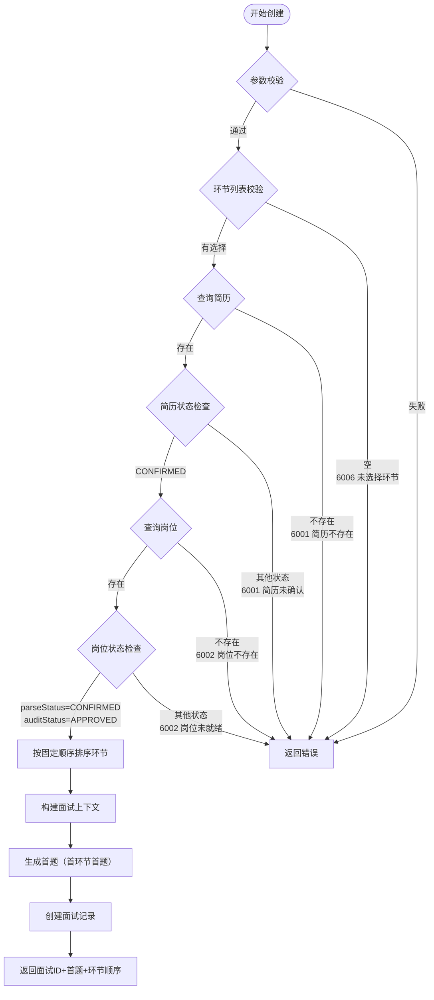

**环节排序规则**：

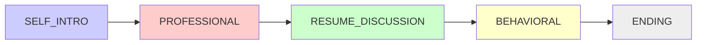

| 用户选择 | 排序后执行顺序 |
|---------|---------------|
| ["BEHAVIORAL", "PROFESSIONAL"] | PROFESSIONAL → BEHAVIORAL → ENDING |
| ["RESUME_DISCUSSION", "SELF_INTRO"] | SELF_INTRO → RESUME_DISCUSSION → ENDING |
| ["PROFESSIONAL"] | PROFESSIONAL → ENDING |
| ["SELF_INTRO", "PROFESSIONAL", "RESUME_DISCUSSION", "BEHAVIORAL"] | 全部顺序执行 |

---

### 5.2 提交回答流程（核心面试循环）

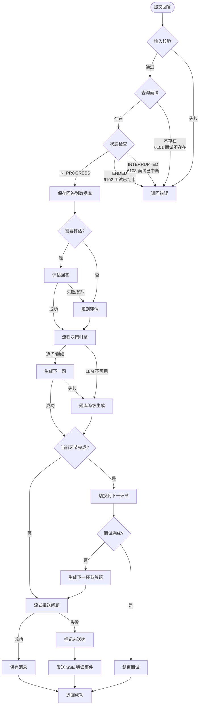

**评估降频判断逻辑**：

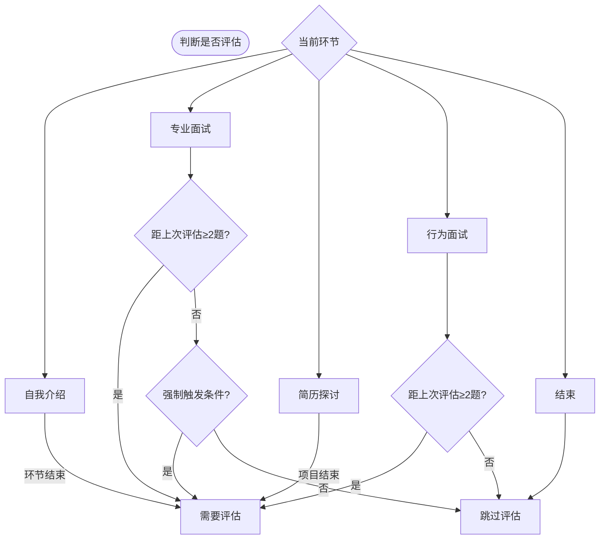

**强制触发评估条件**：
- 当前主题可能达到切换条件
- 回答长度异常（过短 &lt; 10 字或过长 &gt; 2000 字）
- 用户主动请求反馈
- 连续失败/优秀计数可能发生变化

---

### 5.3 各环节处理流程

#### 5.3.1 自我介绍环节（SELF_INTRO）

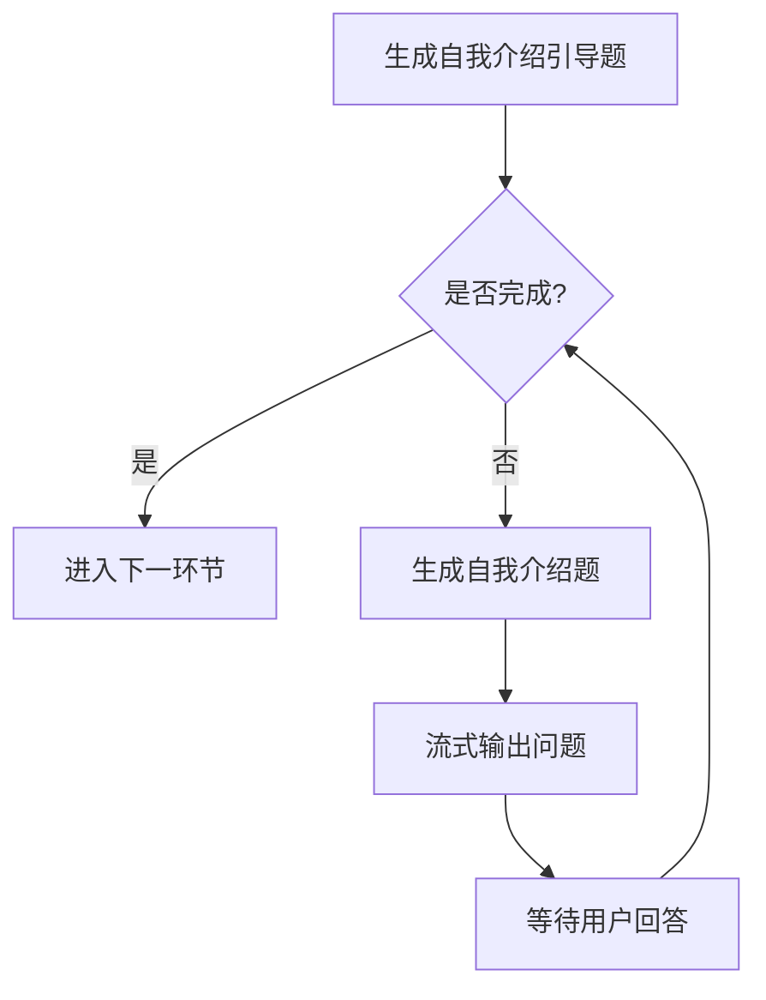

**问题示例**：
- "请做一个简单的自我介绍，包括你的工作经历和擅长的技术领域。"
- "简单介绍一下你最近的工作经历，以及你在项目中承担的角色。"

---

#### 5.3.2 专业面试环节（PROFESSIONAL）

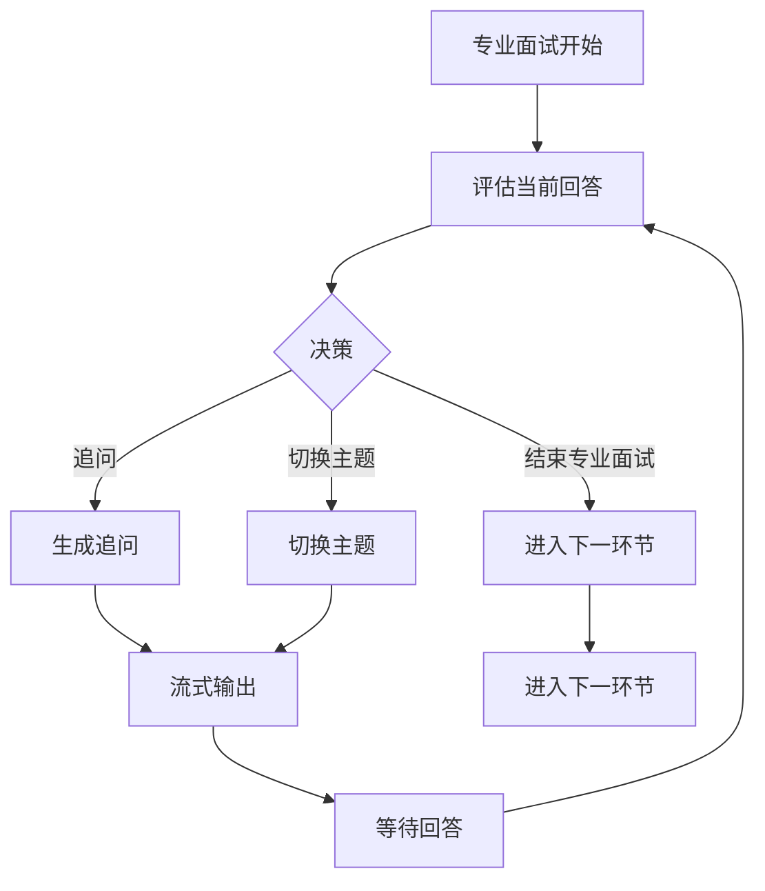

---

#### 5.3.3 简历探讨环节（RESUME_DISCUSSION）

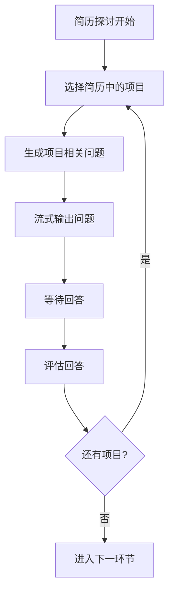

**问题类型**：
- "请详细介绍你在 [项目名] 中承担的角色和技术实现。"
- "在这个项目中遇到的最大技术挑战是什么？怎么解决的？"
- "项目的技术选型是怎么确定的？有哪些考量？"

---

#### 5.3.4 行为面试环节（BEHAVIORAL）

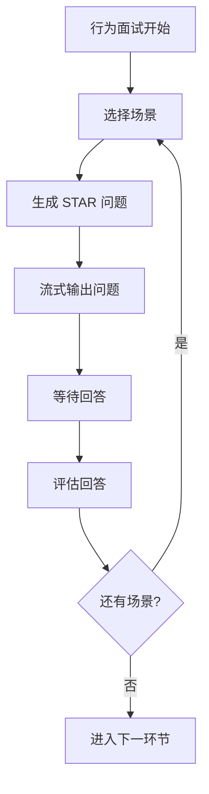

**问题示例**：
- "请描述一个你在项目中与团队成员出现分歧的经历，你是如何处理的？"
- "讲述一个你需要在紧迫时间内完成重要任务的经历。"

---

#### 5.3.5 结束环节（ENDING）

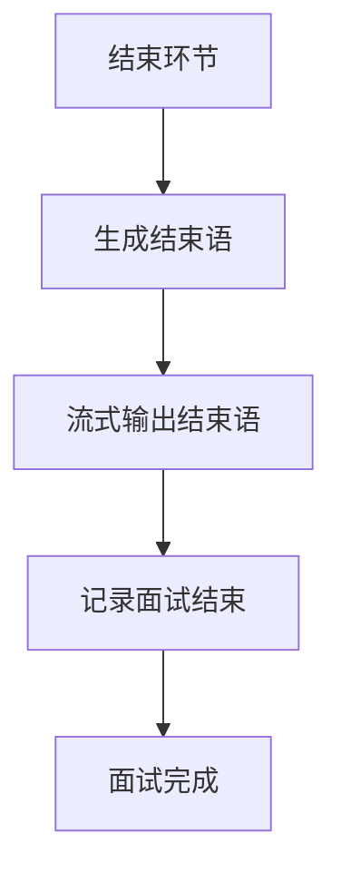

---

### 5.4 评估决策流程（专业面试阶段）

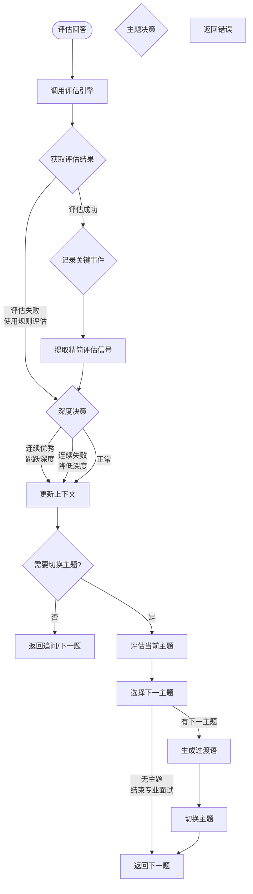

**精简评估信号（对面试官可见）**：

| 信号字段 | 类型 | 说明 |
|----------|------|------|
| suggestedNextDepth | Integer | 建议下一题深度 |
| shouldSwitchTopic | Boolean | 是否切换主题 |
| keyEventType | String | 关键事件类型：EXCELLENT/STRUGGLED/null |
| continueProbing | Boolean | 是否继续追问 |

**详细评估报告（对面试官不可见）**：

- 各维度得分（technicalDepth、technicalBreadth 等）
- 完整评语与薄弱点分析
- 原始回答质量评级

**决策规则详情**：

| 条件 | 决策 | 行为 |
|------|------|------|
| 连续优秀 ≥ 2次 | 深度跳跃 | 跳跃1-2个深度等级 |
| 连续失败 ≥ 2次 且 深度=minDepth | 切换主题 | 切换到下一主题 |
| 当前主题深度已达 maxDepth | 切换主题 | 切换到下一主题 |
| 每主题追问次数已达上限 | 切换主题 | 切换到下一主题 |
| 所有主题已完成 | 结束专业面试 | 进入下一环节 |

---

### 5.5 上下文压缩

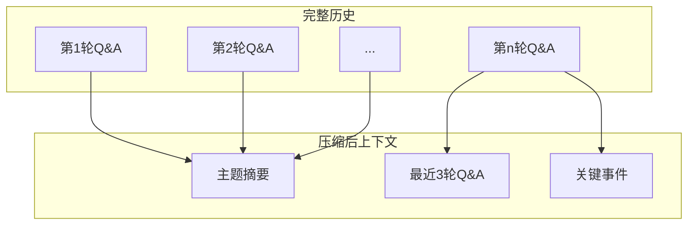

**压缩规则**：

| 场景 | 处理方式 |
|------|---------|
| 同主题早期 Q&A | 由 EvaluatorAgent 生成主题摘要 |
| 进入面试官 Prompt | 只保留最近 3-5 轮完整 Q&A |
| 跨主题切换 | 只携带上一主题摘要，不携带完整历史 |
| 关键事件 | 保留精简信号，不保留完整评语 |

**压缩触发时机**：
- 每个主题切换时生成主题摘要
- 每轮回答后更新 `recentMessages`
- `recentMessages` 超过 5 轮时，最早的一轮被摘要替代

---

### 5.6 提前结束判定流程

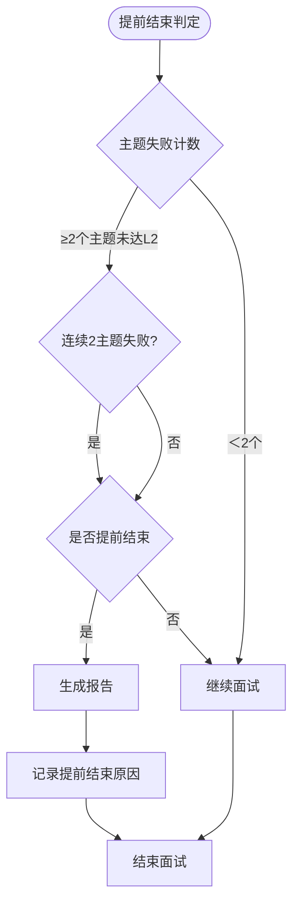

---

### 5.7 断线恢复流程

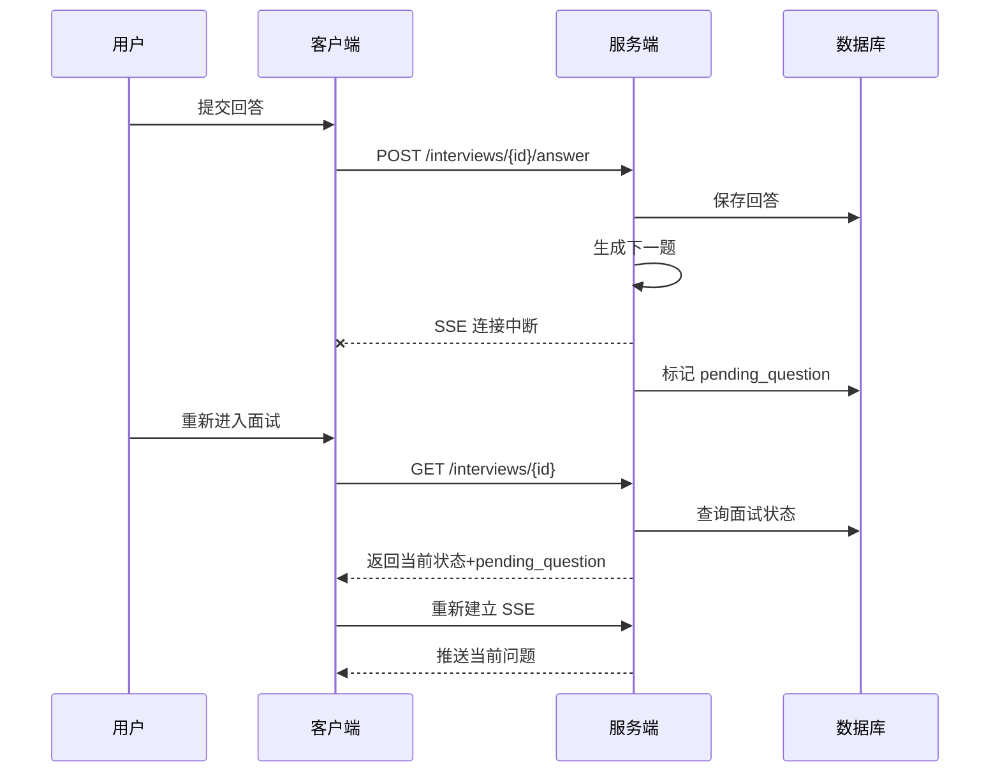

**恢复规则**：
- 每次收到回答后立即持久化
- 若 SSE 推送失败，将问题存入 `pending_question`
- 客户端重新连接时拉取 `pending_question` 并直接展示
- 若用户已看到问题但重新提交回答，服务端幂等处理

### 5.8 流式输出流程

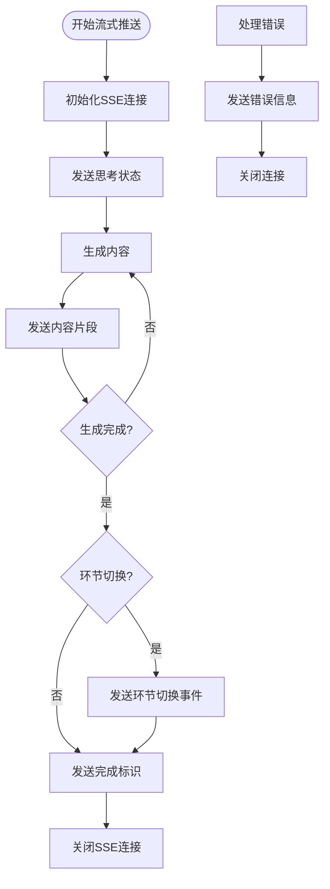

---

## 6. Agent 设计

### 6.1 协调者 Agent（CoordinatorAgent）

```java
// 职责：任务分发、流程控制、结果汇总
public class CoordinatorAgent {
    // 1. 初始化面试上下文
    public InterviewContext initialize(Long userId, Long resumeId, Long positionId,
                                       List<InterviewPhase> selectedPhases);

    // 2. 协调面试流程
    public void coordinate(InterviewContext context, String answer);

    // 3. 汇总结果
    public InterviewReport summarize(InterviewContext context);
}
```

### 6.1.1 流程决策引擎（InterviewDecisionEngine）

```java
/**
 * 流程决策引擎：根据评估信号和面试预算决定下一步动作。
 * 独立于面试官 Agent，避免决策逻辑与问题生成耦合。
 */
public class InterviewDecisionEngine {
    // 1. 判断当前回答是否需要 LLM 评估
    public boolean needEvaluate(InterviewContext context, InterviewMessage answer);

    // 2. 从评估结果中提取精简信号
    public EvaluationSignal extractSignal(EvaluationResult result);

    // 3. 决定下一步动作
    public NextAction decideNextAction(InterviewContext context,
                                       EvaluationSignal signal);

    // 4. 判断当前环节是否完成
    public boolean isPhaseComplete(InterviewContext context);

    // 5. 判断面试是否提前结束
    public boolean shouldEarlyEnd(InterviewContext context);
}
```

### 6.2 面试官 Agent（InterviewerAgent）

```java
// 职责：生成问题（只接收精简评估信号，不读取详细评估报告）
public class InterviewerAgent {
    // 1. 生成自我介绍问题
    public String generateSelfIntroQuestion(InterviewContext context);

    // 2. 生成首题
    public String generateFirstQuestion(InterviewContext context);

    // 3. 生成追问
    public String generateFollowUp(InterviewContext context, String question, String answer,
                                   int previousDepth, int nextDepth);

    // 4. 生成主题切换过渡
    public String generateTopicTransition(InterviewContext context, Topic nextTopic);

    // 5. 生成简历探讨问题
    public String generateResumeQuestion(InterviewContext context, String projectName);

    // 6. 生成行为面试问题
    public String generateBehavioralQuestion(InterviewContext context, String scenario);

    // 7. 生成结束语
    public String generateEndingMessage(InterviewContext context);
}
```

**面试官 Agent 可见信息约束**：
- 可见：用户事实画像摘要、可选辅助分析、岗位画像、最近 Q&A、主题摘要、精简评估信号
- 不可见：详细评估得分、完整评语、维度分析
- 辅助分析中的优势、待验证点和推断技能水平必须在回答中再次验证，不得直接作为评分或结论

### 6.2.1 问题生成策略

**渐进式题库/LLM 出题比例（按岗位大类独立统计）**：

| 题库规模 | 题库出题比例 | LLM 出题比例 | 沉淀规则 |
|----------|-------------|--------------|---------|
| **< 100 题** | 0% | 100% | LLM 生成题目经去重后全部沉淀入库 |
| **100 - 200 题** | 40% | 60% | 经典/高质量 LLM 题目沉淀入库 |
| **200 - 400 题** | 70% | 30% | 经典/高质量 LLM 题目沉淀入库 |
| **400 - 1000 题** | 85% | 15% | 经典/高质量 LLM 题目沉淀入库 |
| **> 1000 题** | 95% | 5% | 经典/高质量 LLM 题目沉淀入库 |

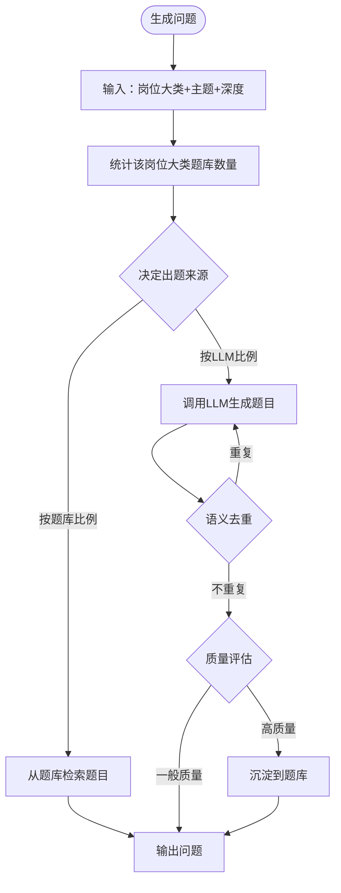

**决策规则**：

| 步骤 | 说明 |
|------|------|
| **题库计数** | 按 `job_category + topic_id` 统计 `is_active=true` 的题目数 |
| **比例计算** | 根据上表决定本次从题库出还是 LLM 出 |
| **去重** | LLM 生成题目与题库做语义相似度比对（阈值 0.92），重复则重新生成 |
| **质量评估** | LLM 自评 + 规则校验，高质量题目沉淀入库 |
| **索引更新** | 新题入库后异步更新向量库和主题索引 |

### 6.3 评估者 Agent（EvaluatorAgent）

```java
// 职责：评估回答、记录关键事件、生成报告
public class EvaluatorAgent {
    // 1. 评估单次回答（通用）
    public EvaluationResult evaluate(InterviewContext context, String question, String answer);

    // 2. 评估自我介绍
    public EvaluationResult evaluateSelfIntro(InterviewContext context, String answer);

    // 3. 评估简历探讨
    public EvaluationResult evaluateResume(InterviewContext context, String question,
                                           String answer, String projectName);

    // 4. 评估行为面试
    public EvaluationResult evaluateBehavioral(InterviewContext context, String question,
                                               String answer);

    // 5. 评估单个主题
    public ThemeEvaluation evaluateTheme(InterviewContext context, Topic topic,
                                        List<InterviewMessage> messages);

    // 6. 生成评估报告
    public InterviewReport generateReport(InterviewContext context,
                                         List<ThemeEvaluation> themeEvaluations);

    // 7. 判断提前结束
    public boolean shouldEarlyEnd(InterviewContext context);

    // 8. 生成主题摘要（用于上下文压缩）
    public String summarizeTopic(InterviewContext context, Topic topic,
                                 List<InterviewMessage> messages);
}
```

### 6.4 工具层补充

#### 6.4.1 QuestionBankTool（题库工具）

```java
/**
 * 题库工具：按岗位大类动态维护题库规模，支持 LLM 生成题目沉淀与去重。
 */
@Component
public class QuestionBankTool {
    /**
     * 检索问题
     * @param topicId 主题ID
     * @param jobCategory 岗位大类
     * @param depth 深度等级
     * @param level 题目级别：1基础 / 2模板 / 3动态 / null表示任意
     * @return 匹配的题目列表
     */
    public List<QuestionBank> search(String topicId, String jobCategory,
                                     Integer depth, Integer level);

    /**
     * 统计岗位大类 + 主题下的有效题目数
     */
    public long countByJobCategoryAndTopic(String jobCategory, String topicId);

    /**
     * 根据题库规模决定本次出题来源（题库 or LLM）
     * @return 题库出题比例（0.0 - 1.0）
     */
    public double decideBankRatio(String jobCategory, String topicId);

    /**
     * 填充模板题目
     */
    public String fillTemplate(QuestionBank template,
                               Map<String, Object> placeholders);

    /**
     * 语义去重检查
     * @param questionText 待检查题目文本
     * @param similarityThreshold 相似度阈值（默认 0.92）
     * @return true 表示存在重复
     */
    public boolean isDuplicate(String jobCategory, String topicId,
                               String questionText, double similarityThreshold);

    /**
     * 沉淀 LLM 生成的题目
     * @param questionText 题目原文
     * @param qualityScore 质量评分（0-1）
     */
    public QuestionBank storeGeneratedQuestion(String jobCategory, String topicId,
                                               Integer depth, String questionText,
                                               double qualityScore);

    /**
     * 记录使用次数
     */
    public void recordUsage(Long questionId);
}
```

#### 6.4.2 EvaluationFallbackTool（评估降级工具）

```java
/**
 * 当 LLM 评估失败或超时时，使用规则评估兜底。
 */
@Component
public class EvaluationFallbackTool {
    public EvaluationResult ruleEvaluate(InterviewMessage question,
                                         InterviewMessage answer,
                                         QuestionBank questionMeta);
}
```

**规则评估维度**：
- 回答长度是否在合理范围
- 是否包含预设关键词
- 是否包含"不知道"/"不了解"等消极表达

---

## 7. 安全设计

### 7.1 数据隔离

| 设计 | 说明 |
|------|------|
| **用户隔离** | 只能操作自己的面试 |
| **会话校验** | 每次请求校验 interviewId + userId |

### 7.2 内容安全

| 设计 | 说明 |
|------|------|
| **回答内容限制** | 限制回答长度，防止恶意输入 |
| **流式中断** | 支持客户端中断 SSE 连接 |

### 7.3 审计日志

| 记录场景 | 记录内容 |
|---------|---------|
| 面试创建 | interviewId, userId, resumeId, positionId, selectedPhases, time |
| 环节切换 | interviewId, fromPhase, toPhase, reason, time |
| 回答提交 | interviewId, questionId, phase, answerLength, time |
| 主题切换 | interviewId, fromTopic, toTopic, reason, time |
| 面试结束 | interviewId, reason, duration, questionCount, completedPhases, time |

---

## 8. 错误码设计

### 8.1 面试模块错误码（6xxx）

| 错误码 | 消息 | 说明 |
|--------|------|------|
| 6001 | 简历不存在或未确认 | 简历状态不对 |
| 6002 | 岗位不存在或未审核 | 岗位状态不对 |
| 6003 | 简历已锁定在其他面试 | 冲突检查 |
| 6006 | 未选择任何环节 | selectedPhases 为空 |

### 8.2 业务错误码（61xx）

| 错误码 | 消息 | 说明 |
|--------|------|------|
| 6101 | 面试不存在 | 面试ID不存在 |
| 6102 | 面试已结束 | 状态已结束 |
| 6103 | 面试已中断 | 用户主动中断 |
| 6104 | 无权访问面试 | 面试不属于当前用户 |
| 6105 | 回答内容无效 | 回答为空或过长 |
| 6107 | 环节不存在 | selectedPhases 包含无效值 |
| 6108 | LLM 调用失败 | 已降级为题库模式 |

---

## 9. LLM Prompt 设计

### 9.1 自我介绍 Prompt

#### System Prompt（系统角色）

```
你是一个专业的面试官，正在进行一场模拟面试。
你负责引导候选人完成自我介绍环节。
```

#### User Prompt（用户输入内容）

```
**面试上下文：**
- 岗位：{position_name}
- 岗位等级：{position_level}
- 用户画像：{user_profile_summary}

**要求：**
生成一道自我介绍引导问题，让候选人介绍自己的背景、工作经历和优势技能。
问题要自然、友好，帮助候选人放松。

**输出格式：**
{
  "question": "自我介绍引导问题"
}
```

---

### 9.2 专业面试评估 Prompt

#### System Prompt（系统角色）

```
你是一个专业的面试评估官，负责评估候选人的回答质量。
你需要从技术深度、技术广度、实践经验、表达能力、学习能力等维度进行评估。
```

#### User Prompt（用户输入内容）

```
**面试上下文：**
- 岗位：{position_name}
- 岗位等级：{position_level}
- 当前主题：{topic_name}
- 问题深度：L{depth}
- 问题：{question}

**候选人回答：**
{answer}

**评估要求：**
1. 判断回答质量：优秀/良好/一般/较差/很差
2. 评估各维度得分（0-100）
3. 给出下一问题的建议深度
4. 判断是否需要记录为关键事件
5. 如果是关键事件，说明原因

**输出格式：**
{
  "assessment": {
    "overall": "优秀/良好/一般/较差/很差",
    "technicalDepth": 85,
    "technicalBreadth": 80,
    "practicalExperience": 75,
    "expression": 80,
    "learningAbility": 78,
    "suggestedNextDepth": 4,
    "keyEvent": "EXCELLENT/STRUGGLED/IMPORTANT/null",
    "keyEventReason": "..."
  }
}
```

---

### 9.3 简历探讨 Prompt

#### System Prompt（系统角色）

```
你是一个专业的面试官，正在进行简历探讨环节。
你需要基于候选人的简历内容，询问项目细节、技术选型、问题解决等方面的问题。
```

#### User Prompt（用户输入内容）

```
**面试上下文：**
- 岗位：{position_name}
- 用户简历项目列表：{projects}

**要求：**
从简历项目中选择一个项目，生成一个深入探讨的问题。
问题应涉及：项目中的技术挑战、角色贡献、成果量化等。

**输出格式：**
{
  "projectName": "项目名称",
  "question": "简历探讨问题"
}
```

---

### 9.4 行为面试 Prompt

#### System Prompt（系统角色）

```
你是一个专业的面试官，正在进行行为面试环节。
你需要使用 STAR 法则（情境、任务、行动、结果）提问，考察候选人的软技能和职业素养。
```

#### User Prompt（用户输入内容）

```
**面试上下文：**
- 岗位：{position_name}
- 已问过的场景：{asked_scenarios}

**可选场景类型：**
- 团队协作：与团队成员分歧、跨团队合作
- 问题解决：紧急任务、技术难题攻克
- 成长学习：新技术学习、错误反思
- 领导力：项目主导、团队管理
- 沟通表达：向上汇报、跨部门沟通

**要求：**
选择一个未问过的场景类型，生成一个 STAR 风格的行为面试问题。

**输出格式：**
{
  "scenarioType": "场景类型",
  "question": "STAR 问题"
}
```

---

### 9.5 追问生成 Prompt

#### System Prompt（系统角色）

```
你是一个资深的面试官，擅长通过递进式提问探测候选人的真实技术水平。
问题要逐步深入，从基础概念到原理机制，再到实践应用。
```

#### User Prompt（用户输入内容）

```
**面试上下文：**
- 岗位：{position_name}
- 当前主题：{topic_name}
- 当前深度：L{current_depth}
- 目标深度：L{target_depth}
- 追问方向：{follow_up_direction}

**上一轮问答：**
- 问题：{previous_question}
- 候选人回答：{previous_answer}

**生成要求：**
1. 基于候选人回答进行追问
2. 探测更深层的理解和实践能力
3. 如果回答优秀，可以跳跃深度
4. 如果回答困难，退回浅层或换角度

**输出格式：**
{
  "question": "追问的问题内容",
  "depth": L{next_depth},
  "direction": "追问的具体方向"
}
```

---

### 9.6 主题切换 Prompt

#### System Prompt（系统角色）

```
你是一个专业的面试官，在面试过程中需要自然地切换技术主题。
```

#### User Prompt（用户输入内容）

```
**面试上下文：**
- 即将切换到的主题：{next_topic_name}
- 该主题的考察重点：{probing_directions}
- 面试进度：已完成 {completed_topics} 个主题

**生成要求：**
1. 自然过渡，不要生硬切换
2. 简单回顾上主题，引出新主题
3. 从新主题的基础概念开始

**输出格式：**
{
  "transition": "过渡语内容，自然引出新主题"
}
```

---

### 9.7 报告生成 Prompt

#### System Prompt（系统角色）

```
你是一个专业的面试评估报告生成助手，负责汇总面试评估结果并生成结构化的报告。
```

#### User Prompt（用户输入内容）

```
**面试基本信息：**
- 岗位：{position_name}
- 面试时长：{duration}分钟
- 总问题数：{question_count}个
- 完成环节：{completed_phases}

**各环节评估结果：**
{phase_evaluations_json}

**各主题评估结果：**
{theme_evaluations_json}

**关键事件记录：**
{key_events_json}

**评估要求：**
1. 汇总各维度得分，计算加权总分
2. 列出候选人的优势技能
3. 列出需要加强的薄弱点
4. 给出面试总结评价

**输出格式：**
{
  "overallScore": 78,
  "grade": "良好",
  "phaseSummary": {
    "SELF_INTRO": {"completed": true, "questionCount": 1},
    "PROFESSIONAL": {"completed": true, "questionCount": 8},
    "RESUME_DISCUSSION": {"completed": true, "questionCount": 3},
    "BEHAVIORAL": {"completed": false, "questionCount": 1}
  },
  "dimensionScores": {
    "technicalDepth": 80,
    "technicalBreadth": 75,
    "practicalExperience": 82,
    "expression": 75,
    "learningAbility": 78
  },
  "strengths": ["优势1", "优势2"],
  "weaknesses": ["薄弱点1", "薄弱点2"],
  "conclusion": "面试总结评价..."
}
```

---

## 10. 面试状态流转

### 10.1 环节流转

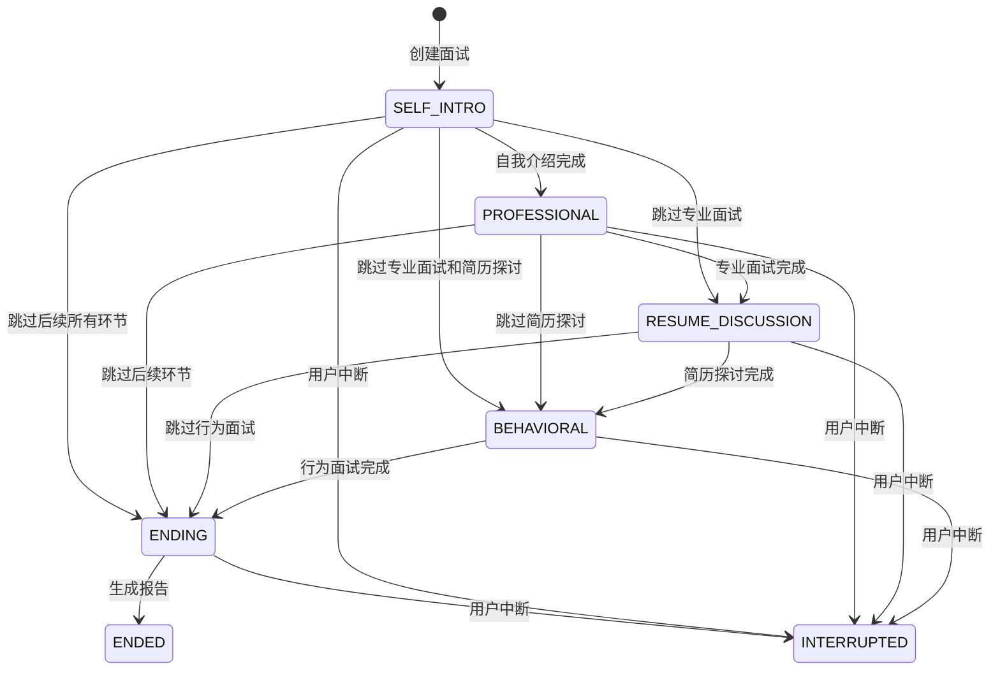

### 10.2 环节完成条件

| 环节 | 完成条件 |
|------|---------|
| **自我介绍** | 回答 1-2 题后自动进入下一环节 |
| **专业面试** | 所有主题考察完毕或达到时间/问题上限 |
| **简历探讨** | 所有项目讨论完毕或达到问题上限 |
| **行为面试** | 回答 3-5 题后自动进入下一环节 |
| **结束** | 输出结束语，面试完成 |

---

## 11. 深度递进模型（专业面试阶段）

> 专业面试的深度模型根据岗位大类适配，以下以技术族为例。其他岗位大类使用各自的专业深度模型。

### 11.1 深度等级定义（技术族）

| 等级 | 名称 | 提问模式 | 考察目的 |
|------|------|---------|---------|
| L1 | 基础概念 | 你对 [技术主题] 有哪些了解？ | 探测广度 |
| L2 | 选型决策 | 碰到这样的问题，你会采用什么技术/方案？ | 探测经验 |
| L3 | 原理机制 | 这项技术的原理是什么？怎么解决的？ | 探测深度 |
| L4 | 实践踩坑 | 使用过程中有没有碰到问题？怎么解决的？ | 探测实践 |
| L5 | 深度扩展 | 在这种情况下，遇到 [异常/边界] 怎么处理？ | 探测精通 |

### 11.2 深度跳跃规则

| 场景 | 行为 | 示例 |
|------|------|------|
| L1 连续优秀 × 2 | 跳跃到 L3 | L1优秀 → L3 |
| L2 连续优秀 × 2 | 跳跃到 L4 | L2优秀 → L4 |
| L3 连续优秀 × 2 | 跳跃到 L5 | L3优秀 → L5 |
| 任意深度连续失败 × 2 | 降低1级或换主题 | L3失败 → L2 |

---

## 12. 多岗位类型支持

### 12.1 环节与岗位大类适配

| 环节 | 技术族 | 产品族 | 设计族 | 运营族 | 营销族 |
|------|--------|--------|--------|--------|--------|
| **自我介绍** | ✓ | ✓ | ✓ | ✓ | ✓ |
| **专业面试** | ✓ | ✓ | ✓ | ✓ | ✓ |
| **简历探讨** | ✓ | ✓ | ✓ | ✓ | ✓ |
| **行为面试** | ✓ | ✓ | ✓ | ✓ | ✓ |
| **结束** | ✓ | ✓ | ✓ | ✓ | ✓ |

> **说明**：专业面试环节适用于所有岗位大类，根据岗位类型适配不同的考察内容（如技术族的源码理解、产品族的业务逻辑、营销族的客户拓展能力）。

### 12.2 各岗位大类专业面试内容

| 岗位大类 | 探讨重点 |
|---------|---------|
| **技术族** | 项目技术实现、代码架构、问题排查 |
| **产品族** | 需求分析、产品设计、项目推进 |
| **设计族** | 设计方案、用户研究、设计迭代 |
| **运营族** | 运营策略、数据分析、效果提升 |
| **营销族** | 营销案例、客户拓展、资源整合 |

---

*文档版本：v0.5*
*创建时间：2026-07-20*
*更新说明：新增成本控制（题库/RAG、评估降频、上下文压缩）、Agent 信号隔离、超时与断线恢复设计*
