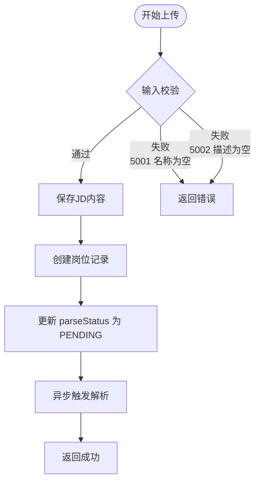
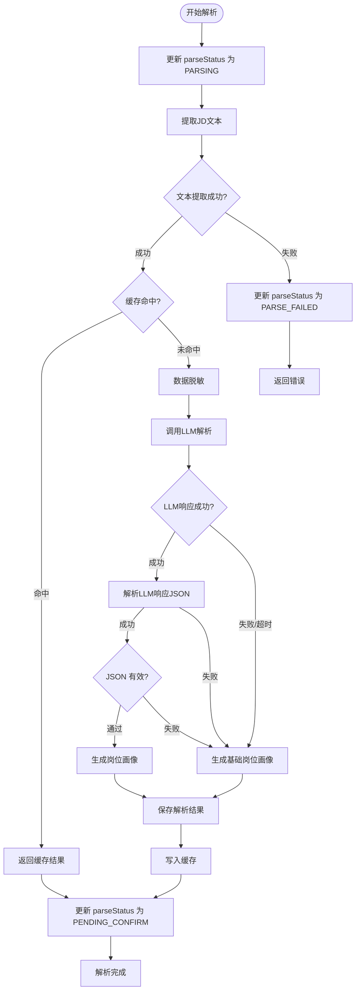
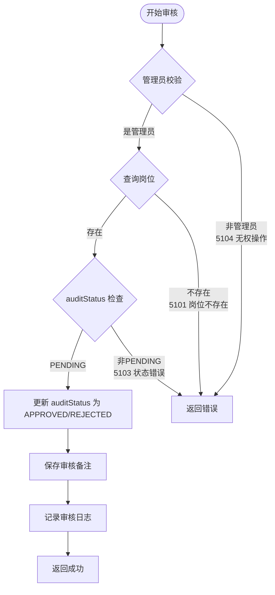
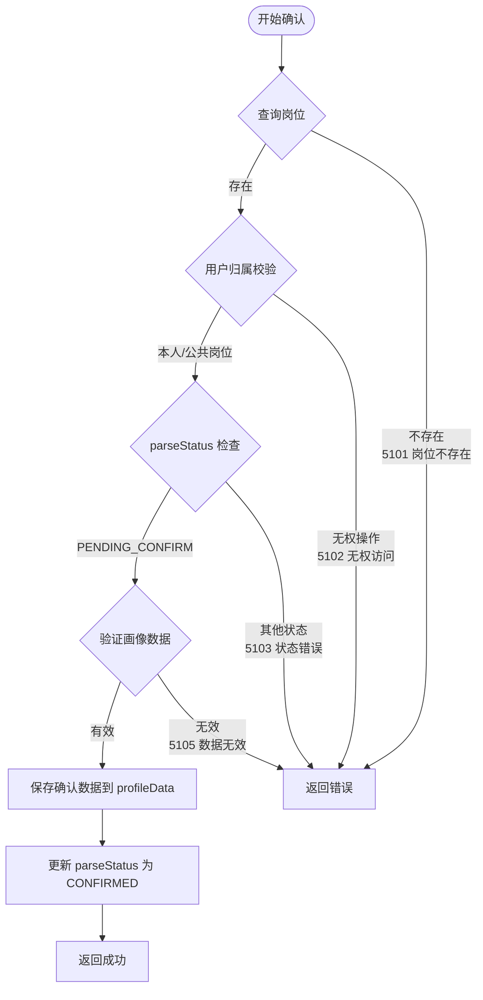
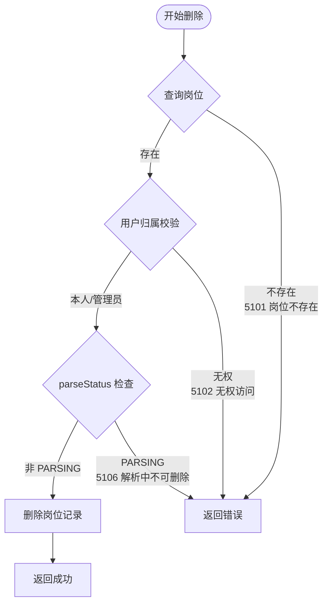
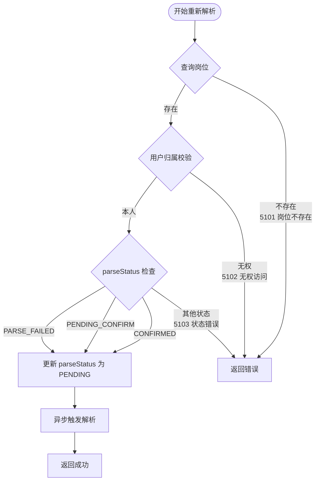
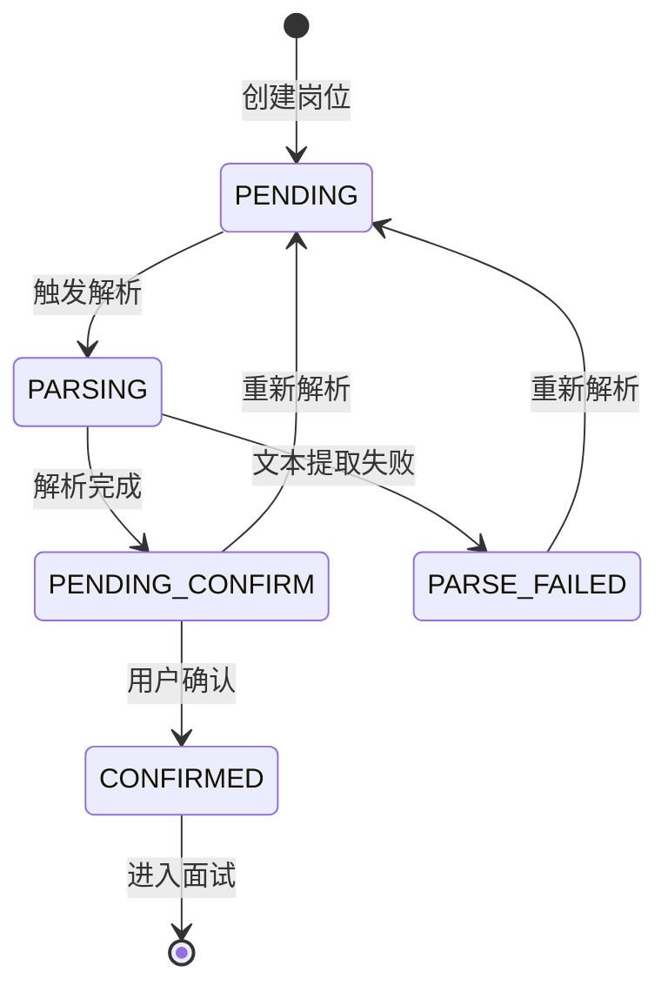
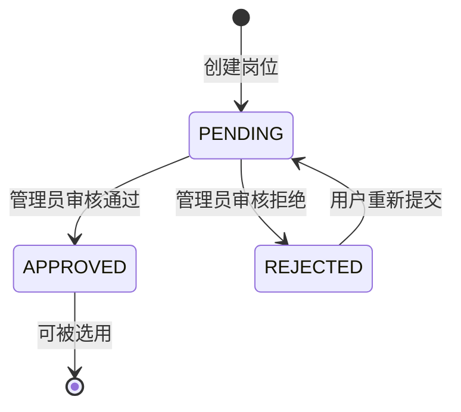

# 岗位模块详细设计

> 本文档记录岗位模块的详细设计，包括功能定义、数据结构、接口设计、业务流程等。

---

## 1. 模块概述

### 1.1 模块职责

| 职责 | 说明 |
|------|------|
| **JD 上传** | 支持粘贴文本或上传文件形式提交 JD |
| **JD 解析** | LLM 智能解析，提取岗位要求 |
| **岗位画像生成** | 基于 JD 生成岗位考察重点 |
| **JD 审核** | 管理员审核用户上传的 JD |
| **公共岗位库** | 管理可复用的岗位模板 |

### 1.2 模块位置

```
┌─────────────────────────────────────────────────────────────┐
│                  岗位模块 (position-module)                     │
├─────────────────────────────────────────────────────────────┤
│  Controller: PositionController, JDController              │
│  Service: PositionService, JDService, AuditService       │
│  Agent: JDAgent                                          │
│  Tools: JDParserTool, ProfileGenTool                    │
│  Repository: PositionRepository, AuditLogRepository       │
└─────────────────────────────────────────────────────────────┘
```

### 1.3 模块依赖

| 依赖模块 | 说明 |
|---------|------|
| 用户模块 | 管理员身份校验、数据隔离 |
| 基础设施模块 | 审计 Tool、持久化 Tool |
| AI 服务层 | LLM 调用（Spring AI Alibaba） |

---

## 2. 数据模型

### 2.1 实体设计

#### Position（岗位）

| 字段 | 类型 | 约束 | 说明 |
|------|------|------|------|
| id | Long | PK, AUTO | 岗位ID |
| userId | Long | FK, INDEX | 上传用户ID（null=公共岗位） |
| positionName | String | NOT NULL | 岗位名称 |
| companyName | String | | 公司名称（可脱敏） |
| location | String | | 工作地点 |
| salaryRange | String | | 薪资范围 |
| jobCategory | String | NOT NULL | 岗位大类：TECH/PRODUCT/DESIGN等 |
| level | String | | 岗位等级：JUNIOR/MID/SENIOR/EXPERT |
| jdContent | Text | | JD 原文内容 |
| parseStatus | Enum | NOT NULL | 解析状态 |
| auditStatus | Enum | NOT NULL | 审核状态 |
| auditRemark | String | | 审核备注 |
| auditorId | Long | FK | 审核人ID |
| auditedAt | DateTime | | 审核时间 |
| isPublic | Boolean | DEFAULT false | 是否公共岗位 |
| createdAt | DateTime | NOT NULL | 创建时间 |
| updatedAt | DateTime | NOT NULL | 更新时间 |

#### PositionProfile（岗位画像）

| 字段 | 类型 | 约束 | 说明 |
|------|------|------|------|
| id | Long | PK, AUTO | 画像ID |
| positionId | Long | FK, UNIQUE, NOT NULL | 岗位ID |
| userId | Long | FK | 用户ID（冗余） |
| profileData | JSON | NOT NULL | 画像数据（JSON） |
| createdAt | DateTime | NOT NULL | 创建时间 |
| updatedAt | DateTime | NOT NULL | 更新时间 |

#### PositionParseStatus（岗位解析状态枚举）

```java
public enum PositionParseStatus {
    PENDING(0),        // 待解析
    PARSING(1),        // 解析中
    PENDING_CONFIRM(2),// 待确认
    CONFIRMED(3),      // 已确认
    PARSE_FAILED(4)    // 解析失败
}
```

#### PositionAuditStatus（岗位审核状态枚举）

```java
public enum PositionAuditStatus {
    PENDING(0),   // 待审核
    APPROVED(1),  // 审核通过
    REJECTED(2)   // 审核拒绝
}
```

> **说明**：画像内容统一存储在 `profileData` JSON 中，避免为每个字段单独建列，与数据库设计保持一致。

### 2.2 画像数据结构

#### PositionProfileData（岗位画像 JSON 结构）

```json
{
  "basicInfo": {
    "title": "Java高级工程师",
    "company": "某互联网公司",
    "location": "某城市",
    "level": "中级",
    "salaryRange": "25k-40k"
  },
  "requiredSkills": [
    { "skill": "Java", "importance": "必须", "depth": "L3-L4" },
    { "skill": "Spring", "importance": "必须", "depth": "L3-L4" },
    { "skill": "MySQL", "importance": "必须", "depth": "L3" }
  ],
  "preferredSkills": [
    { "skill": "Redis", "importance": "加分", "depth": "L2-L3" },
    { "skill": "分布式", "importance": "加分", "depth": "L3" }
  ],
  "probingDirections": [
    {
      "direction": "并发编程",
      "priority": 1,
      "depthRange": "L2-L4",
      "sampleQuestions": ["synchronized原理", "JUC并发包"]
    },
    {
      "direction": "JVM",
      "priority": 2,
      "depthRange": "L3-L4",
      "sampleQuestions": ["垃圾回收", "类加载机制"]
    }
  ],
  "interviewFocus": [
    "技术深度",
    "源码理解",
    "问题解决能力"
  ],
  "confidenceLevel": 0.9
}
```

---

## 3. 功能定义

### 3.1 JD 上传

| 项目 | 说明 |
|------|------|
| **功能描述** | 用户提交 JD（粘贴文本或上传文件） |
| **输入** | JD 文本 / 文件、岗位名称 |
| **输出** | 岗位ID、parseStatus=PENDING、auditStatus=PENDING |
| **流程** | 保存 JD → 创建岗位记录 → 异步触发解析 |

### 3.2 JD 解析

| 项目 | 说明 |
|------|------|
| **功能描述** | LLM 智能解析 JD 内容 |
| **输入** | JD 文本 |
| **输出** | 结构化 JSON（技能要求、考察重点等） |
| **流程** | 提取文本 → 脱敏 → 缓存检查 → LLM解析 → 保存解析结果 → 更新状态 |
| **异步** | 解析为异步操作，通过状态轮询或回调获取结果 |
| **缓存策略** | 相同 JD 文本 MD5 命中缓存时直接返回缓存结果 |
| **降级策略** | LLM 超时/失败时返回基础岗位画像，允许用户手动补充 |

### 3.2.1 缓存设计

| 项目 | 说明 |
|------|------|
| **缓存介质** | Redis |
| **缓存键** | `position:parse:{md5(jdText)}` |
| **缓存值** | 解析后的 `PositionProfileData` JSON |
| **过期时间** | 7 天 |
| **MD5 生成规则** | 对脱敏后的 JD 纯文本计算 MD5，忽略前后空白 |
| **缓存刷新** | 用户触发重新解析时，先删除旧缓存再重新计算 |

### 3.2.2 降级设计

| 场景 | 降级行为 |
|------|---------|
| **LLM 调用超时** | 生成基础岗位画像，状态变为 `PENDING_CONFIRM`，前端提示手动补充 |
| **LLM 返回非 JSON** | 同上 |
| **JSON Schema 校验失败** | 同上 |
| **文本提取失败** | 状态变为 `PARSE_FAILED`，允许用户重新上传或手动填写 |

**基础岗位画像内容**：
- `basicInfo` 仅包含岗位名称
- `requiredSkills` 为空列表
- `preferredSkills` 为空列表
- `probingDirections` 基于岗位大类默认方向
- `interviewFocus` 基于岗位大类默认值
- `confidenceLevel` 为 0
- 前端提示"解析失败，请手动补充岗位要求"

### 3.3 岗位画像生成

| 项目 | 说明 |
|------|------|
| **功能描述** | 基于 JD 解析结果生成完整岗位画像 |
| **输入** | 解析后的 JD JSON |
| **输出** | PositionProfileData 结构 |

### 3.4 JD 审核

| 项目 | 说明 |
|------|------|
| **功能描述** | 管理员审核用户上传的 JD |
| **输入** | 岗位ID、审核结果（通过/拒绝）、备注 |
| **输出** | 审核成功 |
| **权限** | 仅系统管理员可操作 |

### 3.5 公共岗位库

| 功能 | 说明 |
|------|------|
| 创建公共岗位 | 管理员创建公共岗位模板 |
| 查询公共岗位 | 用户浏览公共岗位库 |
| 申请使用 | 用户申请使用公共岗位到自己面试 |
| 管理公共岗位 | 管理员增删改公共岗位 |

### 3.6 首次体验优化

| 优化项 | 说明 |
|--------|------|
| 公共岗位模板 | 预置热门岗位模板（Java、前端、产品等），用户可直接选择 |
| 示例 JD | 提供示例 JD，帮助用户理解如何粘贴 |
| 快速开始 | 允许从公共岗位一键开始面试，跳过审核等待 |
| 跳过确认 | 在明确提示下，允许用户跳过岗位确认直接开始面试 |

---

## 4. 接口设计

### 4.1 接口一览

| 方法 | 路径 | 说明 | 认证 |
|------|------|------|------|
| POST | /api/v1/positions | 创建岗位 | 是 |
| POST | /api/v1/positions/upload | 上传 JD 文件 | 是 |
| GET | /api/v1/positions | 获取岗位列表 | 是 |
| GET | /api/v1/positions/{id} | 获取岗位详情 | 是 |
| GET | /api/v1/positions/{id}/profile | 获取岗位画像 | 是 |
| PUT | /api/v1/positions/{id}/confirm | 确认岗位解析结果 | 是 |
| PUT | /api/v1/positions/{id}/reparse | 重新解析 JD | 是 |
| DELETE | /api/v1/positions/{id} | 删除岗位 | 是 |
| PUT | /api/v1/admin/positions/{id}/audit | 审核岗位 | 是（管理员） |
| GET | /api/v1/positions/public | 获取公共岗位列表 | 是 |
| POST | /api/v1/admin/positions | 创建公共岗位 | 是（管理员） |
| PUT | /api/v1/admin/positions/{id} | 更新公共岗位 | 是（管理员） |
| DELETE | /api/v1/admin/positions/{id} | 删除公共岗位 | 是（管理员） |

### 4.2 接口详情

#### POST /api/v1/positions（创建岗位）

**请求**：
```json
{
  "positionName": "Java高级工程师",
  "companyName": "某互联网公司",
  "location": "北京",
  "salaryRange": "25k-40k",
  "jobCategory": "TECH",
  "jdContent": "负责公司核心系统开发，要求熟悉Java、Spring、MySQL..."
}
```

**响应**（200）：
```json
{
  "code": 0,
  "message": "success",
  "data": {
    "positionId": 1,
    "positionName": "Java高级工程师",
    "parseStatus": "PENDING",
    "auditStatus": "PENDING"
  }
}
```

**错误码**：
| code | message | 说明 |
|------|---------|------|
| 5001 | 岗位名称不能为空 | 校验失败 |
| 5002 | JD描述不能为空 | 校验失败 |

---

#### POST /api/v1/positions/upload（上传 JD 文件）

**请求**：multipart/form-data
| 字段 | 类型 | 必填 | 说明 |
|------|------|------|------|
| file | File | 是 | JD 文件 |
| positionName | String | 是 | 岗位名称 |

**响应**（200）：
```json
{
  "code": 0,
  "message": "success",
  "data": {
    "positionId": 1,
    "positionName": "Java高级工程师",
    "parseStatus": "PENDING",
    "auditStatus": "PENDING"
  }
}
```

---

#### GET /api/v1/positions（获取岗位列表）

**请求参数**：
| 参数 | 类型 | 必填 | 说明 |
|------|------|------|------|
| page | int | 否 | 页码（默认0） |
| size | int | 否 | 每页条数（默认10） |
| parseStatus | String | 否 | 按解析状态筛选 |
| auditStatus | String | 否 | 按审核状态筛选 |

**响应**（200）：
```json
{
  "code": 0,
  "message": "success",
  "data": {
    "content": [
      {
        "positionId": 1,
        "positionName": "Java高级工程师",
        "companyName": "某互联网公司",
        "parseStatus": "CONFIRMED",
        "auditStatus": "APPROVED",
        "createdAt": "2024-01-15T10:30:00",
        "updatedAt": "2024-01-15T10:31:00"
      }
    ],
    "totalElements": 10,
    "totalPages": 1,
    "currentPage": 0
  }
}
```

---

#### GET /api/v1/positions/{id}（获取岗位详情）

**响应**（200）：
```json
{
  "code": 0,
  "message": "success",
  "data": {
    "positionId": 1,
    "positionName": "Java高级工程师",
    "companyName": "某互联网公司",
    "location": "北京",
    "salaryRange": "25k-40k",
    "jobCategory": "TECH",
    "jdContent": "负责公司核心系统开发...",
    "parseStatus": "CONFIRMED",
    "auditStatus": "APPROVED",
    "createdAt": "2024-01-15T10:30:00",
    "updatedAt": "2024-01-15T10:31:00",
    "auditedAt": "2024-01-15T11:00:00"
  }
}
```

**错误码**：
| code | message | 说明 |
|------|---------|------|
| 5101 | 岗位不存在 | 岗位ID不存在 |
| 5102 | 无权访问 | 该岗位不属于当前用户 |

---

#### GET /api/v1/positions/{id}/profile（获取岗位画像）

**响应**（200）：
```json
{
  "code": 0,
  "message": "success",
  "data": {
    "profileId": 1,
    "positionId": 1,
    "profile": {
      "basicInfo": {
        "title": "Java高级工程师",
        "level": "中级",
        "salaryRange": "25k-40k",
        "location": "北京"
      },
      "requiredSkills": [
        { "skill": "Java", "importance": "必须", "depth": "L3-L4" }
      ],
      "preferredSkills": [...],
      "probingDirections": [...],
      "interviewFocus": ["技术深度", "源码理解", "问题解决能力"]
    },
    "parseStatus": "CONFIRMED"
  }
}
```

---

#### PUT /api/v1/positions/{id}/confirm（确认岗位解析结果）

**请求**：
```json
{
  "profile": {
    "requiredSkills": [...],
    "preferredSkills": [...],
    "probingDirections": [...],
    "level": "中级"
  }
}
```

**响应**（200）：
```json
{
  "code": 0,
  "message": "success",
  "data": null
}
```

**错误码**：
| code | message | 说明 |
|------|---------|------|
| 5101 | 岗位不存在 | 岗位ID不存在 |
| 5103 | 岗位状态错误 | 只有PENDING_CONFIRM状态可确认 |
| 5105 | 画像数据无效 | JSON格式错误或必填字段缺失 |

---

#### PUT /api/v1/positions/{id}/reparse（重新解析 JD）

**响应**（200）：
```json
{
  "code": 0,
  "message": "success",
  "data": {
    "positionId": 1,
    "parseStatus": "PENDING"
  }
}
```

**错误码**：
| code | message | 说明 |
|------|---------|------|
| 5101 | 岗位不存在 | 岗位ID不存在 |
| 5102 | 无权访问 | 该岗位不属于当前用户 |
| 5103 | 岗位状态错误 | 当前状态不支持重新解析 |

---

#### PUT /api/v1/admin/positions/{id}/audit（审核岗位）

**请求**：
```json
{
  "status": "APPROVED",
  "remark": "岗位信息完整，通过"
}
```

**响应**（200）：
```json
{
  "code": 0,
  "message": "success",
  "data": null
}
```

**错误码**：
| code | message | 说明 |
|------|---------|------|
| 5103 | 只有待审核状态可审核 | 状态错误 |
| 5104 | 无权操作 | 非管理员无权审核 |

---

#### GET /api/v1/positions/public（获取公共岗位列表）

**响应**（200）：
```json
{
  "code": 0,
  "message": "success",
  "data": {
    "content": [
      {
        "positionId": 100,
        "positionName": "Java工程师（标准模板）",
        "companyName": "公共岗位",
        "level": "中级",
        "probeCount": 5
      }
    ],
    "totalElements": 20
  }
}
```

---

## 5. 业务流程

### 5.1 JD 上传流程



**分支条件详情**：

| 步骤 | 条件 | 结果 | 错误码 |
|------|------|------|--------|
| **输入校验** | positionName 为空 | 返回错误 | 5001 |
| | jdContent 为空 | 返回错误 | 5002 |

---

### 5.2 JD 解析流程（异步）



**分支条件详情**：

| 步骤 | 条件 | 结果 | 错误码 |
|------|------|------|--------|
| **文本提取** | 提取失败 | 标记 PARSE_FAILED | - |
| **缓存检查** | MD5 命中缓存 | 直接返回缓存结果 | - |
| **LLM调用** | 调用失败/超时 | 生成基础画像，状态变为 PENDING_CONFIRM | - |
| **JSON解析** | LLM返回非JSON格式 | 生成基础画像，状态变为 PENDING_CONFIRM | - |
| **解析成功** | 所有步骤成功 | 状态变为 PENDING_CONFIRM | - |

**基础岗位画像内容**：
- `basicInfo` 仅包含岗位名称
- `requiredSkills` 为空列表
- `preferredSkills` 为空列表
- `probingDirections` 基于岗位大类默认方向
- `interviewFocus` 基于岗位大类默认值
- `confidenceLevel` 为 0
- 前端提示"解析失败，请手动补充岗位要求"

---

### 5.3 JD 审核流程



**分支条件详情**：

| 步骤 | 条件 | 结果 | 错误码 |
|------|------|------|--------|
| **管理员校验** | 非管理员 | 返回错误 | 5104 |
| **查询岗位** | 不存在 | 返回错误 | 5101 |
| **审核状态检查** | auditStatus != PENDING | 返回错误 | 5103 |

---

### 5.4 确认岗位解析结果流程



**分支条件详情**：

| 步骤 | 条件 | 结果 | 错误码 |
|------|------|------|--------|
| **查询岗位** | 不存在 | 返回错误 | 5101 |
| **用户归属校验** | 非本人/非公共岗位 | 返回错误 | 5102 |
| **状态检查** | parseStatus != PENDING_CONFIRM | 返回错误 | 5103 |
| **数据验证** | JSON格式错误或必填字段缺失 | 返回错误 | 5105 |

---

### 5.5 删除岗位流程



**分支条件详情**：

| 步骤 | 条件 | 结果 | 错误码 |
|------|------|------|--------|
| **查询岗位** | 不存在 | 返回错误 | 5101 |
| **用户归属校验** | 非本人/非管理员 | 返回错误 | 5102 |
| **解析状态检查** | parseStatus = PARSING | 返回错误 | 5106 |

---

### 5.6 重新解析 JD 流程



**分支条件详情**：

| 步骤 | 条件 | 结果 | 错误码 |
|------|------|------|--------|
| **查询岗位** | 不存在 | 返回错误 | 5101 |
| **用户归属校验** | 非本人 | 返回错误 | 5102 |
| **解析状态检查** | parseStatus 不在 [PARSE_FAILED, PENDING_CONFIRM, CONFIRMED] | 返回错误 | 5103 |

---

## 6. 安全设计

### 6.1 数据隔离

| 设计 | 说明 |
|------|------|
| **用户岗位隔离** | 用户只能操作自己的岗位 |
| **公共岗位** | isPublic=true 的岗位所有用户可查看 |
| **管理员权限** | 审核、管理公共岗位需要管理员权限 |

### 6.2 脱敏处理

| 设计 | 说明 |
|------|------|
| **公司名脱敏** | 公司名 → "某互联网公司" / "某创业公司" |
| **保留分析价值** | 脱敏后保留公司规模、行业等标签 |

### 6.3 审核安全

| 设计 | 说明 |
|------|------|
| **权限校验** | 只有 ADMIN 角色可审核 |
| **审核日志** | 记录审核人、审核时间、审核结果 |
| **审核备注** | 拒绝时必须填写原因 |

---

## 7. 错误码设计

### 7.1 岗位模块错误码（5xxx）

| 错误码 | 消息 | 说明 |
|--------|------|------|
| 5001 | 岗位名称不能为空 | 校验失败 |
| 5002 | JD描述不能为空 | 校验失败 |
| 5003 | JD解析失败 | 解析过程出错 |
| 5004 | 岗位解析中 | 岗位正在解析，无法操作 |

### 7.2 业务错误码（51xx）

| 错误码 | 消息 | 说明 |
|--------|------|------|
| 5101 | 岗位不存在 | 岗位ID不存在 |
| 5102 | 无权访问 | 该岗位不属于当前用户 |
| 5103 | 岗位状态错误 | 当前状态不支持该操作 |
| 5104 | 无权操作 | 非管理员无权执行此操作 |
| 5105 | 画像数据无效 | JSON格式错误或必填字段缺失 |
| 5106 | 解析中不可删除 | 解析中的岗位不可删除 |

---

## 8. 配置设计

### 8.1 配置文件

```yaml
position:
  # JD解析配置（实际模型由用户配置，默认使用 L2 标准模型）
  parsing:
    timeout-seconds: 60
    retry-times: 3
    tier: l2

  # 缓存配置
  cache:
    enabled: true
    ttl-days: 7
    key-prefix: "position:parse"

  # 脱敏配置
  desensitization:
    enabled: true
    company-labels:
      - "知名互联网公司"
      - "中型企业"
      - "创业公司"
      - "某公司"

  # 审核配置
  audit:
    require-remark-on-reject: true  # 拒绝时必须填写备注
```

---

## 9. LLM Prompt 设计

### 9.1 JD 解析 Prompt

#### System Prompt（系统角色）

```
你是一个专业的JD解析助手，负责从岗位描述中提取关键信息并生成结构化的JSON数据。
```

#### User Prompt（用户输入内容）

```
请从以下JD文本中提取关键信息，生成结构化的JSON数据。

**提取要求：**
1. 只提取JD中明确提到的信息，不要推测
2. 对不确定的信息，标注 confidence: low
3. 技能重要性分为：必须、加分
4. 根据岗位描述判断岗位等级：初级/中级/高级/专家
5. 公司名称已脱敏为"某互联网公司/某创业公司"等

**输出格式：**
{
  "basicInfo": {
    "title": "岗位名称",
    "level": "初级/中级/高级/专家",
    "salaryRange": "薪资范围（如有）",
    "location": "工作地点（如有）"
  },
  "requiredSkills": [
    { "skill": "技能名称", "importance": "必须", "depth": "L1-L5" }
  ],
  "preferredSkills": [
    { "skill": "技能名称", "importance": "加分", "depth": "L1-L5" }
  ],
  "probingDirections": [
    {
      "direction": "考察方向名称",
      "priority": 1,
      "depthRange": "L1-L5",
      "sampleQuestions": ["样例问题1", "样例问题2"]
    }
  ],
  "interviewFocus": ["面试重点1", "面试重点2"],
  "confidenceLevel": 0.0-1.0
}

**JD文本：**
{jd_text}
```

---

### 9.2 岗位画像生成 Prompt

#### System Prompt（系统角色）

```
你是一个专业的面试官，根据岗位要求生成面试考察重点和策略。
```

#### User Prompt（用户输入内容）

```
根据以下岗位要求，生成详细的面试考察重点。

**输入岗位信息：**
{position_profile_data}

**生成要求：**
1. 确定每个考察方向的优先级
2. 为每个方向指定考察深度范围（L1-L5）
3. 生成针对该岗位的样例问题
4. 确定面试时间分配建议

**输出格式：**
{
  "interviewStrategy": {
    "totalDuration": "面试总时长",
    "topicOrder": ["主题1", "主题2", "主题3"],
    "timeAllocation": {
      "主题1": "建议时长",
      "主题2": "建议时长"
    }
  },
  "keyTopics": [
    {
      "topic": "并发编程",
      "priority": 1,
      "depthTarget": "L3",
      "mustExplore": ["必须深入的问题1"],
      "optionalExplore": ["可选深入的问题1"]
    }
  ]
}
```

---

## 10. 岗位状态流转

### 10.1 解析状态流转



### 10.2 审核状态流转



---

*文档版本：v0.1*
*创建时间：2026-07-20*
