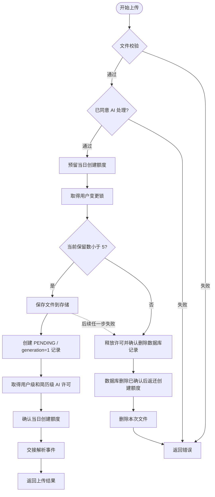
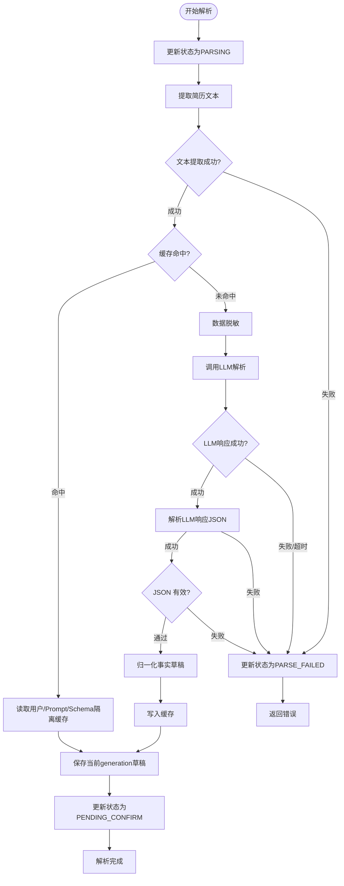
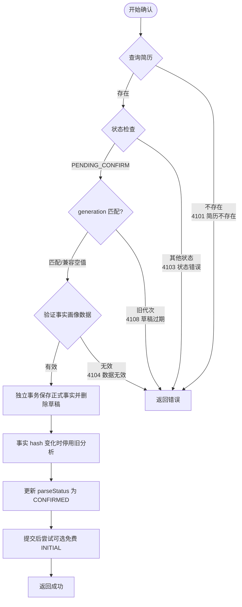
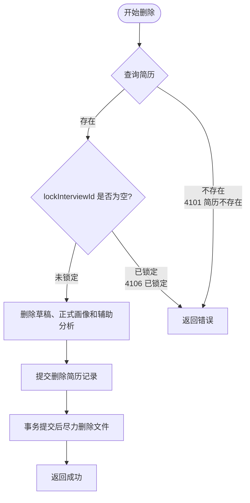
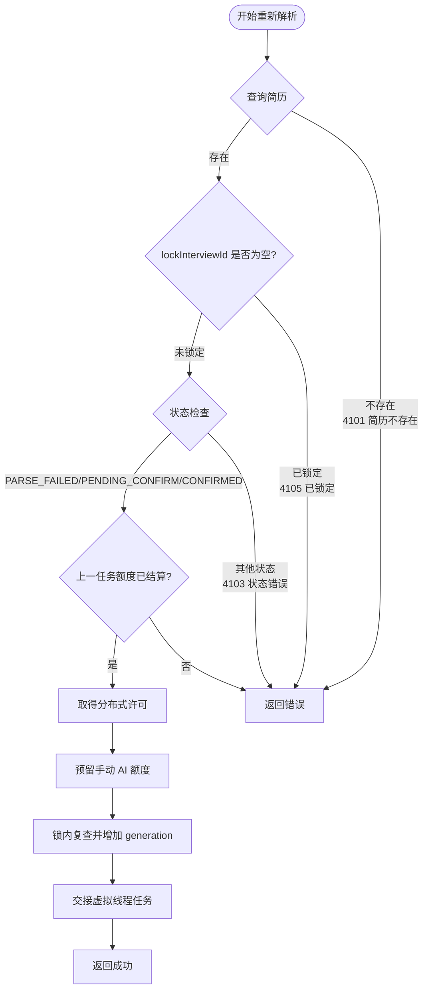
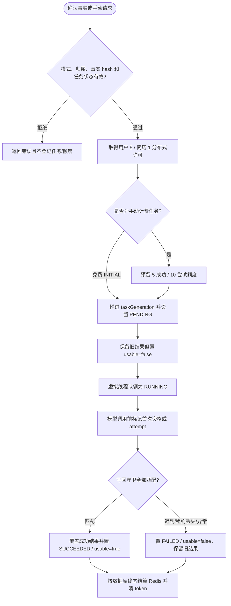
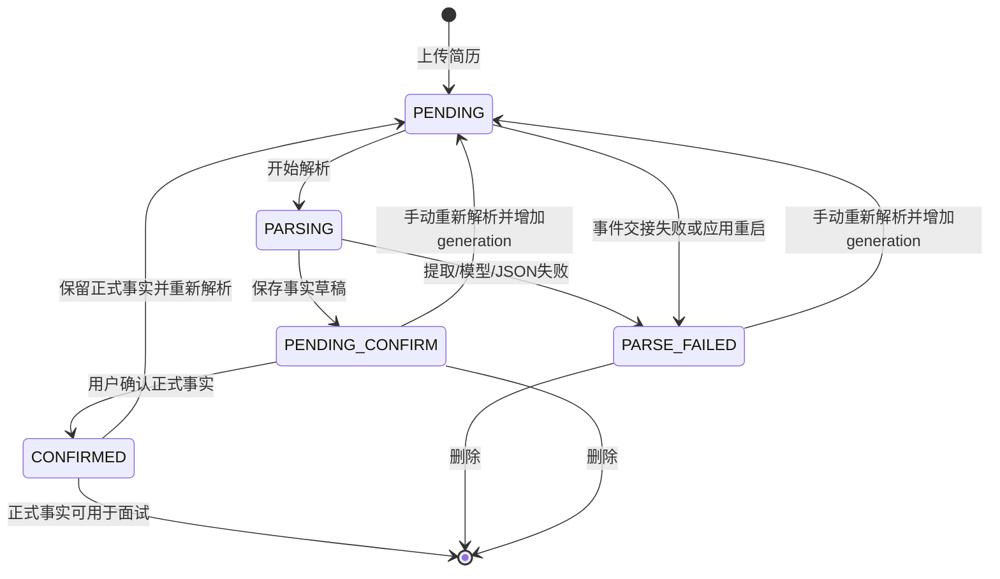
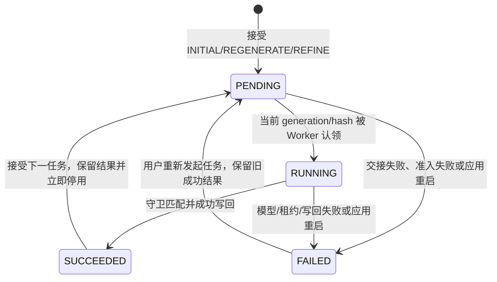

# 简历模块详细设计

> 本文档记录简历模块的详细设计，包括功能定义、数据结构、接口设计、业务流程等。

> **当前 MVP 实现基线（2026-07）**：LLM 首次处理只生成“事实草稿”，用户确认后才写入正式事实画像；优势、待验证能力点和推断技能水平保存在独立 AI 分析记录中。AI 分析只用于模拟面试选题，不传给评估器，也不直接参与评分。
>
> 每份简历最多一条辅助分析记录。该单行同时保留最近一次成功结果和当前任务控制字段，但两者不混用：接受新任务后旧结果仍可展示，立即停止参与新面试；新任务失败不会恢复其可用性。`feedback` 只存在于当前请求和内存调用链，不持久化、不写 Redis、不写日志。
>
> 当前开发部署仍为单应用实例；任务准入使用 Redisson 可过期分布式许可，Worker 使用 Java 21 虚拟线程，不设置业务等待队列。应用重启只将遗留内存任务标记失败并恢复可确认的 Redis 额度结算，不自动重放模型调用。简历域结构由 `V1__init_schema.sql`、`V2__resume_profile_draft_analysis.sql`、`V3__resume_ai_task_control.sql` 建立；完整 MySQL 基线还包括岗位域的 `V4__position_analysis_lifecycle.sql`，所有脚本均由维护者按版本顺序手工执行。

---

## 1. 模块概述

### 1.1 模块职责

| 职责 | 说明 |
|------|------|
| **简历上传** | 支持 PDF/TXT 格式简历上传 |
| **简历解析** | LLM 智能解析，提取关键信息 |
| **事实草稿生成** | LLM 只提取简历中可核对的背景、技能和经历 |
| **用户确认** | 用户修正草稿，确认后写入正式事实画像 |
| **辅助分析** | 基于正式事实生成优势、待验证点和推断技能水平 |
| **简历管理** | 查看、删除当前保留的简历 |

### 1.2 模块位置

```
┌─────────────────────────────────────────────────────────────┐
│                  简历模块 (resume-module)                      │
├─────────────────────────────────────────────────────────────┤
│  接口：ResumeController                                      │
│  编排：ResumeService / ResumeUploadService /                 │
│        ResumeAiTaskSubmissionService                         │
│  状态：ResumeParseStateService /                             │
│        ResumeProfileAnalysisStateService                     │
│  Worker：ResumeParseWorker / ResumeProfileAnalysisWorker     │
│  Agent：ResumeAnalysisAgent / ResumeProfileAnalysisAgent     │
│  存储：Resume*Repository / FileStorageService / Redis        │
└─────────────────────────────────────────────────────────────┘
```

### 1.3 模块依赖

| 依赖模块 | 说明 |
|---------|------|
| 用户模块 | 获取当前用户身份、数据隔离 |
| 面试模块 | 创建面试时读取正式事实及当前可用辅助分析快照 |
| Redis / Redisson | 分布式许可、用户变更锁、手动任务额度和每日创建额度 |
| AI 服务层 | `LlmService` 抽象及 Spring AI / Mock 实现 |

---

## 2. 数据模型

### 2.1 实体设计

#### Resume（简历）

| 字段 | 类型 | 约束 | 说明 |
|------|------|------|------|
| id | Long | PK, AUTO | 简历ID |
| userId | Long | FK, NOT NULL, INDEX | 用户ID |
| resumeName | String | NOT NULL | 简历名称 |
| filePath | String | | 文件存储路径 |
| fileType | String | | PDF / TXT |
| fileSize | Long | | 文件大小（字节） |
| parseStatus | Enum | NOT NULL | 解析状态 |
| jobCategory | String | | 岗位大类：TECH/PRODUCT/DESIGN等 |
| lockInterviewId | Long | | 锁定的面试ID（防止重复使用） |
| parseGeneration | Long | NOT NULL | 解析代次，防止旧任务覆盖新草稿 |
| parseStartedAt | DateTime | | 当前解析开始时间 |
| parseErrorCode | String | | 最近解析错误码 |
| parseErrorMessage | String | | 可向用户展示的最近解析错误 |
| parseQuotaDate | LocalDate | | 手动事实解析额度所属上海自然日；首次上传解析为空 |
| parseQuotaToken | String | | 手动事实解析的幂等结算 token；结算成功后清除 |
| createdAt | DateTime | NOT NULL | 上传时间 |
| updatedAt | DateTime | NOT NULL | 更新时间 |

#### ResumeProfile（简历画像）

| 字段 | 类型 | 约束 | 说明 |
|------|------|------|------|
| id | Long | PK, AUTO | 画像ID |
| resumeId | Long | FK, UNIQUE, NOT NULL | 简历ID |
| userId | Long | FK, NOT NULL | 用户ID |
| profileData | JSON | NOT NULL | 画像数据（JSON） |
| experienceLevel | String | | 经验水平：JUNIOR/MID/SENIOR |
| profileHash | String | 新确认必填 | 正式事实 JSON 的 SHA-256，用于分析结果一致性校验 |
| schemaVersion | Integer | NOT NULL | 事实画像 Schema 版本 |
| confirmedAt | DateTime | 新确认必填 | 用户确认时间 |
| createdAt | DateTime | NOT NULL | 创建时间 |
| updatedAt | DateTime | NOT NULL | 更新时间 |

#### ResumeProfileDraft（事实画像草稿）

每份简历最多保存一份当前草稿，包含 `resumeId`、`userId`、`profileData`、`parseGeneration`、`schemaVersion` 和派生的 `experienceLevel`。模型成功但没有提取到事实时，草稿内容可以为空结构并由用户补充；模型调用、文本提取或 JSON 解析失败时不会创建伪成功草稿。查询和修改只接受与 `resume.parseGeneration` 一致的草稿，确认时执行最小事实校验。

#### ResumeProfileAnalysis（AI 辅助分析）

每份简历最多保存一份当前分析，状态为 `PENDING/RUNNING/SUCCEEDED/FAILED`。单行字段分为两组：

| 分组 | 字段 | 语义 |
|------|------|------|
| 保留的成功结果 | `analysisData`、`sourceProfileHash`、`schemaVersion`、`promptVersion`、`modelName`、`generatedAt` | 最近一次成功分析及其生成元数据；`sourceProfileHash` 只表示该成功结果依据的正式事实 hash，没有成功结果时允许为空 |
| 当前任务 | `status`、`taskProfileHash`、`taskGeneration`、`taskMode`、`errorCode`、`errorMessage` | 最新任务的状态与严格写回守卫；`status` 不等价于保留结果是否存在 |
| 首次资格 | `initialModelCallStarted` | 默认 `false`；仅在免费 `INITIAL` 真正进入模型调用前幂等变为 `true`，失败和启动恢复都不得改回 `false` |
| 面试开关 | `usableForInterview` | 接受任何新分析任务或任务失败时为 `false`；只有当前任务成功写回时恢复为 `true` |
| 额度恢复 | `taskQuotaDate`、`taskQuotaToken` | 手动分析任务的非敏感结算凭据；Redis 明确转换成功后才清除 |

准备新任务时只推进任务字段并将 `usableForInterview=false`，不清空旧 `analysisData`、结果 hash 或结果生成元数据。成功写回必须同时匹配 `userId`、`taskGeneration`、`taskProfileHash` 和当前正式事实 hash；迟到结果直接丢弃。事实 hash 变化时旧结果继续保留供页面展示，但不能进入新面试或 `REFINE`。

#### ResumeProfileAnalysisMode（分析模式）

| 模式 | 可见性 | 行为 |
|------|--------|------|
| `INITIAL` | 内部 | 每份简历首次真正调用辅助分析模型的免费模式；不由 API 客户端直接传入 |
| `REGENERATE` | 公开 | 完全重新生成，不携带旧分析或 `feedback`；首次资格尚未使用时，后端内部映射为 `INITIAL` |
| `REFINE` | 公开 | 基于同一正式事实 hash 的可解析保留结果调整；必须提供不超过 1000 字符的 `feedback` |

#### ResumeParseStatus（简历解析状态枚举）

```java
public enum ResumeParseStatus {
    PENDING(0),        // 待解析
    PARSING(1),        // 解析中
    PENDING_CONFIRM(2),// 待确认
    CONFIRMED(3),      // 已确认
    PARSE_FAILED(4)    // 解析失败
}
```

> **说明**：画像内容统一存储在 `profileData` JSON 中，避免为每个字段单独建列，与数据库设计保持一致。

### 2.2 画像数据结构

#### UserProfileData（用户画像 JSON 结构）

```json
{
  "basicInfo": {
    "workingYears": "5年",
    "currentPosition": "高级Java工程师",
    "education": "本科 - 某某大学"
  },
  "skillTags": ["Java", "Spring", "MySQL", "Redis", "分布式", "微服务"],
  "skillLevel": {"Java": "熟练"},
  "projectExperience": [
    {
      "name": "某电商项目",
      "role": "后端开发",
      "techStack": ["Java", "Spring Cloud", "MySQL", "Redis"],
      "description": "负责订单系统和支付模块开发"
    }
  ],
  "workExperience": [
    {
      "company": "知名互联网公司",
      "position": "高级Java工程师",
      "duration": "2020.03 - 至今",
      "highlights": ["负责微服务架构设计", "主导性能优化"]
    }
  ]
}
```

正式事实画像不保存姓名、年龄、性别、优势、薄弱点或模型置信度。`skillLevel` 只有简历原文明示水平时才保存。AI 推断内容使用独立结构：`strengths`、`verificationPoints`、`skillAssessments`，每项可附 `evidenceRefs` 和 `confidence`。

---

## 3. 功能定义

### 3.1 简历上传

| 项目 | 说明 |
|------|------|
| **功能描述** | 用户上传简历文件 |
| **输入** | 文件（PDF/TXT）、用户ID |
| **校验规则** | 文件大小≤10MB、格式为PDF或TXT |
| **输出** | 简历ID、状态（待解析） |
| **数量限制** | 每用户最多保留 5 份未删除简历；按上海自然日每天最多新建 5 份，删除不返还当日次数 |
| **流程** | 创建额度预留 → 用户变更锁内复查保留数 → 保存文件 → 数据库建档 → 取得 AI 许可 → 确认创建额度 → 交接异步事件 |
| **失败补偿** | 释放许可 → 确认数据库记录已删除/不存在 → 返还本次创建额度 → 删除文件；数据库结果未知时不返还额度 |

### 3.2 简历解析

| 项目 | 说明 |
|------|------|
| **功能描述** | LLM 智能解析简历内容 |
| **输入** | 简历文本（脱敏后） |
| **输出** | 只包含可核对事实的结构化 JSON 草稿 |
| **流程** | 提取文本 → 脱敏 → 可选缓存检查 → LLM事实提取 → 保存草稿 → 用户确认 |
| **异步** | 解析为异步操作，通过 `parse-status` 或画像接口轮询；当前没有外部回调 |
| **缓存策略** | 默认关闭；启用后按用户、Prompt、Schema 和正文 SHA-256 隔离 |
| **失败策略** | 文本提取、LLM 或 JSON 失败时标记 `PARSE_FAILED`，保留已有正式画像 |

### 3.2.1 缓存设计

| 项目 | 说明 |
|------|------|
| **缓存介质** | Redis |
| **缓存键** | `resume:parse:u{userId}:p{promptVersion}:s{schemaVersion}:{sha256(resumeText)}` |
| **缓存值** | 解析后的 `UserProfileData` JSON |
| **过期时间** | 7 天 |
| **默认开关** | `resume.parse-cache.enabled=false` |
| **故障降级** | 读取、反序列化、删除或写入失败都不阻断解析；坏值回源模型 |
| **缓存刷新** | 用户触发重新解析时绕过读取，并用本次结果覆盖同一版本 Key |

### 3.2.2 降级设计

| 场景 | 降级行为 |
|------|---------|
| **LLM 调用超时** | 状态变为 `PARSE_FAILED`，记录稳定错误信息，允许手动重试 |
| **LLM 返回非 JSON** | 同上 |
| **文本提取失败** | 状态变为 `PARSE_FAILED`，允许手动重试 |
| **事件交接/执行器拒绝或应用重启** | 标记失败，不自动重放模型调用 |

模型成功返回但事实为空时允许形成空草稿，用户可以补充后确认；模型调用或 JSON 解析本身失败时不伪装成成功草稿。

### 3.3 画像生成

| 项目 | 说明 |
|------|------|
| **功能描述** | 基于解析结果生成用户画像 |
| **输入** | 解析后的简历JSON |
| **输出** | 待确认 `UserProfileData` 事实草稿 |
| **流程** | 确定性归一化 → 保存当前 generation 草稿 → 等待用户确认 |

### 3.4 用户确认

| 项目 | 说明 |
|------|------|
| **功能描述** | 用户确认/修正解析结果 |
| **输入** | 修正后的画像JSON |
| **输出** | 确认成功 |
| **流程** | 校验当前 generation → 最小事实校验 → 独立提交正式画像 → 删除草稿 → 尝试可选免费 `INITIAL` |
| **可选分析失败** | 无许可、Redis 故障或调度失败只跳过 `INITIAL`，不得回滚已经确认的正式事实 |
| **事实变化** | hash 变化立即停用旧分析；hash 不变也不会重复已经真正开始过的免费分析 |

### 3.5 简历锁定

| 项目 | 说明 |
|------|------|
| **功能描述** | 创建面试时锁定简历，防止同时用于另一场活动面试 |
| **输入** | 简历ID |
| **输出** | 锁定成功 |
| **前置条件** | 当前用户拥有简历且正式事实画像存在；重新解析期间仍可使用已保留的正式画像 |
| **流程** | 清理失效的旧面试锁 → 创建面试并保存事实/可用分析快照 → 写入 `lockInterviewId`；面试结束后释放 |

### 3.6 简历管理

| 功能 | 说明 |
|------|------|
| 查询简历列表 | 获取用户所有简历（分页） |
| 查询简历详情 | 获取简历详情和解析结果 |
| 删除简历 | 删除简历（未锁定的） |
| 重新解析 | 创建新 generation 并重新提取草稿，原正式画像继续可用于面试 |

### 3.7 并发、额度与执行模型

| 项目 | 当前实现 |
|------|----------|
| 用户级并发 | Redisson `RPermitExpirableSemaphore`，每用户最多 5 个简历 AI 任务 |
| 简历级并发 | 每份简历最多 1 个事实解析或辅助分析任务；无等待，冲突立即拒绝 |
| 许可租期 | 默认 5 分钟，每 1 分钟续期；任一许可续期失败即使整个租约失效并中断 Worker |
| Worker | Java 21 逐任务虚拟线程；单个平台调度线程只负责续期，不承载业务排队 |
| 手动 AI 额度 | 上海自然日内最多 5 次成功、10 次真正开始的模型调用；首次上传解析和首次 `INITIAL` 不占该额度 |
| 计数边界 | 先预留；在 `LlmService.chat` 前原子转为 attempt，数据库确认成功后转为 success |
| 故障策略 | Redis/Redisson 对上传、手动任务和数量限制是必需依赖，异常时失败关闭；正式事实提交后的可选 `INITIAL` 可被跳过 |

### 3.8 恢复与结算

- 任务执行使用进程内事件交接和虚拟线程，不保存可重放的任务正文；当前不存在持久任务队列。
- 数据库保存任务代次、hash 和 quota token，Redis 使用 Lua token 状态机完成幂等 `RESERVED → STARTED → SUCCEEDED/FAILED` 转换。
- Worker 和提交补偿必须先确认数据库终态，再转换 Redis；数据库结果未知时保持 fail-closed，保留 token，不推断成功或失败。
- Redis 明确转换成功后才按 `userId + generation/hash + date + token` 清理数据库恢复元数据。
- 应用启动扫描遗留 `PENDING/RUNNING`，标记失败但不重放模型；旧自然日已经关闭且数据库终态明确时可直接清理旧 token。

---

## 4. 接口设计

### 4.1 接口一览

| 方法 | 路径 | 说明 | 认证 |
|------|------|------|------|
| POST | /api/v1/resumes/upload | 上传简历 | 是 |
| GET | /api/v1/resumes | 获取简历列表 | 是 |
| GET | /api/v1/resumes/{id} | 获取简历详情 | 是 |
| GET | /api/v1/resumes/{id}/profile | 获取用户画像 | 是 |
| GET | /api/v1/resumes/{id}/parse-status | 查询异步解析状态，前端每 5 秒轮询 | 是 |
| PUT | /api/v1/resumes/{id}/profile/draft | 保存当前 generation 的用户编辑草稿 | 是 |
| PUT | /api/v1/resumes/{id}/confirm | 确认简历解析结果 | 是 |
| PUT | /api/v1/resumes/{id}/reparse | 重新解析简历 | 是 |
| POST | /api/v1/resumes/{id}/analysis/retry | 手动重试当前正式画像的辅助分析 | 是 |
| DELETE | /api/v1/resumes/{id} | 删除简历 | 是 |

### 4.2 接口详情

#### POST /api/v1/resumes/upload（上传简历）

**请求**：multipart/form-data
| 字段 | 类型 | 必填 | 说明 |
|------|------|------|------|
| file | File | 是 | 简历文件 |
| fileType | String | 是 | PDF / TXT |

**响应**（200）：
```json
{
  "code": 0,
  "message": "success",
  "data": {
    "resumeId": 1,
    "fileName": "resume.pdf",
    "status": "PENDING",
    "parseProgress": 0
  }
}
```

**错误码**：
| code | message | 说明 |
|------|---------|------|
| 4001 | 文件大小超限 | 文件超过10MB |
| 4002 | 文件格式不支持 | 仅支持PDF和TXT |
| 4003 | 文件读取失败 | 文件损坏或无法读取 |

---

#### GET /api/v1/resumes（获取简历列表）

**请求参数**：
| 参数 | 类型 | 必填 | 说明 |
|------|------|------|------|
| page | int | 否 | 页码（默认0） |
| size | int | 否 | 每页条数（默认10） |

**响应**（200）：
```json
{
  "code": 0,
  "message": "success",
  "data": {
    "content": [
      {
        "resumeId": 1,
        "fileName": "resume.pdf",
        "status": "CONFIRMED",
        "createdAt": "2024-01-15T10:30:00",
        "updatedAt": "2024-01-15T10:31:00"
      }
    ],
    "totalElements": 5,
    "totalPages": 1,
    "currentPage": 0
  }
}
```

---

#### GET /api/v1/resumes/{id}（获取简历详情）

**响应**（200）：
```json
{
  "code": 0,
  "message": "success",
  "data": {
    "resumeId": 1,
    "fileName": "resume.pdf",
    "fileType": "PDF",
    "fileSize": 1024000,
    "status": "CONFIRMED",
    "parsedData": {
      "basicInfo": { ... },
      "skillTags": ["Java", "Spring", "MySQL"],
      "projectExperience": [ ... ]
    },
    "createdAt": "2024-01-15T10:30:00",
    "confirmedAt": "2024-01-15T10:31:00"
  }
}
```

**错误码**：
| code | message | 说明 |
|------|---------|------|
| 4101 | 简历不存在 | 简历ID不存在 |
| 4102 | 无权访问 | 该简历不属于当前用户 |

---

#### GET /api/v1/resumes/{id}/profile（获取用户画像）

**响应**（200）：
```json
{
  "code": 0,
  "message": "success",
  "data": {
    "profileId": 1,
    "resumeId": 1,
    "parseGeneration": 2,
    "hasConfirmedProfile": true,
    "profile": {
      "basicInfo": {
        "workingYears": "5年",
        "currentPosition": "高级Java工程师"
      },
      "skillTags": ["Java", "Spring", "MySQL", "Redis", "分布式"],
      "skillLevel": {
        "Java": "精通",
        "Spring": "熟练"
      }
    },
    "confirmedProfile": {"skillTags": ["Java", "Spring", "MySQL", "Redis", "分布式"]},
    "draftProfile": null,
    "analysis": {
      "strengths": [{"content": "有服务端项目经验", "evidenceRefs": ["project:0"], "confidence": 0.8}],
      "verificationPoints": [],
      "skillAssessments": []
    },
    "analysisStatus": "SUCCEEDED",
    "analysisErrorMessage": null,
    "analysisUsableForInterview": true,
    "analysisRefineAllowed": true,
    "analysisTaskGeneration": 3,
    "analysisMode": "REGENERATE",
    "status": "CONFIRMED"
  }
}
```

`profile` 是兼容字段：存在当前代次草稿时返回草稿，否则返回正式画像；新调用方应使用 `confirmedProfile`、`draftProfile` 和 `hasConfirmedProfile` 明确区分。

`analysis` 返回单行中保留的最近成功结果，即使最新任务为 `PENDING/RUNNING/FAILED` 也可能非空。调用方必须以 `analysisUsableForInterview` 判断能否进入新面试，以 `analysisRefineAllowed` 判断是否可发起 `REFINE`；不能仅根据 `analysis` 是否为空或 `analysisStatus` 推断。若数据库状态为 `SUCCEEDED` 但保留 JSON 已损坏，接口会忽略正文并对外按 `FAILED` 返回稳定错误信息。

---

#### PUT /api/v1/resumes/{id}/profile/draft（保存事实草稿）

**请求**：
```json
{
  "parseGeneration": 2,
  "profile": {
    "basicInfo": {"workingYears": "5年"},
    "skillTags": ["Java"],
    "skillLevel": {},
    "projectExperience": [],
    "workExperience": []
  }
}
```

只允许修改 `PENDING_CONFIRM` 且与服务端当前 generation 一致的草稿。成功返回 `ApiResponse<Void>`；旧页面提交返回 4108，不得覆盖新解析结果。

---

#### PUT /api/v1/resumes/{id}/confirm（确认简历）

**请求**：
```json
{
  "parseGeneration": 2,
  "profile": {
    "basicInfo": {
      "workingYears": "5年",
      "currentPosition": "高级Java工程师"
    },
    "skillTags": ["Java", "Spring", "MySQL", "Redis"],
    "projectExperience": [ ... ]
  }
}
```

新客户端应始终提交 `parseGeneration`。为兼容旧客户端，确认接口当前允许该字段为空并使用服务端当前代次；草稿修改接口不提供此兼容。

**响应**（200）：
```json
{
  "code": 0,
  "message": "success",
  "data": null
}
```

**错误码**：
| code | message | 说明 |
|------|---------|------|
| 4101 | 简历不存在 | 简历ID不存在 |
| 4103 | 简历状态错误 | 只有PENDING_CONFIRM状态可确认 |
| 4104 | 画像数据无效 | JSON格式错误或必填字段缺失 |

---

#### PUT /api/v1/resumes/{id}/reparse（重新解析）

**响应**（200）：
```json
{
  "code": 0,
  "message": "success",
  "data": {
    "resumeId": 1,
    "status": "PENDING"
  }
}
```

**错误码**：
| code | message | 说明 |
|------|---------|------|
| 4101 | 简历不存在 | 简历ID不存在 |
| 4105 | 简历已锁定 | 锁定的简历不可重新解析 |

---

#### POST /api/v1/resumes/{id}/analysis/retry（重新生成或调整辅助分析）

**完全重新生成请求**：
```json
{
  "mode": "REGENERATE"
}
```

**基于保留结果调整请求**：
```json
{
  "mode": "REFINE",
  "feedback": "希望更关注项目中的工程能力证据"
}
```

- `mode` 只接受公开值 `REGENERATE`、`REFINE`；客户端不得传 `INITIAL`。
- `REFINE` 必须有与当前正式事实 hash 一致且可解析的保留成功结果、同简历无事实解析或分析任务，并提供 1～1000 字符的 `feedback`。
- `REGENERATE` 忽略旧分析和 `feedback`；若首次模型调用资格尚未使用，后端内部按免费 `INITIAL` 执行。
- 成功响应只表示任务已登记和交接，不表示模型已经完成。`feedback` 不进入响应、数据库、Redis 或日志。

---

#### DELETE /api/v1/resumes/{id}（删除简历）

**响应**（200）：
```json
{
  "code": 0,
  "message": "success",
  "data": null
}
```

**错误码**：
| code | message | 说明 |
|------|---------|------|
| 4101 | 简历不存在 | 简历ID不存在 |
| 4106 | 简历已锁定 | `lockInterviewId` 不为空，不可删除 |

---

## 5. 业务流程

### 5.1 简历上传流程



**分支条件详情**：

| 步骤 | 条件 | 结果 | 错误码 |
|------|------|------|--------|
| **文件校验** | 文件大小 > 10MB | 返回错误 | 4001 |
| | 文件类型非PDF/TXT | 返回错误 | 4002 |
| | 文件读取失败 | 返回错误 | 4003 |
| **保留数量** | 当前未删除简历已达 5 份 | 拒绝创建 | 4114 |
| **每日创建** | 上海自然日已创建 5 份 | 拒绝创建；删除不返还当日次数 | 4115 |
| **任务准入** | 用户第 6 个任务或同简历已有任务 | 立即拒绝，不进入虚拟线程 | 4110 / 4111 |
| **基础设施** | Redis、Redisson、锁或事件交接不可用 | 失败关闭并执行本次上传补偿 | 4116 / 4117 |

补偿必须按“释放任务许可 → 确认数据库记录删除或不存在 → 返还本次创建额度 → 删除文件”的顺序执行。数据库删除提交结果未知时保留创建额度，避免残留简历与额度返还同时成立；文件删除仍为尽力补偿，失败时记录不含正文和敏感路径的告警。

---

### 5.2 简历解析流程（异步）



**分支条件详情**：

| 步骤 | 条件 | 结果 | 错误码 |
|------|------|------|--------|
| **文本提取** | 提取失败（文件损坏） | 标记PARSE_FAILED | - |
| **缓存检查** | 当前用户、Prompt、Schema 和 SHA-256 全部命中 | 返回缓存事实 | - |
| **缓存故障** | 读取、反序列化、删除或写入失败 | 降级调用模型或忽略写入失败 | - |
| **LLM调用** | 调用失败/超时 | 标记PARSE_FAILED，保留已有正式画像 | - |
| **JSON解析** | LLM返回非JSON格式 | 标记PARSE_FAILED，保留已有正式画像 | - |
| **解析成功** | 所有步骤成功 | 状态变为PENDING_CONFIRM | - |

合法但未提取到事实的响应可以保存为空草稿，由用户补充；调用失败和坏 JSON 不伪装成成功草稿。

---

### 5.3 用户确认流程



**分支条件详情**：

| 步骤 | 条件 | 结果 | 错误码 |
|------|------|------|--------|
| **查询简历** | 不存在 | 返回错误 | 4101 |
| **状态检查** | 状态 != PENDING_CONFIRM | 返回错误 | 4103 |
| **代次检查** | 非空 generation 与当前代次不一致 | 返回错误 | 4108 |
| **数据验证** | JSON格式错误或必填字段缺失 | 返回错误 | 4104 |

正式事实提交和可选 `INITIAL` 分属不同事务。后者没有许可、Redis 不可用或调度失败时，确认接口仍以正式事实已保存为成功结果；不得反向回滚事实。

---

### 5.4 删除简历流程



**分支条件详情**：

| 步骤 | 条件 | 结果 | 错误码 |
|------|------|------|--------|
| **查询简历** | 不存在 | 返回错误 | 4101 |
| **锁定检查** | `lockInterviewId` 不为空 | 返回错误 | 4106 |

---

### 5.5 重新解析流程



重新解析保留旧正式画像和旧成功辅助分析数据。事实解析任务运行期间，旧正式画像及与其匹配且仍标记可用的辅助分析可以继续用于创建面试，但暂不允许发起 `REFINE`；新草稿确认后，事实 hash 不变则沿用原结果，hash 变化则立即停用不匹配结果。

---

### 5.6 辅助分析替换流程



`REFINE` 的旧分析只在 Worker 输入准备阶段读取；`REGENERATE` 不携带旧结果。任何失败都不恢复旧结果的面试资格，且不得把 `initialModelCallStarted` 改回 `false`。

### 5.7 应用启动恢复

1. 扫描数据库中遗留的事实解析和辅助分析 `PENDING/RUNNING` 记录并标记失败，不发布新事件、不调用 LLM。
2. 根据持久化的 generation/hash/date/token 与数据库终态确定 `SUCCESS_CONFIRMED` 或 `FAILURE_CONFIRMED`。
3. 数据库终态明确后才执行 Redis Lua 结算；未知结果保留 token，避免放大每日硬上限。
4. Redis 明确结算成功后再清理数据库 token；旧上海自然日已关闭时，终态明确即可清理不再参与新日计算的 token。

---

## 6. 安全设计

### 6.1 数据隔离

| 设计 | 说明 |
|------|------|
| **用户隔离** | 所有简历操作需校验 userId，只能操作自己的简历 |
| **查询过滤** | Repository 查询自动加上 userId 条件 |

### 6.2 脱敏处理

| 设计 | 说明 |
|------|------|
| **发送前脱敏** | 简历文本发送给 LLM 前必须经过脱敏 |
| **直接标识脱敏** | 尽力移除姓名、手机号、邮箱、证件、生日、详细地址和社交账号 |
| **允许保留** | 公司、学校和项目名称按当前产品决策保留 |
| **二次脱敏** | 正式事实发送给辅助分析模型前再次执行同一脱敏器 |
| **漏检策略** | 当前为尽力脱敏；发现漏检不阻断任务，但日志不得记录简历正文 |

### 6.3 文件安全

| 设计 | 说明 |
|------|------|
| **文件类型校验** | 当前只校验请求中的 `fileType` 为 PDF/TXT，实际解析时再由 PDFBox/TXT 读取确认；尚未实现 MIME 或文件魔数校验 |
| **文件大小限制** | 最大 10MB |
| **存储隔离** | 本地存储根目录下按 userId 分目录，文件名使用 UUID + 时间戳；接口不直接暴露文件路径 |
| **剩余风险** | 原文件扩展名仍被保留，上传入口缺少文件魔数检查；部署前需结合存储权限和内容扫描继续加固 |

### 6.4 日志边界

| 场景 | 允许记录 | 禁止记录 |
|------|----------|----------|
| 文件保存失败 | userId、文件大小、异常类型 | 简历正文、绝对文件路径、原始文件内容 |
| 解析/分析任务 | resumeId、generation、阶段、终态、异常类型、耗时 | 事实画像 JSON、辅助分析正文、Prompt 输入 |
| 手动 `REFINE` | mode、非敏感任务标识 | `feedback` 原文；请求 DTO 的 `toString` 必须固定脱敏 |
| Redis/Redisson | userId、resumeId、任务类型、状态转换结果 | Redis 密码、token 明文、简历内容 |

当前模块只有运行日志，没有单独持久化简历审计正文。

---

## 7. 错误码设计

### 7.1 简历模块错误码（4xxx）

| 错误码 | 消息 | 说明 |
|--------|------|------|
| 4001 | 文件大小超限 | 文件超过10MB |
| 4002 | 文件格式不支持 | 仅支持PDF和TXT |
| 4003 | 文件读取失败 | 文件损坏或无法读取 |
| 4004 | 简历解析中 | 简历正在解析，无法重复操作 |
| 4005 | 解析内容为空 | 解析后内容为空 |

### 7.2 业务错误码（41xx）

| 错误码 | 消息 | 说明 |
|--------|------|------|
| 4101 | 简历不存在 | 简历ID不存在 |
| 4102 | 无权访问 | 该简历不属于当前用户 |
| 4103 | 简历状态错误 | 当前状态不支持该操作 |
| 4104 | 画像数据无效 | JSON格式错误或必填字段缺失 |
| 4105 | 简历已锁定 | 锁定的简历不可操作 |
| 4106 | 简历已锁定 | 锁定的简历不可删除 |
| 4107 | 草稿不存在 | 当前简历没有可确认的事实草稿 |
| 4108 | 草稿已过期 | 请求 generation 不是当前解析代次 |
| 4109 | 分析状态已变化 | 预检后任务模式或资格发生变化，刷新后重试 |
| 4110 | 用户 AI 并发已满 | 当前用户已经占用 5 个 AI 任务许可 |
| 4111 | 简历 AI 任务冲突 | 当前简历已有事实解析或辅助分析任务 |
| 4112 | 每日成功额度已满 | 上海自然日内手动 AI 任务成功数达到 5 |
| 4113 | 每日尝试额度已满 | 上海自然日内手动模型调用尝试数达到 10 |
| 4114 | 保留简历已满 | 当前用户已有 5 份未删除简历 |
| 4115 | 每日新建已满 | 上海自然日内已新建 5 份简历；删除不返还次数 |
| 4116 | 任务基础设施不可用 | Redis、Redisson、额度、许可或任务交接不可用 |
| 4117 | 简历变更进行中 | 同一用户已有上传或删除操作持有变更锁 |
| 4118 | 分析请求无效 | mode 不合法、公开传入 INITIAL，或 REFINE feedback 缺失/超长 |
| 4119 | 不允许调整分析 | 没有可解析且与当前事实 hash 匹配的保留成功结果 |

---

## 8. 配置设计

### 8.1 配置文件

```yaml
resume:
  upload:
    max-size: 10485760
    storage-path: ${RESUME_STORAGE_PATH:./uploads/resumes}

  ai-task:
    user-permits: 5
    resume-permits: 1
    acquire-wait: 0s
    lease: 5m
    renew-interval: 1m
    success-limit: 5
    attempt-limit: 10
    retained-resumes: 5
    daily-creates: 5
    zone: Asia/Shanghai
    key-prefix: interview-coach:resume-ai:v1

  parse-cache:
    enabled: false
    ttl: 7d

  llm:
    enabled: ${RESUME_LLM_ENABLED:false} # false 或未配置时使用 Mock
    timeout-seconds: 60
    retry-times: 1
    temperature: 0.3
    max-tokens: 4096
    top-p: 0.9
    # vendors 与 tiers 只引用环境变量或非敏感厂商标识，不在文档写真实凭据
```

Redisson core 手工读取 Spring Data Redis 的同源连接参数，不替换 Lettuce 或 `StringRedisTemplate`。`lease` 必须大于 `renew-interval`，`acquire-wait` 不得为负数；配置校验失败时应用拒绝启动。

---

## 9. LLM Prompt 设计

### 9.1 简历解析 Prompt

#### System Prompt（系统角色）

```
你是简历事实提取助手。只提取原文明确出现的内容，不推断优势、薄弱点、年龄、性别或姓名。
```

#### User Prompt（用户输入内容）

```
请将下面简历中的可核对事实转换为 JSON。

**提取要求：**
1. 不输出姓名、年龄、性别、联系方式、证件、生日和详细地址
2. 公司、学校和项目名称可以保留
3. 技能水平只有原文明示“精通、熟练、熟悉、了解”时才填写
4. 不输出优势、薄弱点或总体置信度
5. 只输出合法 JSON

**输出格式：**
{
  "basicInfo": {
    "workingYears": "工作年限",
    "currentPosition": "当前职位",
    "education": "学历信息"
  },
  "skillTags": ["技能标签列表"],
  "skillLevel": {
    "Java": "精通/熟练/熟悉/了解",
    ...
  },
  "projectExperience": [
    {
      "name": "项目名称",
      "role": "在项目中的角色",
      "techStack": ["使用的技术栈"],
      "description": "项目描述和职责"
    }
  ],
  "workExperience": [
    {
      "company": "公司名称",
      "position": "职位",
      "duration": "工作时间",
      "highlights": ["工作亮点1", "工作亮点2"]
    }
  ]
}

**简历文本：**
{resume_text}
```

---

## 10. 简历状态流转

### 10.1 事实解析状态



`parseStatus` 只描述当前事实解析流程，不代表正式画像是否存在。重新解析进入 `PENDING/PARSING/PARSE_FAILED` 时，调用方应结合 `hasConfirmedProfile` 判断是否仍有可用于面试的正式事实。

### 10.2 辅助分析任务状态



- `status` 是最新任务状态；`analysisData/sourceProfileHash/generatedAt` 是保留成功结果，两者可能对应不同一次执行。
- `usableForInterview` 在新任务登记时立即为 `false`，仅成功写回恢复；失败不会自动回到旧成功结果。
- 页面可以展示 inactive 的保留结果，但新面试必须同时满足结果可解析、结果 hash 等于当前正式事实、`status=SUCCEEDED` 和 `usableForInterview=true`。
- `REFINE` 还要求同一简历没有事实解析或辅助分析任务在执行；该判断不代表用户级许可和每日额度已经预留。

---

*文档版本：v0.5*
*创建时间：2026-07-20*
*更新说明：同步 V3 单行结果/任务分离、分析模式、Redisson 准入、Redis 额度、虚拟线程、启动恢复和上传补偿实现*
