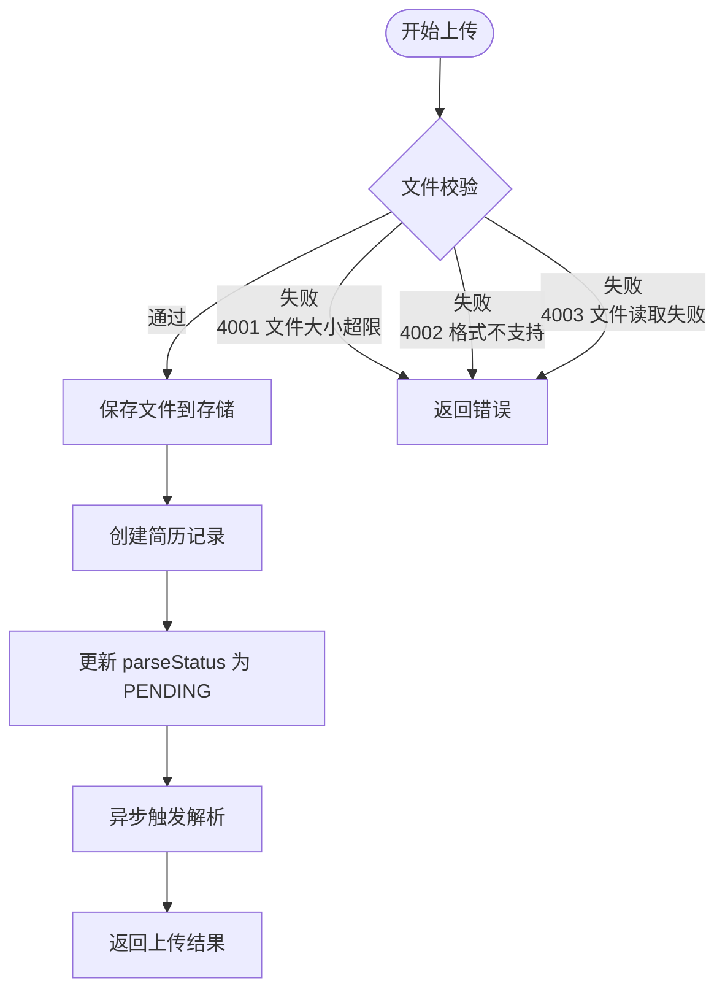
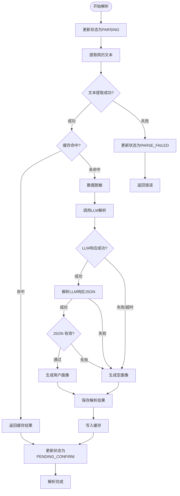
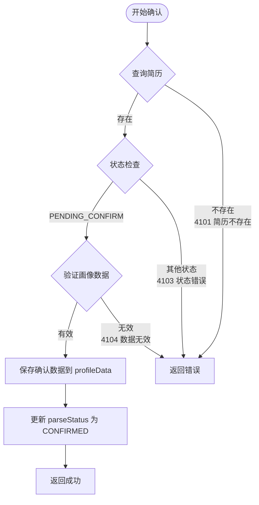
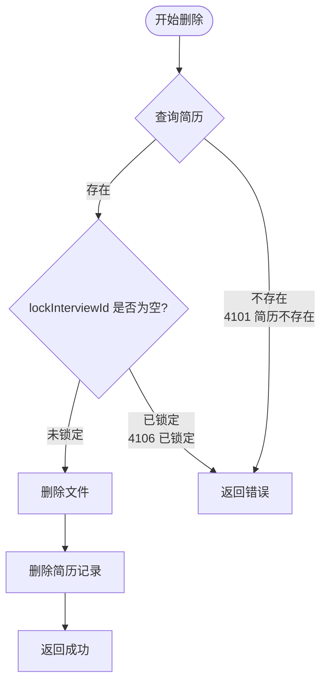
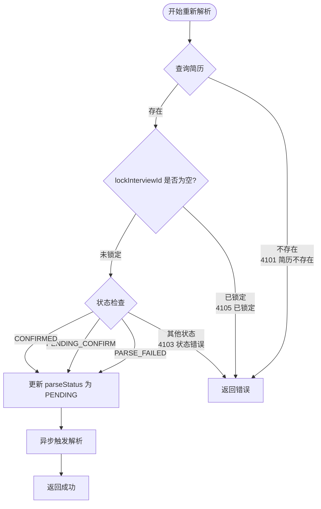
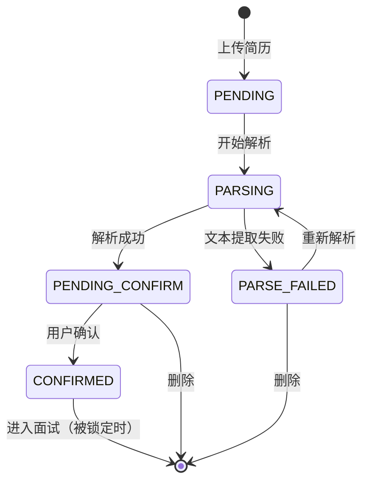

# 简历模块详细设计

> 本文档记录简历模块的详细设计，包括功能定义、数据结构、接口设计、业务流程等。

---

## 1. 模块概述

### 1.1 模块职责

| 职责 | 说明 |
|------|------|
| **简历上传** | 支持 PDF/TXT 格式简历上传 |
| **简历解析** | LLM 智能解析，提取关键信息 |
| **人物画像生成** | 基于简历生成候选人画像 |
| **用户确认** | 用户确认解析结果，可修正 |
| **简历管理** | 查看、删除历史简历 |

### 1.2 模块位置

```
┌─────────────────────────────────────────────────────────────┐
│                  简历模块 (resume-module)                      │
├─────────────────────────────────────────────────────────────┤
│  Controller: ResumeController                                │
│  Service: ResumeService, ResumeAnalysisService              │
│  Agent: ResumeAgent                                        │
│  Tools: ResumeParserTool, ProfileGenTool, DesensitizationTool │
│  Repository: ResumeRepository, UserProfileRepository         │
└─────────────────────────────────────────────────────────────┘
```

### 1.3 模块依赖

| 依赖模块 | 说明 |
|---------|------|
| 用户模块 | 获取当前用户身份、数据隔离 |
| 基础设施模块 | 脱敏 Tool、审计 Tool、持久化 Tool |
| AI 服务层 | LLM 调用（Spring AI Alibaba） |

---

## 2. 数据模型

### 2.1 实体设计

#### Resume（简历）

| 字段 | 类型 | 约束 | 说明 |
|------|------|------|------|
| id | Long | PK, AUTO | 简历ID |
| userId | Long | FK, NOT NULL, INDEX | 用户ID |
| resumeName | String | NOT NULL | 简历名称 |
| filePath | String | | 文件存储路径 |
| fileType | String | | PDF / TXT / DOC |
| fileSize | Long | | 文件大小（字节） |
| parseStatus | Enum | NOT NULL | 解析状态 |
| jobCategory | String | | 岗位大类：TECH/PRODUCT/DESIGN等 |
| lockInterviewId | Long | | 锁定的面试ID（防止重复使用） |
| createdAt | DateTime | NOT NULL | 上传时间 |
| updatedAt | DateTime | NOT NULL | 更新时间 |

#### ResumeProfile（简历画像）

| 字段 | 类型 | 约束 | 说明 |
|------|------|------|------|
| id | Long | PK, AUTO | 画像ID |
| resumeId | Long | FK, UNIQUE, NOT NULL | 简历ID |
| userId | Long | FK, NOT NULL | 用户ID |
| profileData | JSON | NOT NULL | 画像数据（JSON） |
| experienceLevel | String | | 经验水平：JUNIOR/MID/SENIOR |
| createdAt | DateTime | NOT NULL | 创建时间 |
| updatedAt | DateTime | NOT NULL | 更新时间 |

#### ResumeParseStatus（简历解析状态枚举）

```java
public enum ResumeParseStatus {
    PENDING(0),        // 待解析
    PARSING(1),        // 解析中
    PENDING_CONFIRM(2),// 待确认
    CONFIRMED(3),      // 已确认
    PARSE_FAILED(4)    // 解析失败
}
```

> **说明**：画像内容统一存储在 `profileData` JSON 中，避免为每个字段单独建列，与数据库设计保持一致。

### 2.2 画像数据结构

#### UserProfileData（用户画像 JSON 结构）

```json
{
  "basicInfo": {
    "name": "候选人",
    "age": "28岁",
    "gender": "男",
    "workingYears": "5年",
    "currentPosition": "高级Java工程师",
    "education": "本科 - 某某大学"
  },
  "skillTags": ["Java", "Spring", "MySQL", "Redis", "分布式", "微服务"],
  "skillLevel": {
    "Java": "精通",
    "Spring": "熟练",
    "MySQL": "熟练",
    "Redis": "熟悉",
    "分布式": "熟练"
  },
  "projectExperience": [
    {
      "name": "某电商项目",
      "role": "后端开发",
      "techStack": ["Java", "Spring Cloud", "MySQL", "Redis"],
      "description": "负责订单系统和支付模块开发"
    }
  ],
  "workExperience": [
    {
      "company": "知名互联网公司",
      "position": "高级Java工程师",
      "duration": "2020.03 - 至今",
      "highlights": ["负责微服务架构设计", "主导性能优化"]
    }
  ],
  "strengths": ["技术深度好", "有大型项目经验", "沟通能力强"],
  "weaknesses": ["较少接触机器学习", "英语读写一般"],
  "confidenceLevel": 0.85
}
```

---

## 3. 功能定义

### 3.1 简历上传

| 项目 | 说明 |
|------|------|
| **功能描述** | 用户上传简历文件 |
| **输入** | 文件（PDF/TXT）、用户ID |
| **校验规则** | 文件大小≤10MB、格式为PDF或TXT |
| **输出** | 简历ID、状态（待解析） |
| **流程** | 保存文件 → 创建简历记录 → 异步触发解析 |

### 3.2 简历解析

| 项目 | 说明 |
|------|------|
| **功能描述** | LLM 智能解析简历内容 |
| **输入** | 简历文本（脱敏后） |
| **输出** | 结构化 JSON（姓名、技能、项目经历等） |
| **流程** | 提取文本 → 脱敏 → 缓存检查 → LLM解析 → 保存解析结果 → 更新状态 |
| **异步** | 解析为异步操作，通过状态轮询或回调获取结果 |
| **缓存策略** | 相同简历文本 MD5 命中缓存时直接返回缓存结果 |
| **降级策略** | LLM 超时/失败时返回空画像，提示用户手动填写关键信息 |

### 3.2.1 缓存设计

| 项目 | 说明 |
|------|------|
| **缓存介质** | Redis |
| **缓存键** | `resume:parse:{md5(resumeText)}` |
| **缓存值** | 解析后的 `UserProfileData` JSON |
| **过期时间** | 7 天 |
| **MD5 生成规则** | 对脱敏后的简历纯文本计算 MD5，忽略前后空白 |
| **缓存刷新** | 用户触发重新解析时，先删除旧缓存再重新计算 |

### 3.2.2 降级设计

| 场景 | 降级行为 |
|------|---------|
| **LLM 调用超时** | 生成空画像，状态变为 `PENDING_CONFIRM`，前端提示手动补充 |
| **LLM 返回非 JSON** | 同上 |
| **JSON Schema 校验失败** | 同上 |
| **文本提取失败** | 状态变为 `PARSE_FAILED`，允许用户重新上传或手动填写 |

**空画像内容**：
- `basicInfo` 为空
- `skillTags` 为空列表
- `projectExperience` 为空列表
- `workExperience` 为空列表
- `confidenceLevel` 为 0
- 前端提示"解析失败，请手动补充关键信息"

### 3.3 画像生成

| 项目 | 说明 |
|------|------|
| **功能描述** | 基于解析结果生成用户画像 |
| **输入** | 解析后的简历JSON |
| **输出** | UserProfileData 结构 |
| **流程** | 整理数据 → 生成画像 → 关联简历 |

### 3.4 用户确认

| 项目 | 说明 |
|------|------|
| **功能描述** | 用户确认/修正解析结果 |
| **输入** | 修正后的画像JSON |
| **输出** | 确认成功 |
| **流程** | 校验输入 → 保存确认数据 → 更新简历状态 |

### 3.5 简历锁定

| 项目 | 说明 |
|------|------|
| **功能描述** | 确认后锁定简历，进入面试流程 |
| **输入** | 简历ID |
| **输出** | 锁定成功 |
| **前置条件** | 简历状态为 CONFIRMED |
| **流程** | 检查状态 → 锁定简历 → 锁定画像 |

### 3.6 简历管理

| 功能 | 说明 |
|------|------|
| 查询简历列表 | 获取用户所有简历（分页） |
| 查询简历详情 | 获取简历详情和解析结果 |
| 删除简历 | 删除简历（未锁定的） |
| 重新解析 | 重新调用 LLM 解析简历 |

### 3.7 首次体验优化

| 优化项 | 说明 |
|--------|------|
| 示例简历 | 提供示例简历文件，帮助用户了解系统能力 |
| 快速填写 | LLM 解析失败时提供表单快速填写关键信息 |
| 跳过确认 | 在明确提示下，允许用户跳过简历确认直接开始面试 |
| 模板引导 | 首次上传时展示支持的格式和最佳实践 |

---

## 4. 接口设计

### 4.1 接口一览

| 方法 | 路径 | 说明 | 认证 |
|------|------|------|------|
| POST | /api/v1/resumes/upload | 上传简历 | 是 |
| GET | /api/v1/resumes | 获取简历列表 | 是 |
| GET | /api/v1/resumes/{id} | 获取简历详情 | 是 |
| GET | /api/v1/resumes/{id}/profile | 获取用户画像 | 是 |
| GET | /api/v1/resumes/{id}/parse-status | 查询异步解析状态，前端每 5 秒轮询 | 是 |
| PUT | /api/v1/resumes/{id}/confirm | 确认简历解析结果 | 是 |
| PUT | /api/v1/resumes/{id}/reparse | 重新解析简历 | 是 |
| DELETE | /api/v1/resumes/{id} | 删除简历 | 是 |

### 4.2 接口详情

#### POST /api/v1/resumes/upload（上传简历）

**请求**：multipart/form-data
| 字段 | 类型 | 必填 | 说明 |
|------|------|------|------|
| file | File | 是 | 简历文件 |
| fileType | String | 是 | PDF / TXT |

**响应**（200）：
```json
{
  "code": 0,
  "message": "success",
  "data": {
    "resumeId": 1,
    "fileName": "resume.pdf",
    "status": "PENDING",
    "parseProgress": 0
  }
}
```

**错误码**：
| code | message | 说明 |
|------|---------|------|
| 4001 | 文件大小超限 | 文件超过10MB |
| 4002 | 文件格式不支持 | 仅支持PDF和TXT |
| 4003 | 文件读取失败 | 文件损坏或无法读取 |

---

#### GET /api/v1/resumes（获取简历列表）

**请求参数**：
| 参数 | 类型 | 必填 | 说明 |
|------|------|------|------|
| page | int | 否 | 页码（默认0） |
| size | int | 否 | 每页条数（默认10） |

**响应**（200）：
```json
{
  "code": 0,
  "message": "success",
  "data": {
    "content": [
      {
        "resumeId": 1,
        "fileName": "resume.pdf",
        "status": "CONFIRMED",
        "createdAt": "2024-01-15T10:30:00",
        "updatedAt": "2024-01-15T10:31:00"
      }
    ],
    "totalElements": 5,
    "totalPages": 1,
    "currentPage": 0
  }
}
```

---

#### GET /api/v1/resumes/{id}（获取简历详情）

**响应**（200）：
```json
{
  "code": 0,
  "message": "success",
  "data": {
    "resumeId": 1,
    "fileName": "resume.pdf",
    "fileType": "PDF",
    "fileSize": 1024000,
    "status": "CONFIRMED",
    "parsedData": {
      "basicInfo": { ... },
      "skillTags": ["Java", "Spring", "MySQL"],
      "projectExperience": [ ... ]
    },
    "createdAt": "2024-01-15T10:30:00",
    "confirmedAt": "2024-01-15T10:31:00"
  }
}
```

**错误码**：
| code | message | 说明 |
|------|---------|------|
| 4101 | 简历不存在 | 简历ID不存在 |
| 4102 | 无权访问 | 该简历不属于当前用户 |

---

#### GET /api/v1/resumes/{id}/profile（获取用户画像）

**响应**（200）：
```json
{
  "code": 0,
  "message": "success",
  "data": {
    "profileId": 1,
    "resumeId": 1,
    "profile": {
      "basicInfo": {
        "name": "候选人",
        "workingYears": "5年",
        "currentPosition": "高级Java工程师"
      },
      "skillTags": ["Java", "Spring", "MySQL", "Redis", "分布式"],
      "skillLevel": {
        "Java": "精通",
        "Spring": "熟练"
      },
      "strengths": ["技术深度好", "有大型项目经验"],
      "weaknesses": ["英语一般"]
    },
    "status": "CONFIRMED"
  }
}
```

---

#### PUT /api/v1/resumes/{id}/confirm（确认简历）

**请求**：
```json
{
  "profile": {
    "basicInfo": {
      "name": "候选人",
      "workingYears": "5年",
      "currentPosition": "高级Java工程师"
    },
    "skillTags": ["Java", "Spring", "MySQL", "Redis"],
    "projectExperience": [ ... ]
  }
}
```

**响应**（200）：
```json
{
  "code": 0,
  "message": "success",
  "data": null
}
```

**错误码**：
| code | message | 说明 |
|------|---------|------|
| 4101 | 简历不存在 | 简历ID不存在 |
| 4103 | 简历状态错误 | 只有PENDING_CONFIRM状态可确认 |
| 4104 | 画像数据无效 | JSON格式错误或必填字段缺失 |

---

#### PUT /api/v1/resumes/{id}/reparse（重新解析）

**响应**（200）：
```json
{
  "code": 0,
  "message": "success",
  "data": {
    "resumeId": 1,
    "status": "PENDING"
  }
}
```

**错误码**：
| code | message | 说明 |
|------|---------|------|
| 4101 | 简历不存在 | 简历ID不存在 |
| 4105 | 简历已锁定 | 锁定的简历不可重新解析 |

---

#### DELETE /api/v1/resumes/{id}（删除简历）

**响应**（200）：
```json
{
  "code": 0,
  "message": "success",
  "data": null
}
```

**错误码**：
| code | message | 说明 |
|------|---------|------|
| 4101 | 简历不存在 | 简历ID不存在 |
| 4106 | 简历已锁定 | `lockInterviewId` 不为空，不可删除 |

---

## 5. 业务流程

### 5.1 简历上传流程



**分支条件详情**：

| 步骤 | 条件 | 结果 | 错误码 |
|------|------|------|--------|
| **文件校验** | 文件大小 > 10MB | 返回错误 | 4001 |
| | 文件类型非PDF/TXT | 返回错误 | 4002 |
| | 文件读取失败 | 返回错误 | 4003 |

---

### 5.2 简历解析流程（异步）



**分支条件详情**：

| 步骤 | 条件 | 结果 | 错误码 |
|------|------|------|--------|
| **文本提取** | 提取失败（文件损坏） | 标记PARSE_FAILED | - |
| **缓存检查** | MD5 命中缓存 | 直接返回缓存结果 | - |
| **LLM调用** | 调用失败/超时 | 生成空画像，状态变为PENDING_CONFIRM | - |
| **JSON解析** | LLM返回非JSON格式 | 生成空画像，状态变为PENDING_CONFIRM | - |
| **解析成功** | 所有步骤成功 | 状态变为PENDING_CONFIRM | - |

**空画像内容**：
- 基本信息为空，等待用户填写
- 技能列表为空
- 项目经历为空
- 置信度为 0
- 前端提示"解析失败，请手动补充关键信息"

---

### 5.3 用户确认流程



**分支条件详情**：

| 步骤 | 条件 | 结果 | 错误码 |
|------|------|------|--------|
| **查询简历** | 不存在 | 返回错误 | 4101 |
| **状态检查** | 状态 != PENDING_CONFIRM | 返回错误 | 4103 |
| **数据验证** | JSON格式错误或必填字段缺失 | 返回错误 | 4104 |

---

### 5.4 删除简历流程



**分支条件详情**：

| 步骤 | 条件 | 结果 | 错误码 |
|------|------|------|--------|
| **查询简历** | 不存在 | 返回错误 | 4101 |
| **锁定检查** | `lockInterviewId` 不为空 | 返回错误 | 4106 |

---

### 5.5 重新解析流程



---

## 6. 安全设计

### 6.1 数据隔离

| 设计 | 说明 |
|------|------|
| **用户隔离** | 所有简历操作需校验 userId，只能操作自己的简历 |
| **查询过滤** | Repository 查询自动加上 userId 条件 |

### 6.2 脱敏处理

| 设计 | 说明 |
|------|------|
| **发送前脱敏** | 简历文本发送给 LLM 前必须经过脱敏 |
| **姓名脱敏** | 真实姓名 → "候选人" |
| **公司名脱敏** | 公司名 → "某互联网公司" / "某创业公司" |
| **项目名脱敏** | 项目名 → "某电商项目" / "某社交项目" |
| **保留分析价值** | 脱敏后仍保留公司规模/项目类型等标签 |

### 6.3 文件安全

| 设计 | 说明 |
|------|------|
| **文件类型校验** | 校验文件魔数（Magic Number），不只是扩展名 |
| **文件大小限制** | 最大 10MB |
| **存储隔离** | 文件存储路径与用户ID关联，防止越权访问 |

### 6.4 审计日志

| 记录场景 | 记录内容 |
|---------|---------|
| 简历上传 | userId, fileName, fileSize, time |
| 简历解析成功 | resumeId, userId, time |
| 简历解析失败 | resumeId, userId, error, time |
| 简历确认 | resumeId, userId, time |
| 简历删除 | resumeId, userId, time |

---

## 7. 错误码设计

### 7.1 简历模块错误码（4xxx）

| 错误码 | 消息 | 说明 |
|--------|------|------|
| 4001 | 文件大小超限 | 文件超过10MB |
| 4002 | 文件格式不支持 | 仅支持PDF和TXT |
| 4003 | 文件读取失败 | 文件损坏或无法读取 |
| 4004 | 简历解析中 | 简历正在解析，无法重复操作 |
| 4005 | 解析内容为空 | 解析后内容为空 |

### 7.2 业务错误码（41xx）

| 错误码 | 消息 | 说明 |
|--------|------|------|
| 4101 | 简历不存在 | 简历ID不存在 |
| 4102 | 无权访问 | 该简历不属于当前用户 |
| 4103 | 简历状态错误 | 当前状态不支持该操作 |
| 4104 | 画像数据无效 | JSON格式错误或必填字段缺失 |
| 4105 | 简历已锁定 | 锁定的简历不可操作 |
| 4106 | 简历已锁定 | 锁定的简历不可删除 |

---

## 8. 配置设计

### 8.1 配置文件

```yaml
resume:
  # 文件上传配置
  upload:
    max-size: 10485760  # 10MB
    allowed-types:
      - application/pdf
      - text/plain
    storage-path: /data/resumes

  # LLM解析配置（实际模型由用户配置，默认使用 L2 标准模型）
  parsing:
    timeout-seconds: 60
    retry-times: 3
    tier: l2

  # 脱敏配置
  desensitization:
    enabled: true
    rules:
      - field: name
        replacement: "候选人"
      - field: company
        type: classify
        labels:
          - "知名互联网公司"
          - "中型企业"
          - "创业公司"
          - "某公司"
```

---

## 9. LLM Prompt 设计

### 9.1 简历解析 Prompt

#### System Prompt（系统角色）

```
你是一个专业的简历解析助手，负责从简历文本中提取关键信息并生成结构化的JSON数据。
```

#### User Prompt（用户输入内容）

```
请从以下简历文本中提取关键信息，生成结构化的JSON数据。

**提取要求：**
1. 只提取简历中明确提到的信息，不要推测
2. 对不确定的信息，标注 confidence: low
3. 技能水平分为：精通、熟练、熟悉、了解
4. 项目经历中需要包含：项目名称（脱敏）、技术栈、职责描述
5. 公司名称已脱敏为"某互联网公司/某创业公司"等，需根据上下文判断公司规模

**输出格式：**
{
  "basicInfo": {
    "name": "候选人",
    "age": "候选人年龄或年龄段",
    "workingYears": "工作年限",
    "currentPosition": "当前职位",
    "education": "学历信息"
  },
  "skillTags": ["技能标签列表"],
  "skillLevel": {
    "Java": "精通/熟练/熟悉/了解",
    ...
  },
  "projectExperience": [
    {
      "name": "项目名称（脱敏）",
      "role": "在项目中的角色",
      "techStack": ["使用的技术栈"],
      "description": "项目描述和职责"
    }
  ],
  "workExperience": [
    {
      "company": "公司规模标签",
      "position": "职位",
      "duration": "工作时间",
      "highlights": ["工作亮点1", "工作亮点2"]
    }
  ],
  "strengths": ["优势1", "优势2"],
  "weaknesses": ["薄弱点1", "薄弱点2"],
  "confidenceLevel": 0.0-1.0
}

**简历文本：**
{resume_text}
```

---

## 10. 简历状态流转



---

*文档版本：v0.3*
*创建时间：2026-07-20*
*更新说明：统一数据模型与数据库设计一致，补充缓存/降级详细设计，调整状态流转图*
