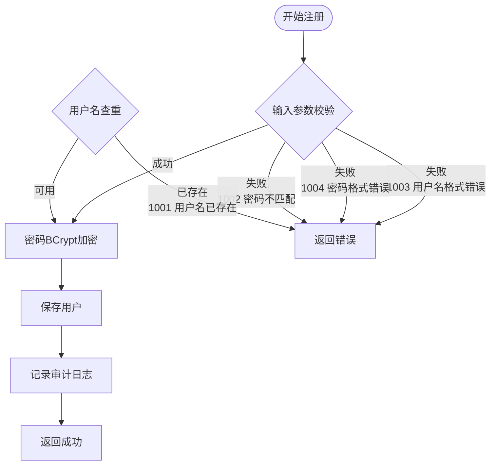
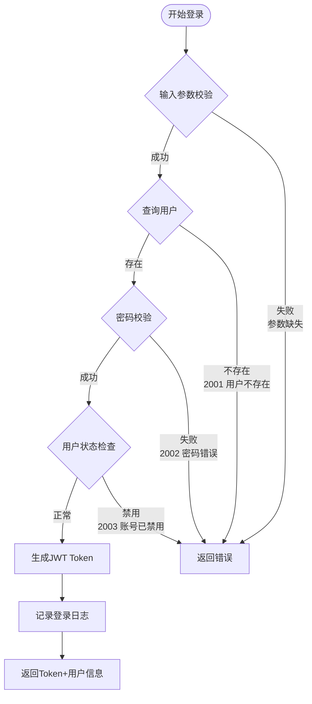
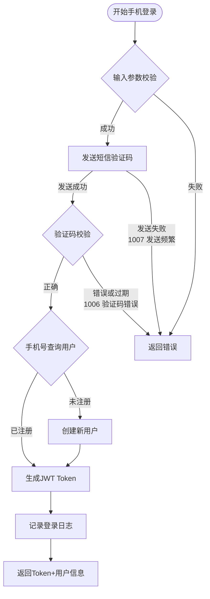
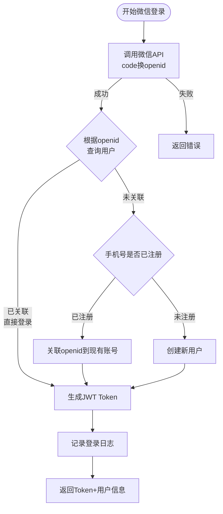
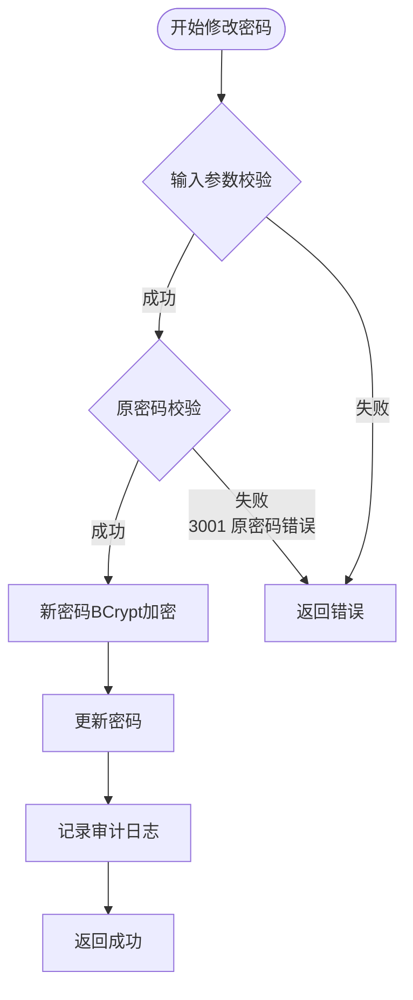
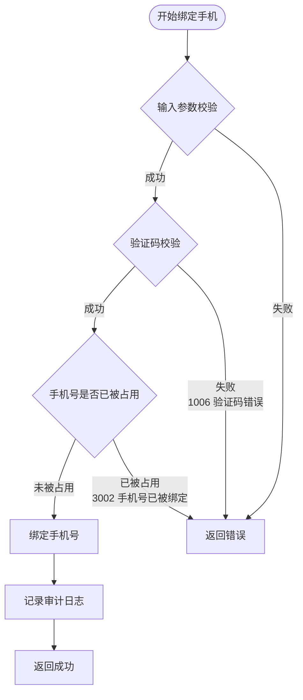
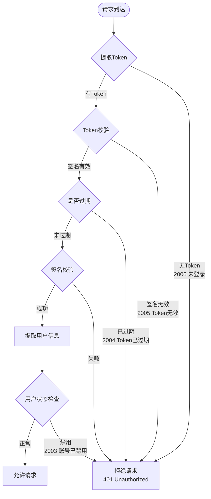

# 用户模块详细设计

> 本文档记录用户模块的详细设计，包括功能定义、数据结构、接口设计、业务流程等。

---

## 1. 模块概述

### 1.1 模块职责

| 职责 | 说明 |
|------|------|
| **用户注册** | 支持求职者注册账号 |
| **用户登录** | 支持用户名密码、手机号、微信登录 |
| **认证授权** | JWT Token 生成与校验、权限管理 |
| **用户信息管理** | 查看/修改个人信息 |
| **数据隔离** | 确保用户只能访问自己的数据 |

### 1.2 模块位置

```
┌─────────────────────────────────────────────────────────────┐
│                    用户模块 (user-module)                     │
├─────────────────────────────────────────────────────────────┤
│  Controller: UserController                                 │
│  Service: UserService, AuthService                         │
│  Repository: UserRepository                                 │
│  Entity: User, UserProfile, UserConsentRecord               │
└─────────────────────────────────────────────────────────────┘
```

### 1.3 模块依赖

| 依赖模块 | 说明 |
|---------|------|
| 基础设施模块 | 审计 Tool、持久化 Tool |

---

## 2. 数据模型

### 2.1 实体设计

#### User（用户实体）

| 字段 | 类型 | 约束 | 说明 |
|------|------|------|------|
| id | Long | PK, AUTO | 用户ID |
| username | String | UNIQUE, NOT NULL | 用户名 |
| password | String | NOT NULL | 密码（BCrypt加密） |
| phone | String | UNIQUE | 手机号 |
| email | String | UNIQUE | 邮箱 |
| openid | String | UNIQUE | 微信 openid |
| status | Enum | NOT NULL | 正常/禁用 |
| createdAt | DateTime | NOT NULL | 创建时间 |
| updatedAt | DateTime | NOT NULL | 更新时间 |

#### UserProfile（用户资料）

| 字段 | 类型 | 约束 | 说明 |
|------|------|------|------|
| id | Long | PK, AUTO | 资料ID |
| userId | Long | FK, UNIQUE | 用户ID |
| nickname | String | | 昵称 |
| avatar | String | | 头像URL |
| gender | Enum | | 男/女/未知 |
| birthday | Date | | 生日 |
| bio | String | | 个人简介 |

#### UserConsentRecord（用户同意记录）

| 字段 | 类型 | 约束 | 说明 |
|------|------|------|------|
| id | Long | PK, AUTO | 记录ID |
| userId | Long | FK, NOT NULL | 用户ID |
| consentType | String | NOT NULL | 同意类型 |
| consentVersion | String | NOT NULL | 同意版本号 |
| consentTime | DateTime | NOT NULL | 同意时间 |
| ipAddress | String | | IP地址 |
| userAgent | String | | 浏览器信息 |

### 2.2 枚举类型

```java
// 用户状态
public enum UserStatus {
    ACTIVE,      // 正常
    DISABLED     // 禁用
}

// 用户性别
public enum Gender {
    MALE,       // 男
    FEMALE,     // 女
    UNKNOWN     // 未知
}

// 同意类型
public enum ConsentType {
    LLM_SERVICE,        // LLM服务同意
    PRIVACY_POLICY      // 隐私政策同意
}
```

---

## 3. 功能定义

### 3.1 注册功能

#### 用户名密码注册

| 项目 | 说明 |
|------|------|
| **功能描述** | 用户输入用户名、密码进行注册 |
| **输入** | username, password, confirmPassword |
| **校验规则** | 用户名 4-20 位，密码 8-20 位 |
| **输出** | 注册成功用户信息 |
| **流程** | 校验 → 加密密码 → 保存用户 → 记录审计日志 |

#### 手机号注册

| 项目 | 说明 |
|------|------|
| **功能描述** | 用户输入手机号+验证码进行注册 |
| **输入** | phone, smsCode |
| **校验规则** | 手机号格式、验证码正确 |
| **输出** | 注册成功用户信息 |
| **流程** | 校验验证码 → 保存用户 → 发送Token → 记录审计日志 |

### 3.2 登录功能

#### 用户名密码登录

| 项目 | 说明 |
|------|------|
| **功能描述** | 用户输入用户名、密码登录 |
| **输入** | username, password |
| **输出** | JWT Token + 用户信息 |
| **流程** | 校验密码 → 生成Token → 记录登录日志 |

#### 手机号登录

| 项目 | 说明 |
|------|------|
| **功能描述** | 用户输入手机号+验证码登录 |
| **输入** | phone, smsCode |
| **输出** | JWT Token + 用户信息 |

#### 微信登录

| 项目 | 说明 |
|------|------|
| **功能描述** | 用户通过微信授权登录 |
| **输入** |微信 code |
| **输出** | JWT Token + 用户信息（新建或关联已有账号） |
| **流程** | 微信 code 换取 openid → 查询/创建用户 → 关联账号 → 生成Token |

### 3.3 认证授权

#### JWT Token 结构

| 字段 | 说明 | 过期时间 |
|------|------|---------|
| userId | 用户ID | - |
| username | 用户名 | - |
| roles | 角色列表 | - |
| iat | 签发时间 | - |
| exp | 过期时间 | 7天 |

#### Token 校验

> **当前实现差异（2026-08-06）**：`SecurityConfig` 尚未配置自定义 `AuthenticationEntryPoint`。缺少或无效 Token 的请求会以匿名身份继续，由 Spring Security 默认返回 HTTP `403`；`JwtAuthenticationFilter` 当前也不查询用户状态。下表和 5.7 节的 `401`、稳定错误码及用户状态检查仍是目标契约，不应当作现有实现或部署冒烟预期。

| 项目 | 说明 |
|------|------|
| **校验内容** | 签名、过期时间、用户状态 |
| **失败处理** | 返回 401，提示重新登录 |

### 3.4 用户信息管理

| 功能 | 说明 |
|------|------|
| 获取个人信息 | 获取当前用户基本信息 |
| 更新个人信息 | 更新昵称、头像、个人简介 |
| 修改密码 | 验证原密码后修改 |
| 绑定手机号 | 验证短信验证码后绑定 |
| 绑定微信 | 微信授权后绑定 |

---

## 4. 接口设计

### 4.1 接口一览

| 方法 | 路径 | 说明 | 认证 |
|------|------|------|------|
| POST | /api/v1/users/register | 用户名密码注册 | 否 |
| POST | /api/v1/users/login | 用户名密码登录 | 否 |
| POST | /api/v1/users/login/phone | 手机号登录 | 否 |
| POST | /api/v1/users/login/wechat | 微信登录 | 否 |
| GET | /api/v1/users/me | 获取个人信息 | 是 |
| PUT | /api/v1/users/me | 更新个人信息 | 是 |
| PUT | /api/v1/users/password | 修改密码 | 是 |
| POST | /api/v1/users/phone/bind | 绑定手机号 | 是 |
| POST | /api/v1/users/wechat/bind | 绑定微信 | 是 |

### 4.2 接口详情

#### POST /api/v1/users/register（用户名密码注册）

**请求**：
```json
{
  "username": "zhangsan",
  "password": "Password123",
  "confirmPassword": "Password123"
}
```

**响应**（200）：
```json
{
  "code": 0,
  "message": "success",
  "data": {
    "userId": 1,
    "username": "zhangsan"
  }
}
```

**错误码**：
| code | message | 说明 |
|------|---------|------|
| 1001 | 用户名已存在 | 用户名重复 |
| 1002 | 密码不匹配 | 两次密码输入不一致 |
| 1003 | 用户名格式错误 | 用户名不符合规范 |
| 1004 | 密码格式错误 | 密码不符合规范 |

---

#### POST /api/v1/users/login（用户名密码登录）

**请求**：
```json
{
  "username": "zhangsan",
  "password": "Password123"
}
```

**响应**（200）：
```json
{
  "code": 0,
  "message": "success",
  "data": {
    "token": "eyJhbGciOiJIUzI1NiIs...",
    "user": {
      "userId": 1,
      "username": "zhangsan",
      "phone": "138****8888"
    }
  }
}
```

**错误码**：
| code | message | 说明 |
|------|---------|------|
| 2001 | 用户不存在 | 用户名错误 |
| 2002 | 密码错误 | 密码错误 |
| 2003 | 账号已被禁用 | 用户状态异常 |

---

#### GET /api/v1/users/me（获取个人信息）

**请求头**：
```
Authorization: Bearer {token}
```

**响应**（200）：
```json
{
  "code": 0,
  "message": "success",
  "data": {
    "userId": 1,
    "username": "zhangsan",
    "phone": "138****8888",
    "email": "u***@email.com",
    "profile": {
      "nickname": "张三",
      "avatar": "https://xxx.com/avatar.png",
      "gender": "MALE",
      "bio": "Java开发工程师"
    }
  }
}
```

---

#### PUT /api/v1/users/me（更新个人信息）

**请求**：
```json
{
  "nickname": "新昵称",
  "avatar": "https://xxx.com/new-avatar.png",
  "gender": "MALE",
  "bio": "新的个人简介"
}
```

**响应**（200）：
```json
{
  "code": 0,
  "message": "success",
  "data": null
}
```

---

#### PUT /api/v1/users/password（修改密码）

**请求**：
```json
{
  "oldPassword": "OldPassword123",
  "newPassword": "NewPassword123",
  "confirmPassword": "NewPassword123"
}
```

**响应**（200）：
```json
{
  "code": 0,
  "message": "success",
  "data": null
}
```

**错误码**：
| code | message | 说明 |
|------|---------|------|
| 3001 | 原密码错误 | 原密码校验失败 |
| 1002 | 密码不匹配 | 两次密码输入不一致 |

---

## 5. 业务流程

### 5.1 注册流程



**分支条件详情**：

| 步骤 | 条件 | 结果 | 错误码 |
|------|------|------|--------|
| **参数校验** | 用户名为空或不符合4-20位 | 返回错误 | 1003 |
| | 密码为空或不符合8-20位+字母+数字 | 返回错误 | 1004 |
| | 确认密码与密码不一致 | 返回错误 | 1002 |
| **用户名查重** | 用户名已存在 | 返回错误 | 1001 |
| | 用户名可用 | 继续流程 | - |

---

### 5.2 用户名密码登录流程



**分支条件详情**：

| 步骤 | 条件 | 结果 | 错误码 |
|------|------|------|--------|
| **参数校验** | username或password为空 | 返回错误 | - |
| **查询用户** | 用户不存在 | 返回错误 | 2001 |
| **密码校验** | BCrypt校验失败 | 返回错误 | 2002 |
| **状态检查** | status=DISABLED | 返回错误 | 2003 |

---

### 5.3 手机号登录流程



**分支条件详情**：

| 步骤 | 条件 | 结果 | 错误码 |
|------|------|------|--------|
| **参数校验** | phone为空或格式错误 | 返回错误 | 1005 |
| **发送短信** | 60秒内重复发送 | 返回错误 | 1007 |
| **验证码校验** | 验证码为空/错误/过期 | 返回错误 | 1006 |
| **用户查询** | 手机号已注册 | 直接登录 | - |
| | 手机号未注册 | 创建新用户后登录 | - |

---

### 5.4 微信登录流程



**分支条件详情**：

| 步骤 | 条件 | 结果 |
|------|------|------|
| **获取openid** | 微信API调用失败 | 返回错误 |
| **查询用户** | openid已关联用户 | 直接登录 |
| | openid未关联 | 检查手机号是否已注册 |
| **手机号检查** | 手机号已注册 | 关联openid到该账号 |
| | 手机号未注册 | 创建新用户并关联openid |

---

### 5.5 修改密码流程



**分支条件详情**：

| 步骤 | 条件 | 结果 | 错误码 |
|------|------|------|--------|
| **参数校验** | 新密码格式错误 | 返回错误 | 1004 |
| | 确认密码不匹配 | 返回错误 | 1002 |
| **原密码校验** | BCrypt校验失败 | 返回错误 | 3001 |

---

### 5.6 绑定手机号流程



---

### 5.7 Token 校验流程



---

## 6. 安全设计

### 6.1 密码安全

| 设计 | 说明 |
|------|------|
| **加密算法** | BCrypt（自带盐值） |
| **密码强度** | 8-20位，必须包含字母和数字 |
| **密码校验** | 使用 BCrypt .matches() 校验 |

### 6.2 Token 安全

| 设计 | 说明 |
|------|------|
| **算法** | HS256 |
| **过期时间** | 7天 |
| **刷新机制** | 过期后需重新登录 |
| **存储** | Redis（可选，用于单点登出） |

### 6.3 审计日志

| 记录场景 | 记录内容 |
|---------|---------|
| 注册成功 | userId, username, ip, userAgent, time |
| 登录成功 | userId, username, loginType, ip, time |
| 登录失败 | username, loginType, failReason, ip, time |
| 修改密码 | userId, ip, time |
| 账号禁用 | userId, operatorId, reason, time |

---

## 7. 错误码设计

### 7.1 用户模块错误码（1xxx）

| 错误码 | 消息 | 说明 |
|--------|------|------|
| 1001 | 用户名已存在 | 用户名重复 |
| 1002 | 密码不匹配 | 两次密码输入不一致 |
| 1003 | 用户名格式错误 | 用户名不符合规范 |
| 1004 | 密码格式错误 | 密码不符合规范 |
| 1005 | 手机号格式错误 | 手机号不符合规范 |
| 1006 | 短信验证码错误 | 验证码不正确或已过期 |
| 1007 | 短信验证码发送频繁 | 发送间隔小于60秒 |

### 7.2 认证错误码（2xxx）

| 错误码 | 消息 | 说明 |
|--------|------|------|
| 2001 | 用户不存在 | 登录时用户不存在 |
| 2002 | 密码错误 | 登录时密码错误 |
| 2003 | 账号已被禁用 | 用户状态为 DISABLED |
| 2004 | Token 已过期 | JWT Token 过期 |
| 2005 | Token 无效 | JWT Token 签名错误或格式错误 |
| 2006 | 未登录 | 需要登录但未提供 Token |

### 7.3 业务错误码（3xxx）

| 错误码 | 消息 | 说明 |
|--------|------|------|
| 3001 | 原密码错误 | 修改密码时原密码不正确 |
| 3002 | 手机号已被绑定 | 绑定手机号时手机号已被其他账号使用 |
| 3003 | 微信已被绑定 | 绑定微信时 openid 已被其他账号使用 |

---

## 8. 配置设计

### 8.1 配置文件

```yaml
user:
  # 密码策略
  password:
    min-length: 8
    max-length: 20
    require-letter: true
    require-digit: true
  
  # Token 策略
  token:
    secret: ${JWT_SECRET}
    expiration-days: 7
  
  # 短信验证码
  sms:
    expiration-minutes: 5
    resend-interval-seconds: 60
```

---

## 9. 待确认事项

### 已确认

| 事项 | 确认内容 |
|------|---------|
| 微信登录 | 需要配置 appid/appsecret |
| 短信验证码 | 保留抽象接口，不限定具体实现（可接入阿里云/腾讯云等） |
| 邮箱登录 | 保留接口支持 |
| 第三方登录 | 保留抽象接口（GitHub/Google等） |

### 抽象接口设计

```java
// 短信服务抽象接口
public interface SmsService {
    /**
     * 发送短信验证码
     */
    void sendVerifyCode(String phone);

    /**
     * 校验验证码
     */
    boolean verifyCode(String phone, String code);
}

// 第三方登录抽象接口
public interface ThirdPartyLoginService {
    /**
     * 获取登录地址
     */
    String getLoginUrl();

    /**
     * 通过授权码获取用户信息
     */
    ThirdPartyUserInfo getUserInfo(String authCode);
}
```

---

## 10. 技术选型

| 技术 | 选型 | 说明 |
|------|------|------|
| 核心框架 | Spring Boot 3.x + Spring Security | 认证授权 |
| 数据库访问 | Spring Data JPA | 数据持久化 |
| 密码加密 | BCrypt | 自带盐值 |
| JWT | jjwt | Token 生成与校验 |
| 短信服务 | 抽象接口 | 可接入阿里云/腾讯云 |
| 微信登录 | 抽象接口 | 可接入微信API |
| 第三方登录 | 抽象接口 | 可接入 GitHub/Google 等 |

---

*文档版本：v0.3*
*创建时间：2026-07-20*
